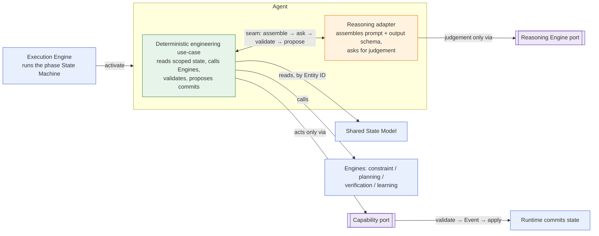
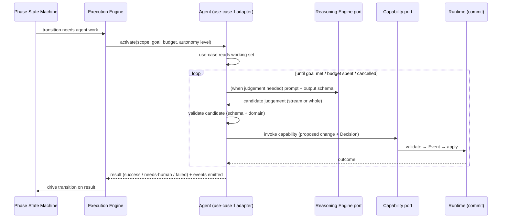

# Agents

> **Ring:** Use cases / runtime — *instance* layer ([P7](../foundation/principles.md)). An **[Agent](../GLOSSARY.md#agent)** is a unit of engineering work bound to one or more [Phases](../GLOSSARY.md#phase). This document is the family overview: it defines the agent model (lifecycle, the two-part split, how agents are invoked, reason, and act) and indexes all 13 agents against the [canonical phase map](../foundation/architecture-views.md). It exists so that every agent doc reads the same way and none re-derives how an agent touches state, reasoning, or persistence.

Agents are the *content* of the engineering process; the kernel ([execution engine](../core/execution-engine.md), [state-machine framework](../core/state-machine-framework.md), [orchestrator](../core/workflow-orchestration.md), [scheduler](../core/scheduler.md)) is the *mechanism and policy* that drives them ([P7](../foundation/principles.md)). An agent never runs itself, never owns knowledge, and never acts except through declared ports. Everything an agent *is* and *does* is specified here and in the 13 per-agent docs; everything about *how a phase advances* belongs to that phase's [state machine](../state-machines/README.md).

## What an agent is — and is not

| An agent **is** | An agent **is not** |
|-----------------|---------------------|
| A two-part unit: a deterministic engineering use-case ‖ a reasoning adapter ([P8](../foundation/principles.md)). | A "god-object" spanning rings. |
| Bound to one or more [Phases](../foundation/architecture-views.md). | The owner of a phase's states/transitions — that is its [state machine](../state-machines/README.md). |
| A *proposer*: it asks for judgement and proposes changes. | A *committer*: only the deterministic runtime commits state ([P3](../foundation/principles.md), [P10](../foundation/principles.md)). |
| A reader of [Engineering State](../core/shared-state-model.md) (scoped) and an actor via the [Capability port](../core/capability-registry.md). | A holder of engineering knowledge ([P2](../foundation/principles.md)) — knowledge lives in the runtime, never in the agent or a prompt. |
| Driven by the [Execution Engine](../core/execution-engine.md) per the [Agent Runtime Protocol](../core/agent-runtime-protocol.md). | A caller of models, stores, or the UI directly. |

## The two-part split (P8)

Every agent is exactly two collaborating halves with a single **seam** between them. The seam — not the middle of a tangled object — is where deterministic engineering logic meets stochastic reasoning ([P8](../foundation/principles.md), [ADR-0006](../decisions/0006-agent-fsm-separation.md)). This pattern is identical across all 13 agents; each agent doc fills it in with its own engineering specifics.

*Figure: the universal two-part agent shape. The deterministic half is the only one that reads state, calls engines, and proposes commits; the reasoning half only obtains judgement. From the runtime's viewpoint.*

| | **Deterministic engineering use-case** | **Reasoning adapter** |
|---|----------------------------------------|------------------------|
| **Role** | Does the engineering work deterministically. | Obtains stochastic judgement. |
| **Reads** | [Engineering State](../core/shared-state-model.md) (scoped), [Knowledge Graph](../knowledge/knowledge-graph.md) / [Vector Memory](../knowledge/vector-memory.md), [Engine](../GLOSSARY.md#engine) outputs. | Only the context the use-case hands it. |
| **Acts** | Only via the [Capability port](../core/capability-registry.md); calls [Engines](../GLOSSARY.md#engine). | Only via the [Reasoning Engine port](../core/reasoning-engine-interface.md). |
| **Commits** | *Proposes* commits; the runtime commits. | **Never.** |
| **Determinism** | Deterministic given inputs ([P4](../foundation/principles.md)). | The sole stochastic element; its outputs are recorded ([P4](../foundation/principles.md)). |

**The seam, concretely:** the deterministic half decides *when* judgement is needed, assembles the context and the **output schema**, asks the reasoning adapter, receives a *candidate*, **validates** it (schema + domain, via the [Constraint Engine](../engineering/constraint-engine.md) and domain invariants), and only then turns it into a [Capability](../core/capability-registry.md) invocation justified by a [Decision](../foundation/engineering-domain-model.md#decision). Unvalidated stochastic output never crosses the seam into committed state.

## Lifecycle of an agent activation

An agent exists only while activated; it holds no durable identity or state between activations. One activation, per the [Agent Runtime Protocol](../core/agent-runtime-protocol.md):

*Figure: one activation, from the state machine's request to the transition it drives. The protocol owns this boundary; each agent fills in the work loop. From the runtime's viewpoint.*

1. **Activate.** The [Execution Engine](../core/execution-engine.md) activates the agent with an **activation context**: the phase position, the **scope** (declared working set), the goal, the cost/time **budget**, and the current [Autonomy Level](../engineering/human-in-the-loop.md) ([P10](../foundation/principles.md)).
2. **Work loop.** The deterministic half drives a bounded loop: read → (optionally) reason → validate → act via capability. Each acting step is a recorded, justified change.
3. **Conclude.** The agent returns a typed result — **success**, **needs-human** (escalation per autonomy level), or **failed** (with diagnostic). It never decides the next phase; the [state machine](../state-machines/README.md) and [orchestrator](../core/workflow-orchestration.md) act on the result.

## How agents are invoked, reason, and act

- **Invoked** — by the [Execution Engine](../core/execution-engine.md) only, per the [Agent Runtime Protocol](../core/agent-runtime-protocol.md). Agents are *instance* driven by *mechanism* ([P7](../foundation/principles.md)); they cannot self-activate.
- **Reason** — only through the [Reasoning Engine port](../core/reasoning-engine-interface.md): structured prompt in, schema-conformant candidate out, validated before it can influence state ([P3](../foundation/principles.md)). The reasoning adapter never commits.
- **Act** — only through the [Capability port](../core/capability-registry.md): a named, schema-described, permission-checked, side-effect-declared invocation. An unregistered action does not exist; this is what makes the god-object impossible by construction.
- **Read** — broadly but scoped: any [Engineering State](../core/shared-state-model.md) entity in scope (by stable [Entity ID](../foundation/engineering-domain-model.md)), plus [Knowledge Graph](../knowledge/knowledge-graph.md), [Vector Memory](../knowledge/vector-memory.md), and [Engine](../GLOSSARY.md#engine) results. Reads have no side effects.
- **Extended** — new agents (and the engines, rule sets, and viewers they rely on) can be contributed by the [Plugin System](../integration/plugin-system.md) without modifying the kernel. A plugin-provided agent registers through the same [Capability port](../core/capability-registry.md) and obeys this identical protocol — there is no privileged back door for third-party agents.

## The 13 agents — index and phase bindings

This index mirrors the [canonical phase map](../foundation/architecture-views.md); that table is the source of truth. **14 phases are covered by 13 agents:** eleven single-phase agents, two dual-phase agents (Planning, Placement), and one cross-cutting agent (Learning, bound to no single phase). Each agent uses only the [Engines](../GLOSSARY.md#engine) listed and cross-links its phase [state machine(s)](../state-machines/README.md).

| Agent | Phase binding | State machine(s) | Engines used |
|-------|---------------|------------------|--------------|
| [Requirement Agent](requirement-agent.md) | Requirement Planning | [requirement-planning](../state-machines/requirement-planning.md) | [Planning](../engineering/planning-engine.md) |
| [Planning Agent](planning-agent.md) | Engineering Analysis **+** Constraint Extraction (dual-phase) | [engineering-analysis](../state-machines/engineering-analysis.md), [constraint-extraction](../state-machines/constraint-extraction.md) | [Planning](../engineering/planning-engine.md), [Constraint](../engineering/constraint-engine.md) |
| [Datasheet Agent](datasheet-agent.md) | Datasheet Intelligence | [datasheet-intelligence](../state-machines/datasheet-intelligence.md) | — (feeds [Knowledge Graph](../knowledge/knowledge-graph.md)) |
| [BOM Agent](bom-agent.md) | BOM Planning | [bom-planning](../state-machines/bom-planning.md) | [Constraint](../engineering/constraint-engine.md) |
| [Schematic Agent](schematic-agent.md) | Schematic Planning | [schematic-planning](../state-machines/schematic-planning.md) | [Planning](../engineering/planning-engine.md), [Constraint](../engineering/constraint-engine.md) |
| [ERC Agent](erc-agent.md) | ERC Verification | [erc-verification](../state-machines/erc-verification.md) | [Verification](../engineering/verification-engine.md) |
| [Placement Agent](placement-agent.md) | PCB Floor Planning **+** Component Placement (dual-phase) | [pcb-floor-planning](../state-machines/pcb-floor-planning.md), [component-placement](../state-machines/component-placement.md) | [Planning](../engineering/planning-engine.md), [Constraint](../engineering/constraint-engine.md) |
| [Routing Agent](routing-agent.md) | Routing Planning | [routing-planning](../state-machines/routing-planning.md) | [Constraint](../engineering/constraint-engine.md), [Planning](../engineering/planning-engine.md) |
| [DRC Agent](drc-agent.md) | DRC Verification | [drc-verification](../state-machines/drc-verification.md) | [Verification](../engineering/verification-engine.md) |
| [DFM Agent](dfm-agent.md) | DFM Verification | [dfm-verification](../state-machines/dfm-verification.md) | [Verification](../engineering/verification-engine.md) |
| [EMC Agent](emc-agent.md) | EMC Analysis | [emc-analysis](../state-machines/emc-analysis.md) | [Verification](../engineering/verification-engine.md) (analysis) |
| [Manufacturing Agent](manufacturing-agent.md) | Manufacturing Generation | [manufacturing-generation](../state-machines/manufacturing-generation.md) | [Verification](../engineering/verification-engine.md) |
| [Learning Agent](learning-agent.md) | Cross-cutting (no single phase; observes all) | *none — engine, not phase* | [Learning](../engineering/learning-engine.md) |

## Anti-duplication rule — agents vs. state machines

The architecture review flagged drift between agent docs and state-machine docs as the top risk. The boundary is fixed ([CONVENTIONS.md](../CONVENTIONS.md)):

| Concern | Owned by |
|---------|----------|
| States · Transitions · Events (phase) · Rollback · Recovery · Persistence | the **[state machine](../state-machines/README.md)** |
| Purpose · Responsibilities · Inputs · Outputs · State (the agent's own working state) · Events (it emits/consumes) · Dependencies · Failure modes · Future improvements · **Two-part split** · **FSM cross-link** | the **agent** (this family) |

**Agents reference their FSM; they never restate its transition tables.** Where an agent doc needs to talk about *when* it runs, it links to the phase state machine rather than reproducing its diagram. Conversely, a state machine names the agent it drives and links here for the agent's internals.

## Agent family template

Every per-agent doc follows the [Agent family template](../CONVENTIONS.md) section set, in this order: **Purpose · Responsibilities · Inputs · Outputs · State · Events · Dependencies · Failure modes · Future improvements · Two-part split** (deterministic use-case ‖ reasoning adapter) **· FSM cross-link** (+ engines used). This uniformity is what lets the 13 docs function as one specification.

## Related documents

[`core/agent-runtime-protocol.md`](../core/agent-runtime-protocol.md) · [`core/reasoning-engine-interface.md`](../core/reasoning-engine-interface.md) · [`core/capability-registry.md`](../core/capability-registry.md) · [`core/contracts.md`](../core/contracts.md) · [`core/execution-engine.md`](../core/execution-engine.md) · [`state-machines/README.md`](../state-machines/README.md) · [`foundation/architecture-views.md`](../foundation/architecture-views.md) · [`foundation/principles.md`](../foundation/principles.md) · [`CONVENTIONS.md`](../CONVENTIONS.md) · [`GLOSSARY.md`](../GLOSSARY.md#agent)
