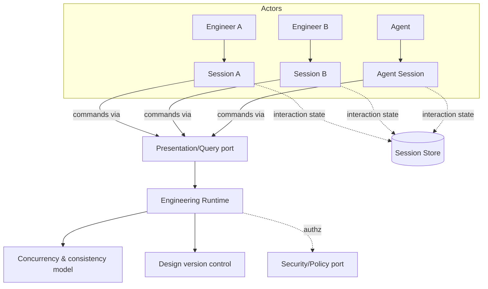

# Multi-User & Sessions

> **Ring:** Cross-cutting / infrastructure concern. This document defines how Electronics Agent Kit handles **users, sessions, workspaces, and real-time collaboration** over a single shared [Engineering State](../core/shared-state-model.md). It exists because the runtime *owns* one canonical, versioned model of a design ([P2](../foundation/principles.md)), yet that design may be worked on by one engineer, by an engineer alongside autonomous [Agents](../agents/README.md), or by several engineers at once — and all of those must reconcile to the same auditable truth. The architecture treats single-user as the simple case of a general multi-actor model, so collaboration is not bolted on later but follows directly from the [Session](../GLOSSARY.md#session), [Session Store](../data/stores/session-store.md), [concurrency model](../core/concurrency-and-consistency.md), and [design version control](../data/design-version-control.md) that already exist.

---

## 1. Purpose & responsibilities

### What it owns
- **The Session concept.** A bounded period of interaction by one actor with a [Project](../GLOSSARY.md#project): its identity, lifecycle, and per-session interaction state (selection, focus, view, pending commands), held in the [Session Store](../data/stores/session-store.md).
- **Workspaces.** The container that scopes a user's access to one or more Projects and frames where their Sessions live.
- **Multi-actor reconciliation.** Defining how concurrent actors (human and agent) see and affect the same [Engineering State](../core/shared-state-model.md) coherently — presence, attribution, and ordering of their effects.
- **Real-time concerns.** What "live" collaboration requires: shared projections, awareness of others' activity, and conflict surfacing — expressed in domain terms.

### What it does NOT own
- **State authority or merge mechanics.** The canonical state and how concurrent mutations serialize is the [concurrency & consistency model](../core/concurrency-and-consistency.md); divergent lines and merges are [design version control](../data/design-version-control.md). This doc *uses* both.
- **Per-session interaction persistence layout** — owned by the [Session Store](../data/stores/session-store.md); this doc defines the Session's meaning, the store persists it.
- **Authorization & tenant isolation** — owned by the [Security/Policy port](../crosscutting/security.md); collaboration relies on it for who-can-see-what.
- **Transport.** Live updates ride the [Presentation/Query port](../integration/ipc.md); collaboration defines *what* is shared, IPC carries it.
- **Autonomy of agents** — the [Autonomy Level](../engineering/human-in-the-loop.md) governs whether an agent acts; here an agent is simply another actor with a Session.

---

## 2. Position in the architecture

*Figure: multiple actors hold Sessions that issue commands through one port to one runtime, reconciled by the concurrency model and version control. From the system viewpoint.*

- **Depends on:** the [Session Store](../data/stores/session-store.md), [concurrency & consistency model](../core/concurrency-and-consistency.md), [design version control](../data/design-version-control.md), [Security/Policy port](../crosscutting/security.md), and [Presentation/Query port](../integration/ipc.md).
- **Depended on by:** [IPC](../integration/ipc.md) (correlates commands to Sessions), the [backend host](../integration/backend.md) (tenant/session hosting), and [governance](../governance/safety-liability-and-ethics.md) (attribution of actions to actors).

---

## 3. Single-user as a special case of multi-actor

The architecture refuses to treat single-user and multi-user as different systems. There is always at least one [Session](../GLOSSARY.md#session); autonomous [Agents](../agents/README.md) are *also* actors with Sessions. Therefore:

- **One coherence model.** Whether the second actor is a human or an agent, their effects reconcile through the same [concurrency model](../core/concurrency-and-consistency.md) and become the same [Events](../core/event-bus.md). There is no separate "collaboration state" to drift from the truth.
- **Attribution everywhere.** Every command and resulting [Decision](../foundation/engineering-domain-model.md#decision) records its actor (human or agent + reasoning call) for [provenance](../core/provenance-and-traceability.md) ([P5](../foundation/principles.md)).
- **Single-user simplicity for free.** With one Session, the model collapses to the trivial case; nothing extra is paid until collaboration is actually used.

## 4. Real-time collaboration concerns

Live multi-engineer work raises four concerns, each resolved by an existing mechanism:

| Concern | Resolution |
|---------|-----------|
| **Seeing each other's changes** | Shared [projection subscriptions](../integration/ipc.md): all Sessions on a Project receive the same Event-driven view-model updates. |
| **Concurrent edits to the same entity** | Serialized by the [concurrency & consistency model](../core/concurrency-and-consistency.md); conflicts surfaced, never silently overwritten. |
| **Diverging exploration** | [Design Branches](../data/design-version-control.md) — engineers explore on branches and merge back ("Git for hardware"). |
| **Presence & awareness** | Per-Session interaction state ([Session Store](../data/stores/session-store.md)) shared as ephemeral presence info, distinct from the durable engineering record. |

Presence/awareness data is explicitly *ephemeral* and operational — it is not part of the [Engineering State](../core/shared-state-model.md) and is never confused with it.

## 5. Why sessions over a single global state pointer

Required by [P13](../foundation/principles.md). Without Sessions, concurrent actors (including agents) would contend over one mutable cursor, losing attribution and making collaboration unsafe. Modeling each actor's interaction as a Session — over one canonical, Event-sourced state — gives clean attribution, lets the same machinery serve one user or many, and keeps autonomous agents as first-class, governable participants rather than a special path.

## Contracts

- **Consumes:** the [Presentation/Query port](../integration/ipc.md) (commands/projections per Session), the [Security/Policy port](../crosscutting/security.md) (authz, tenant isolation), the [Session Store](../data/stores/session-store.md) access (interaction state), the [Event Sink/Source](../core/contracts.md#event-sink-event-source) (shared, ordered updates), and [design version control](../data/design-version-control.md) (branch/merge).
- **Defines:** the Session and Workspace concepts other docs reference.

## Failure modes

| Failure | Effect | Mitigation / degradation |
|---------|--------|--------------------------|
| **Session lost / disconnected** | Actor drops mid-work. | Interaction state in the [Session Store](../data/stores/session-store.md) allows resume; no engineering state is lost (it's in the runtime). |
| **Concurrent conflicting edits** | Two actors change the same entity. | Serialized by the [concurrency model](../core/concurrency-and-consistency.md); the loser is told and re-bases; never a silent overwrite. |
| **Stale presence info** | UI shows wrong "who's here." | Presence is ephemeral and self-expiring; correctness of the design is unaffected. |
| **Cross-tenant leakage** | One workspace sees another. | Prevented by [Security/Policy](../crosscutting/security.md) tenant isolation; collaboration assumes nothing the port doesn't enforce. |
| **Agent and human collide** | Autonomous edit conflicts with a human edit. | Same conflict path as human-human; [autonomy](../engineering/human-in-the-loop.md) gating and reversibility ([P10](../foundation/principles.md)) protect the human's intent. |

## Open decisions

- [ADR-0003](../decisions/0003-shared-state-consistency-model.md) — the concurrency model collaboration depends on.
- [ADR-0008](../decisions/0008-design-version-control-model.md) — branch/merge model for divergent collaboration.
- [ADR-0010](../decisions/0010-human-in-the-loop-autonomy-levels.md) — agents as actors under autonomy gating.

## Related documents

[`data/stores/session-store.md`](../data/stores/session-store.md) · [`core/concurrency-and-consistency.md`](../core/concurrency-and-consistency.md) · [`data/design-version-control.md`](../data/design-version-control.md) · [`integration/ipc.md`](../integration/ipc.md) · [`crosscutting/security.md`](../crosscutting/security.md) · [`engineering/human-in-the-loop.md`](../engineering/human-in-the-loop.md) · [`core/provenance-and-traceability.md`](../core/provenance-and-traceability.md) · [`integration/backend.md`](../integration/backend.md) · [`foundation/principles.md`](../foundation/principles.md) · [`GLOSSARY.md`](../GLOSSARY.md)
