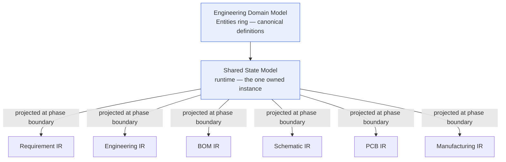
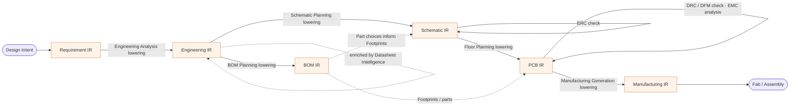

# Compiler IR — Overview

> **Ring:** Domain — compiler (inner; depends only on the [Entities](../foundation/engineering-domain-model.md) ring and on sibling contracts). This document is the entry point to the **Intermediate Representation (IR) layer**: the family of typed, serializable representations the design takes at each [Phase](../foundation/architecture-views.md) boundary, and the [lowering passes](transformations.md) that carry the design from one to the next. It exists to give the engineering process a *compiler-style spine* — a well-defined sequence of representations with checkable invariants between them — without ever becoming a second source of truth. Per [P6](../foundation/principles.md) and [ADR-0005](../decisions/0005-ir-as-canonical-phase-boundary-representation.md), the [Engineering Domain Model](../foundation/engineering-domain-model.md) is canonical; **every IR is a projection/serialization of that one model at a phase boundary**, never a competing definition of the design.

## Why an IR layer exists

A PCB design is built up through many phases — intent becomes requirements, requirements become an analyzed design, the design becomes a schematic and a BOM, the schematic becomes a board, the board becomes manufacturing outputs. Each phase needs a *stable, complete, checkable* picture of the design **as it stands at that boundary**, expressed in exactly the vocabulary that phase consumes and produces. Three forces make a dedicated IR layer the right answer:

1. **Phase boundaries need a contract, not a convention.** The [Workflow Orchestrator](../core/workflow-orchestration.md) sequences phases; the handoff between two phases must be a typed artifact with explicit invariants, so a downstream phase can *trust* what it receives and a [lowering](transformations.md) can be *verified* rather than hoped-for. This is the compiler analogy: a front-end emits an IR a back-end can rely on.
2. **Correctness must be localizable.** When something is wrong, we must be able to say *which representation* it became wrong in. Per-phase IRs with per-IR invariants turn "the design is broken" into "the [Schematic IR](ir/schematic-ir.md) invariant *every Pin resolves to a Net* failed at the Schematic→PCB boundary."
3. **Reproducibility and provenance need stable snapshots.** A serializable IR at a boundary is a deterministic, replayable artifact ([P4](../foundation/principles.md), [ADR-0009](../decisions/0009-determinism-and-replay-strategy.md)) and a natural anchor for [provenance](../core/provenance-and-traceability.md): "this PCB IR was lowered from that Schematic IR by that pass under those Decisions."

The IR layer gives us all three **without** duplicating knowledge, because of the framing in the next section.

## The canonical-model-vs-projection framing (P6)

This is the single most important idea in the compiler ring, and the rule every IR document restates:

> The [Engineering Domain Model](../foundation/engineering-domain-model.md) — realized at runtime as the [Shared State Model](../core/shared-state-model.md) — is the **one canonical source of truth**. An IR is a **typed projection of that state at a phase boundary**: a serializable view that selects, shapes, and freezes the slice of the canonical model relevant to one phase. An IR is *derived*; it is never authoritative over the state it was projected from.

What follows from this framing:

- **No IR invents entities.** Every entity an IR carries resolves to its canonical definition in the [domain model](../foundation/engineering-domain-model.md) (a `Component` in the [Schematic IR](ir/schematic-ir.md) is *the same* `Component`, by stable [Entity ID](../foundation/engineering-domain-model.md), that the [Shared State Model](../core/shared-state-model.md) owns). IRs add no new definitions, only a phase-appropriate *shape*.
- **Lowering writes back through the runtime, never directly.** A [transformation](transformations.md) that produces the next IR proposes its results as validated mutations through the [Capability port](../core/contracts.md#capability-port); the [Engineering Runtime](../core/engineering-runtime.md) — the sole mutator ([P2](../foundation/principles.md)) — records them as [Events](../core/event-bus.md) with justifying [Decisions](../foundation/engineering-domain-model.md#decision). The IR itself is read-only output; it is not a thing the system mutates in place.
- **An IR can always be regenerated.** Because it is a projection, any IR can be deterministically re-derived from the canonical state at its boundary. An IR is therefore in the *derived/projected* partition of state (see [Shared State Model → partitions](../core/shared-state-model.md)); it is a cache of a view, never the truth.
- **Drift is structurally impossible.** The review that motivated [ADR-0005](../decisions/0005-ir-as-canonical-phase-boundary-representation.md) found that an IR, a domain model, and store schemas would otherwise be three sources of truth drifting apart. Making IRs strict projections collapses them to one.

*Figure: every IR is a projection of the one canonical model, not a sibling of it. From the compiler ring's viewpoint. Dependencies point inward — IRs depend on the domain model; the domain model knows nothing of IRs.*

## The IR pipeline

The pipeline mirrors the [canonical phase map](../foundation/architecture-views.md): each IR is produced (or enriched) by specific phases and consumed by the next. The shape of the pipeline is **Requirement → Engineering → {BOM, Schematic} → PCB → Manufacturing**, where Engineering fans out to two parallel projections (sourcing and logical design) that re-converge at the board.

*Figure: the IR pipeline. Solid arrows are [lowering passes](transformations.md) that produce a new IR; self-loops labelled "enriched"/"check" are passes that annotate or deepen an IR in place without producing a new one. From the compiler ring's viewpoint.*

The pipeline maps onto phases as follows (authoritative source: [`architecture-views.md`](../foundation/architecture-views.md)):

| IR | Produced by (phase) | Enriched / checked by | Lowered to |
|----|---------------------|------------------------|------------|
| [Requirement IR](ir/requirement-ir.md) | Requirement Planning | — | Engineering IR |
| [Engineering IR](ir/engineering-ir.md) | Engineering Analysis | Constraint Extraction, Datasheet Intelligence | BOM IR, Schematic IR |
| [BOM IR](ir/bom-ir.md) | BOM Planning | — | informs Schematic & PCB (Parts → Footprints) |
| [Schematic IR](ir/schematic-ir.md) | Schematic Planning | checked by ERC Verification | PCB IR |
| [PCB IR](ir/pcb-ir.md) | PCB Floor Planning | Component Placement, Routing Planning; checked by DRC & DFM; analyzed by EMC | Manufacturing IR |
| [Manufacturing IR](ir/manufacturing-ir.md) | Manufacturing Generation | — | consumed by fab / assembly |

> **Note on "produces" vs "enriches" vs "checks".** Only some phases produce a *new* IR (a lowering). Others *enrich* an existing IR (adding detail to the same projection — e.g. Constraint Extraction adding Constraints to the Engineering IR) or *check* it (annotating it with [Violations](../foundation/engineering-domain-model.md#violation) or [Analysis Results](../foundation/engineering-domain-model.md#analysis-result) without changing its essential content — e.g. ERC over the Schematic IR). The distinction is made precise in [`transformations.md`](transformations.md).

## Shared IR properties

Every IR in the family — regardless of which phase it serves — obeys the same five properties. These are the family-wide invariants; each IR document then adds its own phase-specific ones.

1. **Typed.** An IR is a *typed* projection: its contents are the [domain entities](../foundation/engineering-domain-model.md) with their attributes, and every physical value is a [Physical Quantity](../engineering/units-and-quantities.md) with unit and tolerance ([P9](../foundation/principles.md), [ADR-0007](../decisions/0007-units-and-physical-quantity-type-system.md)) — never a bare number. Typing is what lets a lowering be checked rather than guessed.
2. **Versioned.** Each IR carries the version coordinate of the canonical state it projects (which [Design Branch](../data/design-version-control.md) and which point in history, per [ADR-0008](../decisions/0008-design-version-control-model.md)) and a schema version under [data-versioning](../data/data-versioning-and-migration.md) discipline. Two IRs are comparable only when their schema versions are reconcilable; a breaking schema change is an ADR.
3. **Serializable.** An IR is a self-contained, serializable artifact — it can be written out, replayed, diffed, and handed across a [phase boundary](../core/workflow-orchestration.md) or to an external consumer. Serializability is what makes the IR a real *boundary contract* and a deterministic [replay](../core/determinism-and-reproducibility.md) anchor. (The concrete serialization format is deferred to a later phase; this document fixes only the *property*.)
4. **Invariant-checked.** Each IR declares correctness properties (its **Invariants** section) that must hold for it to be valid. A lowering may only emit an IR that satisfies its invariants; a downstream phase may assume them. Invariant checking is the IR layer's contribution to [determinism](../core/determinism-and-reproducibility.md) and to localizing errors.
5. **Provenance-bearing.** Every entity an IR carries keeps its stable [Entity ID](../foundation/engineering-domain-model.md) and its [provenance links](../core/provenance-and-traceability.md), so the chain Requirement → Constraint → Component → Net → Track → manufacturing artifact survives every projection and lowering ([P5](../foundation/principles.md)). An IR that dropped provenance would not be a faithful projection.

## How IRs relate to the Shared State Model and to phase boundaries

- **To the [Shared State Model](../core/shared-state-model.md):** an IR is a *projection* of the one canonical state instance, sitting in its derived/projected partition. The state is read (never mutated) to produce an IR; the IR is regenerable from the state at any time. An IR is to the Shared State Model what a compiler's IR dump is to the in-memory program graph: a faithful, frozen view at a chosen point, not a fork.
- **To [phase boundaries](../core/workflow-orchestration.md):** IRs *are* the typed currency of phase boundaries. The orchestrator advancing the workflow from phase *N* to phase *N+1* corresponds to a [lowering](transformations.md) producing (or enriching) the IR that phase *N+1* consumes. A verification phase (ERC/DRC/DFM/EMC) sits *at* a boundary and gates the lowering across it.
- **To [Events](../core/event-bus.md) and [Decisions](../foundation/engineering-domain-model.md#decision):** producing an IR reads state; *acting on* an IR (a lowering writing the next phase's content back) is always a sequence of validated mutations recorded as Events with justifying Decisions. The IR is the *what*; the Event log is the *how it changed*.
- **To [view-models](../core/contracts.md#presentation-query-port):** view-models are also projections of the same canonical state, but for the UI rather than for a phase boundary. IRs and view-models are siblings (both projections), never sources for each other ([P6](../foundation/principles.md), [P11](../foundation/principles.md)).

## What this layer does NOT own

- It does **not** define entities — that is the [domain model](../foundation/engineering-domain-model.md) ([P6](../foundation/principles.md)).
- It does **not** own the canonical state or mutate it — that is the [Engineering Runtime](../core/engineering-runtime.md) via the [Shared State Model](../core/shared-state-model.md) ([P2](../foundation/principles.md)).
- It does **not** decide *which* phase runs *when* — that is the [Workflow Orchestrator](../core/workflow-orchestration.md) and [Scheduler](../core/scheduler.md) ([P7](../foundation/principles.md)).
- It does **not** choose a serialization technology, file format, or schema language — deferred to a later phase ([Phase 0 scope](../CONVENTIONS.md)).

## Open decisions

- [ADR-0005](../decisions/0005-ir-as-canonical-phase-boundary-representation.md) — IRs are canonical phase-boundary *projections* of the domain model, not rival sources of truth. (The load-bearing decision for this whole ring.)
- [ADR-0004](../decisions/0004-event-sourcing-decision.md) — the event-sourced state IRs are projected from and lowerings write back to.
- [ADR-0007](../decisions/0007-units-and-physical-quantity-type-system.md) — physical-quantity typing carried by every IR.
- [ADR-0008](../decisions/0008-design-version-control-model.md) — the version coordinate every IR records.
- [ADR-0009](../decisions/0009-determinism-and-replay-strategy.md) — IRs as deterministic, serializable replay anchors.
- **Deferred:** the concrete serialization format and schema language for IRs (technology selection, out of Phase 0 scope).

## Related documents

[`compiler/transformations.md`](transformations.md) · [`compiler/ir/requirement-ir.md`](ir/requirement-ir.md) · [`compiler/ir/engineering-ir.md`](ir/engineering-ir.md) · [`compiler/ir/bom-ir.md`](ir/bom-ir.md) · [`compiler/ir/schematic-ir.md`](ir/schematic-ir.md) · [`compiler/ir/pcb-ir.md`](ir/pcb-ir.md) · [`compiler/ir/manufacturing-ir.md`](ir/manufacturing-ir.md) · [`foundation/engineering-domain-model.md`](../foundation/engineering-domain-model.md) · [`foundation/principles.md`](../foundation/principles.md) · [`foundation/architecture-views.md`](../foundation/architecture-views.md) · [`core/shared-state-model.md`](../core/shared-state-model.md) · [`core/contracts.md`](../core/contracts.md) · [`GLOSSARY.md`](../GLOSSARY.md)
