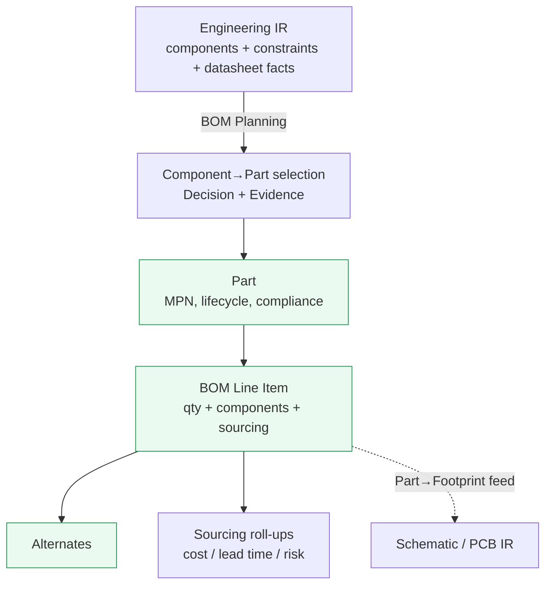

# BOM IR

> **Ring:** Domain — compiler (inner). The BOM IR is the **sourcing** [Intermediate Representation](../compiler-ir.md): a typed, serializable projection of the design's [Parts](../../foundation/engineering-domain-model.md#part-manufacturer-part) and [BOM Line Items](../../foundation/engineering-domain-model.md#bom-line-item) — the bridge from generic components to real, orderable hardware with quantities, sourcing, lifecycle, and alternates. It is one of the two projections that fan out from the [Engineering IR](engineering-ir.md). Per [P6](../../foundation/principles.md) and [ADR-0005](../../decisions/0005-ir-as-canonical-phase-boundary-representation.md), it is a **projection of the canonical [Engineering Domain Model](../../foundation/engineering-domain-model.md)** (its *Sourcing* layer), never a separate source of truth.

## Purpose

The BOM IR exists to make the design **buildable and purchasable**, and to do so *in lockstep* with the logical design rather than as an afterthought. Concretely it:

- selects, for each component that needs one, a real [Part](../../foundation/engineering-domain-model.md#part-manufacturer-part) (manufacturer + MPN) consistent with the component's parameters and datasheet facts;
- assembles [BOM Line Items](../../foundation/engineering-domain-model.md#bom-line-item) — part, quantity, the components that use it, and sourcing data (price, availability, lead time, alternates);
- feeds Part choices forward so the [Schematic IR](schematic-ir.md) and [PCB IR](pcb-ir.md) can bind correct [Footprints](../../foundation/engineering-domain-model.md#footprint) — the cross-feed that keeps sourcing and layout consistent.

Because it lowers from the same [Engineering IR](engineering-ir.md) as the schematic, the BOM cannot diverge from the design's understanding of the problem: both start from the same functional blocks, constraints, and datasheet facts.

## Conceptual schema

The BOM IR projects the *Sourcing* entities of the [domain model](../../foundation/engineering-domain-model.md):

- **Part (Manufacturer Part)** — a real, orderable component: ID, MPN, manufacturer, datasheet reference, lifecycle status (active / NRND / EOL), parametric facts (from [Datasheet Intelligence](../../state-machines/datasheet-intelligence.md)), compliance flags (e.g. RoHS/REACH). Resolved via the [Parts-data port](../../core/contracts.md#parts-data-port).
- **BOM Line Item** — a row of the bill: the chosen Part, quantity, the [Components](../../foundation/engineering-domain-model.md#component) (by stable [Entity ID](../../foundation/engineering-domain-model.md)) that use it, and sourcing data (price, availability, lead time) plus **alternates** (qualified substitute parts with their own sourcing).
- **Component → Part selection** — the [Decision](../../foundation/engineering-domain-model.md#decision) recording *why* this Part was chosen for these components (options considered, rationale, [Evidence](../../foundation/engineering-domain-model.md#evidence), confidence), preserving [provenance](../../core/provenance-and-traceability.md).
- **Sourcing roll-ups** — derived aggregates (total cost, longest lead time, lifecycle-risk flags) — part of the *derived* view, recomputable from the lines.
- **Carried metadata:** version coordinate, IR schema version; all prices/quantities/lead times as typed values ([Physical Quantities](../../engineering/units-and-quantities.md) where dimensional).

*Figure: the BOM IR — parts selected for components, assembled into sourced line items with alternates and roll-ups, feeding footprint binding downstream. From the compiler ring's viewpoint.*

## Producers

- **Phase:** [BOM Planning](../../state-machines/bom-planning.md) (phase 5 in the [canonical phase map](../../foundation/architecture-views.md)).
- **Agent:** [BOM Agent](../../agents/bom-agent.md), using the [Constraint Engine](../../engineering/constraint-engine.md) (to honor sourcing/compliance constraints) and the [Parts-data port](../../core/contracts.md#parts-data-port) (to resolve real parts). Its reasoning half *proposes* part selections; its deterministic half validates against constraints and datasheet facts and commits.

## Consumers

- **[Schematic Planning](../../state-machines/schematic-planning.md)** ([Schematic Agent](../../agents/schematic-agent.md)) — uses Part choices to associate correct [Symbols](../../foundation/engineering-domain-model.md#symbol)/[Footprints](../../foundation/engineering-domain-model.md#footprint) (the cross-feed).
- **[PCB Floor Planning](../../state-machines/pcb-floor-planning.md)** ([Placement Agent](../../agents/placement-agent.md)) — binds each [Component](../../foundation/engineering-domain-model.md#component) to the Footprint implied by its chosen Part when projecting the [PCB IR](pcb-ir.md).
- **[Manufacturing Generation](../../state-machines/manufacturing-generation.md)** ([Manufacturing Agent](../../agents/manufacturing-agent.md)) — the BOM is part of the manufacturing output set; the [Manufacturing IR](manufacturing-ir.md) carries the assembly BOM forward.
- **[Presentation](../../core/contracts.md#presentation-query-port)** — surfaced to the engineer as a BOM view-model (sibling projection).

## Invariants

Beyond the [shared IR properties](../compiler-ir.md):

1. **Full coverage.** Every [Component](../../foundation/engineering-domain-model.md#component) that requires a physical part is covered by exactly one BOM Line Item. No uncovered components; no orphan lines (every line's components exist).
2. **Electrical consistency.** Each chosen [Part](../../foundation/engineering-domain-model.md#part-manufacturer-part) is consistent with its components' electrical parameters and datasheet facts — the domain-model [Component](../../foundation/engineering-domain-model.md#component) invariant carried into sourcing.
3. **Constraint compliance.** No line violates a sourcing, lifecycle, or compliance [Constraint](../../foundation/engineering-domain-model.md#constraint) without a recorded [Waiver](../../foundation/engineering-domain-model.md#waiver) (e.g. an EOL part used only with an explicit, justified acceptance).
4. **Quantities reconcile.** A line's quantity equals the total usage by its referenced components (no under/over-counting).
5. **Every selection is justified.** Each Component→Part selection carries a [Decision](../../foundation/engineering-domain-model.md#decision) with rationale and [Evidence](../../foundation/engineering-domain-model.md#evidence) ([P5](../../foundation/principles.md)); alternates record why they qualify as substitutes.
6. **Roll-ups are derived, never authoritative.** Cost/lead-time/risk aggregates are recomputable from the lines and never override them (the *derived* partition rule from the [Shared State Model](../../core/shared-state-model.md)).

## Transformations in/out

- **In:** [P4 — BOM Planning lowering](../transformations.md) from the [Engineering IR](engineering-ir.md). Inputs: candidate components, their constraints, and datasheet facts.
- **Out:**
  - **Cross-feed** — Part choices flow to the [Schematic IR](schematic-ir.md) and [PCB IR](pcb-ir.md) for [Footprint](../../foundation/engineering-domain-model.md#footprint) binding (not a lowering to a new IR, but a consistency feed; see [`transformations.md`](../transformations.md)).
  - **Forward** — the assembly BOM is carried into the [Manufacturing IR](manufacturing-ir.md) by [P13 — Manufacturing Generation](../transformations.md).

## Open decisions

- [ADR-0005](../../decisions/0005-ir-as-canonical-phase-boundary-representation.md) — the BOM IR is a projection of the sourcing layer.
- [ADR-0007](../../decisions/0007-units-and-physical-quantity-type-system.md) — typed parametric and dimensional values in parts/lines.
- [ADR-0010](../../decisions/0010-human-in-the-loop-autonomy-levels.md) — autonomy for auto-selecting parts vs. requiring engineer approval of sourcing.
- **Open question:** policy for ranking alternates and for accepting NRND/EOL parts under waiver (recorded with the BOM Planning phase / [Constraint Engine](../../engineering/constraint-engine.md)).
- **Deferred:** concrete serialization/schema and the parts-data adapter (out of Phase 0 scope).

## Related documents

[`compiler/compiler-ir.md`](../compiler-ir.md) · [`compiler/transformations.md`](../transformations.md) · [`compiler/ir/engineering-ir.md`](engineering-ir.md) · [`compiler/ir/schematic-ir.md`](schematic-ir.md) · [`compiler/ir/manufacturing-ir.md`](manufacturing-ir.md) · [`foundation/engineering-domain-model.md`](../../foundation/engineering-domain-model.md) · [`state-machines/bom-planning.md`](../../state-machines/bom-planning.md) · [`agents/bom-agent.md`](../../agents/bom-agent.md) · [`integration/supply-chain-and-parts-data.md`](../../integration/supply-chain-and-parts-data.md) · [`engineering/constraint-engine.md`](../../engineering/constraint-engine.md) · [`GLOSSARY.md`](../../GLOSSARY.md)
