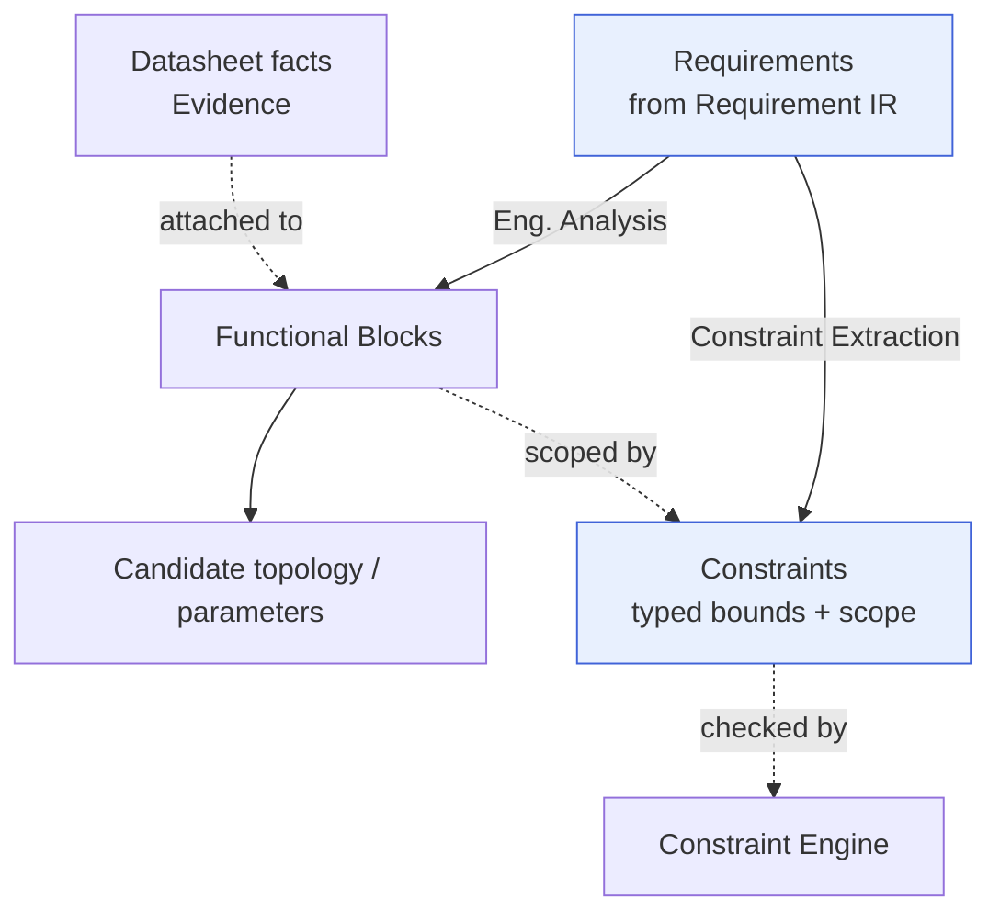

# Engineering IR

> **Ring:** Domain — compiler (inner). The Engineering IR is the **central** [Intermediate Representation](../compiler-ir.md): a typed, serializable projection of the **analyzed design** — its [Functional Blocks](../../foundation/engineering-domain-model.md#functional-block), the [Constraints](../../foundation/engineering-domain-model.md#constraint) extracted from requirements, and the datasheet facts ([Evidence](../../foundation/engineering-domain-model.md#evidence)) that ground it. It is the hinge of the pipeline: produced by lowering the [Requirement IR](requirement-ir.md), enriched by two further passes, and then fanned out into both the [BOM IR](bom-ir.md) and the [Schematic IR](schematic-ir.md). Per [P6](../../foundation/principles.md) and [ADR-0005](../../decisions/0005-ir-as-canonical-phase-boundary-representation.md), it is a **projection of the canonical [Engineering Domain Model](../../foundation/engineering-domain-model.md)**, never a competing source of truth.

## Purpose

The Engineering IR exists to hold the design *after it has been understood but before it has been drawn*. It is the representation where intent has become an organized engineering problem: which functional blocks exist, what enforceable constraints bound them, and what real-world datasheet facts the design must respect. Concretely it:

- carries the [Functional Block](../../foundation/engineering-domain-model.md#functional-block) decomposition that [Engineering Analysis](../../state-machines/engineering-analysis.md) derives from requirements;
- carries the machine-checkable [Constraints](../../foundation/engineering-domain-model.md#constraint) that [Constraint Extraction](../../state-machines/constraint-extraction.md) projects from those requirements, standards, and topology;
- carries the structured datasheet facts ([Datasheet Intelligence](../../state-machines/datasheet-intelligence.md)) attached as [Evidence](../../foundation/engineering-domain-model.md#evidence) to candidate components/parts;
- serves as the **single upstream** for both sourcing ([BOM IR](bom-ir.md)) and logical design ([Schematic IR](schematic-ir.md)), guaranteeing they start from the same understood design.

It is the place the architecture deliberately concentrates *engineering judgement* before any drawing exists, so that the schematic and the BOM cannot diverge in their understanding of the problem.

## Conceptual schema

The Engineering IR projects the analyzed-design slice of the [domain model](../../foundation/engineering-domain-model.md). Three pass kinds contribute to it (one lowering, two enrichments), so the schema is described by *what each contributes*:

- **From the lowering (Engineering Analysis):**
  - **Functional Block** — logical groupings that perform a function (e.g. "buck regulator", "MCU subsystem"), nesting into a block hierarchy, each linked to the [Requirements](../../foundation/engineering-domain-model.md#requirement) it serves.
  - **Candidate topology / design parameters** — the chosen organization and first derived parameters (typed [Physical Quantities](../../engineering/units-and-quantities.md)), recorded with the [Decisions](../../foundation/engineering-domain-model.md#decision) that produced them.
- **From Constraint Extraction (enrichment):**
  - **Constraint** — typed, machine-checkable restrictions (clearance, voltage/current limit, impedance target, thermal limit, keep-out, manufacturing rule, compliance rule), each with scope (which entities it applies to), a bound (a [Physical Quantity](../../engineering/units-and-quantities.md) or relation), severity, and source. Managed by the [Constraint Engine](../../engineering/constraint-engine.md).
- **From Datasheet Intelligence (enrichment):**
  - **Datasheet facts as Evidence** — parameters, pinouts, absolute-maximum and recommended-operating limits, lifecycle and compliance flags, attached to candidate components/parts by stable [Entity ID](../../foundation/engineering-domain-model.md), each carrying source reference and reliability; sourced into the [Knowledge Graph](../../knowledge/knowledge-graph.md).
- **Carried through:** the originating [Requirements](../../foundation/engineering-domain-model.md#requirement) (by reference) and all [provenance links](../../core/provenance-and-traceability.md) back to them; plus the shared IR metadata (version coordinate, schema version).

*Figure: the Engineering IR after its lowering and two enrichments — functional decomposition, extracted constraints, and datasheet evidence over one analyzed design. From the compiler ring's viewpoint.*

## Producers

- **Produced by — [Engineering Analysis](../../state-machines/engineering-analysis.md)** (phase 2) via the [Planning Agent](../../agents/planning-agent.md), using the [Planning Engine](../../engineering/planning-engine.md) and [Constraint Engine](../../engineering/constraint-engine.md). This is the [P1 lowering](../transformations.md) from the [Requirement IR](requirement-ir.md).
- **Enriched by — [Constraint Extraction](../../state-machines/constraint-extraction.md)** (phase 3) via the [Planning Agent](../../agents/planning-agent.md) and [Constraint Engine](../../engineering/constraint-engine.md) — [P2 enrichment](../transformations.md).
- **Enriched by — [Datasheet Intelligence](../../state-machines/datasheet-intelligence.md)** (phase 4) via the [Datasheet Agent](../../agents/datasheet-agent.md), feeding the [Knowledge Graph](../../knowledge/knowledge-graph.md) — [P3 enrichment](../transformations.md).

## Consumers

- **[BOM Planning](../../state-machines/bom-planning.md)** ([BOM Agent](../../agents/bom-agent.md)) — lowers the Engineering IR to the [BOM IR](bom-ir.md) (transformation [P4](../transformations.md)), using constraints and datasheet facts to select real parts.
- **[Schematic Planning](../../state-machines/schematic-planning.md)** ([Schematic Agent](../../agents/schematic-agent.md)) — lowers the Engineering IR to the [Schematic IR](schematic-ir.md) (transformation [P5](../transformations.md)), realizing functional blocks as components/nets under the constraints.
- **[Constraint Engine](../../engineering/constraint-engine.md)** — consumes the carried Constraints for all later checking ([ERC](../../state-machines/erc-verification.md)/[DRC](../../state-machines/drc-verification.md)/[DFM](../../state-machines/dfm-verification.md) specialize over them).

## Invariants

Beyond the [shared IR properties](../compiler-ir.md):

1. **Every Functional Block traces to a Requirement.** No block exists without a requirement it serves; conversely, no in-scope accepted Requirement is left unaddressed without an explicit, recorded deferral/waiver. (Preserves the Requirement IR's rooting through the lowering.)
2. **Every Constraint is a projection of a source.** Each Constraint links to the [Requirement](../../foundation/engineering-domain-model.md#requirement), standard, part, or process it derives from ("a Constraint is a Requirement's enforceable projection"). No free-floating constraints.
3. **Constraints are well-formed and consistent.** Bounds are typed [Physical Quantities](../../engineering/units-and-quantities.md) with resolvable scope; no contradictory constraint pair is admitted without a recorded resolution [Decision](../../foundation/engineering-domain-model.md#decision).
4. **Datasheet facts are sourced and typed.** Every attached fact carries a source reference and reliability, is dimensionally typed, and attaches to an entity by stable ID; conflicts with existing parameters are surfaced as flagged discrepancies, never silent overwrites.
5. **Still pre-physical and pre-schematic.** The Engineering IR carries *no* concrete Components, Pins, Nets, Symbols, Footprints, or layout — those are the [Schematic IR](schematic-ir.md)/[PCB IR](pcb-ir.md). It holds functional blocks and constraints, the inputs to those representations.
6. **One understood design, fanned out consistently.** Because both BOM and Schematic IRs lower from this single IR, any block/constraint/fact they rely on resolves to the same canonical entity — the structural guarantee that sourcing and logical design cannot disagree about the problem.

## Transformations in/out

- **In:** [P1 — Engineering Analysis lowering](../transformations.md) from the [Requirement IR](requirement-ir.md). Then enriched in place by [P2 — Constraint Extraction](../transformations.md) and [P3 — Datasheet Intelligence](../transformations.md).
- **Out (fan-out):**
  - [P4 — BOM Planning lowering](../transformations.md) → [BOM IR](bom-ir.md).
  - [P5 — Schematic Planning lowering](../transformations.md) → [Schematic IR](schematic-ir.md).

  These two lowerings are mutually consistent because they share this IR as their single input; the [BOM IR](bom-ir.md)'s Part choices feed back into the [Schematic IR](schematic-ir.md)'s footprint/symbol association (the cross-feed in [`transformations.md`](../transformations.md)).

## Open decisions

- [ADR-0005](../../decisions/0005-ir-as-canonical-phase-boundary-representation.md) — projection-not-fork framing for the analyzed design.
- [ADR-0007](../../decisions/0007-units-and-physical-quantity-type-system.md) — typed constraint bounds and datasheet parameters.
- [ADR-0004](../../decisions/0004-event-sourcing-decision.md) — enrichment passes write back as Events; the IR re-projects.
- **Open question:** how aggressively the [Constraint Engine](../../engineering/constraint-engine.md) resolves derived constraints during enrichment vs. defers them to later phases (recorded with the Constraint Extraction phase).
- **Deferred:** concrete serialization/schema (out of Phase 0 scope).

## Related documents

[`compiler/compiler-ir.md`](../compiler-ir.md) · [`compiler/transformations.md`](../transformations.md) · [`compiler/ir/requirement-ir.md`](requirement-ir.md) · [`compiler/ir/bom-ir.md`](bom-ir.md) · [`compiler/ir/schematic-ir.md`](schematic-ir.md) · [`foundation/engineering-domain-model.md`](../../foundation/engineering-domain-model.md) · [`engineering/constraint-engine.md`](../../engineering/constraint-engine.md) · [`state-machines/engineering-analysis.md`](../../state-machines/engineering-analysis.md) · [`state-machines/constraint-extraction.md`](../../state-machines/constraint-extraction.md) · [`state-machines/datasheet-intelligence.md`](../../state-machines/datasheet-intelligence.md) · [`knowledge/knowledge-graph.md`](../../knowledge/knowledge-graph.md) · [`GLOSSARY.md`](../../GLOSSARY.md)
