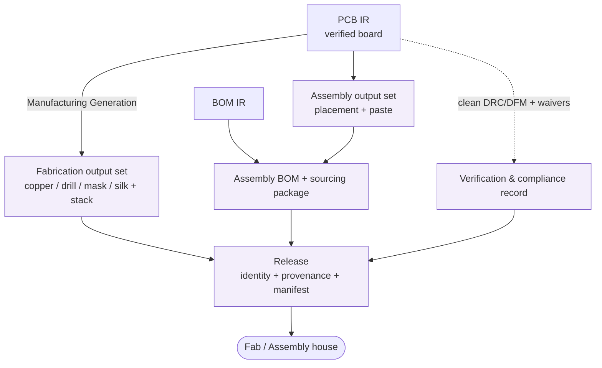

# Manufacturing IR

> **Ring:** Domain — compiler (inner). The Manufacturing IR is the **final** [Intermediate Representation](../compiler-ir.md): a typed, serializable projection of the design's **manufacturing output set** — the fabrication, assembly, and sourcing artifacts that let a fab/assembly house build the board. It is lowered from the verified [PCB IR](pcb-ir.md) and is the pipeline's exit point to the outside world. Per [P6](../../foundation/principles.md) and [ADR-0005](../../decisions/0005-ir-as-canonical-phase-boundary-representation.md), it is a **projection of the canonical [Engineering Domain Model](../../foundation/engineering-domain-model.md)** assembled into a buildable package, never a separate source of truth — it carries no engineering knowledge that is not already derivable from the verified PCB IR and BOM IR.

## Purpose

The Manufacturing IR exists to turn a **verified board into a buildable package** — and to do so traceably, so the thing manufactured is provably the thing that was designed and verified. Concretely it:

- assembles the **fabrication** description (board outline, layer/copper geometry, drill, solder mask, silkscreen, stack-up notes) from the [PCB IR](pcb-ir.md);
- assembles the **assembly** description (component placement/orientation for pick-and-place, the assembly [BOM](bom-ir.md), and any paste/stencil information) from the PCB and [BOM IRs](bom-ir.md);
- carries forward the **sourcing** package (the [BOM Line Items](../../foundation/engineering-domain-model.md#bom-line-item) with alternates) needed to procure parts;
- bundles the **verification record** (clean [DRC](../../state-machines/drc-verification.md)/[DFM](../../state-machines/dfm-verification.md), any [Waivers](../../foundation/engineering-domain-model.md#waiver), [EMC](../../state-machines/emc-analysis.md) analysis) so the package is auditable.

It is deliberately a *terminal* projection: nothing downstream in the pipeline consumes it; its consumers are external (fab and assembly houses) and the engineer reviewing the release.

## Conceptual schema

The Manufacturing IR projects manufacturing outputs assembled from the *Physical design* and *Sourcing* layers of the [domain model](../../foundation/engineering-domain-model.md). Described conceptually (no concrete file formats — those are the deferred, technology-phase decision):

- **Fabrication output set** — the per-layer copper, drill, mask, and silkscreen geometry plus the [Board / Layer Stack](../../foundation/engineering-domain-model.md#board--layer-stack) description (dimensions, stack-up, materials — typed [Physical Quantities](../../engineering/units-and-quantities.md)). Derived directly from the PCB IR's board and routing.
- **Assembly output set** — per-component placement/rotation/side for automated assembly, the **assembly BOM**, and paste/stencil information, derived from PCB [Placement](../../foundation/engineering-domain-model.md#placement) + [Footprints](../../foundation/engineering-domain-model.md#footprint) and the [BOM IR](bom-ir.md).
- **Sourcing package** — the [BOM Line Items](../../foundation/engineering-domain-model.md#bom-line-item) (parts, quantities, alternates, sourcing) carried forward for procurement.
- **Verification & compliance record** — the gating outcome: clean/waived [Violations](../../foundation/engineering-domain-model.md#violation), [Waivers](../../foundation/engineering-domain-model.md#waiver) with justification, and [EMC](../../foundation/engineering-domain-model.md#analysis-result)/compliance results — the evidence that this package is releasable.
- **Release identity & provenance** — the version coordinate of the exact design released, plus [provenance links](../../core/provenance-and-traceability.md) from every artifact back to the PCB IR entities (and onward to nets, schematic, constraints, requirements) it was generated from ([P5](../../foundation/principles.md)).
- **Carried metadata:** IR schema version; artifact manifest binding the set together as one coherent release.

*Figure: the Manufacturing IR — fabrication, assembly, and sourcing output sets plus the verification record, bundled with release identity/provenance into one package for external manufacturers. From the compiler ring's viewpoint.*

## Producers

- **Phase:** [Manufacturing Generation](../../state-machines/manufacturing-generation.md) (phase 14 in the [canonical phase map](../../foundation/architecture-views.md)).
- **Agent:** [Manufacturing Agent](../../agents/manufacturing-agent.md), using the [Verification Engine](../../engineering/verification-engine.md) to enforce the release gate. Its deterministic half assembles artifacts from the verified PCB and BOM IRs; reasoning is minimal here (generation is largely mechanical), with judgement reserved for resolving output-option choices, recorded as [Decisions](../../foundation/engineering-domain-model.md#decision).

## Consumers

- **External fabrication / assembly houses** — the ultimate consumers; receive the fabrication and assembly output sets (via the [artifact store](../../data/stores/artifact-store.md) and export path).
- **Procurement** — consumes the sourcing package.
- **[Presentation](../../core/contracts.md#presentation-query-port)** — the engineer reviews/approves the release through a view-model before it leaves the system ([P10](../../foundation/principles.md): the human disposes).
- **No downstream IR** — the Manufacturing IR is terminal; nothing in the pipeline lowers from it.

## Invariants

Beyond the [shared IR properties](../compiler-ir.md):

1. **Verified-source precondition.** The Manufacturing IR may only be produced from a [PCB IR](pcb-ir.md) with **no open error-severity [Violations](../../foundation/engineering-domain-model.md#violation)** (the domain-model rule that such a design cannot transition to manufacturing); any accepted issue is covered by a recorded [Waiver](../../foundation/engineering-domain-model.md#waiver).
2. **Faithful derivation (no untracked edits).** Every artifact derives from, and traces to, the PCB/BOM IR entities it was generated from; the board the artifacts describe is *exactly* the verified board — no change is introduced between verification and generation. (This is the property that makes "what we built = what we verified" provable.)
3. **Internal consistency.** The output sets agree with each other: the assembly placement file matches the footprints in the fabrication set; the assembly BOM matches the parts those footprints imply; quantities reconcile with the [BOM IR](bom-ir.md).
4. **Completeness.** The set is sufficient to fabricate *and* assemble the board (no missing layer, drill, placement, or BOM line) — a partial set is not a valid Manufacturing IR.
5. **Typed physical content.** Dimensions, stack-up, and geometry are [Physical Quantities](../../engineering/units-and-quantities.md) ([P9](../../foundation/principles.md)).
6. **Release identity & auditability.** The IR records the exact version coordinate released and carries the verification record and full [provenance](../../core/provenance-and-traceability.md), so the release is reproducible and auditable ([P4](../../foundation/principles.md), [P5](../../foundation/principles.md)).

## Transformations in/out

- **In:** [P13 — Manufacturing Generation lowering](../transformations.md) from the verified [PCB IR](pcb-ir.md), drawing the assembly BOM/sourcing forward from the [BOM IR](bom-ir.md). The lowering's precondition is the clean/waived DRC & DFM gate.
- **Out:** none within the pipeline — the Manufacturing IR is **terminal**. Its outputs cross the [system boundary](../../foundation/architecture-views.md) to external fab/assembly via the [artifact store](../../data/stores/artifact-store.md). A defect found at manufacturing review routes *back* (a state-level loop-back to the offending phase), not forward. See [`transformations.md`](../transformations.md).

## Open decisions

- [ADR-0005](../../decisions/0005-ir-as-canonical-phase-boundary-representation.md) — the Manufacturing IR is a projection assembled from the canonical model, not new truth.
- [ADR-0007](../../decisions/0007-units-and-physical-quantity-type-system.md) — typed physical content in fabrication artifacts.
- [ADR-0009](../../decisions/0009-determinism-and-replay-strategy.md) — deterministic, reproducible release generation.
- [ADR-0010](../../decisions/0010-human-in-the-loop-autonomy-levels.md) — engineer approval of the release before export.
- **Deferred:** the concrete output formats (e.g. the fabrication and assembly file standards) — a technology-selection decision out of Phase 0 scope.

## Related documents

[`compiler/compiler-ir.md`](../compiler-ir.md) · [`compiler/transformations.md`](../transformations.md) · [`compiler/ir/pcb-ir.md`](pcb-ir.md) · [`compiler/ir/bom-ir.md`](bom-ir.md) · [`foundation/engineering-domain-model.md`](../../foundation/engineering-domain-model.md) · [`state-machines/manufacturing-generation.md`](../../state-machines/manufacturing-generation.md) · [`agents/manufacturing-agent.md`](../../agents/manufacturing-agent.md) · [`engineering/verification-engine.md`](../../engineering/verification-engine.md) · [`data/stores/artifact-store.md`](../../data/stores/artifact-store.md) · [`core/provenance-and-traceability.md`](../../core/provenance-and-traceability.md) · [`GLOSSARY.md`](../../GLOSSARY.md)
