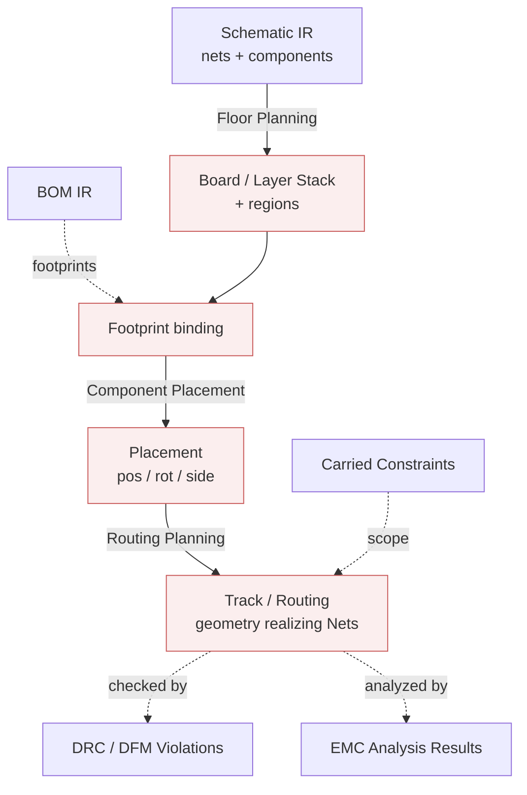

# PCB IR

> **Ring:** Domain — compiler (inner). The PCB IR is the **physical-design** [Intermediate Representation](../compiler-ir.md): a typed, serializable projection of the design as a physical board — [Board / Layer Stack](../../foundation/engineering-domain-model.md#board--layer-stack), [Placement](../../foundation/engineering-domain-model.md#placement), and [Track / Routing](../../foundation/engineering-domain-model.md#track--routing). It is lowered from the [Schematic IR](schematic-ir.md), enriched across floor planning, placement, and routing, and checked by [DRC](../../state-machines/drc-verification.md)/[DFM](../../state-machines/dfm-verification.md) and analyzed by [EMC](../../state-machines/emc-analysis.md) before becoming the [Manufacturing IR](manufacturing-ir.md). Per [P6](../../foundation/principles.md) and [ADR-0005](../../decisions/0005-ir-as-canonical-phase-boundary-representation.md), it is a **projection of the canonical [Engineering Domain Model](../../foundation/engineering-domain-model.md)** (its *Physical design* layer), never a separate source of truth.

## Purpose

The PCB IR exists to represent the design **as copper and substrate** — where every component physically sits and how every net is physically realized. It is the most heavily enriched IR in the pipeline (three contributing phases) and the most heavily checked (three verification/analysis phases). Concretely it:

- gives the design a physical frame: a [Board / Layer Stack](../../foundation/engineering-domain-model.md#board--layer-stack) with regions allocated to [Functional Blocks](../../foundation/engineering-domain-model.md#functional-block) ([Floor Planning](../../state-machines/pcb-floor-planning.md));
- binds each [Component](../../foundation/engineering-domain-model.md#component) to a [Footprint](../../foundation/engineering-domain-model.md#footprint) and a [Placement](../../foundation/engineering-domain-model.md#placement) ([Component Placement](../../state-machines/component-placement.md));
- realizes every [Net](../../foundation/engineering-domain-model.md#net) from the [Schematic IR](schematic-ir.md) as [Track / Routing](../../foundation/engineering-domain-model.md#track--routing) geometry ([Routing Planning](../../state-machines/routing-planning.md));
- is the artifact that [DRC](../../state-machines/drc-verification.md), [DFM](../../state-machines/dfm-verification.md), and [EMC](../../state-machines/emc-analysis.md) check/analyze, and the input to the **PCB→Manufacturing lowering** ([P13](../transformations.md)).

## Conceptual schema

The PCB IR projects the *Physical design* entities of the [domain model](../../foundation/engineering-domain-model.md), contributed by one lowering and two enrichments:

- **From the lowering (Floor Planning):**
  - **Board / Layer Stack** — outline, dimensions, layer stack-up (copper/dielectric layers, thicknesses, materials, dielectric constants — all typed [Physical Quantities](../../engineering/units-and-quantities.md)), and **board regions** allocated to Functional Blocks.
  - **Footprint binding** — each Component bound to its [Footprint](../../foundation/engineering-domain-model.md#footprint) (pad geometry, courtyard, keep-outs, mounting type), using [BOM IR](bom-ir.md) Part choices.
  - **Carried Nets** — every [Net](../../foundation/engineering-domain-model.md#net) from the [Schematic IR](schematic-ir.md), now awaiting physical realization.
- **From Component Placement (enrichment):**
  - **Placement** — per-component position, rotation, layer/side, locked flag (positions as typed length quantities).
- **From Routing Planning (enrichment):**
  - **Track / Routing** — copper geometry (segments, arcs, vias), layer, width, differential-pair partner, realizing each Net.
- **Carried Constraints** — physical/electrical Constraints (clearance, impedance, thermal, keep-out) scoping the physical entities.
- **Verification & analysis annotations** — [Violations](../../foundation/engineering-domain-model.md#violation)/[Waivers](../../foundation/engineering-domain-model.md#waiver) from [DRC](../../state-machines/drc-verification.md)/[DFM](../../state-machines/dfm-verification.md) and [Analysis Results](../../foundation/engineering-domain-model.md#analysis-result) from [EMC](../../state-machines/emc-analysis.md) (annotation only; *derived* view).
- **Carried metadata + provenance** back to nets, schematic, constraints, requirements.

*Figure: the PCB IR — board/stack and regions from floor planning, footprints from the BOM, placement, then routing realizing the nets, with DRC/DFM/EMC annotations layered on. From the compiler ring's viewpoint.*

## Producers

- **Produced by — [PCB Floor Planning](../../state-machines/pcb-floor-planning.md)** (phase 8) via the [Placement Agent](../../agents/placement-agent.md), using Planning & Constraint engines — the [P7 lowering](../transformations.md) from the [Schematic IR](schematic-ir.md).
- **Enriched by — [Component Placement](../../state-machines/component-placement.md)** (phase 9) via the [Placement Agent](../../agents/placement-agent.md) — [P8 enrichment](../transformations.md).
- **Enriched by — [Routing Planning](../../state-machines/routing-planning.md)** (phase 10) via the [Routing Agent](../../agents/routing-agent.md), using Constraint & Planning engines — [P9 enrichment](../transformations.md).
- **Checked/analyzed by:** [DRC Verification](../../state-machines/drc-verification.md) (phase 11, [DRC Agent](../../agents/drc-agent.md)), [DFM Verification](../../state-machines/dfm-verification.md) (phase 12, [DFM Agent](../../agents/dfm-agent.md)), and [EMC Analysis](../../state-machines/emc-analysis.md) (phase 13, [EMC Agent](../../agents/emc-agent.md) via the [Simulation port](../../core/contracts.md#simulation-port)).

## Consumers

- **[Manufacturing Generation](../../state-machines/manufacturing-generation.md)** ([Manufacturing Agent](../../agents/manufacturing-agent.md)) — the primary consumer; lowers the PCB IR to the [Manufacturing IR](manufacturing-ir.md) (transformation [P13](../transformations.md)).
- **[DRC](../../state-machines/drc-verification.md) / [DFM](../../state-machines/dfm-verification.md) / [EMC](../../state-machines/emc-analysis.md)** — consume placement/routing/stack to evaluate physical rules and electromagnetic behavior.
- **[Presentation](../../core/contracts.md#presentation-query-port)** — rendered as a board/layout view-model (sibling projection; diagnostics computed by the [Verification Engine](../../engineering/verification-engine.md), per [P11](../../foundation/principles.md)).

## Invariants

Beyond the [shared IR properties](../compiler-ir.md):

1. **Net carry-through.** Every [Net](../../foundation/engineering-domain-model.md#net) in the source [Schematic IR](schematic-ir.md) is present in the PCB IR; the logical connectivity is fully carried into the physical domain (none dropped, none invented).
2. **Routing fidelity.** For each Net, the union of its [Tracks](../../foundation/engineering-domain-model.md#track--routing) electrically realizes *exactly* that Net's [Connections](../../foundation/engineering-domain-model.md#connection) — no more, no less (the domain-model [Track](../../foundation/engineering-domain-model.md#track--routing) invariant). No shorts (two nets joined), no opens (a net not fully realized) once routing is complete.
3. **Footprint ↔ symbol consistency.** Each Component's bound [Footprint](../../foundation/engineering-domain-model.md#footprint) pad count and pin mapping match its [Symbol](../../foundation/engineering-domain-model.md#symbol) (carried from the [Schematic IR](schematic-ir.md)).
4. **Placement validity.** Every [Placement](../../foundation/engineering-domain-model.md#placement) lies within the board outline and within its [Functional Block](../../foundation/engineering-domain-model.md#functional-block)'s floor-planning region; keep-out and thermal Constraints are respected.
5. **Typed geometry & stack.** Track widths, layer thicknesses, dielectric constants, and positions are [Physical Quantities](../../engineering/units-and-quantities.md) ([P9](../../foundation/principles.md)).
6. **Constraint preservation.** Physical/electrical Constraints carried from upstream remain attached by stable [Entity ID](../../foundation/engineering-domain-model.md) and are the input to DRC/DFM checks.
7. **Manufacturing-gate readiness.** No open error-severity [Violation](../../foundation/engineering-domain-model.md#violation) may exist when the PCB→Manufacturing lowering runs (the domain-model rule that a design with open error-severity violations cannot transition to manufacturing), unless [Waivers](../../foundation/engineering-domain-model.md#waiver) are recorded.

## Transformations in/out

- **In:** [P7 — Floor Planning lowering](../transformations.md) from the [Schematic IR](schematic-ir.md), with [BOM IR](bom-ir.md) footprint feed. Then enriched by [P8 — Component Placement](../transformations.md) and [P9 — Routing Planning](../transformations.md).
- **Check/analysis:** [P10 — DRC](../transformations.md), [P11 — DFM](../transformations.md) (both gate Manufacturing), and [P12 — EMC](../transformations.md) (analysis, may loop back).
- **Out:** [P13 — Manufacturing Generation lowering](../transformations.md) → [Manufacturing IR](manufacturing-ir.md). Verification failures loop back: DRC/EMC → Routing, DFM → Placement (per the [default workflow plan](../../foundation/architecture-views.md)). See [`transformations.md`](../transformations.md).

## Open decisions

- [ADR-0005](../../decisions/0005-ir-as-canonical-phase-boundary-representation.md) — the PCB IR is a projection of the physical-design layer.
- [ADR-0007](../../decisions/0007-units-and-physical-quantity-type-system.md) — typed geometry and stack-up.
- [ADR-0009](../../decisions/0009-determinism-and-replay-strategy.md) — deterministic re-projection on routing/placement loop-backs.
- **Open question:** how much of placement/routing is autonomous vs. engineer-directed, and how EMC analysis findings are turned into routing constraints (recorded with the respective phases and [ADR-0010](../../decisions/0010-human-in-the-loop-autonomy-levels.md)).
- **Deferred:** concrete serialization/schema and the simulation adapter (out of Phase 0 scope).

## Related documents

[`compiler/compiler-ir.md`](../compiler-ir.md) · [`compiler/transformations.md`](../transformations.md) · [`compiler/ir/schematic-ir.md`](schematic-ir.md) · [`compiler/ir/bom-ir.md`](bom-ir.md) · [`compiler/ir/manufacturing-ir.md`](manufacturing-ir.md) · [`foundation/engineering-domain-model.md`](../../foundation/engineering-domain-model.md) · [`state-machines/pcb-floor-planning.md`](../../state-machines/pcb-floor-planning.md) · [`state-machines/component-placement.md`](../../state-machines/component-placement.md) · [`state-machines/routing-planning.md`](../../state-machines/routing-planning.md) · [`state-machines/drc-verification.md`](../../state-machines/drc-verification.md) · [`state-machines/dfm-verification.md`](../../state-machines/dfm-verification.md) · [`state-machines/emc-analysis.md`](../../state-machines/emc-analysis.md) · [`engineering/verification-engine.md`](../../engineering/verification-engine.md) · [`GLOSSARY.md`](../../GLOSSARY.md)
