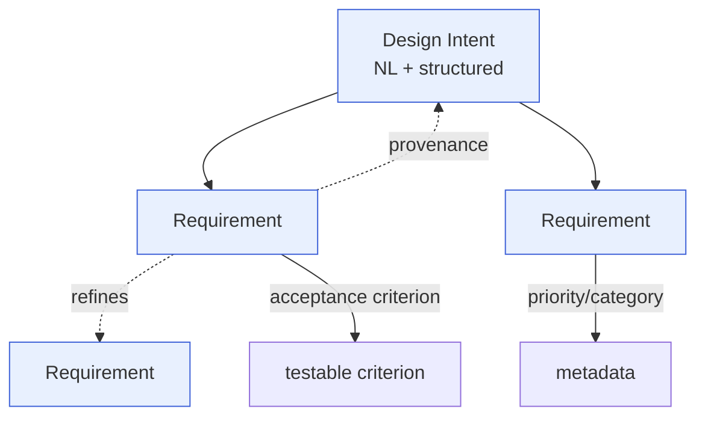

# Requirement IR

> **Ring:** Domain — compiler (inner). The Requirement IR is the **first** [Intermediate Representation](../compiler-ir.md) in the pipeline: a typed, serializable projection of the design's **intent and requirements** at the boundary out of [Requirement Planning](../../state-machines/requirement-planning.md). It is what turns natural-language [Design Intent](../../foundation/engineering-domain-model.md#design-intent) into a structured artifact the rest of the system can reason over. Per [P6](../../foundation/principles.md) and [ADR-0005](../../decisions/0005-ir-as-canonical-phase-boundary-representation.md), it is a **projection of the canonical [Engineering Domain Model](../../foundation/engineering-domain-model.md)** — specifically its *Intent & requirements* layer — never a separate source of truth.

## Purpose

The Requirement IR exists to give the engineering process a **typed, traceable root**. Everything downstream — constraints, components, nets, placement, routing, BOM, manufacturing — must ultimately trace back to a requirement ([P5](../../foundation/principles.md)); the Requirement IR is where that traceability tree is rooted. Concretely it:

- captures [Design Intent](../../foundation/engineering-domain-model.md#design-intent) both as preserved natural language *and* as progressively structured [Requirements](../../foundation/engineering-domain-model.md#requirement);
- gives every requirement a stable [Entity ID](../../foundation/engineering-domain-model.md), category, priority, and acceptance criterion so it is testable and addressable;
- forms the input to the [Engineering Analysis lowering](../transformations.md) (P1) that produces the [Engineering IR](engineering-ir.md).

It is deliberately *pre-engineering*: it states **what must be true**, not how it will be achieved. It carries no Functional Blocks, components, or constraints — those appear only after lowering.

## Conceptual schema

The Requirement IR projects the **Intent & requirements** entities of the [domain model](../../foundation/engineering-domain-model.md). Described conceptually (no formats, no types):

- **Design Intent** — the originating goal(s), preserved verbatim and as a structured summary; origin of all downstream entities; carries source attribution (which human/agent expressed it).
- **Requirement** — each testable statement the design must satisfy, with: stable ID; statement; category (functional / electrical / mechanical / thermal / regulatory / cost / schedule); priority; acceptance criterion; status (proposed / accepted / …); and source (the Design Intent or external standard it came from). Physical targets within a requirement are [Physical Quantities](../../engineering/units-and-quantities.md) with unit and tolerance ([P9](../../foundation/principles.md)).
- **Requirement relationships** — refinement and dependency links between requirements (a requirement may refine or depend on another), each a first-class addressed relationship.
- **Provenance seeds** — the initial [Provenance Links](../../foundation/engineering-domain-model.md#provenance-link) from each Requirement to its source Design Intent, plus any [Decision](../../foundation/engineering-domain-model.md#decision) records made while structuring intent.
- **Carried metadata (shared IR properties):** the version coordinate of the canonical state, the IR schema version, and the [provenance](../../core/provenance-and-traceability.md) needed to keep the tree rooted.

*Figure: the Requirement IR carries Design Intent and the structured Requirements it decomposes into, with acceptance criteria and provenance to source. From the compiler ring's viewpoint; entity definitions are canonical in the [domain model](../../foundation/engineering-domain-model.md).*

## Producers

- **Phase:** [Requirement Planning](../../state-machines/requirement-planning.md) (phase 1 in the [canonical phase map](../../foundation/architecture-views.md)).
- **Agent:** [Requirement Agent](../../agents/requirement-agent.md), using the [Planning Engine](../../engineering/planning-engine.md). Its reasoning half *proposes* structure from intent; its deterministic half validates and commits via the [Capability port](../../core/contracts.md#capability-port). The Requirement IR is then projected from the resulting canonical state.

## Consumers

- **[Engineering Analysis](../../state-machines/engineering-analysis.md)** ([Planning Agent](../../agents/planning-agent.md)) — the primary consumer; lowers the Requirement IR to the [Engineering IR](engineering-ir.md) (transformation [P1](../transformations.md)).
- **[Provenance & traceability](../../core/provenance-and-traceability.md)** — uses the Requirement IR as the root of the requirement-satisfaction matrix; every later phase's "does this satisfy its requirement?" resolves here.
- **[Presentation](../../core/contracts.md#presentation-query-port)** — requirements are surfaced to the engineer as a read-only view-model (a sibling projection, not derived from this IR).

## Invariants

In addition to the [shared IR properties](../compiler-ir.md) (typed, versioned, serializable, invariant-checked, provenance-bearing):

1. **Every Requirement is rooted.** Each Requirement traces (via a [Provenance Link](../../foundation/engineering-domain-model.md#provenance-link)) to a [Design Intent](../../foundation/engineering-domain-model.md#design-intent) or an external standard. No orphan requirements.
2. **Every accepted Requirement is testable.** A Requirement with status *accepted* has a non-empty, checkable acceptance criterion (this is what makes later satisfaction provable — the domain-model Requirement invariant).
3. **Categories and priorities are well-formed.** Each Requirement carries exactly one category from the domain set and a priority; physical targets are typed [Physical Quantities](../../engineering/units-and-quantities.md), never bare numbers.
4. **Identity is stable.** Requirement IDs are opaque and immutable; refinement/dependency links reference by ID, never by statement text or position.
5. **No premature engineering content.** The Requirement IR contains *no* Functional Blocks, Constraints, Components, or layout entities — those belong to downstream IRs. (Guards against the IR becoming a competing design document.)
6. **Intent is preserved, not lost in structuring.** The original natural-language intent is retained alongside its structured form, so structuring decisions remain auditable.

## Transformations in/out

- **In:** none — the Requirement IR is the *source* IR of the pipeline. Its inputs are [Design Intent](../../foundation/engineering-domain-model.md#design-intent) captured during [Requirement Planning](../../state-machines/requirement-planning.md), not another IR.
- **Out:** [P1 — Engineering Analysis lowering](../transformations.md) consumes the Requirement IR and produces the [Engineering IR](engineering-ir.md), adding [Functional Blocks](../../foundation/engineering-domain-model.md#functional-block) and candidate topology while preserving requirement traceability. See [`transformations.md`](../transformations.md).

## Open decisions

- [ADR-0005](../../decisions/0005-ir-as-canonical-phase-boundary-representation.md) — the Requirement IR is a projection of the domain model's intent layer.
- [ADR-0007](../../decisions/0007-units-and-physical-quantity-type-system.md) — typed physical targets within requirements.
- [ADR-0010](../../decisions/0010-human-in-the-loop-autonomy-levels.md) — how much requirement structuring the system may do autonomously vs. with engineer confirmation.
- **Deferred:** concrete serialization/schema of the IR (out of Phase 0 scope).

## Related documents

[`compiler/compiler-ir.md`](../compiler-ir.md) · [`compiler/transformations.md`](../transformations.md) · [`compiler/ir/engineering-ir.md`](engineering-ir.md) · [`foundation/engineering-domain-model.md`](../../foundation/engineering-domain-model.md) · [`state-machines/requirement-planning.md`](../../state-machines/requirement-planning.md) · [`agents/requirement-agent.md`](../../agents/requirement-agent.md) · [`core/provenance-and-traceability.md`](../../core/provenance-and-traceability.md) · [`GLOSSARY.md`](../../GLOSSARY.md)
