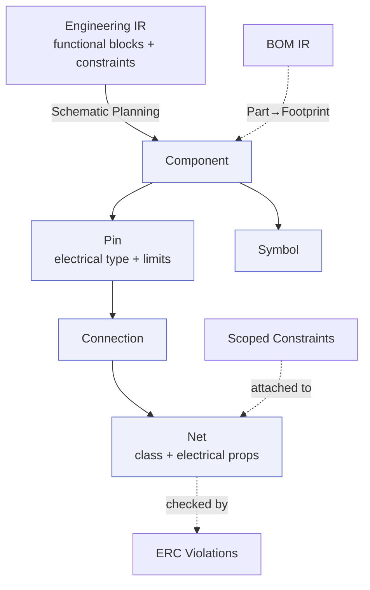

# Schematic IR

> **Ring:** Domain — compiler (inner). The Schematic IR is the **logical-design** [Intermediate Representation](../compiler-ir.md): a typed, serializable projection of the design as a connected circuit — [Components](../../foundation/engineering-domain-model.md#component), [Pins](../../foundation/engineering-domain-model.md#pin), [Connections](../../foundation/engineering-domain-model.md#connection), [Nets](../../foundation/engineering-domain-model.md#net), and [Symbols](../../foundation/engineering-domain-model.md#symbol). It is the second projection fanning out from the [Engineering IR](engineering-ir.md), the artifact [ERC](../../state-machines/erc-verification.md) checks, and the input to the physical domain. Per [P6](../../foundation/principles.md) and [ADR-0005](../../decisions/0005-ir-as-canonical-phase-boundary-representation.md), it is a **projection of the canonical [Engineering Domain Model](../../foundation/engineering-domain-model.md)** (its *Logical design* layer), never a separate source of truth.

## Purpose

The Schematic IR exists to represent **what is connected to what** — the electrical circuit, independent of any physical board. It is the bridge between the analyzed design and the layout: routing later *realizes* its nets physically. Concretely it:

- realizes each [Functional Block](../../foundation/engineering-domain-model.md#functional-block) from the [Engineering IR](engineering-ir.md) as concrete [Components](../../foundation/engineering-domain-model.md#component) with [Pins](../../foundation/engineering-domain-model.md#pin) and [Symbols](../../foundation/engineering-domain-model.md#symbol);
- captures [Connections](../../foundation/engineering-domain-model.md#connection) and resolves them into [Nets](../../foundation/engineering-domain-model.md#net) (the transitive closure of connections) with net classes and electrical properties;
- carries the [Constraints](../../foundation/engineering-domain-model.md#constraint) that scope logical entities so [ERC](../../state-machines/erc-verification.md) can check them and so they survive into the [PCB IR](pcb-ir.md);
- is the thing the **Schematic→PCB lowering** ([P7](../transformations.md)) consumes to build the board.

## Conceptual schema

The Schematic IR projects the *Logical design* entities of the [domain model](../../foundation/engineering-domain-model.md):

- **Component** — an instance of an electronic element (this U3, this R7): ID, reference designator, class, value/parameters (typed [Physical Quantities](../../engineering/units-and-quantities.md)), associated [Symbol](../../foundation/engineering-domain-model.md#symbol) and (via the [BOM IR](bom-ir.md) cross-feed) chosen [Part](../../foundation/engineering-domain-model.md#part-manufacturer-part)/[Footprint](../../foundation/engineering-domain-model.md#footprint).
- **Pin** — a connection point on a Component: ID, number/name, electrical type (input / output / power / passive / bidirectional / no-connect), and limit [Physical Quantities](../../engineering/units-and-quantities.md) (max voltage, max current) — the source of [ERC](../../state-machines/erc-verification.md) checks.
- **Connection** — the atomic assertion that two or more Pins are electrically joined.
- **Net** — the transitive closure of Connections: ID, name, net class (power / ground / signal / differential pair / high-speed), and electrical properties (target impedance, max current, voltage). The bridge to layout.
- **Symbol** — the schematic representation of a Component (pin map + graphic), distinct from its physical Footprint; lives in the [Component Library](../../engineering/component-library.md).
- **Scoped Constraints (carried)** — the Constraints from the [Engineering IR](engineering-ir.md) that apply to logical entities (e.g. a net's impedance target), attached by stable [Entity ID](../../foundation/engineering-domain-model.md).
- **Verification annotations** — [Violations](../../foundation/engineering-domain-model.md#violation)/[Waivers](../../foundation/engineering-domain-model.md#waiver) added by [ERC](../../state-machines/erc-verification.md) (annotation only; part of the *derived* view).
- **Carried metadata + provenance** back to functional blocks and requirements.

*Figure: the Schematic IR — components/pins/symbols, connections resolved into nets, constraints attached, footprints bound from the BOM, ERC annotations layered on. From the compiler ring's viewpoint.*

## Producers

- **Phase:** [Schematic Planning](../../state-machines/schematic-planning.md) (phase 6 in the [canonical phase map](../../foundation/architecture-views.md)).
- **Agent:** [Schematic Agent](../../agents/schematic-agent.md), using the [Planning Engine](../../engineering/planning-engine.md) and [Constraint Engine](../../engineering/constraint-engine.md). Reasoning half *proposes* circuit structure; deterministic half validates connectivity and constraints and commits.
- **Checked by:** [ERC Verification](../../state-machines/erc-verification.md) (phase 7) via the [ERC Agent](../../agents/erc-agent.md) over the [Verification Engine](../../engineering/verification-engine.md) — annotates the Schematic IR with [Violations](../../foundation/engineering-domain-model.md#violation) and gates the lowering to PCB ([P6 check](../transformations.md)).

## Consumers

- **[PCB Floor Planning](../../state-machines/pcb-floor-planning.md)** ([Placement Agent](../../agents/placement-agent.md)) — the primary consumer; lowers the Schematic IR to the [PCB IR](pcb-ir.md) (transformation [P7](../transformations.md)), carrying every Net into the physical domain.
- **[ERC Verification](../../state-machines/erc-verification.md)** — consumes pins/nets/connections to evaluate electrical rules.
- **[Presentation](../../core/contracts.md#presentation-query-port)** — rendered as a schematic view-model (sibling projection; the UI holds no ERC logic, per [P11](../../foundation/principles.md)).

## Invariants

Beyond the [shared IR properties](../compiler-ir.md):

1. **Connectivity completeness.** Every [Pin](../../foundation/engineering-domain-model.md#pin) resolves into exactly one [Net](../../foundation/engineering-domain-model.md#net) (or is an explicit no-connect). No floating pins beyond declared no-connects.
2. **Net = closure of Connections.** Each Net is exactly the transitive closure of its [Connections](../../foundation/engineering-domain-model.md#connection) — no pin in a net lacks a connection path, none is wrongly merged.
3. **Symbol ↔ Pin consistency.** A Component's Pins match its [Symbol](../../foundation/engineering-domain-model.md#symbol)'s pin map; where a [Part](../../foundation/engineering-domain-model.md#part-manufacturer-part)/[Footprint](../../foundation/engineering-domain-model.md#footprint) is bound (BOM cross-feed), footprint pad count and pin mapping match the Symbol (the domain-model [Footprint](../../foundation/engineering-domain-model.md#footprint) invariant) — the precondition the [PCB IR](pcb-ir.md) relies on.
4. **Block realization.** Every [Functional Block](../../foundation/engineering-domain-model.md#functional-block) from the [Engineering IR](engineering-ir.md) is realized by Components; no requirement-bearing block is left unrealized.
5. **Constraints preserved.** Every Constraint that scopes a logical entity remains attached to that entity by stable ID, so it survives into layout and verification.
6. **Typed electrical values.** Pin limits and net electrical properties are [Physical Quantities](../../engineering/units-and-quantities.md), never bare numbers ([P9](../../foundation/principles.md)).
7. **ERC-gate readiness.** No open error-severity [Violation](../../foundation/engineering-domain-model.md#violation) may exist when the Schematic→PCB lowering runs, unless a [Waiver](../../foundation/engineering-domain-model.md#waiver) is recorded.

## Transformations in/out

- **In:** [P5 — Schematic Planning lowering](../transformations.md) from the [Engineering IR](engineering-ir.md), with the [BOM IR](bom-ir.md) Part→Footprint cross-feed.
- **Check:** [P6 — ERC](../transformations.md) annotates the Schematic IR and gates the next lowering.
- **Out:** [P7 — PCB Floor Planning lowering](../transformations.md) → [PCB IR](pcb-ir.md); failures from ERC loop back to Schematic Planning (per the [default workflow plan](../../foundation/architecture-views.md)). See [`transformations.md`](../transformations.md).

## Open decisions

- [ADR-0005](../../decisions/0005-ir-as-canonical-phase-boundary-representation.md) — the Schematic IR is a projection of the logical-design layer.
- [ADR-0007](../../decisions/0007-units-and-physical-quantity-type-system.md) — typed pin limits and net properties.
- [ADR-0006](../../decisions/0006-agent-fsm-separation.md) — the Schematic Agent's two-part split that produces this IR.
- **Open question:** how net-class assignment (high-speed, differential) is proposed vs. confirmed, and how it feeds routing constraints (recorded with the Schematic Planning phase).
- **Deferred:** concrete serialization/schema (out of Phase 0 scope).

## Related documents

[`compiler/compiler-ir.md`](../compiler-ir.md) · [`compiler/transformations.md`](../transformations.md) · [`compiler/ir/engineering-ir.md`](engineering-ir.md) · [`compiler/ir/bom-ir.md`](bom-ir.md) · [`compiler/ir/pcb-ir.md`](pcb-ir.md) · [`foundation/engineering-domain-model.md`](../../foundation/engineering-domain-model.md) · [`state-machines/schematic-planning.md`](../../state-machines/schematic-planning.md) · [`state-machines/erc-verification.md`](../../state-machines/erc-verification.md) · [`agents/schematic-agent.md`](../../agents/schematic-agent.md) · [`engineering/component-library.md`](../../engineering/component-library.md) · [`engineering/verification-engine.md`](../../engineering/verification-engine.md) · [`GLOSSARY.md`](../../GLOSSARY.md)
