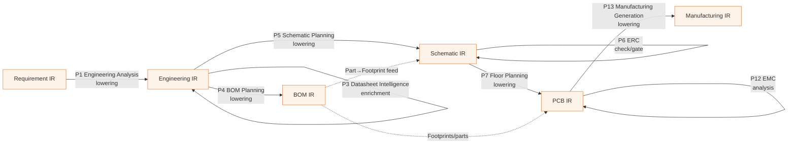

# Transformations (Lowering Passes)

> **Ring:** Domain — compiler (inner). This document specifies the **lowering passes** that carry a design from one [IR](compiler-ir.md) to the next: for each pass, its input and output IR, what engineering meaning it *adds*, the invariants it must *preserve*, how it is *validated*, and how it stays *reversible / traceable*. A lowering is the compiler-style analogue of a phase transition: a defined, invariant-preserving conversion from a higher-level representation to a lower-level one. Per [P6](../foundation/principles.md) and [ADR-0005](../decisions/0005-ir-as-canonical-phase-boundary-representation.md), a lowering never creates a second source of truth — it reads the canonical [Shared State Model](../core/shared-state-model.md) to project the source IR, then writes its results back **through the [Engineering Runtime](../core/engineering-runtime.md)** as validated, [Decision](../foundation/engineering-domain-model.md#decision)-justified [Events](../core/event-bus.md), so the next IR is again a faithful projection of the one canonical model.

## What a lowering is (and is not)

A **lowering** is a transformation `IR_n → IR_{n+1}` that:

- **reads** the source IR (a projection of canonical state at phase *n*),
- **adds** the engineering content that phase *n+1* is responsible for (e.g. turning Connections into routed Tracks),
- **preserves** the invariants that must survive the boundary (e.g. electrical connectivity), and
- **emits** the target IR such that it satisfies its own invariants.

A lowering is **not** a file conversion and **not** an in-place edit of a shared document. The actual mutation of the canonical model is always performed by the runtime ([P2](../foundation/principles.md)); the lowering *proposes* content via the [Capability port](../core/contracts.md#capability-port). The "output IR" is then re-projected from the now-enriched state. This keeps every IR a derived view and never a thing two passes fight over.

We distinguish three pass kinds (the distinction promised in [`compiler-ir.md`](compiler-ir.md)):

| Pass kind | Effect | Produces a new IR? | Examples |
|-----------|--------|--------------------|----------|
| **Lowering** | Projects to the *next* representation, adding that phase's content. | Yes | Engineering Analysis (Requirement→Engineering), Schematic Planning (Engineering→Schematic), Floor Planning (Schematic→PCB), Manufacturing Generation (PCB→Manufacturing). |
| **Enrichment** | Adds detail to the *same* IR (deepens the same projection). | No (same IR, more content) | Constraint Extraction & Datasheet Intelligence (enrich Engineering IR); Component Placement & Routing (enrich PCB IR). |
| **Check** | Annotates an IR with [Violations](../foundation/engineering-domain-model.md#violation) / [Analysis Results](../foundation/engineering-domain-model.md#analysis-result); gates the next lowering. | No (annotates) | ERC (Schematic IR); DRC, DFM (PCB IR); EMC analysis (PCB IR). |

## The pass pipeline

*Figure: the lowering / enrichment / check passes between IRs, labelled P1–P13. Solid arrows that change the target IR are lowerings; self-loops are enrichments or checks on one IR. From the compiler ring's viewpoint. Phase identities and agents are authoritative in [`architecture-views.md`](../foundation/architecture-views.md).*

## The passes

Each pass below names its driving [Phase](../foundation/architecture-views.md) and [Agent](../agents/README.md), its IR in/out, what it adds, the invariants it must preserve, and its validation. All passes share the cross-cutting properties in [Validation](#validation-discipline-shared-by-all-passes) and [Reversibility & traceability](#reversibility-and-traceability).

### P1 — Engineering Analysis (lowering) · Requirement IR → Engineering IR
- **Phase / agent:** [Engineering Analysis](../state-machines/engineering-analysis.md) · [Planning Agent](../agents/planning-agent.md).
- **Adds:** an analyzed design skeleton — [Functional Blocks](../foundation/engineering-domain-model.md#functional-block) decomposing the requirements, candidate topologies, and the first derived design parameters. Turns *what must be true* into *how the design will be organized*.
- **Preserves:** every accepted [Requirement](../foundation/engineering-domain-model.md#requirement) in the Requirement IR must remain traceable — each Functional Block links to the Requirement(s) it serves; no requirement is silently dropped.
- **Validation:** output Engineering IR satisfies its structural invariants (every block traces to ≥1 requirement; no requirement of in-scope category is left unaddressed without an explicit, recorded waiver/deferral).

### P2 — Constraint Extraction (enrichment) · Engineering IR → Engineering IR
- **Phase / agent:** [Constraint Extraction](../state-machines/constraint-extraction.md) · [Planning Agent](../agents/planning-agent.md), via the [Constraint Engine](../engineering/constraint-engine.md).
- **Adds:** machine-checkable [Constraints](../foundation/engineering-domain-model.md#constraint) derived from requirements, standards, and topology — clearances, voltage/current limits, impedance targets, thermal limits, keep-outs, compliance rules. *Intent becomes enforceable.*
- **Preserves:** each Constraint links to the Requirement or source it projects (a Constraint is "a Requirement's enforceable projection"); the requirement→constraint trace is complete.
- **Validation:** Constraints are well-formed for the [Constraint Engine](../engineering/constraint-engine.md) (typed bounds as [Physical Quantities](../engineering/units-and-quantities.md), resolvable scope); no contradictory pair is admitted without a recorded resolution.

### P3 — Datasheet Intelligence (enrichment) · Engineering IR → Engineering IR
- **Phase / agent:** [Datasheet Intelligence](../state-machines/datasheet-intelligence.md) · [Datasheet Agent](../agents/datasheet-agent.md), feeding the [Knowledge Graph](../knowledge/knowledge-graph.md).
- **Adds:** structured datasheet facts (parameters, pinouts, absolute-maximum and recommended-operating limits, compliance flags) attached to the design's candidate parts/components as [Evidence](../foundation/engineering-domain-model.md#evidence).
- **Preserves:** every extracted fact carries its source reference and reliability; facts attach to entities by stable [Entity ID](../foundation/engineering-domain-model.md), enriching — never overwriting — existing parameters.
- **Validation:** extracted facts are schema-conformant and dimensionally typed; conflicts with existing parameters surface as flagged discrepancies, not silent overwrites.

### P4 — BOM Planning (lowering) · Engineering IR → BOM IR
- **Phase / agent:** [BOM Planning](../state-machines/bom-planning.md) · [BOM Agent](../agents/bom-agent.md), via the [Constraint Engine](../engineering/constraint-engine.md) and [Parts-data port](../core/contracts.md#parts-data-port).
- **Adds:** selected real [Parts](../foundation/engineering-domain-model.md#part-manufacturer-part) and [BOM Line Items](../foundation/engineering-domain-model.md#bom-line-item) with quantities, sourcing, lifecycle, and alternates. *Generic components become orderable parts.*
- **Preserves:** every component requiring a part is covered by exactly one BOM line (with alternates as needed); each chosen Part is electrically consistent with the component's parameters and datasheet facts (the [Component](../foundation/engineering-domain-model.md#component) invariant).
- **Validation:** no uncovered component; no line violating a sourcing/compliance Constraint without a recorded waiver; quantities reconcile with component usage.

### P5 — Schematic Planning (lowering) · Engineering IR → Schematic IR
- **Phase / agent:** [Schematic Planning](../state-machines/schematic-planning.md) · [Schematic Agent](../agents/schematic-agent.md), via Planning & Constraint engines.
- **Adds:** concrete [Components](../foundation/engineering-domain-model.md#component), [Pins](../foundation/engineering-domain-model.md#pin), [Connections](../foundation/engineering-domain-model.md#connection), [Nets](../foundation/engineering-domain-model.md#net), and [Symbols](../foundation/engineering-domain-model.md#symbol) realizing the analyzed design and its constraints. *Organization becomes a connected circuit.*
- **Consumes (cross-feed):** Part choices from the [BOM IR](ir/bom-ir.md) inform symbol/footprint association so the schematic and sourcing stay consistent.
- **Preserves:** every Functional Block is realized by components; every Constraint that scopes a logical entity is still attached to that entity; no requirement-bearing block is left unrealized.
- **Validation:** Schematic IR connectivity invariants hold (every Pin resolves into a Net; no floating power pins except declared no-connects) before ERC.

### P6 — ERC (check / gate) · Schematic IR → Schematic IR
- **Phase / agent:** [ERC Verification](../state-machines/erc-verification.md) · [ERC Agent](../agents/erc-agent.md), via the [Verification Engine](../engineering/verification-engine.md).
- **Adds:** [Violations](../foundation/engineering-domain-model.md#violation) (and any [Waivers](../foundation/engineering-domain-model.md#waiver)) annotating the Schematic IR; **gates** the Schematic→PCB lowering.
- **Preserves:** does not alter circuit content — annotation only; the Schematic IR's connectivity invariants are the checks' input.
- **Validation:** an open error-severity Violation blocks P7; the gate is the boundary guard.

### P7 — PCB Floor Planning (lowering) · Schematic IR → PCB IR
- **Phase / agent:** [PCB Floor Planning](../state-machines/pcb-floor-planning.md) · [Placement Agent](../agents/placement-agent.md), via Planning & Constraint engines.
- **Adds:** a [Board / Layer Stack](../foundation/engineering-domain-model.md#board--layer-stack) and board regions allocated to Functional Blocks; binds each Component to a [Footprint](../foundation/engineering-domain-model.md#footprint) (using BOM Part choices). *A circuit becomes a physical frame.*
- **Preserves:** every Net in the Schematic IR appears in the PCB IR (logical connectivity carried into the physical domain); every Component is present with a footprint whose pad/pin mapping matches its symbol.
- **Validation:** footprint↔symbol consistency invariant holds; regions respect floor-planning Constraints.

### P8 — Component Placement (enrichment) · PCB IR → PCB IR
- **Phase / agent:** [Component Placement](../state-machines/component-placement.md) · [Placement Agent](../agents/placement-agent.md).
- **Adds:** [Placement](../foundation/engineering-domain-model.md#placement) — position, rotation, layer/side for each Component.
- **Preserves:** all components placed within their floor-planning regions and within board outline; keep-out and thermal Constraints respected; connectivity unchanged.
- **Validation:** no overlap/courtyard violation beyond what DRC will formally check; every component has a resolved placement or an explicit deferral.

### P9 — Routing Planning (enrichment) · PCB IR → PCB IR
- **Phase / agent:** [Routing Planning](../state-machines/routing-planning.md) · [Routing Agent](../agents/routing-agent.md), via Constraint & Planning engines.
- **Adds:** [Track / Routing](../foundation/engineering-domain-model.md#track--routing) geometry physically realizing each Net.
- **Preserves:** the **routing-completeness/fidelity invariant** — the union of Tracks for a Net realizes exactly that Net's Connections, no more and no less; differential pairs and net-class rules honored.
- **Validation:** every required Net is routed (or explicitly left for a later pass); electrical-rule and clearance Constraints respected ahead of formal DRC.

### P10 — DRC (check / gate) · PCB IR → PCB IR
- **Phase / agent:** [DRC Verification](../state-machines/drc-verification.md) · [DRC Agent](../agents/drc-agent.md), via the [Verification Engine](../engineering/verification-engine.md).
- **Adds:** physical-rule [Violations](../foundation/engineering-domain-model.md#violation)/Waivers; **gates** Manufacturing.
- **Preserves:** annotation only; geometry unchanged.
- **Validation:** open error-severity DRC Violations block the Manufacturing lowering (P13).

### P11 — DFM (check / gate) · PCB IR → PCB IR
- **Phase / agent:** [DFM Verification](../state-machines/dfm-verification.md) · [DFM Agent](../agents/dfm-agent.md), via the [Verification Engine](../engineering/verification-engine.md).
- **Adds:** manufacturability Violations/Waivers (process-capability rules).
- **Preserves:** annotation only.
- **Validation:** open error-severity DFM Violations block P13 unless waived.

### P12 — EMC (analysis) · PCB IR → PCB IR
- **Phase / agent:** [EMC Analysis](../state-machines/emc-analysis.md) · [EMC Agent](../agents/emc-agent.md), via the [Simulation port](../core/contracts.md#simulation-port).
- **Adds:** [Analysis Results](../foundation/engineering-domain-model.md#analysis-result) (not pass/fail) interpreting electromagnetic behavior; may motivate loop-backs to Routing/Placement.
- **Preserves:** annotation only; results are typed and carry confidence and source.
- **Validation:** results are well-formed; severe findings raise advisories the [orchestrator](../core/workflow-orchestration.md) may route back on.

### P13 — Manufacturing Generation (lowering) · PCB IR → Manufacturing IR
- **Phase / agent:** [Manufacturing Generation](../state-machines/manufacturing-generation.md) · [Manufacturing Agent](../agents/manufacturing-agent.md), via the [Verification Engine](../engineering/verification-engine.md).
- **Adds:** the manufacturing output set — fabrication, assembly, and sourcing artifacts — as a [Manufacturing IR](ir/manufacturing-ir.md). *A verified board becomes a buildable package.*
- **Preserves:** every manufacturing artifact derives from and traces to the PCB IR it was generated from; the board the artifacts describe is exactly the verified board (no untracked edits between verification and generation).
- **Validation (precondition):** no open error-severity Violation in the PCB IR (the [Violation](../foundation/engineering-domain-model.md#violation) invariant); artifacts are internally consistent (e.g. placement file agrees with footprints).

## Validation discipline (shared by all passes)

Every pass — lowering, enrichment, or check — obeys the same discipline, which is what makes the pipeline trustworthy:

1. **Precondition: source-IR invariants hold.** A pass may assume its input IR is valid (its invariants were established when it was produced) and must *re-confirm* the specific invariants it depends on.
2. **Reasoning proposes, the core disposes.** Where a pass needs judgement, its [Agent](../agents/README.md)'s reasoning half *proposes* via the [Reasoning Engine port](../core/reasoning-engine-interface.md); the deterministic half validates the proposal against domain rules and only then acts ([P3](../foundation/principles.md)). No reasoning output becomes IR content unvalidated.
3. **Write-back through the runtime.** All added content is applied as validated mutations through the [Capability port](../core/contracts.md#capability-port); the runtime records [Events](../core/event-bus.md) with justifying [Decisions](../foundation/engineering-domain-model.md#decision) ([P2](../foundation/principles.md), [P5](../foundation/principles.md)). The output IR is re-projected from the resulting canonical state.
4. **Postcondition: target-IR invariants hold.** A pass may complete only if the IR it produces/enriches satisfies that IR's **Invariants** section; otherwise the pass fails and the boundary is not crossed.
5. **Gating.** A *check* pass (ERC/DRC/DFM) is a hard gate: an open error-severity [Violation](../foundation/engineering-domain-model.md#violation) blocks the next lowering unless an explicit [Waiver](../foundation/engineering-domain-model.md#waiver) is recorded ([P10](../foundation/principles.md) keeps the human in command of waivers).

## Reversibility and traceability

Lowerings are *information-adding*, so they are not literally invertible (you cannot recover the deliberation that produced a placement from the placement alone). The IR layer instead guarantees the two practical properties engineers actually need:

- **Backward traceability (always).** Every entity in a target IR carries [provenance links](../core/provenance-and-traceability.md) to the source-IR entities and the [Decisions](../foundation/engineering-domain-model.md#decision)/[Evidence](../foundation/engineering-domain-model.md#evidence) that produced it ([P5](../foundation/principles.md)). From any Track you can trace to its Net, to the Connection, to the schematic Decision, to the Constraint, to the Requirement. No lowering may drop a provenance link.
- **Reproducibility / replay (always).** Because each pass writes Events and all non-determinism (reasoning calls, external data) is recorded at its boundary ([P4](../foundation/principles.md), [ADR-0009](../decisions/0009-determinism-and-replay-strategy.md), [ADR-0004](../decisions/0004-event-sourcing-decision.md)), re-running a pass from the same source IR and the same recorded reasoning outputs yields the identical target IR. The pipeline is replayable end to end.
- **Re-entrancy / loop-back (by design).** Verification failures route the workflow *backward* (ERC→Schematic, DRC/EMC→Routing, DFM→Placement, per the [default workflow plan](../foundation/architecture-views.md)). Re-running an earlier pass after a fix re-projects the affected IRs; stable [Entity IDs](../foundation/engineering-domain-model.md) mean the re-projection updates entities in place rather than duplicating them.
- **Undo / branch (state-level, not IR-level).** Reverting a design change is a [Shared State Model](../core/shared-state-model.md) / [version-control](../data/design-version-control.md) operation, not an IR operation: you move the canonical state to an earlier point and re-project the IRs. The IR is never the unit of undo — the state is.

## Failure modes

| Failure | Effect | Mitigation / degradation |
|---------|--------|--------------------------|
| **Source-IR invariant violated on entry** | Pass cannot trust its input. | Pass aborts before mutating; the boundary is not crossed; the upstream pass/phase is the responsible owner. |
| **Reasoning proposal fails validation** | Invalid content would enter the IR. | Deterministic half rejects it; the pass retries/escalates per the agent's strategy; no IR content is written ([P3](../foundation/principles.md)). |
| **Postcondition invariant fails** | Target IR would be invalid. | Pass reports failure; partial mutations are rolled back via the [runtime](../core/engineering-runtime.md)/[checkpoint](../core/checkpoint-system.md) mechanism; boundary not crossed. |
| **Check gate finds error-severity Violation** | Design not ready to lower. | Next lowering blocked; workflow loops back ([architecture-views](../foundation/architecture-views.md)); human may record a [Waiver](../foundation/engineering-domain-model.md#waiver) ([P10](../foundation/principles.md)). |
| **Schema-version mismatch between IRs** | Incompatible boundary. | Reconciled under [data-versioning](../data/data-versioning-and-migration.md); a breaking change is an ADR; mismatched IRs are not silently coerced ([P13](../foundation/principles.md)). |

## Open decisions

- [ADR-0005](../decisions/0005-ir-as-canonical-phase-boundary-representation.md) — lowerings convert projections; they never create rival sources of truth.
- [ADR-0004](../decisions/0004-event-sourcing-decision.md) — write-back as Events; re-projection on replay.
- [ADR-0009](../decisions/0009-determinism-and-replay-strategy.md) — deterministic re-run of passes from recorded reasoning.
- [ADR-0006](../decisions/0006-agent-fsm-separation.md) — the agent two-part split that the "reasoning proposes / core disposes" discipline relies on.
- [ADR-0010](../decisions/0010-human-in-the-loop-autonomy-levels.md) — who may record Waivers at check gates and under which autonomy level.

## Related documents

[`compiler/compiler-ir.md`](compiler-ir.md) · [`compiler/ir/requirement-ir.md`](ir/requirement-ir.md) · [`compiler/ir/engineering-ir.md`](ir/engineering-ir.md) · [`compiler/ir/bom-ir.md`](ir/bom-ir.md) · [`compiler/ir/schematic-ir.md`](ir/schematic-ir.md) · [`compiler/ir/pcb-ir.md`](ir/pcb-ir.md) · [`compiler/ir/manufacturing-ir.md`](ir/manufacturing-ir.md) · [`foundation/architecture-views.md`](../foundation/architecture-views.md) · [`core/workflow-orchestration.md`](../core/workflow-orchestration.md) · [`core/provenance-and-traceability.md`](../core/provenance-and-traceability.md) · [`core/determinism-and-reproducibility.md`](../core/determinism-and-reproducibility.md) · [`engineering/verification-engine.md`](../engineering/verification-engine.md) · [`GLOSSARY.md`](../GLOSSARY.md)
