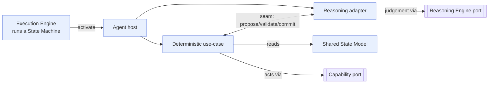
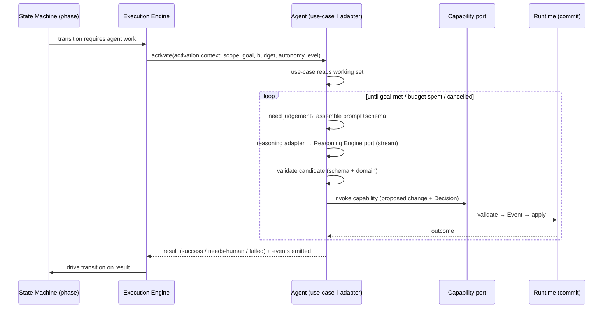

# Agent Runtime Protocol

> **Ring:** Use cases / runtime (inner). This document defines **the contract between the [Engineering Runtime](engineering-runtime.md) and an [Agent](../agents/README.md)**: how an agent is invoked, what it may *read* versus what it may *act on*, the request/response/streaming/cancellation lifecycle, and the mandatory **two-part split** — a deterministic engineering use-case alongside a reasoning adapter ([P8](../foundation/principles.md)). It exists so that all 13 agents are driven uniformly by the kernel and none can become a god-object that reaches across rings ([ADR-0006](../decisions/0006-agent-fsm-separation.md)).

An agent is "a unit of engineering work bound to one or more [Phases](../state-machines/README.md)" ([Glossary](../GLOSSARY.md#agent)). The runtime — specifically the [Execution Engine](execution-engine.md) running a [State Machine](../state-machines/README.md) — invokes agents; agents never invoke themselves, never own state, and never act except through declared ports. This protocol is the seam that keeps the kernel ([mechanism/policy](../foundation/principles.md)) cleanly separated from the agents ([instance](../foundation/principles.md)).

## Purpose & responsibilities

**Owns:**
- The **invocation lifecycle**: how the runtime starts, drives, streams from, and ends an agent activation.
- The **read/act asymmetry**: agents *read* state broadly (scoped) but *act* only through the [Capability port](contracts.md#capability-port).
- The **two-part structure** every agent must have ([P8](../foundation/principles.md)): deterministic use-case ‖ reasoning adapter, and the seam between them.
- The **interaction modes** at the boundary: request/response, streaming, cancellation.

**Does NOT own:**
- **What each agent does** (its engineering purpose, inputs, outputs, reasoning strategy) — that is each [agent's own document](../agents/README.md), per the [anti-duplication rule](../CONVENTIONS.md).
- **States/transitions/events of a phase** — owned by the phase's [State Machine](../state-machines/README.md); this protocol references them, never restates them.
- **The catalog of capabilities** — that is the [Capability Registry](capability-registry.md).
- **The reasoning channel mechanics** — that is the [Reasoning Engine port](reasoning-engine-interface.md).
- **Scheduling/sequencing** — [Scheduler](scheduler.md) and [Workflow Orchestrator](workflow-orchestration.md).

## Position in the architecture

*Figure: the runtime activates an agent; its two halves split cleanly at the seam, each touching only its own port. From the runtime's viewpoint.* The agent depends inward on the ports; nothing depends on the agent ([P1](../foundation/principles.md)).

## The two-part split (P8)

Every agent is exactly two collaborating halves with a single seam between them. This is the protocol's defining rule and the enforcement of [P8](../foundation/principles.md) ("Agents are two-part, never god-objects").

| | **Deterministic engineering use-case** | **Reasoning adapter** |
|---|----------------------------------------|------------------------|
| **Role** | Does the engineering work deterministically. | Obtains stochastic judgement. |
| **May read** | [Shared State Model](shared-state-model.md) (scoped working set), [Knowledge](../knowledge/knowledge-graph.md)/[Vector Memory](../knowledge/vector-memory.md), engine outputs. | Only the context the use-case hands it. |
| **May act** | Only via the [Capability port](contracts.md#capability-port); calls [Engines](../GLOSSARY.md#engine). | Only via the [Reasoning Engine port](reasoning-engine-interface.md). |
| **May commit state** | Proposes commits (the runtime commits). | **Never.** |
| **Determinism** | Deterministic given inputs ([P4](../foundation/principles.md)). | The sole stochastic element; its outputs are recorded ([P4](../foundation/principles.md)). |

**The seam.** The use-case decides *when* judgement is needed, assembles the context and output schema, asks the reasoning adapter, receives a *candidate*, **validates it** (schema + domain, per the [reasoning port](reasoning-engine-interface.md)), and only then turns it into a [Capability](capability-registry.md) invocation justified by a [Decision](../foundation/engineering-domain-model.md#decision). Stochasticity never crosses the seam into a committed change unvalidated. This is why "an agent may propose via reasoning; only the deterministic core may commit" ([P3](../foundation/principles.md)).

> Cross-link: an agent's reasoning *strategy* and failure-of-reasoning handling live in its [agent doc](../agents/README.md); the phase's *states/transitions* live in its [state machine](../state-machines/README.md). This protocol owns only the boundary.

## Invocation lifecycle

*Figure: one agent activation, from the State Machine's request to the transition it drives. From the runtime's viewpoint.*

**Phases of an activation:**
1. **Activate.** The [Execution Engine](execution-engine.md) activates the agent with an **activation context**: the phase and its [State Machine](../state-machines/README.md) position, the **scope** (declared working set, per the [concurrency model](concurrency-and-consistency.md)), the goal, the cost/time **budget** ([Cost-budget port](contracts.md#cross-cutting-contracts)), and the current [Autonomy Level](../engineering/human-in-the-loop.md) ([P10](../foundation/principles.md)).
2. **Work loop.** The use-case drives a bounded loop: read → (optionally) reason → validate → act via capability. Each acting step is a recorded, justified change.
3. **Conclude.** The agent returns a typed **result**: success, needs-human (escalation per autonomy level), or failed (with diagnostic). It never decides the next phase — it returns a result the [State Machine](../state-machines/README.md) and [Orchestrator](workflow-orchestration.md) act on.

**Idempotency & re-entry.** Because every effect is an [Event](event-bus.md) and the activation is scoped, an activation can be retried/rolled back via the [Checkpoint system](checkpoint-system.md) without double-applying effects ([P4](../foundation/principles.md)).

## What an agent may READ vs may ACT on

This asymmetry is the protocol's safety property and a direct consequence of [P2](../foundation/principles.md):

- **READ — broad but scoped.** The deterministic half may read any [Engineering State](shared-state-model.md) entity it needs *within its declared scope*, plus [Knowledge](../knowledge/knowledge-graph.md), [Vector Memory](../knowledge/vector-memory.md), and [Engine](../GLOSSARY.md#engine) results. Reads are by stable [Entity ID](../foundation/engineering-domain-model.md); the scope bounds what conflict detection and [provenance](provenance-and-traceability.md) consider. Reading is free of side effects.
- **ACT — only via the Capability port.** The agent **cannot** mutate state, write a store, call a model directly for effect, or touch the UI. Every action is a [Capability](capability-registry.md) invocation: a named, schema-described, permission-checked, side-effect-declared request. The runtime performs the actual mutation, records the [Event](event-bus.md), and attaches the [Decision](../foundation/engineering-domain-model.md#decision). "The Capability port is the only way an agent acts on the world" ([contracts](contracts.md#capability-port)).

This is what prevents the god-object the architecture review warned about: an agent literally has no API surface to overreach through.

## Request / response / streaming / cancellation at the boundary

- **Request/response.** The default activation is request → result. The result is typed and drives a [State Machine](../state-machines/README.md) transition.
- **Streaming.** An activation may **stream** progress: incremental reasoning (from the [Reasoning Engine port](reasoning-engine-interface.md)) and incremental outcomes, surfaced to the [UI](../presentation/frontend.md) via the [Presentation/Query port](contracts.md#presentation-query-port) as in-progress view-models ([P11](../foundation/principles.md)). Streamed fragments are advisory; only committed [Events](event-bus.md) change state.
- **Cancellation.** An activation is cancellable at any point — by the engineer, the [Execution Engine](execution-engine.md) (phase abort/rollback), or the [Scheduler](scheduler.md) (budget/priority). Cancellation propagates to any in-flight [reasoning call](reasoning-engine-interface.md). Because state changes only on committed capability invocations, a cancelled activation leaves [Engineering State](shared-state-model.md) consistent; partial work is either already-committed Events (kept, attributable) or uncommitted proposals (discarded). Cancellation is recorded ([P5](../foundation/principles.md)).

## Contracts

- **Consumes:** [Capability port](contracts.md#capability-port) (the only action surface), [Reasoning Engine port](reasoning-engine-interface.md) (judgement), [State Repository](contracts.md#state-repository) (scoped reads), [Knowledge port](contracts.md#knowledge-port) & [Vector Memory port](contracts.md#vector-memory-port) (context), [Cost-budget port](contracts.md#cross-cutting-contracts) (activation budget), [Observability port](contracts.md#cross-cutting-contracts) (activation traces), [Security/Policy port](contracts.md#cross-cutting-contracts) (capability authz, autonomy gate).
- **Driven by:** the [Execution Engine](execution-engine.md) per the active [State Machine](../state-machines/README.md).
- **Returns:** a typed activation result that the [Workflow Orchestrator](workflow-orchestration.md)/State Machine acts on.

## Failure modes

| Failure | Effect | Mitigation / degradation |
|---------|--------|--------------------------|
| **Reasoning fails/invalid** | No usable judgement. | Handled at the seam (validate/repair/re-request per the [reasoning port](reasoning-engine-interface.md)); persistent failure → agent returns *failed* with diagnostic; the [State Machine](../state-machines/README.md) routes recovery. |
| **Capability rejected** (permission/side-effect/invalid) | Proposed change refused. | Runtime rejects without mutating; agent re-plans (a new [Reasoning plan](../GLOSSARY.md#the-word-planning-disambiguation)) or escalates. |
| **Budget exhausted** | Work incomplete. | Activation ends with a partial, recorded result; no silent overrun ([P13](../foundation/principles.md)); [Scheduler](scheduler.md) may re-queue. |
| **Conflict on commit** | Proposal stale. | Per [concurrency model](concurrency-and-consistency.md): rebase / re-reason / escalate; activation does not silently overwrite. |
| **Autonomy threshold hit** | Action needs approval. | Returns *needs-human*; the change waits for disposition ([P10](../foundation/principles.md)). |
| **Agent overreach attempt** | — | Impossible by construction: no API exists beyond reads + Capability port. |

## Open decisions

- [ADR-0006](../decisions/0006-agent-fsm-separation.md) — the agent/FSM separation and the two-part agent split this protocol enforces.
- [ADR-0010](../decisions/0010-human-in-the-loop-autonomy-levels.md) — how Autonomy Levels gate an activation's authority to act.
- [ADR-0003](../decisions/0003-shared-state-consistency-model.md) — how scoped activations interact with concurrent commits.

## Related documents

[`agents/README.md`](../agents/README.md) · [`core/capability-registry.md`](capability-registry.md) · [`core/reasoning-engine-interface.md`](reasoning-engine-interface.md) · [`core/execution-engine.md`](execution-engine.md) · [`core/state-machine-framework.md`](state-machine-framework.md) · [`state-machines/README.md`](../state-machines/README.md) · [`core/shared-state-model.md`](shared-state-model.md) · [`engineering/human-in-the-loop.md`](../engineering/human-in-the-loop.md) · [`core/contracts.md`](contracts.md) · [`foundation/principles.md`](../foundation/principles.md)
