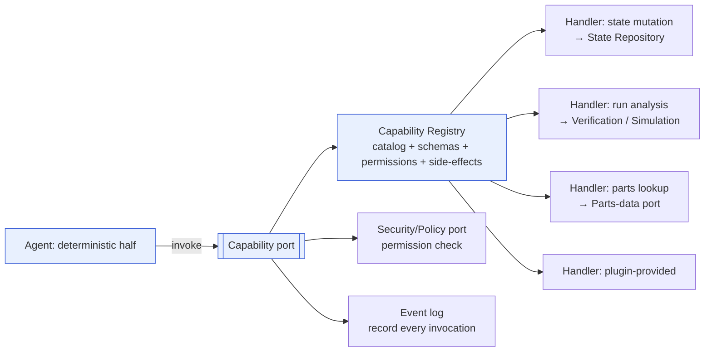
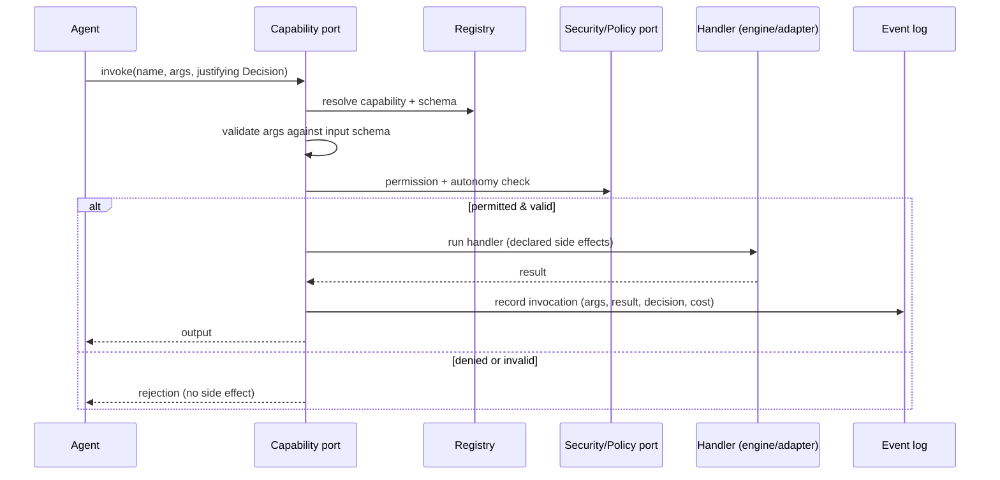

# Capability Registry

> **Ring:** Use cases / runtime (inner). This document defines the **Capability Registry** — the authoritative catalog of the named, schema-described actions the runtime exposes to [Agents](../agents/README.md), and the [Capability port](contracts.md#capability-port) through which those actions are invoked. The Capability port is *the only way an agent acts on the world* ([P2](../foundation/principles.md), [P8](../foundation/principles.md)). It exists so that every effect an agent can have is enumerated, permissioned, side-effect-declared, validated, and recorded — turning "what an AI agent can do" from an open question into a closed, auditable set.

If the [Reasoning Engine port](reasoning-engine-interface.md) is the one place stochastic *judgement* enters, the Capability port is the one place agent *action* exits. Between them sits the deterministic core that validates and commits. An agent reads freely but can change nothing except by invoking a registered Capability; an unregistered action does not exist.

## Purpose & responsibilities

**Owns:**
- The **catalog** of [Capabilities](../GLOSSARY.md#capability): each one's identity, **input/output schema**, **permissions**, and **declared side effects**.
- The **registration model**: how capabilities are added to the catalog, including via [plugins](../integration/plugin-system.md).
- The **invocation contract**: how an agent invokes a capability and what the runtime guarantees around that invocation (validation, permission check, side-effect handling, recording).
- The **discovery model**: how an agent learns which capabilities it is permitted to use.

**Does NOT own:**
- **State mutation mechanics** — a capability that changes state does so through the [State Repository](contracts.md#state-repository) as [Events](event-bus.md); the registry declares the *intent and contract*, the runtime performs the change ([Shared State Model](shared-state-model.md)).
- **The engineering logic inside a capability handler** — e.g. a "run DRC" capability delegates to the [Verification Engine](../engineering/verification-engine.md); the registry catalogs it, the engine implements it.
- **Reasoning** — capabilities are deterministic actions; judgement comes from the [Reasoning Engine port](reasoning-engine-interface.md).
- **Who may run a phase / when** — [Orchestrator](workflow-orchestration.md) and [Scheduler](scheduler.md).

## Position in the architecture

*Figure: the Capability port resolves an invocation against the registry, checks permission, runs the handler, and records the invocation. From the runtime's viewpoint.*

The registry and port are inner-ring; handlers may delegate to [engines](../GLOSSARY.md#engine) (inner) or, for I/O capabilities, to outer-ring adapters via *other* ports ([Simulation port](contracts.md#simulation-port), [Parts-data port](contracts.md#parts-data-port)) — never by the agent reaching outward directly.

## What a Capability is

A **Capability** is a named, schema-described action — e.g. "create component," "assign net," "run DRC," "query datasheet," "place component," "open waiver." Each catalog entry declares four things:

### 1. Schema
- **Input schema** — the typed, domain-vocabulary description of what the capability needs (entities by [Entity ID](../foundation/engineering-domain-model.md), [Physical Quantities](../engineering/units-and-quantities.md) with units, options). Speaks only domain terms ([contracts](contracts.md) design rule 2).
- **Output schema** — what the invocation returns (created/changed entity references, results, diagnostics).
- The schema is what lets the runtime **validate** an invocation before running it, and what a [reasoning adapter](agent-runtime-protocol.md) targets when it shapes a proposal (the capability's input schema often *is* the reasoning output schema).

### 2. Permissions
- Which [Agents](../agents/README.md)/phases may invoke it, and under which [Autonomy Level](../engineering/human-in-the-loop.md) ([P10](../foundation/principles.md)). Checked against the [Security/Policy port](contracts.md#cross-cutting-contracts) on every invocation.
- A capability an agent is not permitted to use is **not even discoverable** to it ("list permitted capabilities" returns only the allowed set), shrinking the action surface to the minimum each agent needs.

### 3. Side-effect declaration
Every capability declares its effects so the runtime can govern them. The taxonomy:

| Side-effect class | Examples | Runtime handling |
|-------------------|----------|------------------|
| **Pure / read-only** | query datasheet facts, compute a roll-up | No state change; cheap; may run freely. |
| **State-mutating** | create/place/route/assign | Must carry a justifying [Decision](../foundation/engineering-domain-model.md#decision); applied as [Events](event-bus.md); subject to the [concurrency model](concurrency-and-consistency.md). |
| **External / I/O** | run simulation, parts lookup | Goes through the proper outer port ([Simulation](contracts.md#simulation-port)/[Parts-data](contracts.md#parts-data-port)); results recorded as [Evidence](../foundation/engineering-domain-model.md#evidence); non-determinism captured ([P4](../foundation/principles.md)). |
| **Cost-bearing** | anything that spends tokens/compute/money | Metered by the [Cost-budget port](contracts.md#cross-cutting-contracts). |

Declared side effects are not advisory — they drive how the runtime validates, records, meters, and (if needed) rolls back the invocation. A capability cannot have an *undeclared* effect; that is the point of the declaration ([P13](../foundation/principles.md): no silent effects).

### 4. Determinism class
A capability is marked deterministic or (if it wraps external I/O) non-deterministic-but-recorded, so [replay](determinism-and-reproducibility.md) knows whether to re-run it or reuse the recorded outcome ([P4](../foundation/principles.md)).

## Invocation guarantees

When an agent invokes a capability through the [Capability port](contracts.md#capability-port), the runtime guarantees, in order:

*Figure: every capability invocation is resolved, validated, permission-checked, executed, and recorded — or rejected with no effect. From the runtime's viewpoint.*

1. **Resolve** the named capability in the registry (unknown name → rejected).
2. **Validate** arguments against the input schema (invalid → rejected, no effect).
3. **Authorize** against permissions and the current [Autonomy Level](../engineering/human-in-the-loop.md) (denied → rejected; may escalate to human, [P10](../foundation/principles.md)).
4. **Execute** the handler, honoring its declared side-effect class.
5. **Record** the invocation as an [Event](event-bus.md) (arguments, justifying [Decision](../foundation/engineering-domain-model.md#decision), result, cost) — the [provenance](provenance-and-traceability.md) link from effect to agent to reasoning.
6. **Return** the typed output.

A rejection at any step produces **no side effect** — the all-or-nothing property the [concurrency model](concurrency-and-consistency.md) relies on.

## Registration — including via plugins

- **Core capabilities** are registered by the runtime at startup: the state-mutating actions over the [domain model](../foundation/engineering-domain-model.md), the verification/analysis actions over [engines](../GLOSSARY.md#engine), and the read/query actions.
- **Plugin capabilities.** The [plugin system](../integration/plugin-system.md) is the [Capability port](contracts.md#capability-port)'s extension mechanism: a plugin registers new capabilities (e.g. a new manufacturing export, a vendor-specific check) by supplying their schema, permissions, and side-effect declaration. This is how the system gains new actions *without changing the kernel* ([P7](../foundation/principles.md): mechanism/policy/instance separation).
- **Registration discipline.** A registered capability must fully declare schema, permissions, and side effects; the registry rejects under-declared registrations. Plugin-provided capabilities are subject to the same [Security/Policy](contracts.md#cross-cutting-contracts) and [Cost-budget](contracts.md#cross-cutting-contracts) governance as core ones — a plugin cannot grant itself an undeclared or unmetered effect.

> **Assumption:** the trust/sandboxing model for third-party plugin capabilities is deferred to the [plugin system](../integration/plugin-system.md) doc and [crosscutting security](../crosscutting/security.md). This document fixes the *registration contract* (must declare schema/permissions/side-effects; same governance as core), per [P13](../foundation/principles.md).

## Why a registry (and not direct method calls)

A closed, declarative catalog — rather than letting agents call runtime functions directly — buys exactly the properties the architecture requires:

- **Auditability** ([P5](../foundation/principles.md)): every possible agent action is enumerable and every actual one is recorded.
- **Least privilege** ([P12](../foundation/principles.md)): permissions shrink each agent's surface to its needs.
- **Governance** ([P10](../foundation/principles.md), [P13](../foundation/principles.md)): autonomy gating and cost metering hook the single invocation path.
- **Extensibility** ([P7](../foundation/principles.md)): new actions arrive as registrations/plugins, not kernel edits.
- **Determinism** ([P4](../foundation/principles.md)): the determinism class of each action is known and recorded.

## Contracts

- **This document specifies:** the [Capability port](contracts.md#capability-port) (invoke / list permitted / describe schema) and its registry.
- **Consumes:** [State Repository](contracts.md#state-repository) (state-mutating handlers), [Event Sink/Source](contracts.md#event-sink-event-source) (recording invocations), [Security/Policy port](contracts.md#cross-cutting-contracts) (permissions/autonomy), [Cost-budget port](contracts.md#cross-cutting-contracts) (metering), [Simulation port](contracts.md#simulation-port) & [Parts-data port](contracts.md#parts-data-port) (external-effect handlers), [Observability port](contracts.md#cross-cutting-contracts).
- **Extended by:** the [plugin system](../integration/plugin-system.md).

## Failure modes

| Failure | Effect | Mitigation / degradation |
|---------|--------|--------------------------|
| **Unknown capability** | Invocation cannot resolve. | Rejected; recorded as a rejected attempt; agent re-plans. |
| **Schema-invalid arguments** | Cannot safely run. | Rejected before any side effect. |
| **Permission/autonomy denial** | Action not allowed now. | Rejected; escalates to human disposition per [P10](../foundation/principles.md). |
| **Handler failure mid-effect** | Partial change risk. | State-mutating handlers commit atomically as Events (all-or-nothing); external handlers record the failure as Evidence and surface a recoverable error. |
| **Undeclared side effect attempted** | Governance bypass. | Impossible: handlers act only through declared ports; the registry rejects under-declared registrations. |
| **Plugin capability misbehaves** | Risk to integrity. | Same validation/permission/cost governance as core; bounded by the [plugin](../integration/plugin-system.md) trust model. |

## Open decisions

- [ADR-0002](../decisions/0002-runtime-owns-knowledge-llm-as-reasoning-engine.md) — capabilities are the sole action surface because the runtime, not the agent, owns effects.
- [ADR-0006](../decisions/0006-agent-fsm-separation.md) — the agent two-part split that makes the Capability port the only action path.
- [ADR-0010](../decisions/0010-human-in-the-loop-autonomy-levels.md) — autonomy gating of capability invocation.

## Related documents

[`core/contracts.md`](contracts.md) · [`core/agent-runtime-protocol.md`](agent-runtime-protocol.md) · [`core/reasoning-engine-interface.md`](reasoning-engine-interface.md) · [`core/shared-state-model.md`](shared-state-model.md) · [`core/provenance-and-traceability.md`](provenance-and-traceability.md) · [`integration/plugin-system.md`](../integration/plugin-system.md) · [`engineering/verification-engine.md`](../engineering/verification-engine.md) · [`engineering/human-in-the-loop.md`](../engineering/human-in-the-loop.md) · [`crosscutting/security.md`](../crosscutting/security.md) · [`foundation/principles.md`](../foundation/principles.md) · [`GLOSSARY.md`](../GLOSSARY.md)
