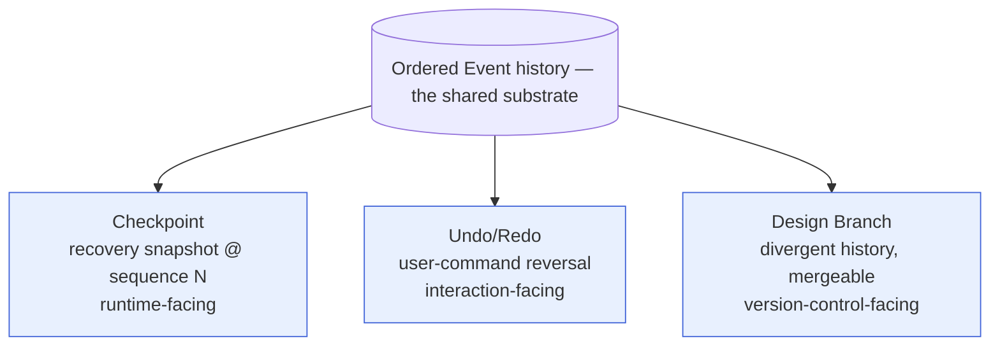
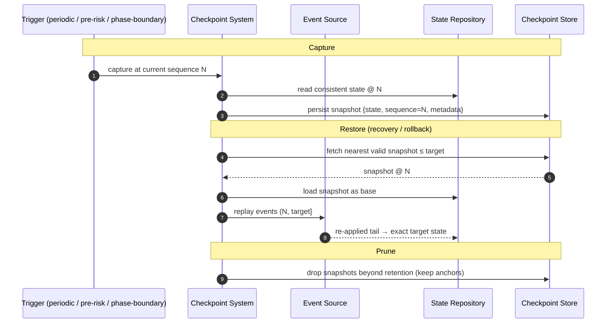

# Checkpoint System

> **Ring:** Use cases / runtime (inner). The Checkpoint System captures and restores **recovery snapshots** of [Engineering State](shared-state-model.md) — a point-in-time base from which the runtime can be reconstructed quickly without replaying all of history. It exists to bound recovery cost and to provide safe rollback points for risky operations. Its single most important job in this documentation set is to **reconcile three concepts that are constantly confused**: a [Checkpoint](#1-the-three-concepts) (recovery), [Undo/Redo](#1-the-three-concepts) (user command history), and a [Design Branch](#1-the-three-concepts) (version control). They share an event substrate but answer different questions, live in different rings, and must never be conflated.

---

## 1. The three concepts (the reconciliation)

| Concept | Question it answers | Audience | Granularity | Lives in | Authoritative doc |
|---------|---------------------|----------|-------------|----------|-------------------|
| **Checkpoint** | "How do I restore a *consistent runtime base* fast after a crash or before a risky step?" | The runtime (recovery) | Whole-state snapshot at a sequence position | This system + [Checkpoint Store](../data/stores/checkpoint-store.md) | **this document** |
| **Undo/Redo** | "How do I reverse the *last thing I did* as a user?" | The engineer (interaction) | One user-initiated command | Presentation/interaction, layered on [Events](event-bus.md) | [`presentation/`](../presentation/frontend.md) + this doc §5 |
| **Design Branch** | "How do I keep a *divergent line of design history* and merge it back?" | The engineer (version control) | A whole line of design evolution | [Design Version Control](../data/design-version-control.md) | [`data/design-version-control.md`](../data/design-version-control.md) |

*Figure: all three derive from the one immutable [Event](event-bus.md) history, but serve different audiences and concerns. Conflating them is a category error the architecture review called out explicitly.*

### Why they are not the same thing

- **A Checkpoint is not Undo.** Restoring a checkpoint reverts *all* state to a snapshot for recovery; undo reverses *one user command* and is an interaction affordance. Restoring a checkpoint is not "undo a step."
- **A Checkpoint is not a Branch.** A checkpoint is a performance/recovery optimization (a cached base for replay); a branch is a *first-class design artifact* the engineer manages ("Git for hardware," [`data/design-version-control.md`](../data/design-version-control.md)). Deleting old checkpoints loses nothing semantically; deleting a branch loses design intent.
- **Undo is not a Branch.** Undo is linear and ephemeral within a session; a branch is durable, named, and mergeable.

The rest of this document specifies the Checkpoint (the runtime's concern) and states precisely how it *relates to* the other two without owning them.

---

## 2. Purpose & responsibilities

### What it owns

- **Capture.** Producing a restorable snapshot of [Engineering State](shared-state-model.md) at a specific [Event](event-bus.md) sequence position, via the [Checkpoint port](contracts.md).
- **Restore.** Loading a snapshot as the base state, after which the [Runtime Lifecycle](runtime-lifecycle.md) replays the event tail to reach the exact target.
- **Prune.** Removing checkpoints that are no longer needed under a stated retention policy ([P13](../foundation/principles.md) — no silent unbounded growth).
- **Trigger policy (mechanism side).** Responding to capture triggers (periodic by event count, before a risky/irreversible operation, at phase boundaries, at clean shutdown).

### What it does **not** own

- **The event history itself** — that is the [Event Store](../data/stores/event-store.md). A checkpoint *references* a sequence position; it never replaces the log.
- **Undo/Redo UX and command stack** — presentation concern; this doc only states the relationship (§5).
- **Branching/merging** — [Design Version Control](../data/design-version-control.md).
- **Snapshot storage technology** — the [Checkpoint Store](../data/stores/checkpoint-store.md) adapter ([P1](../foundation/principles.md)).

---

## 3. Capture, restore, prune

*Figure: the checkpoint lifecycle. Capture is a consistent read at a sequence position; restore is "nearest snapshot + replay the tail"; prune keeps storage bounded while retaining anchors needed for recovery.*

### Capture

- A checkpoint records the [Engineering State](shared-state-model.md) consistent **at a specific event sequence position**, plus metadata (what triggered it, the phase, timestamp as recorded data). Tying it to a sequence position is what makes "snapshot + tail replay" exact ([P4](../foundation/principles.md)).
- **Triggers:** periodic (every N events), *before* an irreversible/side-effecting operation (e.g. a [manufacturing export](../state-machines/manufacturing-generation.md) or external [simulation](../integration/simulation-interface.md) batch), at phase boundaries, and at clean shutdown. Triggers are policy; capture is mechanism.

### Restore

- Restore selects the **nearest valid snapshot at or before the target sequence**, loads it as the base, and lets the [Runtime Lifecycle](runtime-lifecycle.md)/[Execution Engine](execution-engine.md) replay the bounded event tail to reach the exact target ([crash recovery](runtime-lifecycle.md)). This bounds replay cost to "since the last checkpoint," which is the whole point.
- Restore never edits history; it reconstructs a *read* of it.

### Prune

- Retention keeps enough checkpoints to bound worst-case recovery time while not growing storage without limit. The policy (how many, how spaced, which anchors to keep — e.g. one per completed phase) is stated, not silent ([P13](../foundation/principles.md)). Pruning a checkpoint never loses design knowledge because the [Event Store](../data/stores/event-store.md) retains the full history.

---

## 4. Relationship to events (and the system-of-record question)

A checkpoint is a **derived, disposable optimization** over the [Event](event-bus.md) history:

- It is *re-derivable*: given the event log, any checkpoint can be regenerated; losing all checkpoints only makes recovery slower, never impossible (assuming the log is authoritative).
- Whether the log is truly the *system of record* (full event sourcing) versus a state-of-record with checkpoints as the primary base is exactly [ADR-0004](../decisions/0004-event-sourcing-decision.md). The checkpoint system is designed to work under either resolution: under event sourcing it is a pure cache; under state-of-record it is the durable base with events as the forward delta.

---

## 5. Relationship to Undo/Redo

Undo/Redo is a **presentation/interaction** affordance ([P11](../foundation/principles.md)) built *on top of* the same [Event](event-bus.md) substrate, not on checkpoints:

- A user command produces one or more committed [Events](event-bus.md) carrying a [Decision](../foundation/engineering-domain-model.md#decision). **Undo** issues a *compensating* command that emits compensating events (history stays immutable, [P5](../foundation/principles.md)); **Redo** re-applies. The undo stack is per-[Session](../GLOSSARY.md#session) interaction state in the [Session Store](../data/stores/session-store.md).
- The Checkpoint System does **not** implement undo and is not invoked for it. Restoring a checkpoint is a coarse recovery action, not a user-level undo. Stating this boundary is the reconciliation's job; the UX lives in [`presentation/`](../presentation/frontend.md).

---

## 6. Relationship to Design Branches

A [Design Branch](../data/design-version-control.md) is a **divergent, mergeable line of design history** keyed on stable [Entity IDs](../foundation/engineering-domain-model.md) ([ADR-0008](../decisions/0008-design-version-control-model.md)):

- Branching/merging is a *design-versioning* concern owned by [`data/design-version-control.md`](../data/design-version-control.md), not by this system.
- Checkpoints may be *used by* version control as efficient base states when materializing a branch, but a checkpoint is not a branch and carries no merge semantics.
- The clean separation: **Checkpoint = fast recovery base (runtime); Branch = intentional design alternative (version control); Undo = reverse my last action (interaction).**

---

## 7. Contracts

- **Implements / fronts:** the [Checkpoint port](contracts.md) — capture / list / restore / prune.
- **Consumes:** [State Repository](contracts.md) (consistent read at a sequence position), [Event Source](contracts.md) (tail replay on restore), and the [Checkpoint Store](../data/stores/checkpoint-store.md) adapter (durable snapshot persistence).

---

## 8. Failure modes

- **No valid checkpoint on recovery.** Fall back to replaying from the log origin (slower but correct); if neither is available, the [Runtime Lifecycle](runtime-lifecycle.md) opens safe/read-only mode rather than guessing. See [`failure-taxonomy-and-degraded-modes.md` → store failure](failure-taxonomy-and-degraded-modes.md).
- **Corrupt snapshot.** Detected on load (consistency check against its declared sequence position); skipped in favour of the next-older valid snapshot, then tail replay. A corrupt checkpoint is never trusted.
- **Capture during heavy mutation.** Capture reads a consistent state at a sequence position per the [concurrency model](concurrency-and-consistency.md); it never captures a torn state.
- **Storage pressure from snapshots.** Bounded by the stated retention/prune policy ([P13](../foundation/principles.md)); pruning is safe because the event log remains authoritative.

---

## 9. Open decisions

- [ADR-0004](../decisions/0004-event-sourcing-decision.md) — log-as-system-of-record vs. state-of-record (sets whether checkpoints are pure cache or durable base).
- [ADR-0008](../decisions/0008-design-version-control-model.md) — design-branch model and how checkpoints may serve as branch base states.
- [ADR-0003](../decisions/0003-shared-state-consistency-model.md) — consistent capture under concurrency.
- [ADR-0009](../decisions/0009-determinism-and-replay-strategy.md) — snapshot + tail-replay as a deterministic reconstruction.

---

## 10. Related documents

[`data/stores/checkpoint-store.md`](../data/stores/checkpoint-store.md) · [`data/design-version-control.md`](../data/design-version-control.md) · [`core/event-bus.md`](event-bus.md) · [`data/stores/event-store.md`](../data/stores/event-store.md) · [`core/runtime-lifecycle.md`](runtime-lifecycle.md) · [`core/execution-engine.md`](execution-engine.md) · [`core/shared-state-model.md`](shared-state-model.md) · [`core/concurrency-and-consistency.md`](concurrency-and-consistency.md) · [`presentation/frontend.md`](../presentation/frontend.md) · [`core/contracts.md`](contracts.md)
