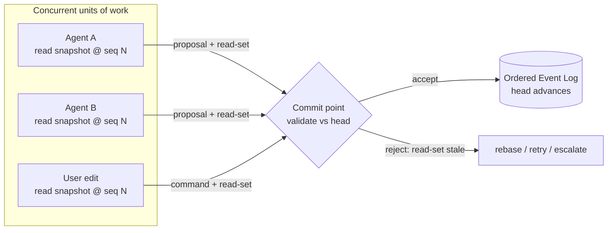
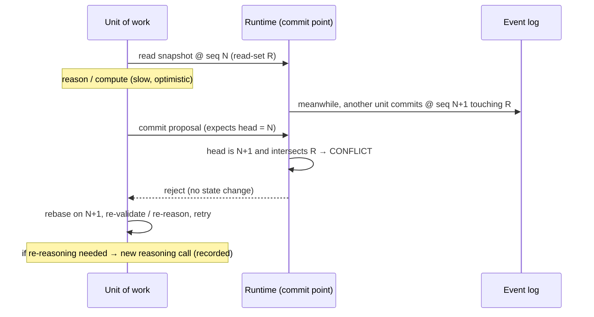

# Concurrency & Consistency

> **Ring:** Use cases / runtime (inner). This document defines the **consistency model** for the [Shared State Model](shared-state-model.md) when multiple [Agents](../agents/README.md), [Phases](../state-machines/README.md), and the human edit concurrently. It decides — and justifies — how mutations are *isolated*, *ordered*, and *reconciled on conflict*, and how that model rests on event-sourcing. It exists because [P2](../foundation/principles.md) (the runtime is the sole mutator) and [P4](../foundation/principles.md) (determinism) are only achievable if concurrent change is governed by an explicit, principled discipline rather than ad-hoc locking invented per agent.

A runtime that orchestrates many engineering phases over one shared state will, by design, have several units of work in flight: an analysis agent reasoning while the engineer edits a constraint, two phases the [scheduler](scheduler.md) ran in parallel, a long simulation completing while routing advances. Without a consistency model these interleave unpredictably and determinism collapses. This document fixes the model so every other document can assume it.

## Purpose & responsibilities

**Owns:**
- The **isolation model**: what concurrent units of work can and cannot observe of each other's in-progress changes.
- The **ordering model**: how a single, authoritative order is established over all mutations.
- The **conflict model**: how competing changes to the same entities are detected and reconciled.
- The **relationship to event-sourcing**: why the ordered [Event](event-bus.md) log is the backbone of consistency.

**Does NOT own:**
- The **structure** of state or the access rules — those are the [Shared State Model](shared-state-model.md).
- **Event transport/persistence** — [Event Bus](event-bus.md) and [Event Store](../data/stores/event-store.md).
- **Replay/determinism mechanics** — [determinism-and-reproducibility.md](determinism-and-reproducibility.md).
- **Branch/merge of divergent histories** — that is [design version control](../data/design-version-control.md); this document governs concurrency *within one line of history*, not across branches.
- **Scheduling decisions** (what runs when) — the [Scheduler](scheduler.md).

## Position in the architecture

This is a runtime-core concern. It is *defined* by the core and *enforced* by the [Execution Engine](execution-engine.md) and the [State Repository](contracts.md#state-repository) port ("open a transactional unit consistent with the concurrency model"). Outer rings neither define nor bypass it.

## The decision

> **The Shared State Model uses a single authoritative writer realized through an append-only ordered event log, with optimistic, scope-based concurrency for the units of work that feed it.** Concretely:
> 1. **Single-writer commit.** All mutations are serialized through the [Engineering Runtime](engineering-runtime.md); the canonical state advances by appending to one ordered [Event](event-bus.md) log per [Project](../data/stores/project-store.md). There is exactly one commit point.
> 2. **Optimistic, scoped units of work.** Concurrent producers (agents, phases, the UI) prepare proposed mutations *optimistically* over a read snapshot, each scoped to a declared working set; they do not hold long locks.
> 3. **Validate-and-append at commit.** A proposal commits only if its read-set is still valid against the current log head (no conflicting intervening Event); otherwise it is rejected and rebased/retried.
> 4. **Event order is the source of truth for ordering.** "Happened-before" is defined by position in the log, not by wall-clock time.

This is recorded and justified in [ADR-0003](../decisions/0003-shared-state-consistency-model.md).

### Why this model (and not the alternatives)

| Candidate model | Why considered | Why not chosen as the base |
|-----------------|----------------|----------------------------|
| **Pessimistic locking** (lock entities for the duration of work) | Simple to reason about; no conflicts. | Agents + LLM calls are *long and variable* in duration; holding locks across a reasoning call would serialize the whole system and stall the engineer. Deadlock risk across multi-entity engineering acts. |
| **Last-writer-wins** | Trivial. | Silently discards engineering changes — unacceptable under [P5](../foundation/principles.md) (traceability) and [P13](../foundation/principles.md) (no silent loss). |
| **Full multi-writer CRDT merge** | Conflict-free, highly concurrent. | Automatic merge of *engineering* state can produce designs no one decided — violating [P2](../foundation/principles.md)/[P10](../foundation/principles.md). Merge of intent is a *human/agent decision*, not a data-structure side effect. |
| **Chosen: single-writer + optimistic scoped + event log** | — | Keeps one authority and one order ([P2](../foundation/principles.md), [P4](../foundation/principles.md)); lets many units reason in parallel without long locks; surfaces conflicts as *decisions*, not silent merges; the log is exactly what [determinism](determinism-and-reproducibility.md) and [provenance](provenance-and-traceability.md) already require. |

The model is chosen because the constraints that already exist (sole-mutator runtime, event log for replay, traceable decisions) *almost entirely determine it*: once mutations must be ordered Events through one authority, single-writer commit with an authoritative log order is the natural consistency model, and optimism is what keeps it from serializing on slow reasoning.

## Isolation

*Figure: many units read a consistent snapshot and prepare proposals optimistically; one ordered commit point validates each against the log head. From the runtime's viewpoint.*

- **Snapshot reads.** Each unit of work reads a **consistent snapshot** of the [Shared State Model](shared-state-model.md) at a known log sequence point. It never observes another unit's *uncommitted* changes (read-committed-or-stronger isolation). This makes an agent's reasoning reproducible: it reasoned over a definite, recorded state.
- **Declared working set.** A unit declares the entities it reads and intends to change (its **scope**). The scope is what conflict detection compares; it also scopes the unit's [provenance](provenance-and-traceability.md).
- **No dirty reads, no long write-locks.** Because producers are optimistic, they hold no locks across reasoning calls; a slow [Reasoning Engine](reasoning-engine-interface.md) call never blocks another phase.

## Ordering

- **One log, one order, per Project.** All committed mutations form a single totally-ordered sequence — the [Event](event-bus.md) log. Sequence position defines *happened-before*. This single order is what makes [replay](determinism-and-reproducibility.md) deterministic ([P4](../foundation/principles.md)).
- **Wall-clock time is metadata, never the orderer.** Time is captured as a recorded input at the boundary (per [P4](../foundation/principles.md)) but two Events are ordered by log position, not timestamps, so clock skew and parallelism cannot reorder history.
- **Commit serialization is the only global bottleneck — and it is cheap.** Validate-and-append is fast (compare read-set against head, append); the *expensive* work (reasoning, engine evaluation) happens optimistically *outside* the serialized section. This keeps throughput high while preserving a single order.

## Conflict handling

A conflict is when a unit's **read-set** has been changed by an intervening committed Event before it commits — i.e. it reasoned over state that is now stale.

*Figure: optimistic conflict detection and rebase. The losing unit never silently overwrites; it re-derives against the new head. From the runtime's viewpoint.*

Resolution policy, in order:
1. **Detect by read-set intersection** against committed Events since the snapshot.
2. **No intersection → commit** (the changes are independent; both keep their distinct order positions).
3. **Intersection, deterministic rebase possible** (the change does not invalidate the unit's reasoning) → **rebase and commit**, recording the rebase.
4. **Intersection, reasoning invalidated** → **re-reason** (a new, recorded [Reasoning Engine](reasoning-engine-interface.md) call over the fresh snapshot) then commit.
5. **Genuine engineering conflict** (two intents disagree, e.g. two placements for one component) → **escalate as a [Decision](../foundation/engineering-domain-model.md#decision)** to the responsible agent or, per [Autonomy Level](../engineering/human-in-the-loop.md) ([P10](../foundation/principles.md)), to the human. Conflicts of *intent* are resolved by *deciding*, never by a merge algorithm.

**Bounded retries.** Optimistic retry is capped; on exhaustion the unit fails loudly and the conflict escalates (per [P13](../foundation/principles.md), no silent infinite retry). The cap is configurable via the [Configuration port](contracts.md#cross-cutting-contracts).

## Relationship to event-sourcing

Event-sourcing is not a separate feature here — it *is* the consistency substrate:

- **The log is the system of record for ordering.** The current [Shared State Model](shared-state-model.md) is the fold of the ordered Event log; consistency = "every reader sees a prefix of the one true log."
- **Atomicity = atomic append.** A multi-entity engineering act commits as a contiguous, atomic set of Events; readers see all or none.
- **Isolation = snapshot at a sequence point.** "Read at seq N" is well-defined precisely because history is an ordered log.
- **Recovery = replay.** After a crash, consistent state is recovered by replaying the log to its head (see [Checkpoint](checkpoint-system.md) for replay acceleration).
- **Determinism = same log → same state.** The [determinism model](determinism-and-reproducibility.md) depends on this document guaranteeing a single, stable order. ([P4](../foundation/principles.md).)

> **Assumption:** whether the [Event Store](../data/stores/event-store.md) is the *sole* system of record or a checkpoint-plus-log hybrid is an implementation choice deferred to the store doc and [ADR-0003](../decisions/0003-shared-state-consistency-model.md)/[ADR-0009](../decisions/0009-determinism-and-replay-strategy.md). The *consistency contract* (one order, snapshot reads, validate-and-append) holds regardless.

## Contracts

- **Consumes/realized through:** [State Repository](contracts.md#state-repository) ("open a transactional unit consistent with the concurrency model"), [Event Sink/Source](contracts.md#event-sink-event-source) (the ordered log), [Configuration port](contracts.md#cross-cutting-contracts) (retry caps, isolation level), [Security/Policy port](contracts.md#cross-cutting-contracts) (who may force-resolve a conflict).
- **Enforced by:** the [Execution Engine](execution-engine.md) (it runs units of work and drives commit) and the [Scheduler](scheduler.md) (it decides what runs in parallel, within this model).

## Failure modes

| Failure | Effect | Mitigation / degradation |
|---------|--------|--------------------------|
| **Write skew** (two units each valid alone, jointly violate an invariant) | Inconsistent state. | Conflict detection compares read-sets *and* invariant scope; cross-entity invariants are validated at commit against the head, not the snapshot. |
| **Starvation** (a slow unit perpetually loses to fast committers) | A phase never completes. | Bounded retries, then priority escalation via the [Scheduler](scheduler.md); a starved unit can be granted a short exclusive commit window. |
| **Hot entity contention** (everyone edits one net/board) | Throughput collapses to serial. | Finer scoping where invariants allow; otherwise serialize honestly — correctness over throughput. |
| **Retry storm** | Wasted reasoning cost. | Caps + backoff governed by the [Cost-budget port](contracts.md#cross-cutting-contracts); repeated conflict escalates to a human Decision rather than re-spending tokens. |
| **Clock-based reasoning leaks in** | Non-determinism. | Ordering is log-position only; time is recorded metadata, never a comparator. |

## Open decisions

- [ADR-0003](../decisions/0003-shared-state-consistency-model.md) — this consistency/concurrency model (single-writer + optimistic scoped + event log) and its precise isolation level.
- [ADR-0009](../decisions/0009-determinism-and-replay-strategy.md) — how the ordered log yields deterministic replay.
- [ADR-0008](../decisions/0008-design-version-control-model.md) — how *cross-branch* divergence (out of scope here) reconciles, complementing in-line concurrency.

## Related documents

[`core/shared-state-model.md`](shared-state-model.md) · [`core/event-bus.md`](event-bus.md) · [`core/determinism-and-reproducibility.md`](determinism-and-reproducibility.md) · [`core/execution-engine.md`](execution-engine.md) · [`core/scheduler.md`](scheduler.md) · [`core/checkpoint-system.md`](checkpoint-system.md) · [`data/stores/event-store.md`](../data/stores/event-store.md) · [`data/design-version-control.md`](../data/design-version-control.md) · [`core/contracts.md`](contracts.md) · [`foundation/principles.md`](../foundation/principles.md)
