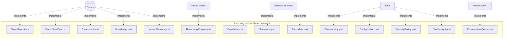

# Contracts (Ports)

> **Ring:** Use cases / runtime (inner). Contracts are *defined* here by the inner rings and *implemented* by outer-ring [Adapters](../GLOSSARY.md#adapter). **This document is what makes the [Dependency Rule (P1)](../foundation/principles.md) real rather than aspirational.**

A contract is an interface at a ring boundary that inverts a dependency: the inner ring declares the interface it needs; the outer ring provides an implementation. The core depends on the *contract*, never on the *implementation*. This document is the authoritative catalog of contracts. Each entry states the contract's purpose, who defines it, who implements it, and its essential operations (described conceptually — no signatures, no types, no tech).

## Why contracts come before mechanisms

The review's strongest finding: authoring the 27 agent/FSM docs *before* the boundary contracts exist would let each invent its own way of touching state, reasoning, and persistence. So this catalog is authored in the foundational pass and every later document references it rather than re-deriving access patterns.

## Contract families

*Figure: the core defines every port; outer adapters implement them. Arrows show implementation, opposite to source dependency.*

---

## 1. State & history contracts

### State Repository
- **Defined by:** runtime core. **Implemented by:** [State Store](../data/stores/state-store.md).
- **Purpose:** read and mutate [Engineering State](shared-state-model.md) entities by stable [Entity ID](../foundation/engineering-domain-model.md).
- **Operations (conceptual):** get entity / query entities by type or relationship / apply a validated mutation / open a transactional unit consistent with the [concurrency model](concurrency-and-consistency.md).
- **Invariant:** all mutations are expressed as [Events](event-bus.md); the repository never accepts an unjustified design-significant change.

### Event Sink / Event Source
- **Defined by:** runtime core. **Implemented by:** [Event Store](../data/stores/event-store.md) (persistence) + [Event Bus](event-bus.md) (transport).
- **Purpose:** append immutable [Events](event-bus.md), subscribe to streams, and replay an ordered history (basis of [determinism](determinism-and-reproducibility.md) and [provenance](provenance-and-traceability.md)).
- **Operations:** append / subscribe / read range / replay from sequence point.

### Checkpoint port
- **Defined by:** runtime core. **Implemented by:** [Checkpoint Store](../data/stores/checkpoint-store.md).
- **Purpose:** capture and restore restorable snapshots ([`checkpoint-system.md`](checkpoint-system.md)).
- **Operations:** capture / list / restore / prune.

## 2. Knowledge & memory contracts

### Knowledge port
- **Defined by:** [knowledge capability](../knowledge/knowledge-graph.md). **Implemented by:** [Knowledge-Graph Store](../data/stores/knowledge-graph-store.md).
- **Purpose:** assert and query interconnected engineering facts and [Evidence](../foundation/engineering-domain-model.md#evidence).
- **Operations:** assert fact / query by pattern / traverse relationships.

### Vector Memory port
- **Defined by:** [vector memory capability](../knowledge/vector-memory.md). **Implemented by:** [Vector Store](../data/stores/vector-store.md).
- **Purpose:** store and retrieve semantically similar engineering content.
- **Operations:** index item / similarity query / delete.

## 3. The reasoning boundary

### Reasoning Engine port
- **Defined by:** runtime core. **Implemented by:** model-client adapters (deferred).
- **Purpose:** the *single* boundary to stochastic judgement. Enforces [P3 (LLMs are only reasoning engines)](../foundation/principles.md).
- **Operations (conceptual):** request a judgement given a structured prompt and schema / stream a judgement / cancel. Every call is recorded for [determinism](determinism-and-reproducibility.md); every output is schema-validated before use.
- **Spec:** [`reasoning-engine-interface.md`](reasoning-engine-interface.md). **ADR:** [0002](../decisions/0002-runtime-owns-knowledge-llm-as-reasoning-engine.md).

## 4. Action & extension contracts

### Capability port
- **Defined by:** runtime core. **Implemented by:** capability handlers + the [plugin system](../integration/plugin-system.md).
- **Purpose:** the only way an [Agent](../agents/README.md) acts on the world. Each [Capability](capability-registry.md) declares its schema, permissions, and side effects.
- **Operations:** invoke capability / list permitted capabilities / describe schema.

### Simulation port
- **Defined by:** runtime core. **Implemented by:** [simulation adapters](../integration/simulation-interface.md).
- **Purpose:** run external analyses (SPICE, SI/PI, thermal, EMC) and return typed [Analysis Results](../foundation/engineering-domain-model.md#analysis-result).

### Parts-data port
- **Defined by:** runtime core. **Implemented by:** [supply-chain adapters](../integration/supply-chain-and-parts-data.md).
- **Purpose:** resolve [Parts](../foundation/engineering-domain-model.md#part-manufacturer-part), pricing, availability, lifecycle.

## 5. Cross-cutting contracts

These are consumed by the core as *abstractions* per [P12](../foundation/principles.md).

| Contract | Purpose | Implemented by |
|----------|---------|----------------|
| **Observability port** | structured logs, metrics, traces | [`crosscutting/logging-and-observability.md`](../crosscutting/logging-and-observability.md) |
| **Configuration port** | typed, layered configuration access | [`crosscutting/configuration.md`](../crosscutting/configuration.md) |
| **Security / Policy port** | authz checks, secret access, redaction | [`crosscutting/security.md`](../crosscutting/security.md) |
| **Cost-budget port** | token/time/cost accounting and limits | [`crosscutting/cost-and-resource-governance.md`](../crosscutting/cost-and-resource-governance.md) |

## 6. Presentation contract

### Presentation / Query port
- **Defined by:** runtime core. **Implemented by:** [IPC](../integration/ipc.md) + [frontend](../presentation/frontend.md).
- **Purpose:** expose read-only projections of state and accept commands. Enforces [P11 (UI is presentation-only)](../foundation/principles.md): the UI receives view-models and sends commands; it never holds engineering rules.
- **Operations:** subscribe to a projection / issue a command / receive diagnostics.

## Contract design rules

1. **Inner defines, outer implements.** A contract lives with the ring that *needs* it.
2. **Domain vocabulary only.** Contracts speak in [domain-model](../foundation/engineering-domain-model.md) terms, never in storage/transport/UI terms.
3. **Stable and versioned.** Contracts change under [data-versioning](../data/data-versioning-and-migration.md) discipline; breaking changes are ADRs.
4. **No leakage.** A contract must not expose an implementation detail (no SQL, no HTTP, no model name).

## Related documents
[`foundation/principles.md`](../foundation/principles.md) · [`core/shared-state-model.md`](shared-state-model.md) · [`core/reasoning-engine-interface.md`](reasoning-engine-interface.md) · [`core/agent-runtime-protocol.md`](agent-runtime-protocol.md) · [`core/capability-registry.md`](capability-registry.md) · [`decisions/0001-adopt-clean-architecture-dependency-rule.md`](../decisions/0001-adopt-clean-architecture-dependency-rule.md)
