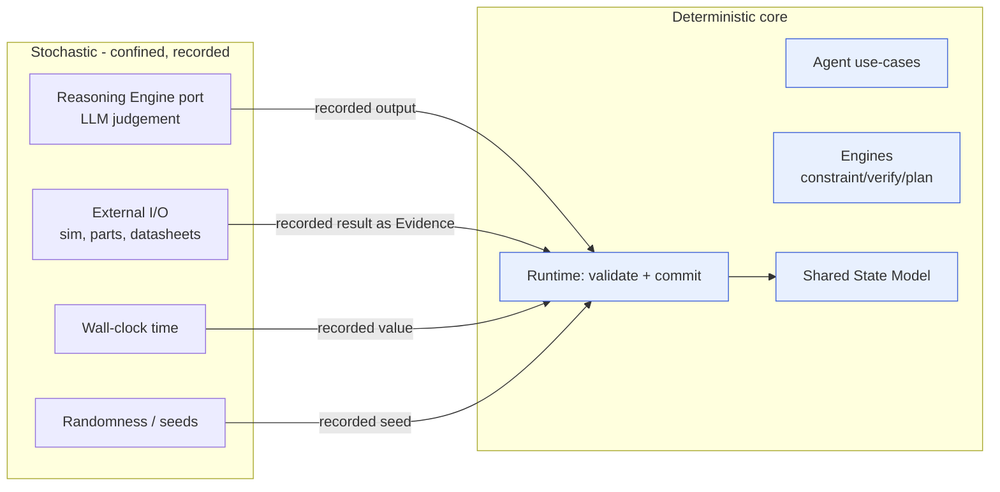
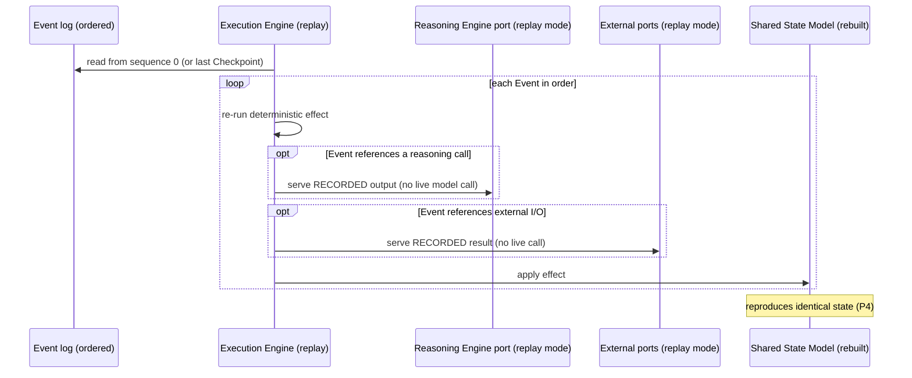

# Determinism & Reproducibility

> **Ring:** Use cases / runtime (inner). This document specifies **how the runtime achieves [P4](../foundation/principles.md) (Determinism by Default) despite building on stochastic reasoning**: a deterministic core, every source of non-determinism captured and recorded at a boundary, and the ability to **replay** an ordered [Event](event-bus.md) log to reproduce the exact same [Engineering State](shared-state-model.md). It exists because reproducibility is the property that turns AI-assisted engineering output from "plausible" into "trustworthy and auditable" — the differentiator the [vision](../foundation/vision.md) is built on.

The apparent contradiction — *deterministic system, stochastic LLM* — is resolved by a single idea: **isolate, capture, and record all non-determinism at its boundary, then replay from the record.** Once a creative reasoning result has been produced and recorded, reproducing the design that followed from it is fully deterministic ([Principles → "Tensions we accept"](../foundation/principles.md)).

## Purpose & responsibilities

**Owns:**
- The **deterministic/stochastic split**: what must be deterministic and what is allowed to be stochastic (and only there).
- The **capture rules**: which inputs are non-deterministic and how each is recorded at its boundary.
- The **replay model**: how the ordered [Event](event-bus.md) log reproduces state exactly.
- The **seeding model**: how the small amount of legitimate randomness is made reproducible.

**Does NOT own:**
- The **reasoning channel** itself — [Reasoning Engine port](reasoning-engine-interface.md) (it records calls; this doc says *why* and *how that yields replay*).
- **Event transport/persistence** — [Event Bus](event-bus.md), [Event Store](../data/stores/event-store.md).
- **Concurrency ordering** — [concurrency-and-consistency.md](concurrency-and-consistency.md) (it guarantees the single order this doc replays).
- **Snapshots** — [Checkpoint system](checkpoint-system.md) (an *optimization* for replay, not a substitute for the log).
- **Version control across branches** — [design version control](../data/design-version-control.md).

## Position in the architecture

Determinism is a property the whole runtime upholds, defined here and enforced at three collaborating points: the [Reasoning Engine port](reasoning-engine-interface.md) (records the stochastic calls), the [Event log](event-bus.md) (the single ordered record), and the [Execution Engine](execution-engine.md) (drives replay). It depends inward on the [Shared State Model](shared-state-model.md) and the [domain model](../foundation/engineering-domain-model.md)'s stable [Entity IDs](../foundation/engineering-domain-model.md) (without stable identity, replay cannot re-bind references).

## The deterministic / stochastic split

*Figure: all non-determinism lives in a thin, recorded boundary; everything that touches state is deterministic. From the runtime's viewpoint.*

- **Deterministic, always:** the [Engineering Runtime](engineering-runtime.md)'s validate-and-commit logic, the [Engines](../GLOSSARY.md#engine) (constraint/planning/verification/learning — "engines contain no stochastic reasoning," [Glossary](../GLOSSARY.md#engine)), the agent **deterministic use-cases** ([P8](../foundation/principles.md)), the [state-machine framework](state-machine-framework.md), and the fold of the [Event](event-bus.md) log into [state](shared-state-model.md).
- **Stochastic, only here, only recorded:** LLM judgement (via the [Reasoning Engine port](reasoning-engine-interface.md)); external I/O whose results the runtime does not control (simulations, parts data, datasheet extraction); wall-clock time; and any legitimate randomness. Each is captured at its boundary as a recorded input ([P4](../foundation/principles.md)).

The split mirrors the agent two-part split ([P8](../foundation/principles.md)): the reasoning adapter is stochastic; the use-case that commits is deterministic. Determinism is therefore an *architectural* property, not a runtime accident.

## Capturing non-determinism at the boundary

Every non-deterministic input is recorded as (or alongside) an [Event](event-bus.md) so that, on replay, the recorded value is reused instead of re-sampled:

| Source | Where captured | What is recorded |
|--------|----------------|------------------|
| **LLM judgement** | [Reasoning Engine port](reasoning-engine-interface.md) | The structured request (and the state snapshot it was built from, by reference), model identity/version, decisive parameters, full output, outcome. |
| **External analysis** | [Simulation port](contracts.md#simulation-port) | Inputs and the returned [Analysis Result](../foundation/engineering-domain-model.md#analysis-result), recorded as [Evidence](../foundation/engineering-domain-model.md#evidence). |
| **Parts / supply data** | [Parts-data port](contracts.md#parts-data-port) | The resolved [Part](../foundation/engineering-domain-model.md#part-manufacturer-part) facts/pricing as of the call, recorded as Evidence. |
| **Datasheet extraction** | [Datasheet Intelligence](../state-machines/datasheet-intelligence.md) | The extracted facts and their source. |
| **Time** | Runtime boundary | The timestamp as a recorded value — never read live during replay. |
| **Randomness** | Runtime boundary | The **seed** (see below). |

The guiding rule ([P4](../foundation/principles.md)): *if it is not a pure function of already-recorded state, it must be captured at a boundary before it can influence state.*

## Seeding

Some deterministic-core operations legitimately want pseudo-randomness (e.g. a placement/routing heuristic exploring candidates). To keep these reproducible:
- Randomness is drawn only from a **seeded** generator whose **seed is recorded** as part of the [Event](event-bus.md) that initiated the operation.
- Replay re-creates the generator from the recorded seed, so the "random" exploration retraces identically.
- No operation that affects state may use an unseeded/ambient random source ([P13](../foundation/principles.md): no silent non-determinism).

This makes even stochastic-flavored heuristics deterministic-on-replay without forcing them to be boring on first run.

## Replay from the event log

*Figure: replay re-runs the deterministic effects in log order, serving recorded outputs for every boundary call. From the runtime's viewpoint.*

- **State is the fold of the ordered log.** Given the same log, replay reconstructs the same [Engineering State](shared-state-model.md) exactly ([P4](../foundation/principles.md)). The single order is guaranteed by the [concurrency model](concurrency-and-consistency.md).
- **Replay mode serves records, never live calls.** In replay, the [Reasoning Engine port](reasoning-engine-interface.md) and external ports return the *recorded* output for each call instead of contacting any provider. This is what makes a stochastic system reproducible.
- **Stable identity makes references re-bind.** Replay re-creates entities under their original [Entity IDs](../foundation/engineering-domain-model.md), so every reference, [Decision](../foundation/engineering-domain-model.md#decision), and [provenance link](provenance-and-traceability.md) resolves identically.
- **Checkpoints accelerate, not replace.** Replay may start from a [Checkpoint](checkpoint-system.md) (a captured snapshot) and apply only the log tail, bounding replay cost; the log remains the source of truth.

### What reproducibility enables
- **Audit**: reconstruct exactly how any design state came to be ([P5](../foundation/principles.md), [provenance](provenance-and-traceability.md)).
- **Time-travel & rollback**: restore any prior state ([checkpoint](checkpoint-system.md), [undo/redo](../GLOSSARY.md#undoredo)).
- **Trustworthy collaboration & version control**: branches/merges are diffs over a reproducible history ([design version control](../data/design-version-control.md)).
- **Testing**: the [quality strategy](../quality/) can pin recorded reasoning to get deterministic test runs of agent behavior.

## Boundaries of determinism (honest limits)

Per [P13](../foundation/principles.md), the limits are stated, not hidden:
- **Replay reproduces from records; it does not re-derive new judgement.** Re-running *with live reasoning* (e.g. to improve a design) is a *new* history, recorded afresh — not a replay. The two are distinct operations.
- **Recorded external facts are point-in-time.** A replayed design uses the parts/pricing/datasheet facts captured then; re-querying live is a new Decision with new Evidence.
- **Determinism is per single ordered history.** Cross-branch reconciliation is [version control](../data/design-version-control.md), not replay.
- **The deterministic core must itself be deterministic.** Any ambient nondeterminism (unordered iteration, unseeded random, live clock reads) inside the core is a defect; the architecture forbids it and the [quality strategy](../quality/) tests for it.

> **Assumption:** whether replay fidelity is guaranteed across changes to the deterministic core's own logic (i.e. versioning the replay engine) is deferred to [ADR-0009](../decisions/0009-determinism-and-replay-strategy.md). The contract here is: *same log + same core version + recorded boundary outputs → identical state.*

## Contracts

- **Relies on:** [Event Sink/Source](contracts.md#event-sink-event-source) (the ordered, replayable log), [Reasoning Engine port](reasoning-engine-interface.md) & [Simulation port](contracts.md#simulation-port) & [Parts-data port](contracts.md#parts-data-port) (record-and-replay boundaries), [Checkpoint port](contracts.md#checkpoint-port) (replay acceleration), [State Repository](contracts.md#state-repository) (state rebuilt deterministically).
- **Guaranteed-by:** the [concurrency model](concurrency-and-consistency.md) (single order) and stable [Entity IDs](../foundation/engineering-domain-model.md).

## Failure modes

| Failure | Effect | Mitigation / degradation |
|---------|--------|--------------------------|
| **Unrecorded non-determinism** (live clock / unseeded random / un-captured I/O in the core) | Replay diverges. | Architecturally forbidden; all boundaries record; [quality](../quality/) tests assert replay equality and flag divergence. |
| **Reasoning record missing/corrupt** | Cannot replay that step. | The log is durable ([Event Store](../data/stores/event-store.md)); a missing record makes the history un-replayable past that point and is surfaced, never silently skipped ([P13](../foundation/principles.md)). |
| **Core logic changed between record and replay** | Possible divergence. | Replay is contracted against a core version; cross-version replay is a versioning concern ([ADR-0009](../decisions/0009-determinism-and-replay-strategy.md)). |
| **External fact drift** (part now EOL) | Live re-run differs from replay. | Expected and correct: replay uses recorded facts; a live re-run is a new, recorded history. |
| **Checkpoint inconsistent with log** | Wrong replay start. | Checkpoints are keyed to a log sequence point; mismatched checkpoints are rejected ([checkpoint](checkpoint-system.md)). |

## Open decisions

- [ADR-0009](../decisions/0009-determinism-and-replay-strategy.md) — the determinism and replay strategy (record-and-replay, seeding, core-version contract).
- [ADR-0003](../decisions/0003-shared-state-consistency-model.md) — the single ordered log that replay depends on.
- [ADR-0002](../decisions/0002-runtime-owns-knowledge-llm-as-reasoning-engine.md) — confining stochasticity to the reasoning boundary.

## Related documents

[`core/reasoning-engine-interface.md`](reasoning-engine-interface.md) · [`core/concurrency-and-consistency.md`](concurrency-and-consistency.md) · [`core/event-bus.md`](event-bus.md) · [`core/checkpoint-system.md`](checkpoint-system.md) · [`core/provenance-and-traceability.md`](provenance-and-traceability.md) · [`core/shared-state-model.md`](shared-state-model.md) · [`data/stores/event-store.md`](../data/stores/event-store.md) · [`data/design-version-control.md`](../data/design-version-control.md) · [`foundation/principles.md`](../foundation/principles.md) · [`GLOSSARY.md`](../GLOSSARY.md)
