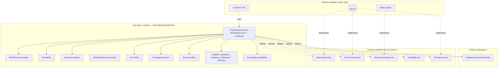
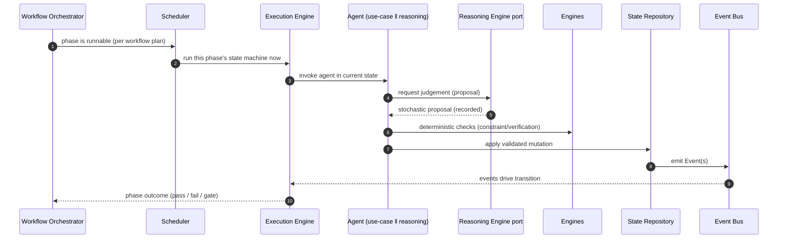

# Engineering Runtime

> **Ring:** Use cases / runtime (inner). This is the conceptual heart of Electronics Agent Kit. The Engineering Runtime is the deterministic kernel that *owns* the engineering knowledge ([P2](../foundation/principles.md)) and ties together [Engineering State](shared-state-model.md), [Phases](../GLOSSARY.md#phase), [Agents](../agents/README.md), [Engines](../GLOSSARY.md#engine), and [Events](event-bus.md) into one coherent whole. It exists because an AI-native engineering tool must keep the *truth* of a design in a durable, versioned, traceable model — never in a model prompt, an agent's memory, or the UI. This document defines what the runtime **is** and **owns**; it deliberately does *not* describe how a state machine is stepped (that is the [Execution Engine](execution-engine.md), a mechanism) nor how the kernel is assembled at startup (that is the [Runtime Lifecycle](runtime-lifecycle.md), a composition concern).

---

## 1. Purpose & responsibilities

The Engineering Runtime is the single authority over everything the system *knows* about a design. It is the embodiment of the product thesis: **the runtime owns the knowledge; LLMs are only reasoning engines** ([P2](../foundation/principles.md), [P3](../foundation/principles.md)).

### What it owns

- **The Engineering State.** The single, versioned, authoritative model of a [Project's](../GLOSSARY.md#project) design — requirements, constraints, components, nets, placement, routing, BOM, verification results, decisions, and their provenance. Structure is defined in [`shared-state-model.md`](shared-state-model.md); entities in [`engineering-domain-model.md`](../foundation/engineering-domain-model.md). The runtime is the *only* component permitted to mutate this state.
- **The authority to commit.** An [Agent](../agents/README.md) may *propose* a change through reasoning; only the runtime's deterministic core may *commit* it, and only after validation against domain rules. This "propose vs. commit" seam is the practical expression of [P3](../foundation/principles.md).
- **The orchestration of work.** It sequences [Phases](../GLOSSARY.md#phase) (via the [Workflow Orchestrator](workflow-orchestration.md)), decides when runnable work executes (via the [Scheduler](scheduler.md)), runs each phase's [State Machine](state-machine-framework.md) (via the [Execution Engine](execution-engine.md)), and dispatches [Agents](../agents/README.md) into those machines.
- **The event record.** Every design-significant change is an immutable [Event](event-bus.md), transported in-process by the [Event Bus](event-bus.md) and persisted to the [Event Store](../data/stores/event-store.md). This record is the basis of [provenance](provenance-and-traceability.md) and [deterministic replay](determinism-and-reproducibility.md).
- **The boundary contracts.** The runtime *defines* every [Contract](contracts.md) it needs (State Repository, Event Sink/Source, Reasoning Engine port, Capability port, Checkpoint port, …) and depends only on those ports, never on the outer-ring [Adapters](../GLOSSARY.md#adapter) that implement them.

### What it explicitly does **not** own

- **Mechanism of stepping a state machine.** Delegated to the [Execution Engine](execution-engine.md). The runtime is the *what and why*; the execution engine is the *how to run one transition*.
- **Composition / wiring.** Which adapter implements which port, and in what order subsystems start, belongs to the [Runtime Lifecycle](runtime-lifecycle.md) (the composition root).
- **Stochastic judgement.** Reasoning is obtained only through the [Reasoning Engine port](reasoning-engine-interface.md); the runtime core has zero knowledge of any model or provider ([P3](../foundation/principles.md)).
- **Persistence technology.** Storage is an outer-ring concern reached through ports; the runtime never imports a concrete store ([P1](../foundation/principles.md), [P12](../foundation/principles.md)).
- **Engineering rules in the UI.** The [frontend](../presentation/frontend.md) is presentation-only ([P11](../foundation/principles.md)); diagnostics it shows are computed inside the runtime by the [Verification Engine](../engineering/verification-engine.md) and delivered via the [Presentation/Query port](contracts.md).

---

## 2. Position in the architecture

The runtime lives in the **Use cases / runtime** ring. By the [Dependency Rule (P1)](../foundation/principles.md) it depends *inward* only — on the [Entities](../foundation/engineering-domain-model.md) — and on its own contracts. Everything in the outer rings depends on it; it depends on nothing outer.

*Figure: the runtime sits between the entities it owns and the contracts it defines; outer adapters implement those contracts. Source dependencies point only inward (toward Entities); implementation arrows point the opposite way.*

- **Depends on:** the [Engineering Domain Model](../foundation/engineering-domain-model.md) (entities), and the [Contracts](contracts.md) it itself defines.
- **Depended on by:** every outer ring — [data](../data/storage.md), [integration](../integration/ipc.md), [presentation](../presentation/frontend.md) — plus the concrete [agents](../agents/README.md) and [state-machine instances](../state-machines/README.md).

---

## 3. The runtime as a coordinator of five forces

The runtime's distinctive value is *integration*: it makes five otherwise-independent concerns operate as one auditable system. Each concern has its own document; the runtime is what ties them together.

| Force | What it contributes | Owned/specified in |
|-------|--------------------|--------------------|
| **State** | The canonical, versioned knowledge of the design. | [`shared-state-model.md`](shared-state-model.md) |
| **Phases** | The discrete engineering stages and their ordering. | [`workflow-orchestration.md`](workflow-orchestration.md), [`state-machines/`](../state-machines/README.md) |
| **Agents** | The actors that do engineering work within a phase. | [`agents/README.md`](../agents/README.md), [`agent-runtime-protocol.md`](agent-runtime-protocol.md) |
| **Engines** | Deterministic, reusable domain logic (no stochastic reasoning). | [`engineering/`](../engineering/constraint-engine.md) |
| **Events** | The immutable record that makes all of the above traceable and replayable. | [`event-bus.md`](event-bus.md), [`provenance-and-traceability.md`](provenance-and-traceability.md) |

### How they tie together (the central loop)

*Figure: the canonical runtime loop, from the runtime's viewpoint. The orchestrator decides *what*, the scheduler decides *when*, the execution engine runs *how*, and the agent does the *work* — but only the runtime (via the State Repository) *commits*, and every commit becomes an Event.*

The crucial discipline visible here: **reasoning produces a proposal; engines and the state repository decide whether it becomes truth.** Stochastic output never reaches state without passing a deterministic gate ([P3](../foundation/principles.md), [P4](../foundation/principles.md)).

---

## 4. Why a "runtime" and not a "library" or a "pipeline"

Three alternatives were rejected; recording why is required by [P13](../foundation/principles.md).

- **A library of functions.** A passive library cannot own state, enforce that all mutations are events, or guarantee determinism — callers could mutate freely and bypass provenance. The thesis ([P2](../foundation/principles.md)) demands a *single authority*, which only an active runtime provides.
- **A fixed pipeline.** Engineering is iterative: verification fails and loops back ([the default workflow plan](../foundation/architecture-views.md) shows ERC→Schematic, DRC→Routing loop-backs). A linear pipeline cannot express branches, gates, and loop-backs. The runtime separates *mechanism* from *policy* ([P7](../foundation/principles.md)) so the phase graph can change without touching the kernel.
- **An agent framework with shared memory.** Letting agents share mutable memory recreates the "knowledge in prompts" anti-pattern and produces god-objects ([P8](../foundation/principles.md)). The runtime instead makes agents two-part and forces all knowledge through contracts.

---

## 5. Distinguishing the three "runtime" documents

These three documents are frequently confused; the architecture review flagged the risk explicitly. Their division is strict:

| Document | Concern | Question it answers | Analogy |
|----------|---------|---------------------|---------|
| **This doc — Engineering Runtime** | *Identity & ownership* | *What is the kernel and what does it own?* | The constitution |
| [**Execution Engine**](execution-engine.md) | *Mechanism* | *How is one state-machine transition actually run?* | The engine block |
| [**Runtime Lifecycle**](runtime-lifecycle.md) | *Composition* | *How is the kernel assembled, started, and shut down?* | The ignition + assembly line |

The Engineering Runtime *contains* the execution engine as a component and *is brought to life by* the runtime lifecycle. It never restates their internals; it references them.

---

## 6. Contracts

The runtime is the **definer** of nearly every [Contract](contracts.md) in the system. It *consumes* them as abstractions ([P12](../foundation/principles.md)); outer-ring adapters *implement* them.

- **Defines & consumes:** [State Repository](contracts.md), [Event Sink/Source](contracts.md), [Checkpoint port](contracts.md), [Reasoning Engine port](reasoning-engine-interface.md), [Capability port](capability-registry.md), [Simulation port](contracts.md), [Parts-data port](contracts.md), [Observability / Configuration / Security / Cost-budget ports](contracts.md), [Presentation/Query port](contracts.md).
- **Invariant it enforces across all of them:** every design-significant mutation is expressed as an [Event](event-bus.md) and justified by a [Decision](../foundation/engineering-domain-model.md#decision) ([P5](../foundation/principles.md)); the State Repository rejects unjustified change.

---

## 7. Failure modes

The runtime's failure posture is detailed in [`error-handling.md`](error-handling.md) and [`failure-taxonomy-and-degraded-modes.md`](failure-taxonomy-and-degraded-modes.md); summarized from the kernel's viewpoint:

- **Reasoning unavailable or invalid.** The runtime degrades to advisory/manual operation; no proposal becomes state without validation, so an unavailable model blocks progress but never corrupts the design. See [failure taxonomy → LLM hallucination/invalid output](failure-taxonomy-and-degraded-modes.md).
- **Store unavailable.** Mutations cannot be committed; the runtime refuses to advance rather than hold uncommitted knowledge ([P2](../foundation/principles.md)). See [failure taxonomy → store failure](failure-taxonomy-and-degraded-modes.md).
- **Crash mid-phase.** On restart the [Runtime Lifecycle](runtime-lifecycle.md) reconstructs state from the [Event Store](../data/stores/event-store.md) and/or the nearest [Checkpoint](checkpoint-system.md), then resumes from a known-good point.
- **Partial progress within a phase.** Reconciled by the [Execution Engine's](execution-engine.md) effect/commit boundary and the [Checkpoint System](checkpoint-system.md); the runtime never leaves state half-mutated for a design-significant operation.

---

## 8. Open decisions

- [ADR-0001](../decisions/0001-adopt-clean-architecture-dependency-rule.md) — clean-architecture dependency rule that makes the runtime the inner authority.
- [ADR-0002](../decisions/0002-runtime-owns-knowledge-llm-as-reasoning-engine.md) — the runtime owns the knowledge; LLM is only a reasoning engine.
- [ADR-0003](../decisions/0003-shared-state-consistency-model.md) — concurrency & consistency model the runtime coordinates under.
- [ADR-0004](../decisions/0004-event-sourcing-decision.md) — whether the event log is the system of record (event sourcing) or a projection-backed audit log.
- [ADR-0009](../decisions/0009-determinism-and-replay-strategy.md) — determinism & replay strategy.

---

## 9. Related documents

[`foundation/principles.md`](../foundation/principles.md) · [`core/execution-engine.md`](execution-engine.md) · [`core/runtime-lifecycle.md`](runtime-lifecycle.md) · [`core/shared-state-model.md`](shared-state-model.md) · [`core/workflow-orchestration.md`](workflow-orchestration.md) · [`core/scheduler.md`](scheduler.md) · [`core/event-bus.md`](event-bus.md) · [`core/contracts.md`](contracts.md) · [`core/reasoning-engine-interface.md`](reasoning-engine-interface.md) · [`core/provenance-and-traceability.md`](provenance-and-traceability.md) · [`core/determinism-and-reproducibility.md`](determinism-and-reproducibility.md) · [`foundation/architecture-views.md`](../foundation/architecture-views.md)
