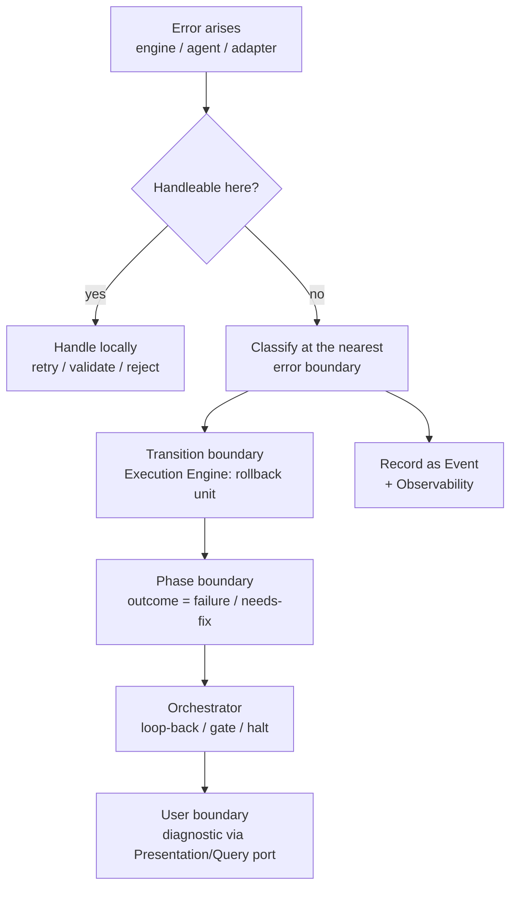
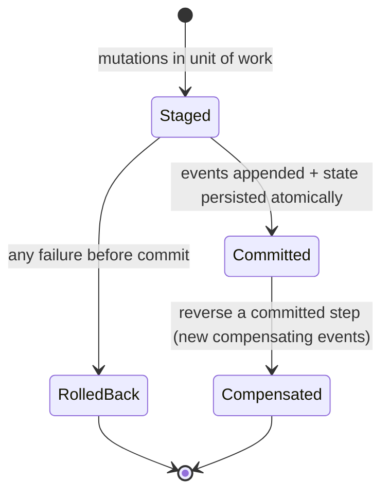

# Error Handling

> **Ring:** Use cases / runtime (inner). This document defines the runtime's **error model**: how errors are categorized, how they propagate, where the boundaries are, and how the runtime retries, compensates, or rolls back transactionally. It exists so that failure is handled *by design and consistently* across every phase, agent, and engine — never ad hoc — which is essential for a tool whose outputs must be trustworthy ([P5](../foundation/principles.md), [P13](../foundation/principles.md)). It owns the *error mechanism and policy*: categories, boundaries, propagation, retry, compensation, and transactional rollback. It does **not** enumerate the concrete failure *classes* of the domain and their degradation strategies — that is its companion, [`failure-taxonomy-and-degraded-modes.md`](failure-taxonomy-and-degraded-modes.md), cross-linked throughout.

---

## 1. Purpose & responsibilities

### What it owns

- **The error taxonomy (by handling shape).** Categorizing every error by *how the runtime should respond*, independent of its domain cause.
- **Propagation rules.** How an error travels from where it occurs (an engine, an agent, an adapter) to where it is handled (a transition boundary, a phase, the orchestrator, the user).
- **Error boundaries.** The explicit seams at which errors are caught, classified, and either contained or re-raised — so no error escapes unhandled and none crosses a ring boundary as a raw implementation detail.
- **Retry, compensation, rollback.** The three response mechanisms and the rules for choosing among them.
- **Transactional rollback.** Guaranteeing all-or-nothing for design-significant operations at the [Execution Engine's](execution-engine.md) commit boundary.

### What it does **not** own

- **Concrete domain failure classes** (agent failure, LLM hallucination, constraint violation, simulation divergence, data unavailability, partial progress, store failure) and per-class degraded modes — that is [`failure-taxonomy-and-degraded-modes.md`](failure-taxonomy-and-degraded-modes.md).
- **Transition mechanics** — owned by the [Execution Engine](execution-engine.md); this doc defines the *policy* it applies on failure.
- **What to surface in the UI** — presentation maps runtime errors to diagnostics via the [Presentation/Query port](contracts.md) ([P11](../foundation/principles.md)).
- **Logging/metrics transport** — the [Observability port](contracts.md) ([P12](../foundation/principles.md)).

---

## 2. Position in the architecture

- **Depends on:** the [Event Sink/Source](contracts.md) (errors and compensations are recorded as [Events](event-bus.md)), the [Checkpoint port](contracts.md) (rollback via restore), the [Observability port](contracts.md), and the [State Repository](contracts.md) (transactional unit of work). Inward / same-ring ([P1](../foundation/principles.md)).
- **Depended on by:** the [Execution Engine](execution-engine.md), [Scheduler](scheduler.md), [Workflow Orchestrator](workflow-orchestration.md), [agents](../agents/README.md), and [engines](../engineering/constraint-engine.md) — all apply this model.

---

## 3. Error categories (by handling shape)

Errors are classified by *how to respond*, which determines the mechanism. (The orthogonal classification by *domain cause* is the [failure taxonomy](failure-taxonomy-and-degraded-modes.md).)

| Category | Meaning | Default response |
|----------|---------|------------------|
| **Transient** | A momentary fault likely to succeed on retry (e.g. a reasoning timeout, a brief store hiccup). | Bounded [retry](#5-retry) with backoff, then escalate. |
| **Invalid-input / validation** | A proposal or input violates domain rules (e.g. invalid [reasoning output](reasoning-engine-interface.md), [constraint](../engineering/constraint-engine.md) breach). | Reject before commit; optionally re-request; never commit. |
| **Domain-rule failure** | A legitimate engineering outcome that blocks progress (e.g. open error [Violations](../foundation/engineering-domain-model.md#violation)). | Not an exception — routed as a phase *outcome* (e.g. a [loop-back](workflow-orchestration.md)). |
| **Permanent / unrecoverable** | Cannot succeed by retrying (e.g. misconfiguration, missing adapter). | Fail the unit, [compensate](#6-compensation) if needed, escalate to human. |
| **Boundary / external** | An adapter beyond the runtime failed ([simulation](../integration/simulation-interface.md), [parts data](../integration/supply-chain-and-parts-data.md), store). | Contain at the boundary; degrade per [taxonomy](failure-taxonomy-and-degraded-modes.md). |
| **Internal invariant violation** | The runtime detected its own inconsistency. | Halt the affected scope safely; never proceed on corrupt state ([P2](../foundation/principles.md)). |

A critical distinction: a **domain-rule failure is not an error** in the exceptional sense — a DRC finding violations is the system *working correctly*. It flows as a normal phase outcome the [orchestrator](workflow-orchestration.md) routes, not as an exception. Conflating the two is a common design mistake this model prevents.

---

## 4. Propagation & boundaries

*Figure: errors propagate outward through nested boundaries; each boundary either handles or re-raises with proper classification. Nothing crosses a ring as a raw implementation error ([P1](../foundation/principles.md), [P12](../foundation/principles.md)).*

Boundary rules:

1. **Translate at every ring crossing.** An adapter's low-level failure is translated into a domain-level [category](#3-error-categories-by-handling-shape) before it enters the core — no SQL/HTTP/model errors leak inward ([contract design rule "no leakage"](contracts.md)).
2. **The transition boundary is the primary catch.** The [Execution Engine](execution-engine.md) wraps each transition; an unhandled error there triggers [transactional rollback](#7-transactional-rollback) of that transition.
3. **The phase boundary turns failure into outcome.** A phase that cannot complete yields a *failure outcome* to the [orchestrator](workflow-orchestration.md), not a thrown exception.
4. **The user boundary is last.** Anything unresolved becomes an actionable diagnostic ([P10](../foundation/principles.md), [P13](../foundation/principles.md)) — never a silent failure.
5. **Everything is recorded.** Every classified error is an [Event](event-bus.md) and an [observability](../crosscutting/logging-and-observability.md) signal, preserving [provenance](provenance-and-traceability.md) of failures ([P5](../foundation/principles.md)).

---

## 5. Retry

- **Only transient/boundary categories are retried.** Validation and domain-rule failures are *never* blindly retried (retrying invalid reasoning output without changing constraints just wastes budget).
- **Bounded and stated.** Retries have an explicit maximum and backoff; there are no silent infinite retries ([P13](../foundation/principles.md)). Budgets are checked through the [Cost-budget port](contracts.md) so retries cannot blow a [cost budget](../crosscutting/cost-and-resource-governance.md) — the [Scheduler](scheduler.md) governs re-admission.
- **Idempotency required.** Because a retried unit may have partially executed, retry targets the *pre-commit* stage (nothing crossed the [commit boundary](execution-engine.md)); committed effects are reversed by [compensation](#6-compensation), not retried.
- **Reasoning re-request is a guided retry.** An invalid [reasoning output](reasoning-engine-interface.md) may be re-requested *with tightened constraints* — a different operation from a transient retry; see [taxonomy → LLM hallucination](failure-taxonomy-and-degraded-modes.md).

---

## 6. Compensation

When a *committed* step must be reversed (history is immutable, [P5](../foundation/principles.md)), the runtime emits **compensating [Events](event-bus.md)** rather than editing the past — the engineering analogue of a reversing journal entry.

- **Compensation vs. restore.** For a localized reversal, a compensating transition is preferred (it preserves the full audit trail of "did X, then deliberately undid X"). For broad corruption or deep rollback, restoring a [Checkpoint](checkpoint-system.md) is used. The choice is stated per situation, not implicit.
- **Side-effecting capabilities.** A [Capability](capability-registry.md) that touched the outside world (e.g. submitted a [simulation](../integration/simulation-interface.md) job) declares a compensating action where one exists; where none exists, the operation is sequenced *after* the commit boundary and its irreversibility is surfaced before execution ([P10](../foundation/principles.md)).

---

## 7. Transactional rollback

Design-significant operations are **all-or-nothing** at the [Execution Engine's](execution-engine.md) commit boundary:

*Figure: the rollback/compensation states. Pre-commit failures roll back the unit (clean discard); post-commit reversal is compensation, never history edits.*

Guarantees:

- **No torn state.** State and its justifying [Events](event-bus.md) are committed together or not at all, so they can never diverge ([P5](../foundation/principles.md)).
- **Pre-commit rollback is free.** Nothing reached the record, so the machine simply stays in its prior state.
- **Post-commit reversal is auditable.** Done only via compensation/restore, both fully recorded.

---

## 8. Contracts

- **Consumes:** [State Repository](contracts.md) (unit of work), [Event Sink/Source](contracts.md) (record errors + compensations), [Checkpoint port](contracts.md) (restore-based rollback), [Observability port](contracts.md), [Cost-budget port](contracts.md) (retry budgeting).
- **Provides:** a consistent error-handling policy applied by the [Execution Engine](execution-engine.md) and consumed as outcomes by the [Workflow Orchestrator](workflow-orchestration.md). No new outward/domain contract.

---

## 9. Failure modes (of error handling itself)

- **Error during error handling.** Compensation or rollback may itself fail; this escalates to internal-invariant handling — halt the affected scope safely and surface it, never loop ([P13](../foundation/principles.md)).
- **Misclassification.** Treating a permanent error as transient causes wasted retries; bounded retries + budget checks cap the damage, and repeated "transient" failures are reclassified and escalated.
- **Unrecorded error.** Prevented by the rule that every classified error is an [Event](event-bus.md); an error that cannot be recorded (store down) is itself a [store-failure class](failure-taxonomy-and-degraded-modes.md) handled by halting commit admission.

---

## 10. Open decisions

- [ADR-0003](../decisions/0003-shared-state-consistency-model.md) — consistency model underpinning transactional rollback.
- [ADR-0004](../decisions/0004-event-sourcing-decision.md) — compensation-as-events vs. state correction.
- [ADR-0009](../decisions/0009-determinism-and-replay-strategy.md) — recorded errors/compensations as part of deterministic history.
- [ADR-0010](../decisions/0010-human-in-the-loop-autonomy-levels.md) — when an error must escalate to a human.

---

## 11. Related documents

[`core/failure-taxonomy-and-degraded-modes.md`](failure-taxonomy-and-degraded-modes.md) · [`core/execution-engine.md`](execution-engine.md) · [`core/workflow-orchestration.md`](workflow-orchestration.md) · [`core/checkpoint-system.md`](checkpoint-system.md) · [`core/event-bus.md`](event-bus.md) · [`core/reasoning-engine-interface.md`](reasoning-engine-interface.md) · [`core/provenance-and-traceability.md`](provenance-and-traceability.md) · [`crosscutting/logging-and-observability.md`](../crosscutting/logging-and-observability.md) · [`crosscutting/cost-and-resource-governance.md`](../crosscutting/cost-and-resource-governance.md) · [`core/contracts.md`](contracts.md)
