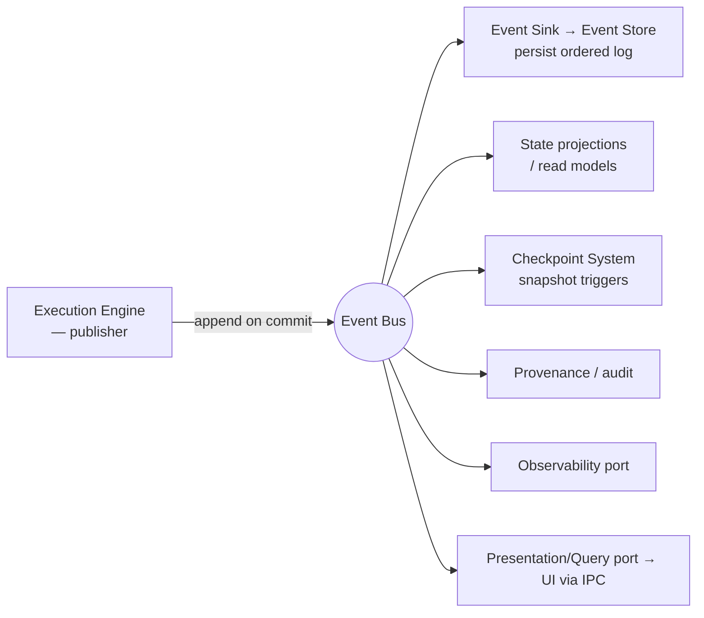
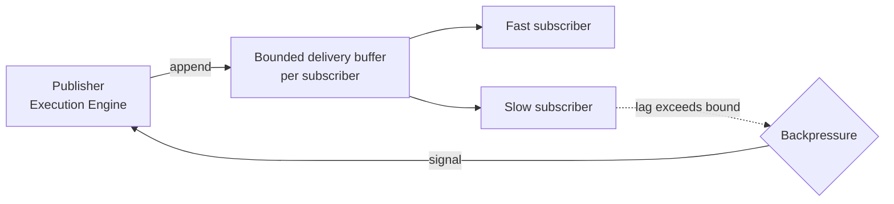

# Event Bus

> **Ring:** Use cases / runtime (inner). The Event Bus is the **in-process transport** for [Events](../GLOSSARY.md#event): it delivers an immutable, ordered stream of "something happened" records from publishers (chiefly the [Execution Engine](execution-engine.md)) to subscribers (projections, the [Checkpoint System](checkpoint-system.md), observability, the [Presentation/Query port](contracts.md)). It exists to decouple *who emits* a state change from *who reacts* to it, which is what lets provenance, projections, and the UI all observe the same authoritative stream without coupling to its producer ([P5 — everything is traceable](../foundation/principles.md), [P7 — mechanism vs. policy](../foundation/principles.md)). It is **transport only**: durable persistence of events is the [Event Store's](../data/stores/event-store.md) job (cross-linked below), and whether that log is the system of record is [ADR-0004](../decisions/0004-event-sourcing-decision.md).

---

## 1. Purpose & responsibilities

### What it owns

- **Publish / subscribe.** Accept appended [Events](../GLOSSARY.md#event) from publishers and deliver them to all interested subscribers.
- **Ordering.** Preserve a single, total order of events as they are committed, so every subscriber sees the same sequence (the basis of deterministic projection and replay).
- **Delivery semantics.** Define and uphold a stated delivery guarantee to in-process subscribers.
- **Backpressure.** Bound in-flight delivery so a slow subscriber cannot exhaust resources or cause unbounded buffering — and never silently drop ([P13](../foundation/principles.md)).
- **Fan-out.** One committed event reaches many subscribers (audit, projection, checkpointing, UI) without the publisher knowing who they are.

### What it does **not** own

- **Persistence / durability.** Storing the ordered log is the [Event Store](../data/stores/event-store.md) (via the [Event Sink/Source](contracts.md) contract). The bus transports; the store remembers.
- **Event *meaning*.** What an event signifies is domain knowledge in the [Engineering Domain Model](../foundation/engineering-domain-model.md); the bus is content-agnostic transport.
- **What to emit / when.** Emission is decided by the [Execution Engine](execution-engine.md) at the commit boundary; the bus does not generate events.
- **Cross-process / network messaging.** This is *in-process* transport. UI delivery crosses a process boundary via the [Presentation/Query port](contracts.md) over [IPC](../integration/ipc.md), which subscribes to the bus on the runtime side; the bus itself does not span processes.

---

## 2. Position in the architecture

*Figure: the bus fans one committed event out to all subscribers, including the store that persists it. Source dependencies still point inward; subscribers depend on the bus, not vice versa.*

- **Depends on:** the [Event](../GLOSSARY.md#event) concept and the [Event Sink/Source](contracts.md) contract. Nothing outward ([P1](../foundation/principles.md)).
- **Depended on by:** the [Execution Engine](execution-engine.md) (publishes), and every subscriber (projections, [checkpoint system](checkpoint-system.md), [provenance](provenance-and-traceability.md), [observability](../crosscutting/logging-and-observability.md), the [Presentation/Query port](contracts.md)).

---

## 3. Ordering

A single **total order** is the bus's central guarantee. Each event carries a stable, monotonic sequence position assigned at commit (the same position used by the [State Repository](contracts.md) and recovery). Consequences:

- **Every subscriber sees events in the same order**, so independently-built projections agree with each other and with a replay ([P4](../foundation/principles.md)).
- **Causality is respected:** because the [Execution Engine](execution-engine.md) commits one transition atomically before emitting, an event's predecessors are always already ordered before it.
- **Replay = re-delivery in order.** Reconstructing state is re-delivering the persisted ordered stream from a sequence point — the same operation the [Runtime Lifecycle](runtime-lifecycle.md) uses on recovery.

> **Assumption:** a single total order is assumed sufficient for in-process runtime needs. If per-aggregate parallel ordering becomes necessary for throughput, that is a change governed by [ADR-0003](../decisions/0003-shared-state-consistency-model.md); it is called out rather than assumed silently ([P13](../foundation/principles.md)).

---

## 4. Delivery semantics

The bus delivers to in-process subscribers under a stated guarantee:

- **At-least-once to durable subscribers.** A subscriber that must not miss events (the [Event Store](../data/stores/event-store.md) persister, projections, checkpoint triggers) is delivered each event until it acknowledges; on transient failure, redelivery follows. Subscribers are therefore required to be **idempotent** with respect to event sequence position, so redelivery is safe ([P4](../foundation/principles.md)).
- **Ordered per subscriber.** A subscriber observes events strictly in sequence order; it never sees a later event before an earlier unacknowledged one.
- **Persist-before-observe for the system of record.** The append to the durable [Event Sink](contracts.md) is ordered ahead of (or atomic with) external-facing observation, so nothing the UI or audit sees can fail to be in the durable log. The precise coupling (atomic vs. ordered) is set by [ADR-0004](../decisions/0004-event-sourcing-decision.md).

Exactly-once *delivery* is not promised (it is generally unachievable); exactly-once *effect* is achieved by idempotent subscribers keyed on sequence position.

---

## 5. Backpressure

The bus bounds in-flight work so a slow subscriber degrades gracefully rather than exhausting memory ([P13](../foundation/principles.md) — no silent unbounded buffering).

*Figure: when a subscriber's lag exceeds its bound, backpressure is signalled toward the publisher. The runtime slows commit admission rather than dropping events.*

Policy:

- **Durable/critical subscribers** (event-store persister, projections) use backpressure: if they fall behind, commit admission is throttled by the [Scheduler](scheduler.md) (which already governs admission), preserving the invariant that committed events are never lost.
- **Best-effort subscribers** (e.g. live UI telemetry) may operate on a bounded, lossy buffer *explicitly declared as such* — the loss is of *live notification*, never of the durable record, because the [Event Store](../data/stores/event-store.md) still has every event for catch-up.
- **No silent drops for the record.** Any bound that could drop is on a best-effort subscriber only, and is stated.

---

## 6. Relationship to the Event Store (transport vs. persistence)

This separation is deliberate and load-bearing:

| Concern | Event Bus (this doc) | [Event Store](../data/stores/event-store.md) |
|---------|----------------------|----------------------------------------------|
| Role | In-process transport | Durable persistence |
| Lifetime of an event | Until delivered & acknowledged | Forever (immutable log) |
| Ordering | Assigns/preserves total order in flight | Persists the order durably |
| Replay | Re-delivers from the store | Supplies the ordered history |
| Contract | [Event Sink/Source](contracts.md) (transport side) | [Event Sink/Source](contracts.md) (persistence side) |

Both sit behind the single [Event Sink / Event Source](contracts.md) contract: *Sink* = append, *Source* = subscribe / read range / replay. The bus and the store are two adapters cooperating behind one port, which is why callers (e.g. the execution engine) need not know which is which.

---

## 7. Contracts

- **Implements / fronts:** the transport side of the [Event Sink / Event Source](contracts.md) contract (append, subscribe, read range, replay from a sequence point).
- **Consumes:** the persistence side of the same contract (delegates durability to the [Event Store](../data/stores/event-store.md)) and the [Observability port](contracts.md) (to expose lag/throughput metrics) and [Cost/Resource budgets](contracts.md) indirectly via the [Scheduler](scheduler.md) for admission throttling.

---

## 8. Failure modes

- **Subscriber crash / lag.** Bounded by backpressure; on recovery the subscriber resumes from its last acknowledged sequence position via the [Event Source](contracts.md). No event lost for durable subscribers.
- **Persister (Event Store) unavailable.** Treated as a hard fault: commit admission is halted rather than emitting events that can't be durably recorded — the runtime must not produce knowledge it cannot persist ([P2](../foundation/principles.md)). See [`failure-taxonomy-and-degraded-modes.md` → store failure](failure-taxonomy-and-degraded-modes.md).
- **Buffer pressure from a best-effort subscriber.** Its declared lossy buffer drops *live notifications* only; it catches up from the store. The loss is explicit, not silent ([P13](../foundation/principles.md)).
- **Redelivery to a non-idempotent subscriber.** Prevented by the idempotency requirement (§4); a subscriber that cannot be idempotent is a design error surfaced at subscription.

---

## 9. Open decisions

- [ADR-0004](../decisions/0004-event-sourcing-decision.md) — **the event-sourcing question:** is the persisted event log the system of record, or an audit projection alongside a state-of-record? Sets persist/observe coupling and replay authority.
- [ADR-0003](../decisions/0003-shared-state-consistency-model.md) — single total order vs. per-aggregate ordering; backpressure interplay with admission.
- [ADR-0009](../decisions/0009-determinism-and-replay-strategy.md) — ordered re-delivery as the replay mechanism.

---

## 10. Related documents

[`data/stores/event-store.md`](../data/stores/event-store.md) · [`core/execution-engine.md`](execution-engine.md) · [`core/engineering-runtime.md`](engineering-runtime.md) · [`core/scheduler.md`](scheduler.md) · [`core/checkpoint-system.md`](checkpoint-system.md) · [`core/provenance-and-traceability.md`](provenance-and-traceability.md) · [`core/determinism-and-reproducibility.md`](determinism-and-reproducibility.md) · [`core/contracts.md`](contracts.md) · [`integration/ipc.md`](../integration/ipc.md) · [`crosscutting/logging-and-observability.md`](../crosscutting/logging-and-observability.md)
