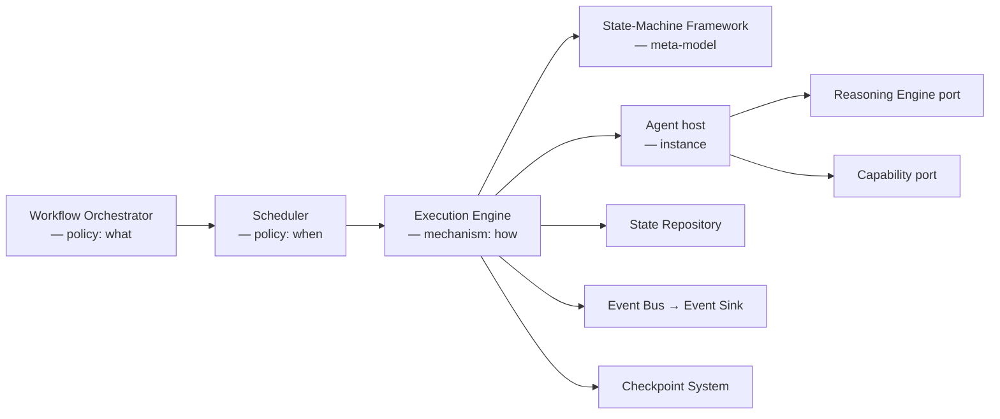
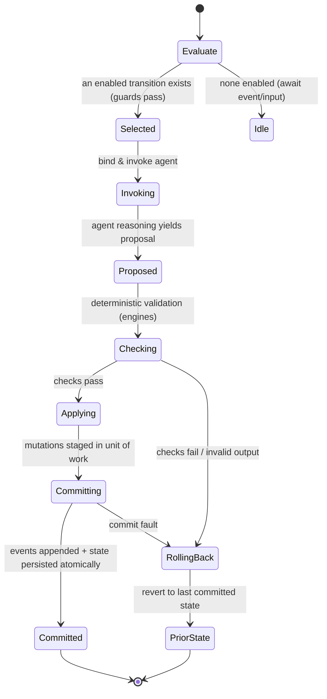

# Execution Engine

> **Ring:** Use cases / runtime (inner). The Execution Engine is the **mechanism** that actually runs a [State Machine](state-machine-framework.md): it evaluates which [Transition](state-machine-framework.md) is enabled, invokes the bound [Agent](../agents/README.md), applies the resulting effects, and commits the change as [Events](event-bus.md). It exists to isolate the *how-to-run-one-step* mechanism from the *what-to-run* policy and the *what-the-content-is* instance ([P7](../foundation/principles.md)). It is pure mechanism: it does **not** decide which phase runs (that is the [Workflow Orchestrator](workflow-orchestration.md)), it does **not** decide when work runs (that is the [Scheduler](scheduler.md)), and it does **not** define the shape of a state machine (that is the [State-Machine Framework](state-machine-framework.md), whose meta-model it interprets).

---

## 1. Purpose & responsibilities

### What it owns

- **The transition cycle.** Given a state machine in a given [State](state-machine-framework.md), evaluate enabled transitions, select one, run it to a committed outcome, and land in the next state — or roll back cleanly.
- **Guard evaluation.** Asking each candidate transition's [Guard](state-machine-framework.md) whether it is satisfied against current [Engineering State](shared-state-model.md), so an illegal transition is never taken.
- **Agent invocation.** Driving the bound [Agent](../agents/README.md) through the [agent runtime protocol](agent-runtime-protocol.md): handing it the state context, letting its reasoning half *propose* and its deterministic half *act* via [Capabilities](capability-registry.md).
- **Effect application.** Turning an agent's validated actions into concrete mutations against the [State Repository](contracts.md), gated by deterministic checks.
- **Event commit.** Emitting the [Events](event-bus.md) that record the transition atomically, so the transition is all-or-nothing.
- **Rollback on failure.** Reverting a partially-applied transition to the prior committed state.

### What it does **not** own

- **Choice of next phase / loop-backs** — [Workflow Orchestrator](workflow-orchestration.md).
- **Timing, concurrency, fairness, budgets** — [Scheduler](scheduler.md).
- **The definition of states/guards/effects** — [State-Machine Framework](state-machine-framework.md) (the meta-model) and the per-phase [instances](../state-machines/README.md).
- **Reasoning** — obtained by the agent through the [Reasoning Engine port](reasoning-engine-interface.md); the execution engine never calls a model directly.
- **Persistence technology** — it commits through the [Event Sink](contracts.md) and [State Repository](contracts.md) ports only.

---

## 2. Position in the architecture

*Figure: the execution engine receives admitted work from the scheduler and runs it against the framework and agents, committing through the state and event ports. It is the hinge between policy and instance.*

- **Depends on:** the [State-Machine Framework](state-machine-framework.md) (to interpret), the [agent runtime protocol](agent-runtime-protocol.md), and the [State Repository](contracts.md), [Event Sink/Source](contracts.md), [Capability port](capability-registry.md), and [Checkpoint port](contracts.md). All inward / same-ring contracts ([P1](../foundation/principles.md)).
- **Depended on by:** the [Scheduler](scheduler.md) (which hands it admitted work) and the [Workflow Orchestrator](workflow-orchestration.md) (which consumes phase outcomes).

---

## 3. The transition cycle (the core mechanism)

A single transition is the unit of work. It is **atomic with respect to committed state**: it either reaches a new committed state with its events appended, or it leaves the prior committed state untouched.

*Figure: the lifecycle of one transition, from the execution engine's viewpoint. The Checking step is the deterministic gate that keeps stochastic proposals out of committed state ([P3](../foundation/principles.md)).*

### Step-by-step

1. **Evaluate.** Collect candidate transitions out of the current state; ask each [Guard](state-machine-framework.md) against the current state snapshot. If none are enabled, the machine is idle and yields control back to the scheduler (no busy-waiting, [P13](../foundation/principles.md)).
2. **Select.** Choose exactly one enabled transition. Selection is deterministic given the same state and inputs ([P4](../foundation/principles.md)); ambiguity (two enabled transitions) is a modelling error surfaced by the framework, not silently resolved.
3. **Invoke.** Bind the transition's [Agent](../agents/README.md) and run it via the [agent runtime protocol](agent-runtime-protocol.md). The agent's *reasoning adapter* may call the [Reasoning Engine port](reasoning-engine-interface.md) to produce a proposal; its *deterministic use-case* acts only through registered [Capabilities](capability-registry.md).
4. **Check.** Validate every proposed action against domain rules using the [Constraint](../engineering/constraint-engine.md) and [Verification](../engineering/verification-engine.md) engines and schema validation. **No proposal becomes state without passing here.**
5. **Apply.** Stage the validated mutations in a transactional unit of work via the [State Repository](contracts.md), consistent with the [concurrency model](concurrency-and-consistency.md).
6. **Commit.** Append the resulting [Events](event-bus.md) through the [Event Sink](contracts.md) and persist the state mutation *atomically with* the events, so state and its justifying record can never diverge ([P5](../foundation/principles.md)).
7. **Roll back** on any failure in 4–6, returning to the last committed state (see §5).

---

## 4. The effect / commit boundary

The engine distinguishes **proposals** (reversible, in-memory, not yet truth), **effects** (validated mutations staged in a unit of work), and **commits** (durable events + persisted state). This three-tier boundary is what makes determinism and rollback tractable.

| Tier | Reversible? | Reaches state? | Recorded? |
|------|-------------|----------------|-----------|
| Proposal (from reasoning) | Yes (discard) | No | The reasoning call is recorded; the proposal itself only if accepted |
| Effect (staged mutation) | Yes (abandon unit of work) | Pending | No |
| Commit (events + state) | Only via compensating events | Yes | Yes — immutable |

A design-significant operation crosses the commit boundary exactly once, atomically. Side-effecting [Capabilities](capability-registry.md) that touch the outside world (e.g. a [simulation run](../integration/simulation-interface.md)) declare their effects so the engine can sequence them before the irreversible commit and record their outcomes.

---

## 5. Rollback & recovery (mechanism, not policy)

- **Within a transition:** the unit of work is abandoned; no events are appended; the machine returns to its prior committed state. Because nothing crossed the commit boundary, this is a clean discard.
- **Across transitions (a committed step was wrong):** the engine never edits history. Reversal is a *new* compensating transition emitting compensating [Events](event-bus.md), or restoration from a [Checkpoint](checkpoint-system.md). The strategy for which to use is in [`error-handling.md`](error-handling.md).
- **After a crash:** the engine is reconstructed by the [Runtime Lifecycle](runtime-lifecycle.md), which replays events / restores a checkpoint; the engine then resumes evaluation from the last committed state. The engine itself holds no durable state — its durability is entirely in the event/state/checkpoint stores ([P2](../foundation/principles.md)).

The *meta-model* of guards, effects, and rollback hooks is owned by the [State-Machine Framework](state-machine-framework.md); the execution engine merely *interprets* them. This separation lets a phase change its rollback behaviour without touching the engine.

---

## 6. Determinism

The execution engine is the place where determinism is mechanically enforced ([P4](../foundation/principles.md)):

- Transition **selection** and **effect application** are pure functions of the current committed state plus recorded inputs.
- Every non-deterministic input — a [Reasoning Engine](reasoning-engine-interface.md) output, the clock, randomness, external [parts](../integration/supply-chain-and-parts-data.md)/[simulation](../integration/simulation-interface.md) data — is captured as an [Event](event-bus.md) at the boundary so a replay re-feeds the recorded value rather than re-calling the source.
- Given the same event history, re-running the engine reproduces the same state exactly. See [`determinism-and-reproducibility.md`](determinism-and-reproducibility.md).

---

## 7. Contracts

- **Consumes:** [State Repository](contracts.md), [Event Sink/Source](contracts.md), [Checkpoint port](contracts.md), [Capability port](capability-registry.md), [Reasoning Engine port](reasoning-engine-interface.md) (indirectly, via the agent), [Observability](contracts.md) and [Cost-budget](contracts.md) ports (to report progress and account reasoning cost).
- **Provides (to policy):** a conceptual "run this state machine to its next committed state" operation returning a phase/transition outcome the [Scheduler](scheduler.md) and [Orchestrator](workflow-orchestration.md) consume. No new domain contract is defined here.

---

## 8. Failure modes

- **Guard evaluation error.** Treated as "transition not enabled" plus a surfaced error; the engine never takes a transition whose guard could not be confirmed. See [failure taxonomy → constraint violation](failure-taxonomy-and-degraded-modes.md).
- **Agent failure / timeout.** The transition rolls back; the failure is classified per [`failure-taxonomy-and-degraded-modes.md` → agent failure](failure-taxonomy-and-degraded-modes.md) and retried or escalated per [`error-handling.md`](error-handling.md).
- **Invalid reasoning output.** Caught at the Check step; proposal discarded, optionally re-requested with constraints; never committed. See [failure taxonomy → LLM hallucination/invalid output](failure-taxonomy-and-degraded-modes.md).
- **Commit fault (store error mid-commit).** Atomic commit fails as a unit; the transition rolls back; the engine reports a store-failure to error handling rather than leaving torn state. See [failure taxonomy → store failure](failure-taxonomy-and-degraded-modes.md).
- **Ambiguous model.** Two enabled transitions is a modelling defect; the engine refuses to guess and surfaces it ([P13](../foundation/principles.md)).

---

## 9. Open decisions

- [ADR-0003](../decisions/0003-shared-state-consistency-model.md) — the consistency model the unit-of-work and atomic commit rely on.
- [ADR-0004](../decisions/0004-event-sourcing-decision.md) — whether commit means "append to the system-of-record log" or "write state + audit event".
- [ADR-0006](../decisions/0006-agent-fsm-separation.md) — the agent/FSM split the invocation step depends on.
- [ADR-0009](../decisions/0009-determinism-and-replay-strategy.md) — deterministic selection and replay.

---

## 10. Related documents

[`core/engineering-runtime.md`](engineering-runtime.md) · [`core/state-machine-framework.md`](state-machine-framework.md) · [`core/workflow-orchestration.md`](workflow-orchestration.md) · [`core/scheduler.md`](scheduler.md) · [`core/event-bus.md`](event-bus.md) · [`core/checkpoint-system.md`](checkpoint-system.md) · [`core/agent-runtime-protocol.md`](agent-runtime-protocol.md) · [`core/concurrency-and-consistency.md`](concurrency-and-consistency.md) · [`core/error-handling.md`](error-handling.md) · [`core/determinism-and-reproducibility.md`](determinism-and-reproducibility.md) · [`core/contracts.md`](contracts.md)
