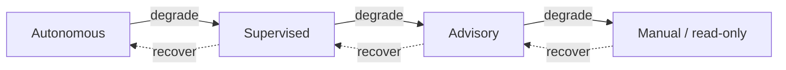

# Failure Taxonomy & Degraded Modes

> **Ring:** Use cases / runtime (inner). This document enumerates the explicit **failure classes** of an AI-native engineering runtime — by *domain cause* — and the **graceful degradation strategy** for each. It exists because an AI system that touches engineering correctness must have a *named, deliberate* answer to "what happens when the model lies, the simulator diverges, a part can't be found, or a store goes dark?" — degradation must be designed, never emergent ([P10](../foundation/principles.md), [P13](../foundation/principles.md)). It is the companion to [`error-handling.md`](error-handling.md): that document owns the *mechanism* (categories by handling shape, propagation, retry, rollback); **this** document owns the *classes* (by cause) and the per-class degraded mode. Every class maps onto an error-handling [category](error-handling.md) and a degraded behaviour that keeps the engineer in command and the [Engineering State](shared-state-model.md) uncorrupted.

---

## 1. Principles of degradation

1. **Correctness over availability.** When in doubt, the runtime *stops and asks* rather than committing a possibly-wrong design fact. The product's value is trustworthy engineering, so a degraded mode never trades correctness for throughput ([P2](../foundation/principles.md)).
2. **Degrade toward the human.** Every degraded mode falls back to a *more supervised* [Autonomy Level](../engineering/human-in-the-loop.md): autonomous → supervised → advisory → manual ([P10](../foundation/principles.md)).
3. **No silent degradation.** Entering a degraded mode is recorded as an [Event](event-bus.md) and surfaced via the [Presentation/Query port](contracts.md) ([P5](../foundation/principles.md), [P13](../foundation/principles.md)).
4. **State stays valid.** No failure class is allowed to leave [Engineering State](shared-state-model.md) torn or unjustified; the [commit boundary](execution-engine.md) and [transactional rollback](error-handling.md) protect it ([P4](../foundation/principles.md)).

*Figure: degradation always moves toward more human control, and recovery moves back only when the failing dependency is healthy again. Viewpoint: the runtime's autonomy posture.*

---

## 2. The failure classes

Each class below states: what it is, the [error category](error-handling.md) it maps to, its degraded mode, and recovery.

### 2.1 Agent failure
- **What:** an [Agent](../agents/README.md) cannot complete its work — crashes, times out, or produces no usable result (distinct from producing *invalid* reasoning output, §2.2).
- **Category:** transient or permanent ([error-handling](error-handling.md)).
- **Degraded mode:** the [transition rolls back](execution-engine.md); the phase retries within bounds, then drops to **advisory** — present partial findings and ask the engineer how to proceed. Other phases on independent branches continue (the [Scheduler](scheduler.md) isolates them).
- **Recovery:** re-invoke from the last committed state; if persistent, the [orchestrator](workflow-orchestration.md) halts the branch and escalates.

### 2.2 LLM hallucination / invalid output
- **What:** the [Reasoning Engine](reasoning-engine-interface.md) returns output that is schema-invalid, self-contradictory, or violates domain rules — the canonical AI risk ([P3](../foundation/principles.md)).
- **Category:** invalid-input / validation.
- **Degraded mode:** **rejected at the [Check step](execution-engine.md) before commit** — it never reaches state. The runtime may *re-request with tightened constraints* (a guided retry), fall back to a deterministic [engine](../engineering/constraint-engine.md) default where one exists, or drop to **advisory** and ask the engineer. This is the single most important guarantee: *a hallucination can waste a call, but it cannot corrupt the design* ([P2](../foundation/principles.md), [P3](../foundation/principles.md)).
- **Recovery:** a later valid proposal proceeds normally; all attempts (including rejected ones) are recorded for [provenance](provenance-and-traceability.md) and [determinism](determinism-and-reproducibility.md).

### 2.3 Constraint violation
- **What:** a proposed or existing design state breaches a [Constraint](../foundation/engineering-domain-model.md#constraint) / [Rule](../foundation/engineering-domain-model.md#rule) (clearance, voltage limit, impedance, manufacturing rule).
- **Category:** *domain-rule failure* — **the system working correctly**, not an exception ([error-handling §3](error-handling.md)).
- **Degraded mode:** not a degradation at all for a *proposed* change — it is simply rejected by the [Constraint Engine](../engineering/constraint-engine.md) before commit. For an *existing* violation found in verification ([ERC](../state-machines/erc-verification.md)/[DRC](../state-machines/drc-verification.md)/[DFM](../state-machines/dfm-verification.md)), it is recorded as a [Violation](../foundation/engineering-domain-model.md#violation) and routed as a phase outcome — typically a [loop-back](workflow-orchestration.md) — or accepted via an explicit [Waiver](../foundation/engineering-domain-model.md#waiver) ([P10](../foundation/principles.md)).
- **Recovery:** fix-and-re-verify loop, or waiver with recorded rationale.

### 2.4 Simulation divergence
- **What:** an external [simulation](../integration/simulation-interface.md) (SPICE, SI/PI, thermal, EMC) fails to converge, returns out-of-range results, or disagrees with expectation ([Analysis Result](../foundation/engineering-domain-model.md#analysis-result) with low confidence).
- **Category:** boundary / external.
- **Degraded mode:** the result is marked **low-confidence and not treated as truth**; the affected analysis phase (e.g. [EMC Analysis](../state-machines/emc-analysis.md)) drops to **advisory** — surface the divergence, do not auto-advance a gate on it. Deterministic checks that do not need the simulator still proceed.
- **Recovery:** re-run with adjusted setup, or defer the analysis and let the engineer decide; the divergence and any re-runs are recorded.

### 2.5 Data unavailability
- **What:** an external data dependency is unreachable or incomplete — [parts/supply-chain data](../integration/supply-chain-and-parts-data.md), a [datasheet](../state-machines/datasheet-intelligence.md), a standard.
- **Category:** boundary / external.
- **Degraded mode:** phases that *require* the data (e.g. [BOM Planning](../state-machines/bom-planning.md) pricing/availability) wait in a gated state or proceed with **explicitly-marked provisional** values; phases that don't need it continue. The runtime never fabricates a part fact to fill a gap ([P2](../foundation/principles.md)); a provisional value is flagged, not silently treated as confirmed ([P13](../foundation/principles.md)).
- **Recovery:** resume/refresh when the source returns; provisional facts are reconciled and re-justified.

### 2.6 Partial progress
- **What:** work was interrupted mid-phase — by a crash, a budget stop ([Scheduler](scheduler.md)/[cost governance](../crosscutting/cost-and-resource-governance.md)), or a cancellation — leaving the phase incomplete.
- **Category:** internal / transient.
- **Degraded mode:** no uncommitted work is treated as done; the phase resumes from its last committed state (a [resumable state](state-machine-framework.md)) or restarts from a safe state (a non-resumable one). Committed sub-progress is preserved via [Events](event-bus.md)/[Checkpoints](checkpoint-system.md); uncommitted attempts are discarded ([P4](../foundation/principles.md)).
- **Recovery:** the [Runtime Lifecycle](runtime-lifecycle.md) reconstructs state; the [orchestrator](workflow-orchestration.md) re-declares the phase runnable.

### 2.7 Store failure
- **What:** a persistence adapter is unavailable or erroring — most critically the [Event Store](../data/stores/event-store.md) or [State Store](../data/stores/state-store.md); also [Checkpoint](../data/stores/checkpoint-store.md), [Knowledge-Graph](../data/stores/knowledge-graph-store.md), [Vector](../data/stores/vector-store.md), etc.
- **Category:** boundary / external (often escalating to internal-invariant if the system of record is affected).
- **Degraded mode:** if the **system-of-record store** ([Event Store](../data/stores/event-store.md) / [State Store](../data/stores/state-store.md)) is down, the runtime **halts commit admission** — it refuses to produce knowledge it cannot durably record ([P2](../foundation/principles.md)) — and drops to **read-only** over the last consistent state. If a *non-critical* store is down ([Vector](../data/stores/vector-store.md)/[Knowledge-Graph](../data/stores/knowledge-graph-store.md)), only the dependent *capability* degrades (e.g. similarity retrieval unavailable) while core design work continues.
- **Recovery:** resume commit admission when the store returns; on restart, [crash recovery](runtime-lifecycle.md) replays/restores.

---

## 3. Class → category → degraded mode (summary)

| Failure class | Error category ([error-handling](error-handling.md)) | Degraded mode | State safe? |
|---------------|-----------------------------|---------------|-------------|
| Agent failure | transient / permanent | retry → advisory; isolate branch | yes (rollback) |
| LLM hallucination / invalid output | invalid-input / validation | reject pre-commit → re-request → advisory | yes (never commits) |
| Constraint violation | domain-rule (not an error) | reject proposal / record Violation → loop-back or waiver | yes |
| Simulation divergence | boundary / external | mark low-confidence → advisory | yes |
| Data unavailability | boundary / external | gate or provisional-flagged → wait | yes (no fabrication) |
| Partial progress | internal / transient | resume or safe-restart | yes (commit boundary) |
| Store failure (system-of-record) | boundary → internal-invariant | halt commit, read-only | yes (no uncommitted knowledge) |
| Store failure (non-critical) | boundary / external | degrade dependent capability only | yes |

---

## 4. Cross-cutting degradation behaviours

- **Branch isolation.** A failure in one [workflow](workflow-orchestration.md) branch does not stop independent branches; the [Scheduler](scheduler.md) keeps interactive and unaffected work flowing.
- **Capability-scoped degradation.** Losing an optional [capability](capability-registry.md) (e.g. [vector memory](../knowledge/vector-memory.md)) degrades only what depends on it, not the whole runtime — a direct benefit of the [contract/adapter](contracts.md) boundary ([P12](../foundation/principles.md)).
- **Everything degraded is visible and recorded.** Degraded modes are [Events](event-bus.md) and UI diagnostics, so the engineer always knows the runtime's current posture ([P5](../foundation/principles.md), [P10](../foundation/principles.md)).
- **Recovery is deliberate.** The runtime climbs back up the [autonomy ladder](#1-principles-of-degradation) only when the failing dependency is confirmed healthy, never optimistically.

---

## 5. Contracts

- **Consumes (to detect/record/surface):** [Event Sink/Source](contracts.md), [Observability port](contracts.md), [Reasoning Engine port](reasoning-engine-interface.md) (validation point), [Simulation port](contracts.md), [Parts-data port](contracts.md), [State Repository](contracts.md) / [Checkpoint port](contracts.md) (recovery), [Cost-budget port](contracts.md) (budget-stop class).
- **Provides:** the per-class degraded-mode policy applied by [error handling](error-handling.md), the [orchestrator](workflow-orchestration.md), and the [human-in-the-loop](../engineering/human-in-the-loop.md) layer. No new outward/domain contract.

---

## 6. Open decisions

- [ADR-0002](../decisions/0002-runtime-owns-knowledge-llm-as-reasoning-engine.md) — the runtime-owns-knowledge stance that forbids fabricating facts on data unavailability.
- [ADR-0004](../decisions/0004-event-sourcing-decision.md) — system-of-record definition that sets store-failure severity.
- [ADR-0009](../decisions/0009-determinism-and-replay-strategy.md) — recording rejected reasoning + degraded transitions for replay.
- [ADR-0010](../decisions/0010-human-in-the-loop-autonomy-levels.md) — the autonomy ladder degraded modes fall back along.

---

## 7. Related documents

[`core/error-handling.md`](error-handling.md) · [`core/execution-engine.md`](execution-engine.md) · [`core/workflow-orchestration.md`](workflow-orchestration.md) · [`core/scheduler.md`](scheduler.md) · [`core/runtime-lifecycle.md`](runtime-lifecycle.md) · [`core/checkpoint-system.md`](checkpoint-system.md) · [`core/reasoning-engine-interface.md`](reasoning-engine-interface.md) · [`engineering/human-in-the-loop.md`](../engineering/human-in-the-loop.md) · [`engineering/constraint-engine.md`](../engineering/constraint-engine.md) · [`engineering/verification-engine.md`](../engineering/verification-engine.md) · [`integration/simulation-interface.md`](../integration/simulation-interface.md) · [`integration/supply-chain-and-parts-data.md`](../integration/supply-chain-and-parts-data.md) · [`data/stores/event-store.md`](../data/stores/event-store.md)
