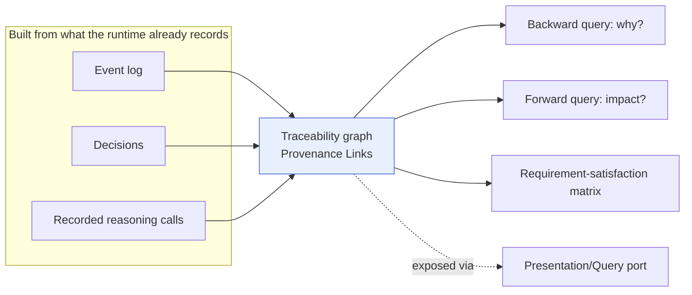
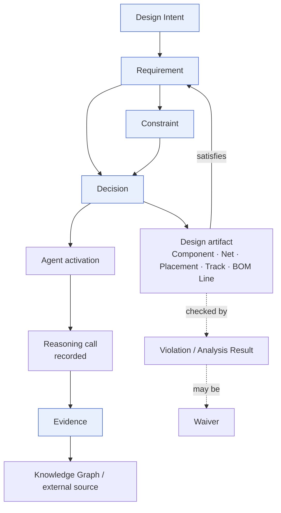

# Provenance & Traceability

> **Ring:** Use cases / runtime (inner). This document defines **end-to-end lineage**: how every engineering fact traces back through the [Decision](../foundation/engineering-domain-model.md#decision) that made it, the [Agent](../agents/README.md) and [reasoning call](reasoning-engine-interface.md) that produced it, and the [Evidence](../foundation/engineering-domain-model.md#evidence) that supported it — all the way to the originating [Requirement](../foundation/engineering-domain-model.md#requirement) and [Design Intent](../foundation/engineering-domain-model.md#design-intent). It is the operational form of [P5](../foundation/principles.md) (*Everything Is Traceable*) and the reason an AI-driven engineering tool can be *trusted*: nothing in the design is unexplained.

Trust in an engineering artifact comes from being able to ask, of any track, part, or constraint, "*why is this here, who decided it, and on what basis?*" — and getting a complete, queryable answer. This document specifies the **traceability graph** that answers those questions, how it is built (as a free byproduct of how the runtime already works), how it is queried, and how it yields requirement-satisfaction matrices.

## Purpose & responsibilities

**Owns:**
- The **traceability graph**: the connected lineage over [Provenance Links](../foundation/engineering-domain-model.md#provenance-link) joining Requirements → Constraints → Decisions → Agents → reasoning calls → Evidence → design artifacts.
- The **query model**: how lineage is traversed (backward "why," forward "impact").
- **Requirement-satisfaction matrices**: how the graph answers "is every accepted Requirement satisfied, and by what?"

**Does NOT own:**
- The **entity definitions** (Decision, Evidence, Provenance Link, Requirement) — canonical in the [domain model](../foundation/engineering-domain-model.md).
- The **event log** that records changes — [Event Bus](event-bus.md) / [Event Store](../data/stores/event-store.md); provenance is *built from* it.
- The **knowledge facts** Evidence points into — [Knowledge Graph](../knowledge/knowledge-graph.md).
- **Replay** — [determinism](determinism-and-reproducibility.md) (a sibling property over the same log).

## Position in the architecture

*Figure: provenance is a graph assembled from the runtime's existing records, queried in both directions and surfaced to the engineer. From the runtime's viewpoint.*

Provenance is not a bolt-on logging system: because the [Shared State Model](shared-state-model.md) already requires that every design-significant change be an [Event](event-bus.md) justified by a [Decision](../foundation/engineering-domain-model.md#decision) backed by [Evidence](../foundation/engineering-domain-model.md#evidence), the traceability graph is largely *already present* in the data the runtime keeps. This document defines how that data is connected and queried.

## The traceability chain

The canonical lineage, end to end ([P5](../foundation/principles.md)):

*Figure: the trace from intent to artifact and back to satisfaction. Every artifact links to the Decision that created it; every Decision links to its agent, reasoning call, and evidence; everything roots in a Requirement. From the engineering-auditor's viewpoint.*

Reading the chain in words: a **routed [Track](../foundation/engineering-domain-model.md#track--routing)** traces to the **[Net](../foundation/engineering-domain-model.md#net)** it realizes, to the **[Decision](../foundation/engineering-domain-model.md#decision)** that routed it, to the **[Routing Agent](../agents/routing-agent.md)** activation and the **[reasoning call](reasoning-engine-interface.md)** behind it, to the **[Evidence](../foundation/engineering-domain-model.md#evidence)** (e.g. an impedance target from a datasheet) it relied on, to the **[Constraint](../foundation/engineering-domain-model.md#constraint)** and the **[Requirement](../foundation/engineering-domain-model.md#requirement)** that demanded it. This is the engineering analogue of "git blame with a why" (the [vision](../foundation/vision.md)'s Git tenet).

## How the graph is built

- **Provenance Links are first-class entities.** Each "X derived from / justified by Y" is an identified [Provenance Link](../foundation/engineering-domain-model.md#provenance-link) in the [Shared State Model](shared-state-model.md), addressed by [Entity ID](../foundation/engineering-domain-model.md) like any other entity — so the graph itself is versioned and reproducible.
- **Links are created at the moment of change, not reconstructed later.** When the runtime commits a [Capability](capability-registry.md) invocation, it attaches the justifying [Decision](../foundation/engineering-domain-model.md#decision) and the provenance links (artifact ← decision ← agent/reasoning ← evidence) as part of the same recorded [Event](event-bus.md). Provenance cannot drift from reality because it is written *with* reality ([P2](../foundation/principles.md), [P5](../foundation/principles.md)).
- **Reasoning calls are linked, not inlined.** A Decision references the recorded [reasoning call](reasoning-engine-interface.md) (by reference into the [event log](event-bus.md)), so "what was the model asked and what did it answer" is recoverable for any decision — without storing prompts inside the design ([P2](../foundation/principles.md)).
- **Evidence links outward.** Evidence references [Knowledge Graph](../knowledge/knowledge-graph.md) facts and external sources with a recorded reliability, connecting internal decisions to their external basis.

Because identity is stable ([domain model](../foundation/engineering-domain-model.md) principle 1), links survive renames, re-values, and branch/merge — the trace from a 2-year-old requirement to today's track stays intact.

## Querying the graph

Two fundamental traversals, plus their compositions:

| Query | Direction | Answers | Used by |
|-------|-----------|---------|---------|
| **Why?** (backward lineage) | artifact → … → requirement | "Why does this track/part/constraint exist? Who decided, on what evidence?" | Audit, review, debugging, the [UI](../presentation/frontend.md) "explain this" affordance. |
| **Impact?** (forward lineage) | requirement/decision/evidence → … → artifacts | "If this requirement changes, what is affected? If this datasheet fact was wrong, what decisions rest on it?" | Change management, [verification](../engineering/verification-engine.md) re-runs, risk analysis. |
| **Satisfaction** (matrix) | requirement ↔ evidence-of-satisfaction | "Is every accepted requirement satisfied, by what artifact and verification?" | Sign-off, [Manufacturing gate](../state-machines/manufacturing-generation.md). |
| **Confidence/basis** | decision → reasoning call + evidence reliability | "How sure are we, and why?" | Human-in-the-loop review ([P10](../foundation/principles.md)). |

- **Queries traverse [Provenance Links](../foundation/engineering-domain-model.md#provenance-link)** in the [Shared State Model](shared-state-model.md), optionally joining the [Knowledge Graph](../knowledge/knowledge-graph.md) for external evidence and the [event log](event-bus.md) for the recorded reasoning detail.
- **Exposed read-only** through the [Presentation/Query port](contracts.md#presentation-query-port) as view-models — the UI renders lineage, it does not compute it ([P11](../foundation/principles.md)).
- **Reproducible**: because the graph is part of versioned state, a "why" answer is identical on [replay](determinism-and-reproducibility.md).

## Requirement-satisfaction matrices

The matrix is the headline artifact of traceability — the bridge from "we built something" to "we built the right thing":

- **Rows:** accepted [Requirements](../foundation/engineering-domain-model.md#requirement). **Columns:** the artifacts and verification results that satisfy them. **Cells:** the [Provenance Links](../foundation/engineering-domain-model.md#provenance-link) and satisfaction status (satisfied / partially / violated / waived / unaddressed).
- **Derived, never hand-maintained.** The matrix is a *projection* of the traceability graph (derived partition of [state](shared-state-model.md)); it cannot disagree with the design because it is computed from the same links.
- **Enforces the domain invariant.** The [domain model](../foundation/engineering-domain-model.md) states "every accepted Requirement must be traceable to satisfaction evidence before a design is declared complete." The matrix is how the runtime checks that invariant; an unsatisfied accepted requirement is a gating condition the [orchestrator](workflow-orchestration.md) can block on, and open error-[Violations](../foundation/engineering-domain-model.md#violation) (with their lineage) block the [Manufacturing](../state-machines/manufacturing-generation.md) transition.
- **Waivers carry provenance.** A [Waiver](../foundation/engineering-domain-model.md#waiver) that accepts a violation is itself a justified, recorded node in the graph, so "this requirement is met *except* for waived violation V, justified by J" is fully traceable ([P5](../foundation/principles.md), [P13](../foundation/principles.md)).

## Contracts

- **Consumes:** [State Repository](contracts.md#state-repository) (Provenance Links, Decisions, Evidence as entities), [Event Sink/Source](contracts.md#event-sink-event-source) (recorded reasoning calls and change history), [Knowledge port](contracts.md#knowledge-port) (external evidence).
- **Exposes:** lineage and satisfaction view-models through the [Presentation/Query port](contracts.md#presentation-query-port).
- **Serves:** the [verification engine](../engineering/verification-engine.md) (links violations to causes), the [Workflow Orchestrator](workflow-orchestration.md) (satisfaction gating), [human-in-the-loop](../engineering/human-in-the-loop.md) review.

## Failure modes

| Failure | Effect | Mitigation / degradation |
|---------|--------|--------------------------|
| **Missing link** (a change committed without justification) | Untraceable artifact. | Architecturally prevented: the [State Repository invariant](contracts.md#state-repository) refuses unjustified design-significant changes; provenance is written with the change. |
| **Orphaned evidence** (evidence source removed) | Dangling basis. | Evidence references are by ID with recorded source; removal leaves a tombstone, degrading to "source no longer available" not silent loss. |
| **Stale satisfaction matrix** | Misleading sign-off. | Matrix is derived and invalidated on the Events that change its inputs; recomputed deterministically ([determinism](determinism-and-reproducibility.md)). |
| **Over-deep "impact" query** (huge fan-out) | Expensive traversal. | Queries are bounded/paged; costs governed by the [Cost-budget port](contracts.md#cross-cutting-contracts); no silent truncation ([P13](../foundation/principles.md)). |
| **Low-confidence decision passes unnoticed** | Risk. | Confidence is a queryable attribute; review surfaces low-confidence lineage; autonomy gating ([P10](../foundation/principles.md)) can require human disposition. |

## Open decisions

- [ADR-0005](../decisions/0005-ir-as-canonical-phase-boundary-representation.md) — provenance lives in the canonical model and projects into IRs/matrices, not the reverse.
- [ADR-0009](../decisions/0009-determinism-and-replay-strategy.md) — provenance and replay are sibling properties over the one ordered log.
- [ADR-0008](../decisions/0008-design-version-control-model.md) — provenance links survive branch/merge via stable Entity IDs.

## Related documents

[`foundation/engineering-domain-model.md`](../foundation/engineering-domain-model.md) · [`core/shared-state-model.md`](shared-state-model.md) · [`core/event-bus.md`](event-bus.md) · [`core/determinism-and-reproducibility.md`](determinism-and-reproducibility.md) · [`core/capability-registry.md`](capability-registry.md) · [`core/reasoning-engine-interface.md`](reasoning-engine-interface.md) · [`engineering/verification-engine.md`](../engineering/verification-engine.md) · [`knowledge/knowledge-graph.md`](../knowledge/knowledge-graph.md) · [`engineering/human-in-the-loop.md`](../engineering/human-in-the-loop.md) · [`foundation/principles.md`](../foundation/principles.md) · [`GLOSSARY.md`](../GLOSSARY.md)
