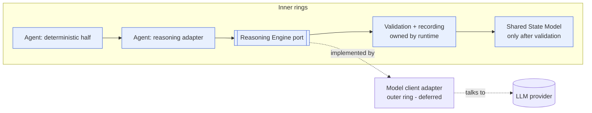
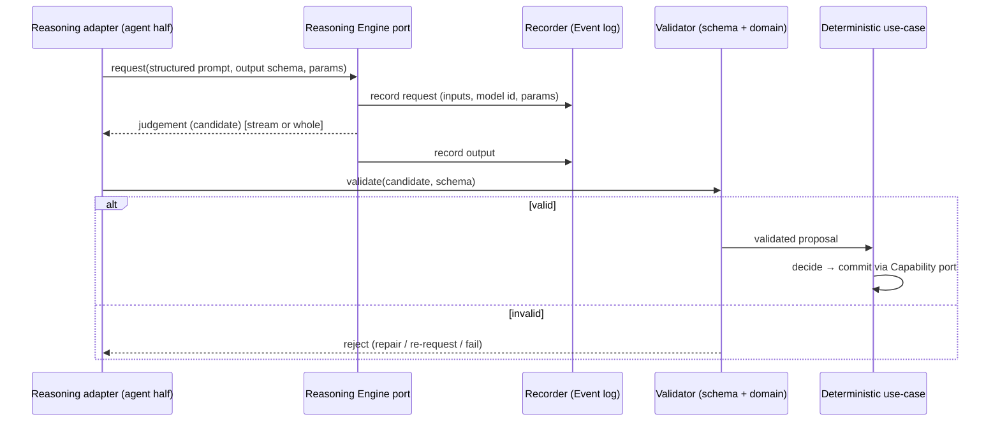

# Reasoning Engine Interface

> **Ring:** Use cases / runtime (inner). This document specifies **the single boundary to stochastic judgement** — the [Reasoning Engine port](contracts.md#reasoning-engine-port) — through which the runtime obtains judgement from a large language model and *nothing else*. It is the concrete enforcement of [P3](../foundation/principles.md): *LLMs are only reasoning engines.* It exists because the entire architecture's trust, determinism, and provider-independence depend on stochasticity being confined to exactly one, disciplined seam.

The runtime never "calls an LLM." It requests a *judgement* through this port, supplying a structured prompt and an expected output schema, and receives a candidate answer that is **validated against domain rules before it is allowed to influence state**. The port hides every model, provider, protocol, and prompt-encoding detail from the domain core ([P1](../foundation/principles.md), [P12](../foundation/principles.md)). This is the difference between an engineering runtime that *uses* AI and a "thin LLM wrapper" the [vision](../foundation/vision.md) rejects.

## Purpose & responsibilities

**Owns (as a contract the core defines):**
- The **shape of a judgement request**: a structured prompt plus a declared **output schema** the answer must conform to.
- The **interaction modes**: synchronous request, **streaming** judgement, and **cancellation**.
- The **validation obligation**: every output is schema-validated *and* domain-validated before it may touch [Engineering State](shared-state-model.md).
- The **recording obligation**: every call (request, recorded inputs, output, model/version identity, and decisive parameters) is recorded as an [Event](event-bus.md) for [determinism](determinism-and-reproducibility.md) and [provenance](provenance-and-traceability.md).
- **Provider-independence**: the contract speaks only in domain/judgement terms; no model name, protocol, or token concept leaks inward ([P12](../foundation/principles.md)).

**Does NOT own:**
- **Any engineering decision.** The port returns *judgement*; the deterministic core decides whether to *commit* it ([P3](../foundation/principles.md): "an agent may propose; only the deterministic core may commit").
- **Knowledge or state.** Reasoning output is never truth or state — it is a proposal ([P2](../foundation/principles.md), [P3](../foundation/principles.md)).
- **The concrete model client** — that is a deferred outer-ring [Adapter](../GLOSSARY.md#adapter).
- **Prompt *content* strategy per phase** — what to ask is the [reasoning adapter](agent-runtime-protocol.md) half of each [Agent](../agents/README.md); this document owns the *channel and discipline*, not the questions.
- **Vector retrieval / knowledge lookup** — those are the [Vector Memory](../knowledge/vector-memory.md) and [Knowledge](../knowledge/knowledge-graph.md) ports; the reasoning port consumes their results as supplied context, it does not perform retrieval itself.

## Position in the architecture

*Figure: the reasoning port is the only path to an LLM; output passes through runtime-owned validation and recording before it can reach state. From the runtime's viewpoint.* The arrow into `MC` is implementation (outer implements inner), opposite to source dependency ([P1](../foundation/principles.md)).

## How a judgement is requested

A request is **structured in, structured out** — never free-text round-tripping into state:

1. **Structured prompt.** The requesting [reasoning adapter](agent-runtime-protocol.md) assembles a prompt from runtime-owned context: relevant [Engineering State](shared-state-model.md) entities, retrieved [Evidence](../foundation/engineering-domain-model.md#evidence)/[Knowledge](../knowledge/knowledge-graph.md), the question, and the constraints the answer must respect. The prompt is data the runtime composes — knowledge lives in the runtime, not baked into a model ([P2](../foundation/principles.md)).
2. **Declared output schema.** Every request carries the **schema the answer must satisfy** (e.g. "a ranked list of candidate parts with rationale and confidence"). The schema is a domain-shaped contract, not a model feature. Requesting judgement *without* a schema is not allowed — unconstrained text cannot be validated, and unvalidated text must never touch state.
3. **Decisive parameters, recorded.** Any parameter that affects the output distribution (e.g. a sampling/determinism setting, see [seeding](determinism-and-reproducibility.md)) is part of the recorded request so the call is reproducible ([P4](../foundation/principles.md)).
4. **Judgement, not truth.** The response is treated as a *candidate*. It carries the model's expressed confidence but the runtime assigns trust only after validation.

*Figure: the lifecycle of one judgement — request, record, return, validate, and only then propose a commit. From the agent's viewpoint.*

## Streaming

- **Why streaming is first-class.** Engineering reasoning can be long; the [UI](../presentation/frontend.md) and the deterministic half benefit from partial results (progress, early cancellation, incremental display). The port therefore supports a **streamed judgement** mode in addition to whole-response.
- **Streaming changes delivery, not discipline.** A streamed answer is still validated *as a whole* against its output schema before it influences state; partial fragments may be shown to the engineer (clearly marked as in-progress, [P11](../foundation/principles.md)) but never committed. The complete output is what gets recorded for [determinism](determinism-and-reproducibility.md).
- **Backpressure & bounds.** Streams are bounded (length/time caps surfaced via the [Cost-budget port](contracts.md#cross-cutting-contracts)); no silent unbounded generation ([P13](../foundation/principles.md)).

## Cancellation

- **Every call is cancellable.** A judgement request can be cancelled — by the engineer (an interaction), by the [Execution Engine](execution-engine.md) (phase aborted/rolled back), by the [Scheduler](scheduler.md) (budget/priority), or by a [concurrency](concurrency-and-consistency.md) rebase that invalidates the question.
- **Cancellation is recorded.** A cancelled call is recorded as such (with whatever partial output existed) so history stays complete and replay knows the call did not produce a committed result ([P4](../foundation/principles.md), [P5](../foundation/principles.md)).
- **Cancellation never half-commits.** Because output influences state only *after* whole-answer validation and an explicit deterministic commit, a cancelled call leaves [Engineering State](shared-state-model.md) untouched by construction.

## Validation before state — the non-negotiable gate

This is the heart of [P3](../foundation/principles.md). **No reasoning output reaches [Engineering State](shared-state-model.md) without passing validation.** Validation has two layers:

1. **Schema validation** — the output structurally conforms to the requested schema. A non-conforming answer is rejected outright (optionally re-requested with a repair instruction).
2. **Domain validation** — the (now well-formed) proposal is checked against domain invariants and [Constraints](../foundation/engineering-domain-model.md#constraint) via the [Constraint Engine](../engineering/constraint-engine.md) and the domain-model invariants. A part suggestion whose parameters contradict the datasheet, a placement that violates a keep-out, a net assignment that breaks an invariant — all are caught here.

Only a proposal that passes both layers may be turned into a committed change, and even then the commit happens through the deterministic half via the [Capability port](contracts.md#capability-port), justified by a [Decision](../foundation/engineering-domain-model.md#decision). The reasoning port itself **never writes state**.

## Recording every call for determinism

Per [P4](../foundation/principles.md), the reasoning boundary is *the* primary source of non-determinism, so it is recorded most carefully. Each call records, as [Events](event-bus.md): the structured request (and the state snapshot it was built from, by reference), the model identity and version, the decisive parameters, the full output, and the outcome (accepted / repaired / rejected / cancelled). With these recorded, [replay](determinism-and-reproducibility.md) reuses the recorded output instead of re-calling the model — reproducing the same [Engineering State](shared-state-model.md) exactly ([P4](../foundation/principles.md)). This recording is also the [provenance](provenance-and-traceability.md) link from a [Decision](../foundation/engineering-domain-model.md#decision) back to the reasoning that produced it.

## Provider-independence

- The contract is expressed in **judgement terms** (prompt, schema, stream, cancel), never in provider terms. No model name, endpoint, token, or wire format appears in any inner-ring document ([P12](../foundation/principles.md), contract design rule "no leakage").
- The concrete model client is a deferred [Adapter](../GLOSSARY.md#adapter) ([ADR-0002](../decisions/0002-runtime-owns-knowledge-llm-as-reasoning-engine.md)). Swapping providers, running several, or routing by cost/capability is an outer-ring concern invisible to the core.
- Because the domain core has *zero* knowledge of any model, the product is not a wrapper around one vendor; the LLM is "just one external dependency behind the reasoning port" (per the [C1 context view](../foundation/architecture-views.md)).

## Contracts

- **This document specifies:** the [Reasoning Engine port](contracts.md#reasoning-engine-port) (request judgement / stream / cancel).
- **Consumes:** [Event Sink/Source](contracts.md#event-sink-event-source) (recording every call), [Cost-budget port](contracts.md#cross-cutting-contracts) (token/time/cost limits per call), [Observability port](contracts.md#cross-cutting-contracts) (traces/metrics of reasoning), [Security/Policy port](contracts.md#cross-cutting-contracts) (redaction of sensitive context before it leaves, authz to call).
- **Feeds:** the [Capability port](contracts.md#capability-port) indirectly — validated proposals become capability invocations performed by the deterministic half.

## Failure modes

| Failure | Effect | Mitigation / degradation |
|---------|--------|--------------------------|
| **Schema-invalid output** | Cannot be used. | Reject; optionally one bounded repair re-request; else fail the reasoning step (the agent's deterministic half decides fallback). |
| **Schema-valid but domain-invalid** (plausible nonsense) | Would corrupt state if trusted. | Domain validation gate blocks it; recorded as a rejected proposal; agent may re-reason or escalate to the human ([P10](../foundation/principles.md)). |
| **Provider unavailable / timeout** | No judgement. | Surface as a recoverable failure to the [Execution Engine](execution-engine.md); phase pauses/retries per policy; the deterministic core may proceed with non-reasoning fallbacks where defined. |
| **Cost/budget exceeded** | Call refused. | [Cost-budget port](contracts.md#cross-cutting-contracts) refuses before the call; surfaced as a governed limit, not a silent stop ([P13](../foundation/principles.md)). |
| **Sensitive data in prompt** | Leakage risk. | [Security/Policy port](contracts.md#cross-cutting-contracts) redacts before egress; redaction is recorded. |
| **Non-reproducible parameters not recorded** | Replay diverges. | All decisive parameters are part of the recorded request; replay reuses recorded outputs ([determinism](determinism-and-reproducibility.md)). |

## Open decisions

- [ADR-0002](../decisions/0002-runtime-owns-knowledge-llm-as-reasoning-engine.md) — runtime owns knowledge; LLM is only a reasoning engine behind this port.
- [ADR-0009](../decisions/0009-determinism-and-replay-strategy.md) — how recorded reasoning outputs enable deterministic replay.
- [ADR-0006](../decisions/0006-agent-fsm-separation.md) — the reasoning adapter vs. deterministic use-case split that uses this port.

## Related documents

[`core/contracts.md`](contracts.md) · [`core/agent-runtime-protocol.md`](agent-runtime-protocol.md) · [`core/determinism-and-reproducibility.md`](determinism-and-reproducibility.md) · [`core/provenance-and-traceability.md`](provenance-and-traceability.md) · [`core/capability-registry.md`](capability-registry.md) · [`core/shared-state-model.md`](shared-state-model.md) · [`engineering/constraint-engine.md`](../engineering/constraint-engine.md) · [`knowledge/knowledge-graph.md`](../knowledge/knowledge-graph.md) · [`foundation/principles.md`](../foundation/principles.md) · [`GLOSSARY.md`](../GLOSSARY.md)
