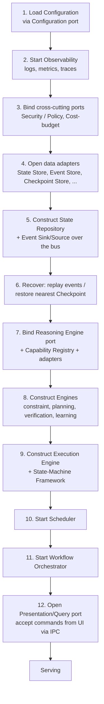
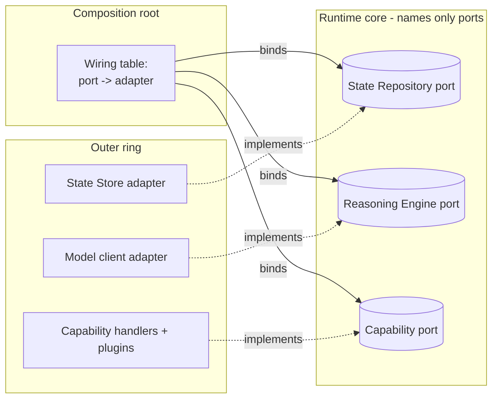
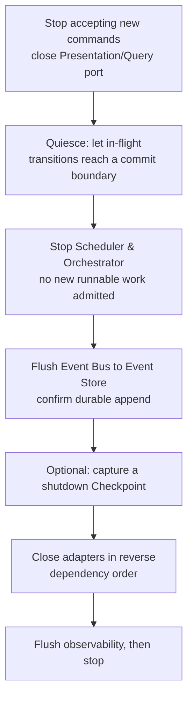
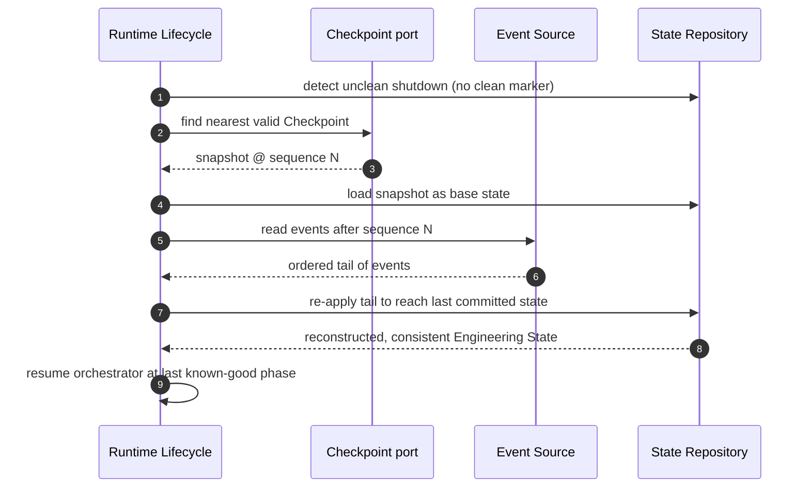

# Runtime Lifecycle

> **Ring:** Use cases / runtime (inner). This document is the **composition root** of the [Engineering Runtime](engineering-runtime.md): how the kernel is assembled from contracts and adapters, the ordered bootstrap that brings it to a serving state, how dependencies are wired without violating the [Dependency Rule (P1)](../foundation/principles.md), and how it shuts down gracefully and recovers after a crash. It exists because a system whose thesis is durability and determinism must have an *explicit, ordered, reproducible* way of coming up and going down — startup order, adapter binding, and recovery are architecture, not incidental glue. It owns *composition and lifecycle*; it does **not** own what the runtime *is* (see [Engineering Runtime](engineering-runtime.md)) nor how a transition runs (see [Execution Engine](execution-engine.md)).

---

## 1. Purpose & responsibilities

### What it owns

- **The composition root.** The single place where outer-ring [Adapters](../GLOSSARY.md#adapter) are bound to the inner-ring [Contracts](contracts.md) they implement. This is the *only* location aware of both sides of every port, which is precisely why it sits at the outermost edge of composition while the core stays adapter-blind ([P1](../foundation/principles.md), [P12](../foundation/principles.md)).
- **Bootstrap ordering.** The deterministic sequence in which subsystems initialize, including the dependency ordering between them (e.g. observability before anything that logs; state/event ports before the execution engine).
- **Dependency wiring.** How each port acquires its adapter, and how cross-cutting abstractions ([Observability, Configuration, Security, Cost-budget](contracts.md)) are made available to the core as injected abstractions rather than imports.
- **Graceful shutdown.** Quiescing in-flight work, flushing the [Event Bus](event-bus.md) to the [Event Store](../data/stores/event-store.md), and releasing adapters in reverse dependency order.
- **Crash recovery on restart.** Detecting an unclean prior shutdown and reconstructing a consistent [Engineering State](shared-state-model.md) from the durable record before resuming.

### What it does **not** own

- **Runtime identity / ownership semantics** — that is [Engineering Runtime](engineering-runtime.md).
- **Transition mechanics** — that is the [Execution Engine](execution-engine.md).
- **Workflow sequencing of phases** — that is the [Workflow Orchestrator](workflow-orchestration.md). The lifecycle *starts* the orchestrator; it does not decide phase order.
- **Concrete technology** — no process model, container, or DI framework is chosen here ([Phase 0](../CONVENTIONS.md)); only the conceptual ordering and binding rules.

---

## 2. Position in the architecture

The composition root is an architectural paradox resolved by clean architecture: it is the one component permitted to know *both* the inner contracts and the outer adapters, so it can wire them — yet it injects, and the core never depends on it. Conceptually it lives at the boundary of the [Frameworks & Drivers](../foundation/principles.md) ring (deferred tech) but its *rules* are specified here in the runtime ring.

- **Depends on:** all [Contracts](contracts.md) (to wire them) and the existence of adapters (to bind them). It is the assembler, so it transitively references the outer rings — this is the documented, intentional exception to "no inner→outer" because composition is not a *source dependency of the core*; the core is handed already-built abstractions.
- **Depended on by:** the process entry point only. Nothing in the domain references the lifecycle.

---

## 3. The bootstrap sequence

Initialization order is dictated by the dependency graph: a subsystem starts only after everything it needs is ready. Ordering is *deterministic* so that two cold starts from the same configuration and the same durable record reach the same serving state ([P4](../foundation/principles.md)).

*Figure: the cold-start ordering, from the composition root's viewpoint. Each step depends on all prior steps. Recovery (step 6) happens before any agent or scheduler can run, so no work begins on an unreconstructed state.*

### Why this order

- **Configuration and observability first** so every later step is configurable and observable; a failure during bootstrap must itself be diagnosable ([P12](../foundation/principles.md), [P13](../foundation/principles.md)).
- **State/event ports before the execution engine** because the engine cannot commit a single transition without the [State Repository](contracts.md) and [Event Sink/Source](contracts.md).
- **Recovery before scheduler/orchestrator** so the runtime never schedules work against partially-reconstructed knowledge ([P2](../foundation/principles.md)).
- **Presentation port last** so the UI can only connect once the runtime can actually answer queries and accept commands ([P11](../foundation/principles.md)).

---

## 4. Dependency wiring (how contracts get their adapters)

The composition root is the inversion point. The flow of *control* runs outer→inner at startup (the root constructs adapters and hands them in); the flow of *source dependency* remains inner-only (the core names only ports).

*Figure: the wiring table is the only artifact that names both a port and its adapter. The core sees only the left column.*

Rules the wiring obeys:

1. **One adapter per port at a time**, selected by [Configuration](../crosscutting/configuration.md); swapping an adapter (e.g. a different reasoning provider) is a configuration/wiring change, never a core change ([P3](../foundation/principles.md)).
2. **No core code references the wiring.** If the core could see the table, the dependency rule would be violated.
3. **Capability adapters are registered, not hard-wired.** The [Capability Registry](capability-registry.md) and [plugin system](../integration/plugin-system.md) let capabilities be contributed; the lifecycle validates each against its declared schema/permissions before activation.

---

## 5. Graceful shutdown

Shutdown is the bootstrap sequence reversed, with an explicit quiescence step so no knowledge is lost ([P2](../foundation/principles.md), [P5](../foundation/principles.md)).

*Figure: ordered shutdown. The quiesce step relies on the [Execution Engine's](execution-engine.md) commit boundary so a phase is never frozen mid-mutation.*

Key guarantees:

- **No torn writes.** Shutdown waits for the current transition to reach the execution engine's atomic commit boundary; design-significant work is either fully committed or not started.
- **Durability before exit.** The process does not exit until the bus has flushed and the [Event Store](../data/stores/event-store.md) confirms the append, because the event log is the recovery substrate.
- **Reverse-order release** mirrors construction so dependents close before their dependencies.

---

## 6. Crash recovery on restart

If the prior shutdown was unclean, the lifecycle reconstructs a consistent state before serving. This is the operational payoff of [event-driven state](event-bus.md) and [checkpoints](checkpoint-system.md).

*Figure: crash recovery. The nearest [Checkpoint](checkpoint-system.md) bounds replay cost; the [Event Source](contracts.md) supplies the authoritative tail. The exact authority of the log (full event sourcing vs. checkpoint-anchored replay) is [ADR-0004](../decisions/0004-event-sourcing-decision.md).*

- **Idempotent re-application.** Re-applying already-persisted events must be safe; events carry stable sequence identity so partial-tail replay converges to exactly the last committed state ([P4](../foundation/principles.md)).
- **Forward-only resume.** Recovery never invents new design facts; it only re-derives committed ones, then hands control to the [Workflow Orchestrator](workflow-orchestration.md) at the last completed phase boundary.
- **Recovery is itself observed.** The recovery span is logged via the [Observability port](contracts.md) so an operator can audit what was reconstructed ([P13](../foundation/principles.md)).

---

## 7. Contracts

- **Consumes (to wire):** every [Contract](contracts.md) — it is the binder. Of special note at lifecycle time: [Configuration port](contracts.md) (first), [Observability port](contracts.md) (second), [State Repository](contracts.md) + [Event Sink/Source](contracts.md) + [Checkpoint port](contracts.md) (for recovery), [Reasoning Engine port](reasoning-engine-interface.md) and [Capability port](capability-registry.md) (before agents can act).
- **Defines:** no new domain contract; the lifecycle is pure composition.

---

## 8. Failure modes

- **Adapter fails to bind (missing/misconfigured).** Bootstrap aborts *before* serving with a precise, observable error; the runtime never serves a half-wired kernel. See [`failure-taxonomy-and-degraded-modes.md` → store/dependency unavailability](failure-taxonomy-and-degraded-modes.md).
- **Recovery cannot find a consistent base.** If neither a valid checkpoint nor a replayable event tail exists, the runtime opens read-only/safe mode and surfaces the inconsistency rather than guessing ([P5](../foundation/principles.md)).
- **Reasoning adapter absent at startup.** The runtime still boots and serves in advisory/manual mode; phases requiring proposals wait, but state is fully usable ([P10](../foundation/principles.md)).
- **Slow quiesce at shutdown.** Bounded by a stated timeout (no silent infinite wait, [P13](../foundation/principles.md)); on timeout the runtime escalates to a forced flush of the event log so recovery remains possible.

---

## 9. Open decisions

- [ADR-0001](../decisions/0001-adopt-clean-architecture-dependency-rule.md) — the dependency rule that forces a composition root.
- [ADR-0003](../decisions/0003-shared-state-consistency-model.md) — concurrency/consistency model governing quiesce and recovery.
- [ADR-0004](../decisions/0004-event-sourcing-decision.md) — log-as-system-of-record vs. checkpoint-anchored replay (sets recovery semantics).
- [ADR-0009](../decisions/0009-determinism-and-replay-strategy.md) — deterministic cold start and replay.

---

## 10. Related documents

[`core/engineering-runtime.md`](engineering-runtime.md) · [`core/execution-engine.md`](execution-engine.md) · [`core/workflow-orchestration.md`](workflow-orchestration.md) · [`core/scheduler.md`](scheduler.md) · [`core/event-bus.md`](event-bus.md) · [`core/checkpoint-system.md`](checkpoint-system.md) · [`core/contracts.md`](contracts.md) · [`core/determinism-and-reproducibility.md`](determinism-and-reproducibility.md) · [`crosscutting/configuration.md`](../crosscutting/configuration.md) · [`integration/backend.md`](../integration/backend.md) · [`data/stores/event-store.md`](../data/stores/event-store.md)
