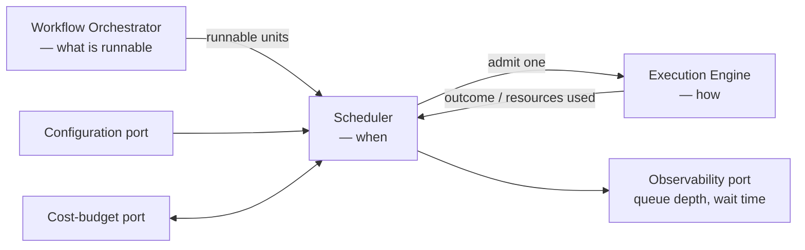
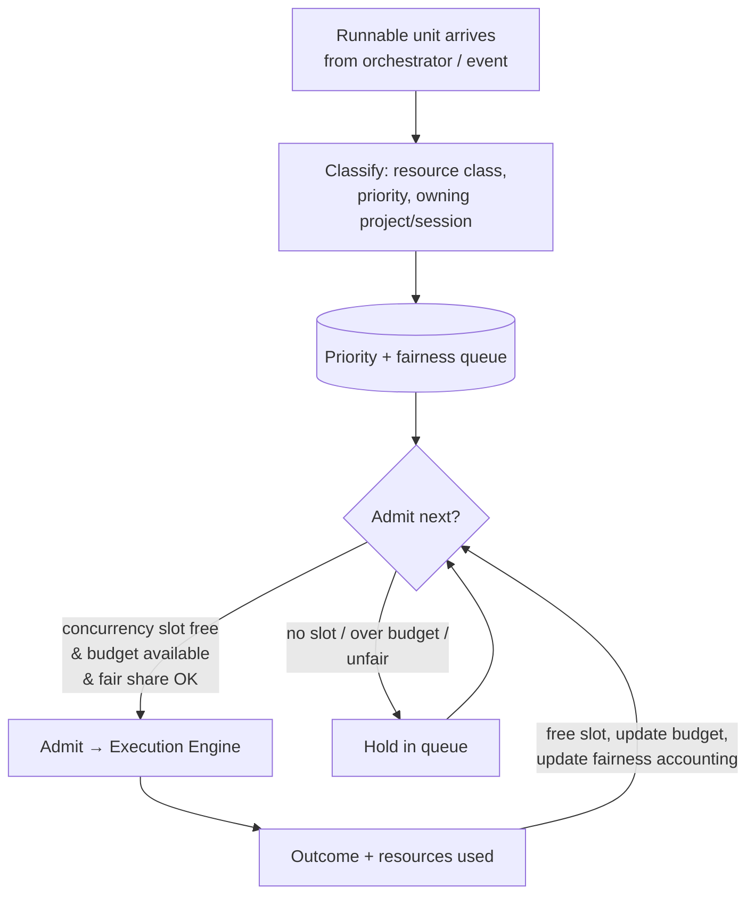

# Scheduler

> **Ring:** Use cases / runtime (inner). The Scheduler decides **when** runnable work executes — under concurrency limits, priority, fairness, and cost/resource budgets. It exists to keep the runtime responsive and within budget when more work is runnable than can run at once, and to make admission a *first-class, governed* decision rather than an emergent one. It is **policy about timing**, sharply distinct from the [Workflow Orchestrator](workflow-orchestration.md) (policy about *what* runs — the phase graph) and the [Execution Engine](execution-engine.md) (mechanism — *how* a transition runs). The scheduler chooses which already-eligible unit the engine runs next, and how many run concurrently; it never decides phase order and never steps a machine itself.

---

## 1. Purpose & responsibilities

### What it owns

- **Admission control.** Deciding which runnable units (a phase transition, an agent task, a [reasoning](reasoning-engine-interface.md) call, a [simulation](../integration/simulation-interface.md) run) are admitted to execute now versus queued.
- **Concurrency limits.** Bounding how much runs in parallel, globally and per resource class (e.g. reasoning calls, simulation jobs, store-heavy work).
- **Priority.** Ordering the queue so urgent/interactive work (e.g. a user-initiated command) precedes background work (e.g. a [Learning](../engineering/learning-engine.md) pass).
- **Fairness.** Preventing starvation across [Projects](../GLOSSARY.md#project), [Sessions](../GLOSSARY.md#session), and users — no tenant monopolizes the runtime.
- **Budget enforcement at admission.** Refusing or deferring work that would breach a token/time/cost budget, in cooperation with the [Cost-budget port](contracts.md).

### What it does **not** own

- **The phase graph / loop-backs** — [Workflow Orchestrator](workflow-orchestration.md). The orchestrator declares a phase *runnable*; the scheduler decides *when* it actually runs.
- **Running a transition** — [Execution Engine](execution-engine.md). The scheduler hands an admitted unit to the engine and observes the outcome.
- **Defining budgets/costs** — the [Cost & Resource Governance](../crosscutting/cost-and-resource-governance.md) cross-cutting concern owns the budget *model*; the scheduler *enforces* it at admission.
- **Reasoning** — it schedules reasoning calls but never makes them.

---

## 2. Position in the architecture

*Figure: the scheduler sits between orchestration (what) and execution (how), gating admission against concurrency, priority, fairness, and budgets. From whose viewpoint: the runtime kernel.*

- **Depends on:** the [Cost-budget port](contracts.md), [Configuration port](contracts.md) (limits/weights), and [Observability port](contracts.md). Consumes runnable units from the [Workflow Orchestrator](workflow-orchestration.md). All inward / same-ring ([P1](../foundation/principles.md), [P12](../foundation/principles.md)).
- **Depended on by:** the [Execution Engine](execution-engine.md) (receives admitted work) and the [Event Bus](event-bus.md) (admission throttling on backpressure).

---

## 3. The scheduling decision

*Figure: the admission loop. A unit is admitted only when a concurrency slot is free, its budget allows it, and admitting it preserves fairness.*

### Dimensions of the decision

1. **Concurrency** — is a slot free in the relevant resource class? Distinct pools (reasoning, simulation, store-heavy, interactive) prevent one heavy class from starving another.
2. **Priority** — interactive/user work outranks background work; verification loop-backs that unblock the [workflow plan](../foundation/architecture-views.md) outrank speculative work.
3. **Fairness** — accounting per project/session/user ensures long-running background work yields to others; no starvation.
4. **Budget** — the [Cost-budget port](contracts.md) is consulted before admitting cost-bearing work (especially [reasoning](reasoning-engine-interface.md) calls); over-budget work is deferred or refused with a clear, surfaced reason ([P13](../foundation/principles.md)), not silently dropped.

---

## 4. Cost & resource governance (cross-link)

The scheduler is the **enforcement point** for budgets defined in [`crosscutting/cost-and-resource-governance.md`](../crosscutting/cost-and-resource-governance.md). The division:

| Concern | Owner |
|---------|-------|
| What a budget *is* (token/time/cost limits, scopes, accounting) | [Cost & Resource Governance](../crosscutting/cost-and-resource-governance.md) via the [Cost-budget port](contracts.md) |
| *Enforcing* a budget at admission time (defer/refuse) | This scheduler |
| Reporting actual spend back | [Execution Engine](execution-engine.md) → [Cost-budget port](contracts.md), observed by the scheduler |

Because reasoning calls dominate cost, the scheduler treats the reasoning resource class with explicit budgeting: a phase that wants many proposals is throttled to its budget, and the deferral is visible to the user ([P10](../foundation/principles.md), [P13](../foundation/principles.md)).

---

## 5. Determinism considerations

Scheduling introduces timing non-determinism, which must not leak into engineering results ([P4](../foundation/principles.md)):

- **Outcomes are order-independent.** The [Execution Engine](execution-engine.md) commits each transition atomically with a stable sequence position; the *committed order of events* — not wall-clock admission order — defines state. So two runs that admit work in different real-time orders still produce the same committed event history for the same inputs.
- **Concurrency respects the consistency model.** The scheduler never admits two units that would conflict on the same state aggregate beyond what [ADR-0003](../decisions/0003-shared-state-consistency-model.md) permits; conflicting work is serialized.
- **Replay ignores the scheduler.** Reconstruction replays committed events in order; the scheduler plays no part in replay, so its timing choices are not part of the reproducible result.

---

## 6. Contracts

- **Consumes:** [Cost-budget port](contracts.md) (admission gating + spend), [Configuration port](contracts.md) (limits, priorities, fairness weights), [Observability port](contracts.md) (queue depth, wait times, admission decisions).
- **Provides (to the kernel):** an admission service — "give me the next unit to run / I have a free slot in class C." No new outward/domain contract.

---

## 7. Failure modes

- **Saturation (more runnable work than capacity).** Expected, not a failure: work queues by priority/fairness; the scheduler reports growing wait times via [observability](../crosscutting/logging-and-observability.md). Interactive work stays responsive because its class is reserved.
- **Budget exhausted.** Cost-bearing work is deferred or refused with an explicit, user-visible reason; the design is never silently stalled ([P13](../foundation/principles.md)). See [`failure-taxonomy-and-degraded-modes.md` → partial progress](failure-taxonomy-and-degraded-modes.md).
- **Starvation risk.** Prevented by fairness accounting; if detected, low-priority background work is preempted in favour of starved tenants.
- **Downstream (engine/store) backpressure.** The [Event Bus](event-bus.md) signals backpressure; the scheduler throttles admission so the runtime sheds load gracefully rather than overcommitting.
- **Priority inversion.** Mitigated by class isolation and by not letting a low-priority unit hold a resource a high-priority unit needs without bounded escalation.

---

## 8. Open decisions

- [ADR-0003](../decisions/0003-shared-state-consistency-model.md) — concurrency/consistency model that bounds what may run in parallel.
- [ADR-0009](../decisions/0009-determinism-and-replay-strategy.md) — keeping scheduling timing out of reproducible results.
- See also [`crosscutting/cost-and-resource-governance.md`](../crosscutting/cost-and-resource-governance.md) for the budget model the scheduler enforces.

---

## 9. Related documents

[`core/workflow-orchestration.md`](workflow-orchestration.md) · [`core/execution-engine.md`](execution-engine.md) · [`core/engineering-runtime.md`](engineering-runtime.md) · [`core/event-bus.md`](event-bus.md) · [`core/concurrency-and-consistency.md`](concurrency-and-consistency.md) · [`core/reasoning-engine-interface.md`](reasoning-engine-interface.md) · [`crosscutting/cost-and-resource-governance.md`](../crosscutting/cost-and-resource-governance.md) · [`crosscutting/performance.md`](../crosscutting/performance.md) · [`core/contracts.md`](contracts.md)
