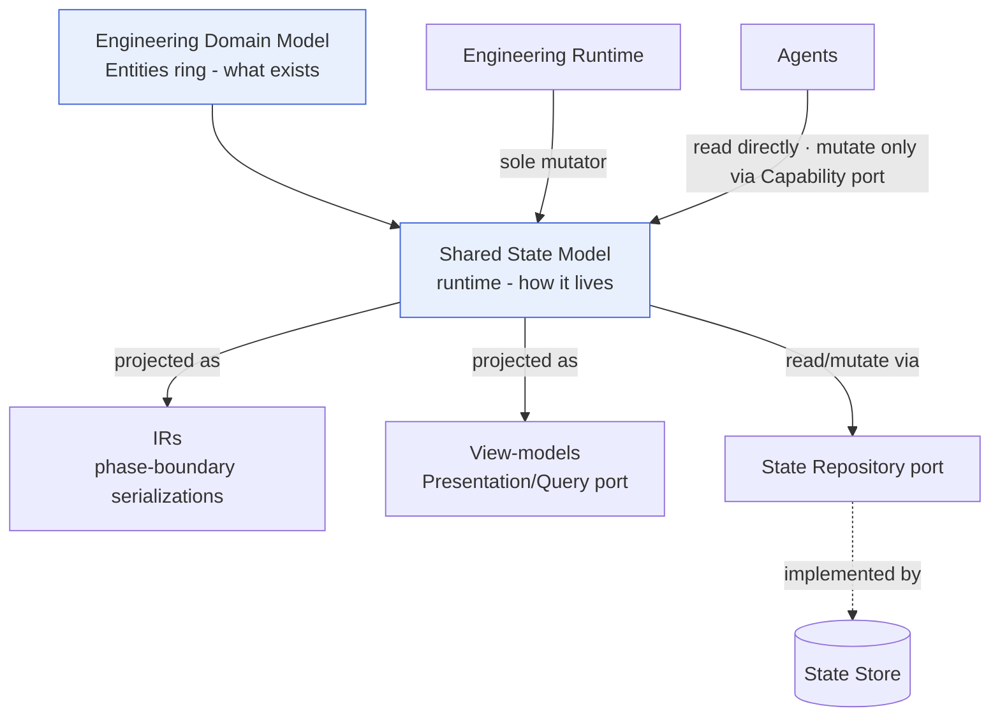
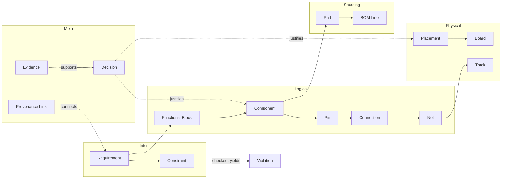
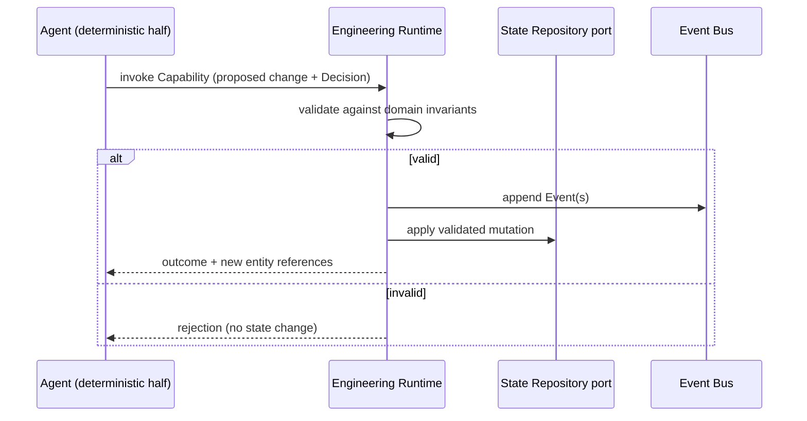

# Shared State Model

> **Ring:** Use cases / runtime (inner). This document defines **the Engineering State** — the single, versioned, authoritative model of everything known about a design — as an operational structure: how it is shaped, who may touch it, how its entities are identified and addressed, and how it relates to the [Engineering Domain Model](../foundation/engineering-domain-model.md) above it and the [State Repository](contracts.md#state-repository) contract below it. It is a keystone document: the [Engineering Runtime](engineering-runtime.md)'s thesis is that *the runtime owns the knowledge* ([P2](../foundation/principles.md)), and this is the description of the knowledge it owns.

The [Engineering Domain Model](../foundation/engineering-domain-model.md) says *what entities exist*. This document says *how those entities live together at runtime as one coherent, mutable, observable whole*. Where the domain model is conceptual (identity, attributes, relationships, invariants), the Shared State Model is operational (ownership, access discipline, addressing, granularity, change semantics). The two are deliberately separated so the vocabulary can stay stable while the runtime mechanics evolve.

## Purpose & responsibilities

**Owns (as a concept the runtime realizes):**
- The **single canonical instance** of all engineering knowledge for a [Project](../data/stores/project-store.md): requirements, constraints, functional blocks, components, pins, connections, nets, symbols, footprints, placement, routing, board/stack, parts, BOM line items, rules, violations, waivers, analysis results, decisions, evidence, and the provenance links among them — exactly the entities enumerated in the [domain model](../foundation/engineering-domain-model.md).
- The **rules of access**: who may read, who may mutate, through which boundary, and under what justification.
- The **identity and addressing scheme**: how any entity is named stably and referenced unambiguously across edits, phases, branches, and time.
- The **granularity contract**: the unit at which state is read, mutated, observed, and versioned.

**Does NOT own:**
- The **definitions** of the entities — those are canonical in the [domain model](../foundation/engineering-domain-model.md) ([P6](../foundation/principles.md): one canonical model, many projections). This document never re-defines an entity.
- **Persistence layout / storage** — that is the [State Store](../data/stores/state-store.md) behind the [State Repository](contracts.md#state-repository) port. The Shared State Model is storage-agnostic by construction.
- **Phase-boundary serializations** — those are [IRs](../compiler/compiler-ir.md), which are *projections* of this state, never competing copies.
- **Concurrency mechanics** (isolation, ordering, conflict resolution) — those are specified in [concurrency-and-consistency.md](concurrency-and-consistency.md); this document only states the *access discipline* that makes concurrency tractable.
- **Event mechanics** (transport, persistence, replay) — owned by the [Event Bus](event-bus.md), [Event Store](../data/stores/event-store.md), and [determinism](determinism-and-reproducibility.md) model. This document states only that *every mutation is expressed as an [Event](event-bus.md)*.

## Position in the architecture

*Figure: the Shared State Model operationalizes the domain model, is projected into IRs and view-models, and is reached through the State Repository port. From the runtime's viewpoint.* (Dependencies point inward: the domain model knows nothing of this document; this document depends on the domain model.)

## The structure of Engineering State

Engineering State is best understood as **one connected graph of identified entities**, layered by abstraction (not by phase, per the domain model's modelling principle 5). It is not a stack of per-phase documents; it is a single web that is *enriched* as the design advances.

### Three conceptual partitions

The state divides into three partitions that differ in their change semantics, not in their location:

| Partition | Contents | Change semantics |
|-----------|----------|------------------|
| **Design content** | Requirements, constraints, components, nets, placement, routing, BOM, board — the engineering artifacts. | Mutated only via justified [Decisions](../foundation/engineering-domain-model.md#decision); every change is design-significant and traceable. |
| **Reasoning & provenance** | Decisions, evidence, provenance links. | Append-mostly; records *why* the design content is what it is ([P5](../foundation/principles.md)). |
| **Derived / projected** | Verification violations, analysis results, computed roll-ups, indices. | Recomputable from design content; never an independent source of truth. May be invalidated and regenerated. |

The separation matters: the **derived** partition can always be rebuilt deterministically from the **design content** plus the **reasoning** partition, which is what lets the runtime cache aggressively without risking the source of truth. A violation list is never authoritative over the routing that produced it.

### The state graph

*Figure: Engineering State as one enriched graph spanning intent, logical, physical, sourcing, and meta domains. Entity definitions are canonical in the [domain model](../foundation/engineering-domain-model.md); this shows how they co-reside at runtime.*

### Layered, not duplicated

A `Component` is created during [Schematic Planning](../state-machines/schematic-planning.md), gains a `Footprint` association, then a `Placement` during [Component Placement](../state-machines/component-placement.md), then `Track` geometry as its nets are routed. The **same entity, same Entity ID**, accumulates attributes across phases. Phases never fork their own `Component`; they enrich the canonical one. This is the operational meaning of domain-model modelling principle 5 ("layered by abstraction, not by phase").

## Ownership — only the runtime mutates (P2)

The single most important rule of this document: **the [Engineering Runtime](engineering-runtime.md) is the sole mutator of Engineering State.** This is [P2 (The Runtime Owns the Knowledge)](../foundation/principles.md) made concrete.

- **No agent mutates state directly.** An [Agent](../agents/README.md)'s reasoning half may *propose*; its deterministic half acts only through the [Capability port](contracts.md#capability-port). A capability invocation is the *request*; the runtime performs the *mutation* — validating it, expressing it as an [Event](event-bus.md), and attaching the justifying [Decision](../foundation/engineering-domain-model.md#decision). This realizes [P3](../foundation/principles.md)'s "an agent may propose via reasoning; only the deterministic core may commit."
- **No LLM mutates state.** Per [P3](../foundation/principles.md), reasoning output is never trusted as truth or state; it is validated and only then may drive a runtime mutation.
- **No UI mutates state.** Per [P11](../foundation/principles.md), the [frontend](../presentation/frontend.md) issues *commands* through the [Presentation/Query port](contracts.md#presentation-query-port); the runtime decides whether and how they change state.
- **No store mutates state.** Stores persist what the runtime hands them via the [State Repository](contracts.md#state-repository); they hold no engineering rules ([P1](../foundation/principles.md)).

Because all writes funnel through one authority, every change can be (a) validated against domain invariants, (b) justified by a Decision, (c) recorded as an Event, and (d) made reproducible. Distributed mutation would forfeit all four properties — which is precisely the failure mode of "knowledge in prompts" that the vision rejects.

*Figure: the only legal mutation path. The agent proposes via a capability; the runtime validates, records, then applies. From the runtime's viewpoint.*

## Access rules — who reads, who writes

| Actor | Read | Write |
|-------|------|-------|
| **Engineering Runtime** | Yes (directly) | **Yes — the only writer**, via the [State Repository](contracts.md#state-repository), always as Events. |
| **Agent — deterministic half** | Yes, scoped to its phase's working set, via the runtime / repository queries. | No direct write; **proposes** mutations via the [Capability port](contracts.md#capability-port). |
| **Agent — reasoning adapter** | No state access of its own; receives only the structured context the deterministic half assembles for the [Reasoning Engine port](reasoning-engine-interface.md). | Never. |
| **Engines** (constraint, planning, verification, learning) | Yes, read-only, for evaluation. | No; they return results the runtime records. |
| **Frontend / UI** | Read-only **projections** (view-models) via the [Presentation/Query port](contracts.md#presentation-query-port). | No; issues **commands** only ([P11](../foundation/principles.md)). |
| **IRs / Compiler** | Read, to produce a [projection](../compiler/compiler-ir.md). | No; lowering writes back only through the runtime. |
| **Stores** | N/A (they *are* the persistence). | Only as instructed by the repository adapter. |

**Read discipline.** Reads are broad but always *by stable reference* (see addressing). An agent reads its **working set** — the slice of state relevant to its phase — rather than the whole graph, both for performance and to make its provenance precise.

**Write discipline.** Writes are narrow and always (1) validated, (2) justified by a Decision, (3) expressed as an Event. The [State Repository invariant](contracts.md#state-repository) — "the repository never accepts an unjustified design-significant change" — is the enforcement point.

## Entity identity & addressing

Stable identity is the foundation that makes provenance, version control, and determinism possible (domain-model modelling principle 1). The Shared State Model commits to these rules:

1. **Opaque, immutable Entity ID.** Every entity carries an Entity ID that is assigned at creation and never changes — not on rename, re-value, refactor, move between branches, or version bump. The ID carries no meaning (it is *not* a reference designator, a net name, or a position); meaningful attributes can change freely without breaking references.
2. **Reference by ID, never by name or position.** A `Connection` references `Pin`s by ID; a `Track` references its `Net` by ID; a `Decision` references its subject by ID. Names (e.g. net `VBUS`, refdes `U3`) are *attributes*, not identifiers, and may be reassigned. Positions (e.g. the third pin) are never identifiers.
3. **Addressing = (Entity ID) within (Project, version point).** To resolve an entity unambiguously the runtime needs the Entity ID plus the version coordinate (which [Design Branch](../data/design-version-control.md) and which point in history). The same Entity ID denotes "the same engineering thing" across branches; [version control](../data/design-version-control.md) keys on it ([ADR-0008](../decisions/0008-design-version-control-model.md)).
4. **Relationships are first-class, addressed entities.** A [Provenance Link](../foundation/engineering-domain-model.md#provenance-link) ("X derived from Y") and a [Connection](../foundation/engineering-domain-model.md#connection) are themselves identified entities, not implicit pointers, so the runtime can attach Events, Decisions, and provenance *to the relationship itself*.
5. **Identity survives supersession.** When an entity is superseded (e.g. a Part choice replaced), the new entity gets a new ID and a provenance link to the old; the old is retired, not erased ([traceability](provenance-and-traceability.md), domain-model entity lifecycle).

> **Assumption:** the exact shape of the Entity ID and the version coordinate is a later-phase concern, deferred to [ADR-0008](../decisions/0008-design-version-control-model.md). This document fixes only the *properties* the identifier must have (opaque, immutable, project-scoped, branch-stable), per [P13](../foundation/principles.md) (no silent assumptions).

## Granularity

Granularity is the unit at which the state is **read, mutated, observed, and versioned**. The model picks the **entity** as the primary grain, with sub-entity attributes addressable when needed.

| Operation | Grain | Rationale |
|-----------|-------|-----------|
| **Read** | Entity, or a queried set of entities ([State Repository](contracts.md#state-repository): "get entity / query entities by type or relationship"). | An agent's working set is a set of entities, not the whole graph. |
| **Mutate** | A **validated mutation** spanning one or more entities, applied atomically as a unit consistent with the [concurrency model](concurrency-and-consistency.md). | A single engineering act (e.g. "place this component") may touch several entities and must be all-or-nothing. |
| **Observe (Event)** | The entity-level (or relationship-level) change, with before/after references. | Events are the unit of provenance and replay; per-entity granularity keeps the [traceability](provenance-and-traceability.md) graph precise. |
| **Version** | The Entity ID across history; branches diff and merge at entity granularity. | [Design version control](../data/design-version-control.md) ("Git for hardware") needs entity-level diffs, not file-level. |

**Why not finer (per-attribute) or coarser (per-phase document)?** Per-attribute mutation would fragment the justifying Decision and make invariants (which span attributes of one entity) hard to enforce. Per-phase-document mutation would resurrect the "competing copies of truth" the architecture explicitly forbids ([P6](../foundation/principles.md)) and destroy fine-grained provenance. The entity grain is the smallest unit that carries a coherent engineering meaning and a single justification.

## How it relates to the domain model and the State Repository

- **To the [domain model](../foundation/engineering-domain-model.md):** this document *operationalizes* it. The domain model is the noun list and its invariants; the Shared State Model is those nouns instantiated as one mutable, owned, addressable graph at runtime. Every entity here resolves to its canonical definition there; this document adds no new entities and changes no definitions ([P6](../foundation/principles.md)).
- **To the [State Repository](contracts.md#state-repository) contract:** the repository is the *port* through which the runtime reads and mutates this state. The Shared State Model defines *what* is being read/mutated and the *discipline*; the repository contract defines the *operations* (get / query / apply validated mutation / open transactional unit) and is implemented by the [State Store](../data/stores/state-store.md) adapter. The two are complementary: model = the thing; repository = the doorway to it.
- **To [IRs](../compiler/compiler-ir.md):** each IR is a typed projection of this state at a phase boundary, produced by [lowering](../compiler/transformations.md). The state is canonical; IRs are derived ([P6](../foundation/principles.md)).
- **To [provenance](provenance-and-traceability.md):** the meta partition (decisions, evidence, provenance links) *is* the traceability graph, co-resident with the design content it explains.

## Contracts

- **Consumes:** [State Repository](contracts.md#state-repository) (read/mutate), [Event Sink/Source](contracts.md#event-sink-event-source) (every mutation is an Event), [Checkpoint port](contracts.md#checkpoint-port) (snapshots of this state).
- **Exposed through:** the [Presentation/Query port](contracts.md#presentation-query-port) (read-only view-model projections) and the [Capability port](contracts.md#capability-port) (the only proposal-of-mutation path for agents).
- **Projected into:** [IRs](../compiler/compiler-ir.md) via [transformations](../compiler/transformations.md).

## Failure modes

| Failure | Effect | Mitigation / degradation |
|---------|--------|--------------------------|
| **Attempted out-of-band mutation** (agent/UI tries to write directly) | Would corrupt ownership invariant. | Architecturally impossible: there is no write path except the runtime via the repository. Capability invocations that imply unjustified changes are rejected. |
| **Dangling reference** (entity references a retired/absent ID) | Broken graph. | References are by immutable ID; retirement keeps a tombstone + provenance link so resolution degrades to "superseded by X," never to a silent null. |
| **Derived/source divergence** (cached violations stale vs. routing) | Misleading diagnostics. | Derived partition is recomputable; invalidated on the Events that change its inputs and regenerated deterministically. |
| **Invariant violation slips in** (e.g. footprint pin count ≠ symbol) | Inconsistent state. | Mutations are validated against domain invariants *before* the Event is appended; rejection leaves state unchanged. |
| **Concurrent conflicting mutations** | Lost update / inconsistency. | Resolved by the [concurrency model](concurrency-and-consistency.md) (single-writer per scope + ordered Events); out of scope here. |

## Open decisions

- [ADR-0008](../decisions/0008-design-version-control-model.md) — Entity identity under branch/merge (the concrete ID and version-coordinate shape).
- [ADR-0003](../decisions/0003-shared-state-consistency-model.md) — the consistency model that governs how concurrent mutations to this state are isolated and ordered.
- [ADR-0005](../decisions/0005-ir-as-canonical-phase-boundary-representation.md) — IRs are projections of this state, not rival sources of truth.
- [ADR-0002](../decisions/0002-runtime-owns-knowledge-llm-as-reasoning-engine.md) — the runtime, not the model, owns this knowledge.

## Related documents

[`foundation/engineering-domain-model.md`](../foundation/engineering-domain-model.md) · [`core/contracts.md`](contracts.md) · [`core/concurrency-and-consistency.md`](concurrency-and-consistency.md) · [`core/provenance-and-traceability.md`](provenance-and-traceability.md) · [`core/determinism-and-reproducibility.md`](determinism-and-reproducibility.md) · [`core/event-bus.md`](event-bus.md) · [`data/stores/state-store.md`](../data/stores/state-store.md) · [`compiler/compiler-ir.md`](../compiler/compiler-ir.md) · [`foundation/principles.md`](../foundation/principles.md) · [`GLOSSARY.md`](../GLOSSARY.md)
