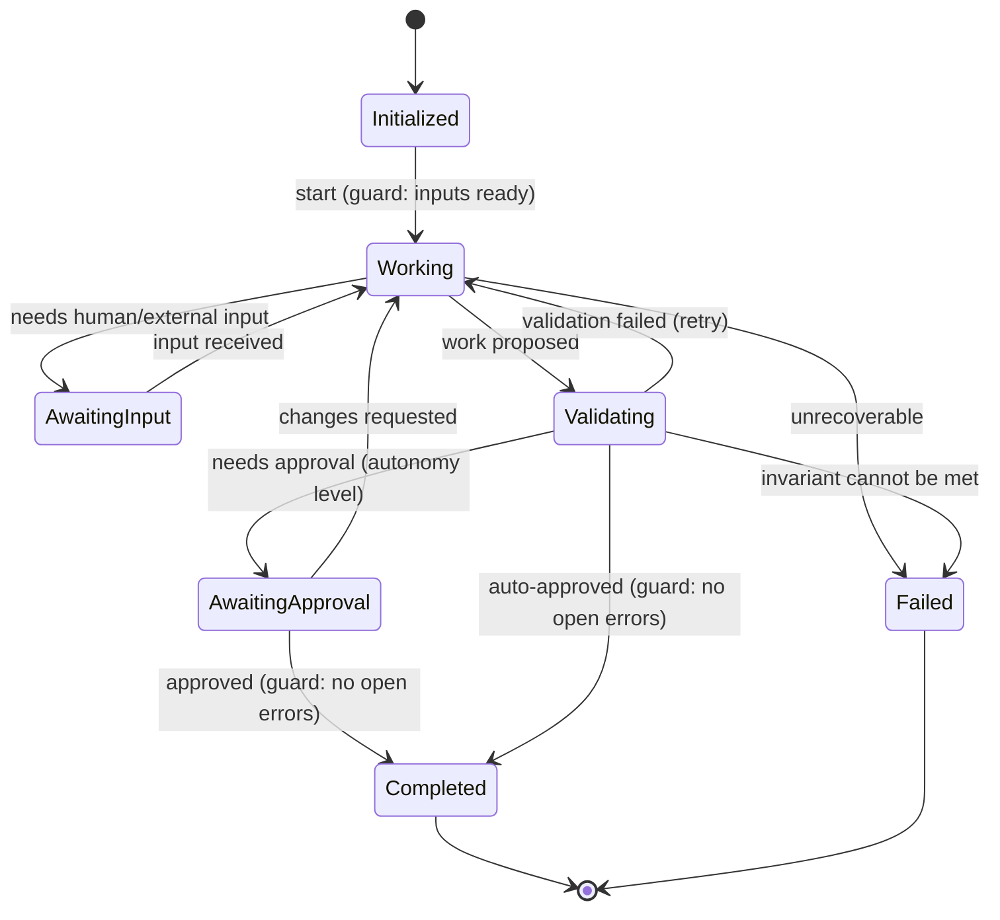

# State-Machine Framework

> **Ring:** Use cases / runtime (inner). This document defines the reusable **meta-model** for every phase state machine — the abstract vocabulary of [States](#states), [Transitions](#transitions-and-their-semantics), [Guards](#guards), [Effects](#effects), rollback, recovery, and persistence hooks — *not* any concrete phase. It exists so all 14 phase state machines share one rigorously-defined shape, which is what lets the [Execution Engine](execution-engine.md) interpret any of them generically ([P7 — mechanism/policy/instance separation](../foundation/principles.md)). The concrete per-phase **instances** live in [`state-machines/`](../state-machines/README.md); this framework is what they instantiate. It owns the *form* of a state machine; it does **not** own how a transition is executed ([Execution Engine](execution-engine.md)) nor which machine runs when ([Workflow Orchestrator](workflow-orchestration.md) / [Scheduler](scheduler.md)).

---

## 1. Purpose & responsibilities

### What it owns

- **The abstract elements** every phase machine is built from: States, Transitions, Guards, Effects, Events, and terminal/error states.
- **Transition semantics:** what it means for a transition to be enabled, selected, run, and committed — defined abstractly so the [Execution Engine](execution-engine.md) can apply them uniformly.
- **Rollback & recovery hooks:** the abstract slots a phase fills in to specify how a transition reverses and how a machine reconstructs after a crash.
- **Persistence hooks:** how a machine's current position and history are expressed as [Events](event-bus.md) so position is durable and replayable, never held only in memory.
- **Well-formedness rules:** the static constraints a valid machine must satisfy (reachability, determinism of selection, defined error handling).

### What it does **not** own

- **Concrete phases.** Requirement Planning, Routing Planning, DRC, etc. are [instances](../state-machines/README.md), each owning its own States/Transitions/Events per the [anti-duplication rule](../CONVENTIONS.md).
- **Execution.** Stepping a machine is the [Execution Engine](execution-engine.md).
- **Sequencing of machines.** The phase DAG is the [Workflow Orchestrator's](workflow-orchestration.md) [workflow plan](../GLOSSARY.md#the-word-planning-disambiguation).
- **Agent internals.** A transition *invokes* an [Agent](../agents/README.md); the agent's two-part structure is specified in [`agent-runtime-protocol.md`](agent-runtime-protocol.md) and [ADR-0006](../decisions/0006-agent-fsm-separation.md).

---

## 2. Position in the architecture

- **Depends on:** the [Engineering Domain Model](../foundation/engineering-domain-model.md) (states/guards/effects speak in domain terms) and the [Event](event-bus.md) concept. Nothing outward ([P1](../foundation/principles.md)).
- **Depended on by:** the [Execution Engine](execution-engine.md) (interprets it) and every [state-machine instance](../state-machines/README.md) (conforms to it).

---

## 3. The meta-model

```mermaid
flowchart TD
  SM[State Machine\n= one Phase] --> ST[State]
  SM --> TR[Transition]
  TR -->|from| ST
  TR -->|to| ST
  TR --> G[Guard\npredicate over Engineering State]
  TR --> EF[Effect\nagent invocation + mutations]
  TR --> EV[Event(s)\nemitted on commit]
  TR --> RB[Rollback spec\nhow to reverse]
  ST --> KIND{Kind}
  KIND --> Initial
  KIND --> Normal
  KIND --> Wait[Waiting / human-in-the-loop]
  KIND --> Terminal[Terminal: success]
  KIND --> Error[Terminal: failure]
```
*Figure: the elements of the meta-model and how they relate. Every concrete phase is a graph of these elements.*

### States

A **State** is a named, stable configuration of a phase in which the machine is at rest, awaiting an enabling event or input. Kinds:

- **Initial** — entry point; exactly one per machine.
- **Normal** — ordinary working states.
- **Waiting / human-in-the-loop** — the machine is paused for human input or approval, honoring the configured [Autonomy Level](../engineering/human-in-the-loop.md) ([P10](../foundation/principles.md)). The runtime is idle, not busy ([P13](../foundation/principles.md)).
- **Terminal (success)** — phase complete; the [Workflow Orchestrator](workflow-orchestration.md) may advance.
- **Terminal (failure)** — phase cannot complete; surfaces an outcome the orchestrator routes (e.g. a verification failure loop-back).

A state holds **no engineering knowledge** of its own; the knowledge is in [Engineering State](shared-state-model.md). A state is just a position in the process.

### Transitions and their semantics

A **Transition** connects a *from* state to a *to* state and bundles: a [Guard](#guards), an [Effect](#effects), the [Events](event-bus.md) it emits, and a [rollback spec](#rollback). Its lifecycle, as run by the [Execution Engine](execution-engine.md):

1. **Enabled** when its source is the current state *and* its guard is satisfied.
2. **Selected** — exactly one enabled transition is chosen; the framework requires selection to be unambiguous and deterministic ([P4](../foundation/principles.md)).
3. **Run** — its effect executes (agent invocation, validated mutations).
4. **Committed** — its events are appended atomically with the state change; the machine lands in the *to* state.

### Guards

A **Guard** is a side-effect-free predicate over current [Engineering State](shared-state-model.md) (and recorded inputs). Guards decide *legality*, never perform work. Because they are pure, evaluating them is deterministic and safe to repeat during replay. Typical guards reference domain invariants — e.g. "no open error-severity [Violations](../foundation/engineering-domain-model.md#violation)" before a [Terminal-success](#states) transition, mirroring the domain invariant that a design with open errors cannot reach [Manufacturing Generation](../state-machines/manufacturing-generation.md).

### Effects

An **Effect** is the work a transition performs: invoking the bound [Agent](../agents/README.md) and applying the resulting validated mutations through the [State Repository](contracts.md). Effects are where proposals become (validated) reality — but the *validation gate* and *atomic commit* are enforced by the [Execution Engine](execution-engine.md), not re-implemented per machine. An effect declares whether it has external side effects (e.g. a [simulation](../integration/simulation-interface.md) call) so the engine can order it relative to the commit boundary.

### Events & persistence hooks

The machine's position and progress are expressed entirely as [Events](event-bus.md): "entered state X", "transition T committed", "phase terminal". This is the persistence hook — there is no separate, hidden machine state. Consequences:

- **Position is durable and replayable.** Reconstructing a machine means replaying its events (bounded by the nearest [Checkpoint](checkpoint-system.md)).
- **Position is traceable.** Every move is in the audit record ([P5](../foundation/principles.md)).

### Rollback

Each transition carries a **rollback spec** describing how to reverse it:

- **Pre-commit rollback** (the common case): if the effect's validation fails before the commit boundary, the unit of work is abandoned and the machine stays in the *from* state — nothing to undo because nothing was committed.
- **Post-commit reversal:** a committed transition is reversed only by a *compensating* transition emitting compensating [Events](event-bus.md) (history is immutable), or by restoring a [Checkpoint](checkpoint-system.md). The framework provides the slot; [`error-handling.md`](error-handling.md) defines the policy for choosing.

### Recovery

The **recovery hook** specifies how a machine re-establishes a consistent position after a crash: it is reconstructed by the [Runtime Lifecycle](runtime-lifecycle.md) from events/checkpoint and resumes at its last committed state. A phase may mark certain states **non-resumable** (must restart the phase) versus **resumable** (continue mid-phase); this is part of its instance spec, expressed against this hook.

---

## 4. A generic phase machine


*Figure: a generic phase state machine using the meta-model, from the framework's viewpoint. Concrete phases in [`state-machines/`](../state-machines/README.md) specialize this shape; e.g. a verification phase's `Failed` terminal becomes a loop-back edge in the [workflow plan](../foundation/architecture-views.md). The `AwaitingApproval` state realizes [human-in-the-loop](../engineering/human-in-the-loop.md) ([P10](../foundation/principles.md)).*

---

## 5. Well-formedness rules

A valid state machine must satisfy (checked when an instance is registered):

1. **Single initial state; reachable terminals.** Every state is reachable from initial; at least one terminal is reachable from every state (no dead ends, no infinite traps without an escape).
2. **Deterministic selection.** No two transitions out of one state may be simultaneously enabled for the same inputs ([P4](../foundation/principles.md)); overlap is a defect surfaced at registration, never resolved by guessing.
3. **Total error handling.** Every state defines how an effect failure is handled (rollback to *from*, or a transition to an error state) — no undefined failure behaviour ([P13](../foundation/principles.md)).
4. **Pure guards.** Guards may not mutate state or have observable side effects.
5. **Events for every committed move.** No silent state change; position is always expressed as events ([P5](../foundation/principles.md)).

---

## 6. Contracts

- **Consumes (via the execution engine that interprets it):** [State Repository](contracts.md) (guards read it; effects mutate it), [Event Sink/Source](contracts.md) (position + history), [Checkpoint port](contracts.md) (recovery boundary).
- **Provides:** an abstract, interpretable machine definition that the [Execution Engine](execution-engine.md) runs. No new outward contract.

---

## 7. Failure modes

- **Ill-formed instance.** Rejected at registration by the well-formedness rules; never loaded, so a malformed phase cannot run.
- **Guard non-determinism / overlap.** Detected statically (rule 2) or surfaced at runtime by the engine as an ambiguous-model error. See [`execution-engine.md`](execution-engine.md).
- **Non-resumable state after crash.** The recovery hook restarts the phase from a safe state; partial in-phase progress that wasn't committed is discarded ([P4](../foundation/principles.md)). See [`failure-taxonomy-and-degraded-modes.md` → partial progress](failure-taxonomy-and-degraded-modes.md).
- **Effect with undeclared side effect.** Treated as a modelling error; the engine cannot guarantee ordering around the commit boundary, so the transition is refused.

---

## 8. Open decisions

- [ADR-0006](../decisions/0006-agent-fsm-separation.md) — the agent/FSM separation that keeps effects thin and agents two-part.
- [ADR-0004](../decisions/0004-event-sourcing-decision.md) — events as the persistence substrate for machine position.
- [ADR-0009](../decisions/0009-determinism-and-replay-strategy.md) — deterministic selection and replayable position.
- [ADR-0010](../decisions/0010-human-in-the-loop-autonomy-levels.md) — how waiting/approval states bind to autonomy levels.

---

## 9. Related documents

[`core/execution-engine.md`](execution-engine.md) · [`core/engineering-runtime.md`](engineering-runtime.md) · [`core/workflow-orchestration.md`](workflow-orchestration.md) · [`core/event-bus.md`](event-bus.md) · [`core/checkpoint-system.md`](checkpoint-system.md) · [`core/agent-runtime-protocol.md`](agent-runtime-protocol.md) · [`state-machines/README.md`](../state-machines/README.md) · [`engineering/human-in-the-loop.md`](../engineering/human-in-the-loop.md) · [`foundation/architecture-views.md`](../foundation/architecture-views.md)
