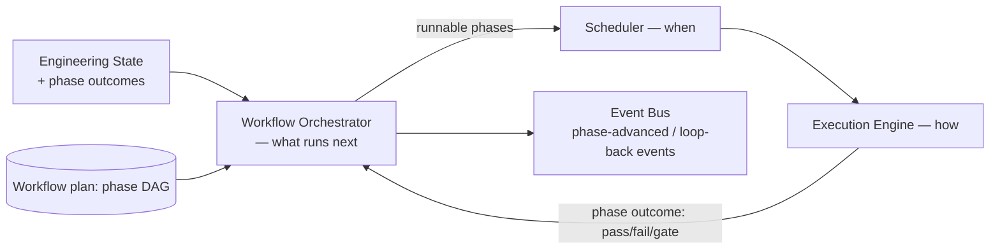

# Workflow Orchestration

> **Ring:** Use cases / runtime (inner). The Workflow Orchestrator owns the **[workflow plan](../GLOSSARY.md#the-word-planning-disambiguation)**: the directed graph of [Phases](../GLOSSARY.md#phase) for a [Project](../GLOSSARY.md#project) — its branches, gates, and loop-backs on verification failure. It exists because engineering is *not* a linear pipeline: phases fork, wait on gates, and loop back when verification fails, and *something* must own that graph declaratively so the kernel mechanism stays phase-agnostic ([P7 — mechanism/policy/instance separation](../foundation/principles.md)). It is **policy about what runs**, distinct from the [Scheduler](scheduler.md) (policy about *when*) and the [Execution Engine](execution-engine.md) (mechanism — *how* a phase's state machine runs). Per the disambiguation in [`GLOSSARY.md`](../GLOSSARY.md), "workflow plan" is the *project-wide phase graph* — never a [reasoning plan](../GLOSSARY.md#the-word-planning-disambiguation) (an agent's short-horizon steps).

---

## 1. Purpose & responsibilities

### What it owns

- **The workflow plan.** The phase DAG for a project: which [Phases](../GLOSSARY.md#phase) exist, their dependencies, branch points, gates, and loop-back edges. The default is the [default workflow plan](../foundation/architecture-views.md).
- **Phase sequencing.** Deciding, from the current [Engineering State](shared-state-model.md) and phase outcomes, which phase(s) become *runnable* next.
- **Gates.** Conditions (often [human approval](../engineering/human-in-the-loop.md) at an [Autonomy Level](../engineering/human-in-the-loop.md), or "no open error [Violations](../foundation/engineering-domain-model.md#violation)") that must hold before a phase may begin or a project may advance.
- **Loop-backs.** Routing a verification *failure* outcome back to the phase that can fix it (e.g. ERC failure → Schematic Planning; DRC failure → Routing Planning).
- **Branches.** Allowing alternative paths (optional phases, parallel sub-flows) within one project.

### What it does **not** own

- **Timing/concurrency/budget** — [Scheduler](scheduler.md). The orchestrator declares a phase runnable; the scheduler decides when it actually runs.
- **Running a phase** — [Execution Engine](execution-engine.md) interpreting that phase's [state machine](state-machine-framework.md).
- **A phase's internal states/transitions** — the per-phase [state-machine instance](../state-machines/README.md) (anti-duplication rule, [`CONVENTIONS.md`](../CONVENTIONS.md)).
- **Agent reasoning plans** — a [reasoning plan](../GLOSSARY.md#the-word-planning-disambiguation) is the [Planning Engine's](../engineering/planning-engine.md) concern, scoped *inside* one phase, not the project-wide graph.

---

## 2. Position in the architecture


*Figure: the orchestrator turns state + outcomes into runnable phases against the workflow plan, then consumes outcomes to advance, gate, or loop back. Viewpoint: the runtime kernel.*

- **Depends on:** the [State Repository](contracts.md) (to read outcomes/gate conditions), the [Event Sink/Source](contracts.md) (to record advances), the [Security/Policy port](contracts.md) and [human-in-the-loop](../engineering/human-in-the-loop.md) (for gates). All inward / same-ring ([P1](../foundation/principles.md)).
- **Depended on by:** the [Scheduler](scheduler.md) (consumes runnable phases) and, indirectly, the whole runtime loop described in [`engineering-runtime.md`](engineering-runtime.md).

---

## 3. The workflow plan

The plan is a **declarative DAG of phases**, separate from the kernel so phases can be added, reordered, branched, or gated without touching mechanism ([P7](../foundation/principles.md)). The canonical default mirrors the [default workflow plan](../foundation/architecture-views.md) and the [canonical phase map](../foundation/architecture-views.md):

```mermaid
flowchart LR
  R[1 Requirement Planning] --> EA[2 Engineering Analysis] --> CE[3 Constraint Extraction]
  CE --> DS[4 Datasheet Intelligence] --> BOM[5 BOM Planning] --> SCH[6 Schematic Planning] --> ERC[7 ERC Verification]
  ERC -->|pass gate: no open errors| FP[8 PCB Floor Planning] --> PL[9 Component Placement] --> RO[10 Routing Planning]
  RO --> DRC[11 DRC Verification] --> DFM[12 DFM Verification] --> EMC[13 EMC Analysis] --> MFG[14 Manufacturing Generation]
  ERC -.fail loop-back.-> SCH
  DRC -.fail loop-back.-> RO
  DFM -.fail loop-back.-> PL
  EMC -.fail loop-back.-> RO
```


*Figure: the default workflow plan owned by the orchestrator (consistent with [`architecture-views.md`](../foundation/architecture-views.md)). Solid edges are forward dependencies; dotted edges are verification loop-backs; the ERC→Floor-Planning edge is a gate.*

### Elements of the plan

- **Nodes** are phases (each a [state-machine instance](../state-machines/README.md) driven by its [agent](../agents/README.md)).
- **Forward edges** are dependencies: a phase becomes runnable only when its predecessors reached a terminal-success outcome.
- **Gate edges** carry a condition checked before traversal — e.g. an approval gate honouring the [Autonomy Level](../engineering/human-in-the-loop.md) ([P10](../foundation/principles.md)), or an invariant gate ("no open error-severity [Violations](../foundation/engineering-domain-model.md#violation)").
- **Loop-back edges** route a verification *failure* outcome to a fixing phase; this is how iteration is expressed declaratively rather than as ad-hoc control flow.
- **Branch points** allow optional/parallel sub-flows (e.g. skipping EMC analysis for a low-speed board), each justified by state, not by hardcoding.

---

## 4. Sequencing semantics

```mermaid
sequenceDiagram
  autonumber
  participant ORCH as Orchestrator
  participant ST as State Repository
  participant SCHED as Scheduler
  participant X as Execution Engine
  ORCH->>ST: read outcomes + gate conditions
  ORCH->>ORCH: compute runnable set from the plan
  ORCH->>SCHED: declare phase P runnable (with priority hint)
  SCHED->>X: (when admitted) run P's state machine
  X-->>ORCH: P outcome = success | failure | needs-gate
  alt success
    ORCH->>ORCH: mark P complete; recompute runnable set (successors)
  else failure (verification)
    ORCH->>ORCH: traverse loop-back edge to fixing phase
  else needs-gate
    ORCH->>ORCH: pause at gate; await approval/condition
  end
  ORCH->>SCHED: declare next runnable phase(s)
```
*Figure: how the orchestrator advances a project. It only ever declares phases *runnable*; the [Scheduler](scheduler.md) decides timing and the [Execution Engine](execution-engine.md) runs them.*

Rules:

- **Outcome-driven, not time-driven.** Advancement is a pure function of committed phase outcomes and state, so the same project history yields the same advancement decisions ([P4](../foundation/principles.md)).
- **Loop-backs are first-class and recorded.** A loop-back is an [Event](event-bus.md) ("phase X re-opened due to failure in Y"), preserving [traceability](provenance-and-traceability.md) of why work was redone ([P5](../foundation/principles.md)).
- **Gates respect human command.** A gate that requires approval blocks advancement until the engineer disposes, per the project's [Autonomy Level](../engineering/human-in-the-loop.md) ([P10](../foundation/principles.md)).
- **Convergence safeguards.** Loop-back cycles are bounded/observed so a design cannot oscillate forever silently; repeated failures escalate to the engineer ([P13](../foundation/principles.md)).

---

## 5. Relationship to other kernel components

| Question | Answered by |
|----------|-------------|
| *What* phase runs next, and the project's branch/gate/loop-back graph | **This orchestrator** |
| *When* a runnable phase actually executes (concurrency, priority, budget) | [Scheduler](scheduler.md) |
| *How* a phase's state machine is stepped | [Execution Engine](execution-engine.md) |
| The *form* of any state machine | [State-Machine Framework](state-machine-framework.md) |
| The *content* of one phase (its states/transitions) | [state-machine instance](../state-machines/README.md) |
| An agent's *short-horizon* steps inside a phase | [reasoning plan](../GLOSSARY.md#the-word-planning-disambiguation) via [Planning Engine](../engineering/planning-engine.md) |

This is the practical payoff of [P7](../foundation/principles.md): the workflow plan can be edited (add a phase, change a gate) without modifying the execution engine, scheduler, or framework.

---

## 6. Contracts

- **Consumes:** [State Repository](contracts.md) (read outcomes/gate conditions), [Event Sink/Source](contracts.md) (record advances and loop-backs), [Security/Policy port](contracts.md) (gate authorization), [Configuration port](contracts.md) (the plan definition / project-specific overrides).
- **Provides (to the kernel):** the runnable-phase set the [Scheduler](scheduler.md) admits. No new outward/domain contract.

---

## 7. Failure modes

- **Phase fails unrecoverably (no fixing edge).** The orchestrator halts that branch and surfaces it to the engineer rather than looping blindly. See [`failure-taxonomy-and-degraded-modes.md`](failure-taxonomy-and-degraded-modes.md).
- **Oscillating loop-back (verification keeps failing).** Bounded by convergence safeguards; on exceeding the bound, the project pauses at a gate for human decision ([P10](../foundation/principles.md), [P13](../foundation/principles.md)).
- **Gate condition never met.** The project waits in a gated state (idle, not busy); the pending gate is visible in the UI via the [Presentation/Query port](contracts.md).
- **Plan inconsistency (cycle without escape, unreachable phase).** Rejected when the plan is loaded — analogous to the [framework's](state-machine-framework.md) well-formedness rules — so an ill-formed workflow never runs.

---

## 8. Open decisions

- [ADR-0005](../decisions/0005-ir-as-canonical-phase-boundary-representation.md) — phase boundaries are crossed by lowering one [IR](../compiler/compiler-ir.md) to the next; the plan's forward edges align with IR lowerings.
- [ADR-0010](../decisions/0010-human-in-the-loop-autonomy-levels.md) — how gates bind to autonomy levels.
- [ADR-0003](../decisions/0003-shared-state-consistency-model.md) — whether independent branches may advance concurrently.

---

## 9. Related documents

[`core/scheduler.md`](scheduler.md) · [`core/execution-engine.md`](execution-engine.md) · [`core/state-machine-framework.md`](state-machine-framework.md) · [`core/engineering-runtime.md`](engineering-runtime.md) · [`state-machines/README.md`](../state-machines/README.md) · [`engineering/planning-engine.md`](../engineering/planning-engine.md) · [`engineering/human-in-the-loop.md`](../engineering/human-in-the-loop.md) · [`foundation/architecture-views.md`](../foundation/architecture-views.md) · [`compiler/compiler-ir.md`](../compiler/compiler-ir.md)
