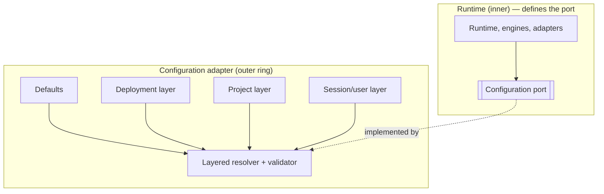

# Configuration

> **Ring:** Cross-cutting abstraction ([P12](../foundation/principles.md)). Configuration is consumed by the [Engineering Runtime](../core/engineering-runtime.md) as the **[Configuration port](../core/contracts.md#cross-cutting-contracts)** — typed, layered access to settings that the core *defines* and depends on, with concrete sources living in the outer ring. It exists because a multi-deployment engineering runtime (local desktop, shared service, CI) must be tunable without code changes — yet configuration must be *typed* and *validated* so a misconfiguration fails loudly at startup rather than producing a subtly wrong engineering result. The core reads configuration only through this abstraction; it never imports a concrete config source ([P1](../foundation/principles.md), [P12](../foundation/principles.md)).

---

## 1. Purpose & responsibilities

### What it owns (as an abstraction)
- **Typed access.** Exposing settings as validated, typed values (including [Physical-Quantity](../engineering/units-and-quantities.md)-typed defaults where relevant), so consumers never parse raw strings or guess units ([P9](../foundation/principles.md)).
- **Layering & precedence.** A defined override order (built-in defaults → deployment → [Project](../GLOSSARY.md#project) → [Session](../collaboration/multi-user-and-sessions.md)/user → runtime override), with the effective value resolvable and explainable.
- **Validation.** Checking the resolved configuration against a schema at startup, failing fast on invalid or missing required settings.
- **Change semantics.** Defining what is fixed-at-startup vs. safely reloadable, and surfacing the *effective* configuration for inspection.

### What it does NOT own
- **Secrets.** Credentials are *not* configuration; they flow through the [Security/Policy port](security.md)'s secret broker. A config value may *name* a secret; it never *contains* one.
- **Concrete sources.** Files, environment, remote config services are deferred outer-ring implementations ([P12](../foundation/principles.md)).
- **Engineering parameters that belong in state.** A design's constraints, net classes, and rules are [Engineering State](../core/shared-state-model.md), not configuration — they are versioned, traceable [domain entities](../foundation/engineering-domain-model.md), not knobs.
- **Autonomy policy.** The [Autonomy Level](../engineering/human-in-the-loop.md) is a governed engineering policy, not a free config toggle (though its default may be configured).
- **Feature/plugin logic** — [plugins](../integration/plugin-system.md) may *contribute* a config layer, but their behavior is theirs.

---

## 2. Position in the architecture

*Figure: consumers read typed values through one port; an outer adapter resolves and validates the layered sources. From the runtime's viewpoint ([P12](../foundation/principles.md)).*

- **Depends on:** nothing outer — the port is core-defined; the adapter depends inward.
- **Depended on by:** the [runtime lifecycle](../core/runtime-lifecycle.md) (binds it first), the [backend host](../integration/backend.md), [scheduler](../core/scheduler.md), [cost governance](cost-and-resource-governance.md), [observability](logging-and-observability.md), and outer adapters needing endpoints/tunables.

---

## 3. Layering model

Configuration resolves through an explicit precedence so the *effective* value is always explainable ([P13](../foundation/principles.md): no silent settings):

| Layer | Sets | Example |
|-------|------|---------|
| **Built-in defaults** | Safe baseline shipped with the system. | Default cache sizes, timeouts. |
| **Deployment** | Per-host operational settings. | Endpoint of an external [solver](../integration/simulation-interface.md), telemetry level. |
| **Project** | Per-[Project](../GLOSSARY.md#project) preferences. | Default [autonomy](../engineering/human-in-the-loop.md), house rule-set selection. |
| **Session / user** | Per-[Session](../collaboration/multi-user-and-sessions.md) overrides. | UI preferences, verbosity. |
| **Runtime override** | Explicit, audited override. | Temporary tuning during an operation. |

Higher layers override lower; the resolver can report which layer supplied each effective value. Configuration that influences engineering outcomes is recorded so a [reproducible run](../core/determinism-and-reproducibility.md) captures the effective config alongside inputs ([P4](../foundation/principles.md)).

## 4. Why typed, layered, fail-fast

Required by [P13](../foundation/principles.md). Untyped configuration is a classic source of silent, hard-to-trace defects — a wrong unit, a missing endpoint, a string where a number was meant. In an engineering tool those defects can corrupt results, not just operations. Typing + schema validation at startup turns misconfiguration into a loud, immediate failure; layering lets one codebase serve desktop, CI, and hosted deployments without forks; and capturing the effective config makes a run reproducible and explainable.

## Contracts

- **This document specifies:** the [Configuration port](../core/contracts.md#cross-cutting-contracts) — *typed, layered configuration access*.
- **Consumes:** the [Security/Policy port](security.md) for any secret a config value *references* (never stores).
- **Consumed by:** the [runtime lifecycle](../core/runtime-lifecycle.md), [backend host](../integration/backend.md), [scheduler](../core/scheduler.md), [observability](logging-and-observability.md), [cost governance](cost-and-resource-governance.md), [simulation](../integration/simulation-interface.md) and [parts-data](../integration/supply-chain-and-parts-data.md) adapters, and the [plugin system](../integration/plugin-system.md).

## Failure modes

| Failure | Effect | Mitigation / degradation |
|---------|--------|--------------------------|
| **Missing required setting** | A consumer can't initialize. | Validation fails startup loudly; the [lifecycle](../core/runtime-lifecycle.md) refuses to run a partially-configured kernel. |
| **Type/schema-invalid value** | Wrong behavior risk. | Rejected at validation; never coerced silently ([P9](../foundation/principles.md), [P13](../foundation/principles.md)). |
| **Source unavailable** | Can't read a layer. | Fall back to lower layers/defaults where safe; if a *required* layer is unreadable, fail fast rather than guess. |
| **Unsafe live reload** | Changing a startup-only value at runtime. | Reloadable vs. fixed is declared per setting; fixed settings reject live changes. |
| **Secret placed in config** | Leakage risk. | Rejected — secrets belong to the [Security/Policy port](security.md); config may only reference them by name. |

## Open decisions

- [ADR-0001](../decisions/0001-adopt-clean-architecture-dependency-rule.md) — configuration is an inner-defined port, outer-implemented.
- [ADR-0009](../decisions/0009-determinism-and-replay-strategy.md) — capturing effective config as part of a reproducible run.

## Related documents

[`core/contracts.md`](../core/contracts.md) · [`crosscutting/security.md`](security.md) · [`crosscutting/logging-and-observability.md`](logging-and-observability.md) · [`crosscutting/cost-and-resource-governance.md`](cost-and-resource-governance.md) · [`core/runtime-lifecycle.md`](../core/runtime-lifecycle.md) · [`integration/backend.md`](../integration/backend.md) · [`engineering/units-and-quantities.md`](../engineering/units-and-quantities.md) · [`core/determinism-and-reproducibility.md`](../core/determinism-and-reproducibility.md) · [`foundation/principles.md`](../foundation/principles.md)
