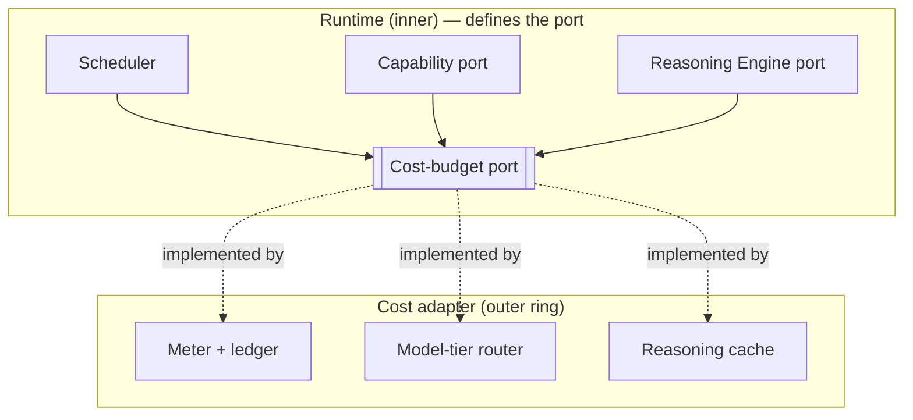

# Cost & Resource Governance

> **Ring:** Cross-cutting abstraction ([P12](../foundation/principles.md)). Cost governance is consumed by the [Engineering Runtime](../core/engineering-runtime.md) as the **[Cost-budget port](../core/contracts.md#cross-cutting-contracts)** — token, time, and money accounting and limits that the core *defines* and depends on, with concrete metering living in the outer ring. It exists because an AI engineering tool can spend unbounded amounts of money and time on [reasoning](../core/reasoning-engine-interface.md) and [simulation](../integration/simulation-interface.md) if left ungoverned; budgets, model routing, and caching of reasoning are what make autonomous and semi-autonomous operation economically safe. It is the enforcement counterpart to [performance](performance.md): performance optimizes *speed*, this port optimizes and *bounds spend*.

---

## 1. Purpose & responsibilities

### What it owns (as an abstraction)
- **Accounting.** Metering every cost-bearing action — reasoning tokens, external solver time, parts-data queries, compute — attributed to a [Session](../collaboration/multi-user-and-sessions.md)/[Project](../GLOSSARY.md#project)/[Phase](../GLOSSARY.md#phase)/[Agent](../agents/README.md).
- **Budgets & limits.** Enforcing token/time/money budgets at the granularity they're set (per operation, per phase, per session, per project), and denying or escalating when a budget would be exceeded.
- **Model routing policy.** Deciding which model *tier* a given reasoning request should use — routing cheap/easy judgements to smaller/faster models and reserving expensive tiers for hard ones (the policy; the call still goes through the [Reasoning Engine port](../core/reasoning-engine-interface.md)).
- **Caching of reasoning.** Governing reuse of recorded reasoning results so an equivalent judgement is not paid for twice.

### What it does NOT own
- **The reasoning call itself** — that is the [Reasoning Engine port](../core/reasoning-engine-interface.md); this port *meters and routes* it.
- **Speed optimization** — owned by [performance](performance.md) (shared caching/routing levers, different objective).
- **Measurement sinks** — spend metrics are emitted via the [Observability port](logging-and-observability.md).
- **When work runs** — the [Scheduler](../core/scheduler.md) sequences work; this port supplies the budget constraints the scheduler respects.
- **Autonomy policy** — whether the AI may act is the [Autonomy Level](../engineering/human-in-the-loop.md); cost governance bounds *how much* it may spend doing so.
- **Concrete pricing/provider** — deferred ([P12](../foundation/principles.md)).

---

## 2. Position in the architecture

*Figure: cost-bearing paths consult the Cost-budget port for accounting, routing, and reasoning-cache decisions; an outer adapter implements it. From the runtime's viewpoint ([P12](../foundation/principles.md)).*

- **Depends on:** the [Observability port](logging-and-observability.md) (to record spend). The port is core-defined; the adapter depends inward.
- **Depended on by:** the [Scheduler](../core/scheduler.md), the [Capability Registry](../core/capability-registry.md) (cost-bearing capabilities), the [Reasoning Engine port](../core/reasoning-engine-interface.md) (routing + cache), [simulation](../integration/simulation-interface.md), and [parts-data](../integration/supply-chain-and-parts-data.md) adapters.

---

## 3. The three levers

| Lever | What it does | Effect |
|-------|--------------|--------|
| **Budgets** | Hard/soft limits per scope; deny or escalate on breach. | Bounds worst-case spend; makes autonomy economically safe. |
| **Model routing** | Match request difficulty to model tier. | Cuts average cost/latency without sacrificing hard-case quality. |
| **Reasoning caching** | Reuse recorded results for equivalent structured inputs. | Avoids paying twice; aligns with [determinism](../core/determinism-and-reproducibility.md) (recorded outputs are reused on replay). |

These compose: a request is first checked for a cache hit, then routed to a tier, then metered against the budget — and every step is recorded for [provenance](../core/provenance-and-traceability.md) and [observability](logging-and-observability.md).

## 4. Relationship to the scheduler

The [Scheduler](../core/scheduler.md) decides *when* runnable work executes under concurrency and priority; cost governance supplies the *budget envelope* it must schedule within. A phase that would exceed its budget is not silently truncated — the scheduler defers it, the cost port escalates to a human per [P10](../foundation/principles.md), or the work is rejected with a clear reason ([P13](../foundation/principles.md): no silent caps). This division keeps mechanism (scheduling) separate from policy (budgets), per [P7](../foundation/principles.md).

## 5. Why govern cost as a first-class port

Required by [P13](../foundation/principles.md). Reasoning and simulation are metered, externally-priced resources; without a single enforcement boundary, cost would leak across dozens of call sites and autonomous operation would be financially unsafe. Centralizing accounting, routing, and reasoning-cache decisions in one port makes spend visible, boundable, and attributable — and makes the determinism story cheaper, since recorded reasoning is reused rather than re-billed.

## Contracts

- **This document specifies:** the [Cost-budget port](../core/contracts.md#cross-cutting-contracts) — *token/time/cost accounting and limits, model routing, reasoning-cache governance*.
- **Consumes:** the [Observability port](logging-and-observability.md) (spend metrics).
- **Consumed by:** the [Scheduler](../core/scheduler.md), [Reasoning Engine port](../core/reasoning-engine-interface.md), [Capability Registry](../core/capability-registry.md), [simulation](../integration/simulation-interface.md), and [parts-data](../integration/supply-chain-and-parts-data.md) adapters; gated alongside the [Autonomy Level](../engineering/human-in-the-loop.md).

## Failure modes

| Failure | Effect | Mitigation / degradation |
|---------|--------|--------------------------|
| **Budget exhausted mid-operation** | Work cannot continue. | Pause and escalate to a human ([P10](../foundation/principles.md)); never silently truncate or downgrade quality without recording it ([P13](../foundation/principles.md)). |
| **Metering unavailable** | Spend unaccounted. | Fail safe: cost-bearing actions are blocked or require explicit override rather than running unmetered. |
| **Routing misjudges difficulty** | Cheap tier returns poor judgement. | Validation gate ([reasoning interface](../core/reasoning-engine-interface.md)) rejects bad output; the request escalates to a higher tier — bounded by budget. |
| **Stale reasoning-cache hit** | Reused result no longer valid. | Cache keyed by structured input + relevant state version; invalidated by [Events](../core/event-bus.md), like all caches. |
| **Runaway autonomous loop** | Repeated expensive calls. | Per-scope budgets cap the loop; the scheduler enforces concurrency limits; activity is observable. |

## Open decisions

- [ADR-0009](../decisions/0009-determinism-and-replay-strategy.md) — reasoning caching/recording underpins both determinism and cost.
- [ADR-0010](../decisions/0010-human-in-the-loop-autonomy-levels.md) — budget breach escalates to human disposition.
- [ADR-0003](../decisions/0003-shared-state-consistency-model.md) — scheduler/budget interplay under concurrency.

## Related documents

[`core/contracts.md`](../core/contracts.md) · [`core/scheduler.md`](../core/scheduler.md) · [`core/reasoning-engine-interface.md`](../core/reasoning-engine-interface.md) · [`crosscutting/performance.md`](performance.md) · [`crosscutting/logging-and-observability.md`](logging-and-observability.md) · [`engineering/human-in-the-loop.md`](../engineering/human-in-the-loop.md) · [`core/determinism-and-reproducibility.md`](../core/determinism-and-reproducibility.md) · [`foundation/quality-attributes.md`](../foundation/quality-attributes.md) · [`foundation/principles.md`](../foundation/principles.md)
