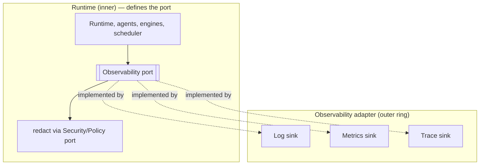

# Logging & Observability

> **Ring:** Cross-cutting abstraction ([P12](../foundation/principles.md)). Observability is consumed by the [Engineering Runtime](../core/engineering-runtime.md) as the **[Observability port](../core/contracts.md#cross-cutting-contracts)** — structured logging, metrics, and tracing, merged into one concern that the core *defines* and depends on, with concrete sinks living in the outer ring. It exists because an AI-native engineering runtime is only trustworthy if you can *see* what it did: which [Phase](../GLOSSARY.md#phase) ran, which [Agent](../agents/README.md) acted, what the [reasoning](../core/reasoning-engine-interface.md) call decided, how long it took, and what it cost. Observability is the operational lens on the system; it is deliberately distinct from — but complementary to — the in-domain audit trail of [Events](../core/event-bus.md) and [provenance](../core/provenance-and-traceability.md), which is the *engineering* record.

---

## 1. Purpose & responsibilities

### What it owns (as an abstraction)
- **Structured logging.** A typed, queryable stream of operational records (not free-text), correlated by [Session](../collaboration/multi-user-and-sessions.md), [Project](../GLOSSARY.md#project), Phase, and request id.
- **Metrics.** Counters, gauges, and distributions for latency, throughput, error rates, resource use, and the AI-specific signals (reasoning-call counts, token spend, cache hit-rates) — the raw material for [performance](performance.md) and [cost governance](cost-and-resource-governance.md).
- **Tracing.** Causal spans across an operation — command → phase → agent → reasoning call → capability → store — so a slow or failed flow can be followed end to end.
- **Agent / reasoning observability.** First-class visibility into *reasoning behavior*: which prompt template, which model tier, confidence, retries, and outcome — without capturing the secret/IP content itself (redacted via the [Security/Policy port](security.md)).

### What it does NOT own
- **The engineering audit trail.** [Events](../core/event-bus.md), [Decisions](../foundation/engineering-domain-model.md#decision), and [provenance](../core/provenance-and-traceability.md) are the *domain* record of truth, owned by the runtime and the [Event Store](../data/stores/event-store.md). Observability is *operational* telemetry; it never substitutes for, nor mutates, the Event record.
- **Concrete sinks.** Log/metric/trace backends are deferred outer-ring implementations ([P12](../foundation/principles.md)).
- **Cost limits.** Observability *measures* cost; *enforcing* budgets is the [Cost-budget port](cost-and-resource-governance.md).
- **Redaction policy.** It *applies* redaction at emit time but the policy is owned by [security](security.md).
- **Alerting/runbooks** — operational process, out of scope for this architectural abstraction.

---

## 2. Position in the architecture

*Figure: the core emits structured logs/metrics/traces through one port (redacting first); outer sinks implement it. From the runtime's viewpoint ([P12](../foundation/principles.md)).*

- **Depends on:** the [Security/Policy port](security.md) (redaction before emit). The port itself is core-defined; the adapter depends inward.
- **Depended on by:** essentially every component — the runtime, agents, engines, scheduler, and outer adapters all emit through it.

---

## 3. The two records: operational vs. engineering

A deliberate, load-bearing distinction:

| | Observability (this doc) | Provenance / Events |
|--|--------------------------|---------------------|
| **Purpose** | *How is the system running?* | *Why is the design the way it is?* |
| **Audience** | Operators, developers | Engineers, auditors |
| **Content** | Latency, errors, spans, token counts | Decisions, evidence, state changes |
| **Lifecycle** | Sampled, retained operationally, may be lossy | Immutable, complete, the record of truth |
| **Owned by** | [Observability port](../core/contracts.md#cross-cutting-contracts) | [Event Store](../data/stores/event-store.md) / [provenance](../core/provenance-and-traceability.md) |

They cross-reference (a trace span can carry the Event/Decision id) but never merge: telemetry may be sampled or dropped; the engineering record never can ([P5](../foundation/principles.md)).

## 4. Observing the AI (why this matters here)

A conventional app logs requests; an AI engineering runtime must also make *reasoning* legible. Through this port the system surfaces, per reasoning call: the prompt template/version, the model tier used (via [routing](cost-and-resource-governance.md)), latency, token spend, confidence, schema-validation outcome, retries, and final disposition. This makes hard questions answerable — *why was this slow? why did this proposal get rejected? where is the token budget going?* — and feeds [agent evaluation](../quality/agent-evaluation.md) and [performance](performance.md). Crucially, the *content* of reasoning (which may contain IP) is redacted; observability records the *shape and outcome*, not the secret payload ([security](security.md), [P13](../foundation/principles.md)).

## Contracts

- **This document specifies:** the [Observability port](../core/contracts.md#cross-cutting-contracts) — *emit structured logs, metrics, and traces*.
- **Consumes:** the [Security/Policy port](security.md) (redaction at emit).
- **Feeds:** [performance](performance.md) (latency/throughput signals), [cost-and-resource-governance](cost-and-resource-governance.md) (spend metrics), [agent evaluation](../quality/agent-evaluation.md) (reasoning telemetry), and [testing & validation](../quality/testing-and-validation-strategy.md) (observable assertions).

## Failure modes

| Failure | Effect | Mitigation / degradation |
|---------|--------|--------------------------|
| **Sink unavailable** | Telemetry can't be delivered. | Emitting is best-effort and non-blocking; the runtime *never* stalls or fails engineering work because a log sink is down ([P12](../foundation/principles.md)). |
| **Telemetry volume overload** | Cost/noise. | Sampling and level controls (config-driven via [configuration](configuration.md)); the engineering record is unaffected since it is separate. |
| **Redaction miss** | Sensitive data nearly emitted. | Redaction is mandatory pre-emit; on uncertainty, drop the field ([security](security.md), [P13](../foundation/principles.md)). |
| **Clock skew across spans** | Confusing traces. | Spans carry the runtime's logical ordering/[Event](../core/event-bus.md) ids, not just wall-clock. |
| **Telemetry mistaken for the record** | Audit gap if logs are trusted as truth. | Architecturally prevented: provenance is the record; observability is explicitly lossy and secondary. |

## Open decisions

- [ADR-0001](../decisions/0001-adopt-clean-architecture-dependency-rule.md) — observability is an inner-defined port, outer-implemented.
- [ADR-0004](../decisions/0004-event-sourcing-decision.md) — boundary between the Event record and operational telemetry.
- [ADR-0009](../decisions/0009-determinism-and-replay-strategy.md) — what reasoning telemetry must be captured to support replay/eval.

## Related documents

[`core/contracts.md`](../core/contracts.md) · [`crosscutting/security.md`](security.md) · [`crosscutting/performance.md`](performance.md) · [`crosscutting/cost-and-resource-governance.md`](cost-and-resource-governance.md) · [`crosscutting/configuration.md`](configuration.md) · [`core/provenance-and-traceability.md`](../core/provenance-and-traceability.md) · [`core/event-bus.md`](../core/event-bus.md) · [`quality/agent-evaluation.md`](../quality/agent-evaluation.md) · [`foundation/quality-attributes.md`](../foundation/quality-attributes.md) · [`foundation/principles.md`](../foundation/principles.md)
