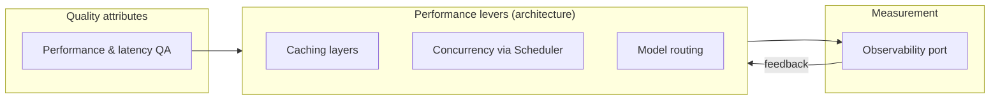

# Performance

> **Ring:** Cross-cutting architecture concern ([P12](../foundation/principles.md)). This document defines the **performance architecture** of Electronics Agent Kit: where time goes, what the latency and throughput targets are, what the caching strategy is, and how the design honors the performance and latency [quality attributes](../foundation/quality-attributes.md). Unlike the other cross-cutting docs, performance is not a single port — it is a *property* the whole system must exhibit, achieved by deliberate placement of caches, budgets, and concurrency, and *measured* through the [Observability port](logging-and-observability.md). It exists because an AI-native engineering tool spends most of its wall-clock time in three expensive places — reasoning calls, external simulation, and routing/placement computation — and naïve design would make the tool feel slow and cost too much.

---

## 1. Purpose & responsibilities

### What it owns
- **Performance targets.** The latency and throughput expectations per interaction class (interactive UI response, a reasoning turn, a verification pass, a full phase), expressed as goals the architecture must support.
- **A time budget.** A shared understanding of *where time goes* and how the architecture keeps the dominant costs off the interactive path.
- **Caching strategy.** What is cached, at which layer, with what invalidation discipline — without choosing a cache technology.
- **The quality-attribute link.** Operationalizing the [performance & latency](../foundation/quality-attributes.md) quality attribute into concrete architectural commitments.

### What it does NOT own
- **Cost/budget enforcement.** Token/money/time *limits* are the [Cost-budget port](cost-and-resource-governance.md); performance optimizes speed, cost governance optimizes spend (they share caching and routing levers).
- **Measurement plumbing.** Metrics/traces are emitted via the [Observability port](logging-and-observability.md); performance *consumes* them, it does not implement sinks.
- **Scheduling mechanism.** *When* work runs under concurrency is the [Scheduler](../core/scheduler.md); performance sets the targets the scheduler serves.
- **Determinism guarantees.** Caching must never alter results; correctness/[determinism](../core/determinism-and-reproducibility.md) always wins over speed.
- **Technology selection** — deferred ([P12](../foundation/principles.md)).

---

## 2. Position in the architecture

*Figure: performance is a property realized by caching/concurrency/routing levers, driven by the quality attribute and measured through observability. From the architecture viewpoint.*

- **Depends on:** the [Observability port](logging-and-observability.md) (to measure), the [Scheduler](../core/scheduler.md) (to parallelize), the [Cost-budget port](cost-and-resource-governance.md) (shared levers), and the [Configuration port](configuration.md) (tunable targets/cache sizes).
- **Depended on by:** the user experience and every long-running flow ([reasoning](../core/reasoning-engine-interface.md), [simulation](../integration/simulation-interface.md), routing).

---

## 3. Where the time goes

The three dominant costs, and the architectural response to each:

| Cost center | Why it's slow | Architectural response |
|-------------|---------------|------------------------|
| **Reasoning calls** | Network + model latency; often the largest single contributor. | Keep off the interactive path; [cache reasoning](cost-and-resource-governance.md) by structured input; [route](cost-and-resource-governance.md) easy judgements to cheaper/faster tiers; stream partial results. |
| **External simulation** | SPICE/SI/PI/thermal/EMC solves are heavy. | Run asynchronously via the [Scheduler](../core/scheduler.md); cache typed [Analysis Results](../foundation/engineering-domain-model.md#analysis-result) keyed by input snapshot; reuse on [replay](../core/determinism-and-reproducibility.md). |
| **Routing / placement compute** | Combinatorial, iterative. | Incremental recompute over changed regions only; parallelize independent regions; cache intermediate results keyed by [Entity ID](../foundation/engineering-domain-model.md). |

The cross-cutting principle: the **interactive path stays responsive** by pushing heavy work into asynchronous, observable, cancellable jobs whose progress is streamed to the UI via the [Presentation/Query port](../integration/ipc.md).

## 4. Caching strategy

Caching is the primary lever; the discipline is *cache aggressively, invalidate correctly, never change results*:

- **Cache by stable input.** Cache entries key on [Entity IDs](../foundation/engineering-domain-model.md) and typed input snapshots, not on names or positions, so the [stable-identity](../foundation/engineering-domain-model.md) model makes invalidation precise.
- **Layered caches.** Reasoning-result cache, analysis-result cache, projection/view-model cache for the UI, and parts-data cache (with freshness TTLs per [supply-chain](../integration/supply-chain-and-parts-data.md)).
- **Event-driven invalidation.** When an [Event](../core/event-bus.md) changes underlying state, dependent cache entries are invalidated by their input keys — the same Event record that drives provenance drives correctness of the cache.
- **Determinism-safe.** A cache hit must be *indistinguishable* from a recompute. Caching never introduces a result a recompute wouldn't produce ([P4](../foundation/principles.md)); on any doubt, recompute.

## 5. Why design for performance up front

Required by [P13](../foundation/principles.md). Performance is an *architectural* property — caches, asynchrony, and incremental recompute have to be placed at the right boundaries, which is hard to retrofit. Stating targets and the time-budget now lets every later component know what "fast enough" means and where the heavy costs are, so the interactive feel and the per-operation cost stay acceptable as the system grows.

## Contracts

- **Consumes:** the [Observability port](logging-and-observability.md) (latency/throughput signals), the [Scheduler](../core/scheduler.md) (concurrency), the [Cost-budget port](cost-and-resource-governance.md) (shared caching/routing levers), and the [Configuration port](configuration.md) (targets, cache sizing).
- **Realizes:** the [performance & latency quality attribute](../foundation/quality-attributes.md).
- **No port of its own** — performance is a property, not a boundary.

## Failure modes

| Failure | Effect | Mitigation / degradation |
|---------|--------|--------------------------|
| **Cache stampede** | Many identical expensive computes at once. | Single-flight de-duplication keyed by input; concurrent callers await one result. |
| **Stale cache returns wrong result** | Correctness violation. | Event-driven invalidation by input key; determinism-safety rule (recompute on doubt) — correctness over speed. |
| **Latency-target miss** | Sluggish UX. | Observability surfaces the regression against targets; heavy work moved off the interactive path; routing to faster tiers. |
| **Resource saturation** | Throughput collapse. | Scheduler backpressure and concurrency limits; budgets cap runaway work ([cost governance](cost-and-resource-governance.md)). |
| **Optimization breaks determinism** | Non-reproducible results. | Forbidden: any optimization that changes results is rejected ([P4](../foundation/principles.md)). |

## Open decisions

- [ADR-0003](../decisions/0003-shared-state-consistency-model.md) — concurrency model underpinning parallel speedups.
- [ADR-0009](../decisions/0009-determinism-and-replay-strategy.md) — caching must preserve deterministic replay.

## Related documents

[`foundation/quality-attributes.md`](../foundation/quality-attributes.md) · [`crosscutting/cost-and-resource-governance.md`](cost-and-resource-governance.md) · [`crosscutting/logging-and-observability.md`](logging-and-observability.md) · [`core/scheduler.md`](../core/scheduler.md) · [`core/determinism-and-reproducibility.md`](../core/determinism-and-reproducibility.md) · [`integration/simulation-interface.md`](../integration/simulation-interface.md) · [`integration/ipc.md`](../integration/ipc.md) · [`foundation/principles.md`](../foundation/principles.md)
