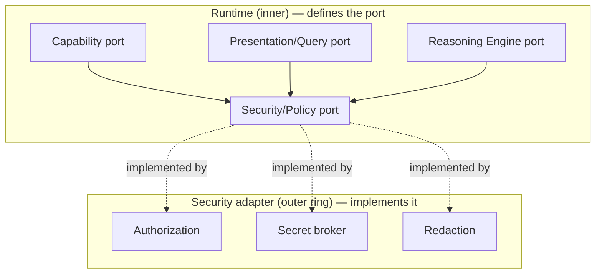

# Security

> **Ring:** Cross-cutting abstraction ([P12](../foundation/principles.md)). Security is consumed by the [Engineering Runtime](../core/engineering-runtime.md) as the **[Security/Policy port](../core/contracts.md#cross-cutting-contracts)** — an abstraction the core *defines* and depends on, whose concrete implementation lives in the outer ring. This document covers the **information-security** posture of an AI engineering tool: authorization, secret handling, redaction, and the threat model. It exists because a system where an AI can act on a design — invoking [Capabilities](../core/capability-registry.md), reaching external services, and reading proprietary IP — must make every action authorizable, every secret protected, and every sensitive datum redactable, *by construction*. This is infosec; it is explicitly **distinct** from [engineering standards compliance](../engineering/standards-and-compliance.md), which is about the design meeting electrical/regulatory rules.

---

## 1. Purpose & responsibilities

### What it owns (as an abstraction)
- **Authorization.** Deciding whether a given actor (human user, [Session](../collaboration/multi-user-and-sessions.md), agent, or plugin) may perform a given action — every [Capability](../core/capability-registry.md) invocation and every [command](../integration/ipc.md) is authorized through this port.
- **Secret access.** Mediating access to credentials needed by outer-ring adapters ([simulation](../integration/simulation-interface.md), [parts data](../integration/supply-chain-and-parts-data.md), model clients) so secrets never live in [Engineering State](../core/shared-state-model.md), prompts, logs, or the UI.
- **Redaction.** Stripping or masking sensitive content (secrets, PII, proprietary IP) before it leaves a trust boundary — into a [reasoning](../core/reasoning-engine-interface.md) prompt, an external service, a [log](logging-and-observability.md), or a UI [projection](../integration/ipc.md).
- **Threat-model ownership.** Maintaining the catalog of threats specific to an AI engineering tool and the mitigations the architecture commits to.

### What it does NOT own
- **Engineering correctness or standards compliance.** Whether a board meets IPC/IEC/regulatory rules is the [Standards & Compliance](../engineering/standards-and-compliance.md) and [Verification Engine](../engineering/verification-engine.md) concern — a different meaning of the word "compliance."
- **Concrete security technology.** Identity providers, key stores, and crypto choices are deferred outer-ring implementations ([P1](../foundation/principles.md), [P12](../foundation/principles.md)); this doc fixes the *abstraction* and requirements.
- **Autonomy policy.** *Whether the AI may act without approval* is the [Human-in-the-Loop](../engineering/human-in-the-loop.md) [Autonomy Level](../engineering/human-in-the-loop.md); security *enforces* the permission, autonomy *decides* the gate.
- **Legal liability and ethics.** Owned by [safety, liability & ethics](../governance/safety-liability-and-ethics.md).
- **Data licensing / IP rights** of third-party data — owned by [data licensing & IP](../governance/data-licensing-and-ip.md); security protects that data in transit/at rest, it does not adjudicate the rights.

---

## 2. Position in the architecture

*Figure: the core defines the Security/Policy port and routes authorization, secret access, and redaction through it; an outer adapter implements it. From the runtime's viewpoint ([P12](../foundation/principles.md)).*

- **Depends on:** nothing outer — the port is defined by the core. The adapter depends inward.
- **Depended on by:** the [Capability Registry](../core/capability-registry.md), [IPC](../integration/ipc.md), the [Reasoning Engine port](../core/reasoning-engine-interface.md), the [plugin system](../integration/plugin-system.md), and every outer adapter that holds a secret.

---

## 3. Authorization model

Authorization is checked at the *single action path* — the [Capability port](../core/capability-registry.md) — so there is one place to reason about who-can-do-what:

- **Least privilege.** An actor sees and can invoke only the Capabilities it is granted; an unpermitted Capability is not even discoverable ([Capability Registry](../core/capability-registry.md)). This bounds blast radius for agents and plugins alike.
- **Actor identity.** Every command/invocation carries an actor and [Session](../collaboration/multi-user-and-sessions.md); authorization is a pure function of actor, action, target, and context, with the decision recorded as an [Event](../core/event-bus.md) ([P5](../foundation/principles.md)).
- **Tenant isolation.** On a [shared backend host](../integration/backend.md), one tenant's [Project](../GLOSSARY.md#project) is inaccessible to another; isolation is enforced here, not assumed by the host.
- **Autonomy interplay.** A permitted-but-high-impact action may still require human disposition per the [Autonomy Level](../engineering/human-in-the-loop.md) ([P10](../foundation/principles.md)); security enforces the permission, the human-in-the-loop policy adds the gate.

## 4. Secrets and redaction

- **Secrets never enter the domain.** Credentials for external [solvers](../integration/simulation-interface.md), [parts sources](../integration/supply-chain-and-parts-data.md), and model clients are brokered through the port to the adapter that needs them; they never appear in [Engineering State](../core/shared-state-model.md), [Events](../core/event-bus.md), prompts, or projections ([P2](../foundation/principles.md)).
- **Redaction at boundaries.** The most distinctive AI-tool risk is *exfiltration through reasoning*: proprietary design IP could leak into a model prompt or an external call. Redaction is applied wherever content crosses a trust boundary — before it reaches the [Reasoning Engine port](../core/reasoning-engine-interface.md), before it is logged ([Observability](logging-and-observability.md) coordinates a redaction log), and before it reaches a UI projection the actor is not entitled to see.
- **No secret in logs.** The [Observability port](logging-and-observability.md) and this port jointly guarantee secrets/PII are scrubbed from structured logs and traces ([P13](../foundation/principles.md): no silent leakage).

## 5. Threat model (AI-engineering-tool specific)

| Threat | Vector | Mitigation |
|--------|--------|------------|
| **IP exfiltration via reasoning** | Proprietary design sent to a model/external service. | Redaction before the [Reasoning Engine port](../core/reasoning-engine-interface.md); least-data prompts; per-tenant policy. |
| **Prompt injection / tool misuse** | Malicious content steers an agent to misact. | Agents act only via permissioned [Capabilities](../core/capability-registry.md); no Capability = no effect; high-impact actions gated by [autonomy](../engineering/human-in-the-loop.md). |
| **Malicious / over-reaching plugin** | Third-party code seeks undeclared access. | Least-privilege grant + per-invocation authz ([plugin system](../integration/plugin-system.md)). |
| **Secret leakage** | Credentials in state/logs/prompts. | Secret broker; redaction; secrets never in the domain. |
| **Cross-tenant access** | One user reads another's design. | Tenant isolation enforced at the port. |
| **Tampering with the record** | Altering Events/provenance. | The [Event Store](../data/stores/event-store.md) is append-only; authorization plus immutability protect the audit trail ([P5](../foundation/principles.md)). |

## Contracts

- **This document specifies:** the [Security/Policy port](../core/contracts.md#cross-cutting-contracts) — *authorization checks, secret access, redaction*.
- **Consumed by:** the [Capability Registry](../core/capability-registry.md) (every invocation), [IPC](../integration/ipc.md) (every command), the [Reasoning Engine port](../core/reasoning-engine-interface.md) (redaction before reasoning), the [plugin system](../integration/plugin-system.md), and all secret-holding adapters.
- **Coordinates with:** the [Observability port](logging-and-observability.md) (redaction log) and the [Human-in-the-Loop](../engineering/human-in-the-loop.md) autonomy gating.

## Failure modes

| Failure | Effect | Mitigation / degradation |
|---------|--------|--------------------------|
| **Authorization service unavailable** | Cannot decide permissions. | Fail *closed* — deny by default; the runtime degrades to read-only rather than permit unchecked actions. |
| **Secret broker unavailable** | Adapters can't reach external services. | Affected Capabilities fail as recoverable errors; core engineering work continues offline ([P12](../foundation/principles.md) isolates the dependency). |
| **Redaction gap** | Sensitive datum nearly leaks. | Boundary checks are mandatory and conservative; on uncertainty, redact rather than pass ([P13](../foundation/principles.md)). |
| **Over-broad grant** | Actor has more access than needed. | Least-privilege defaults; grants are auditable Events and reviewable. |
| **Compromised plugin** | Attempts privilege escalation. | Bounded by its grant; blocked at the port; activity recorded. |

## Open decisions

- [ADR-0001](../decisions/0001-adopt-clean-architecture-dependency-rule.md) — security is an inner-defined port, outer-implemented.
- [ADR-0002](../decisions/0002-runtime-owns-knowledge-llm-as-reasoning-engine.md) — secrets/IP never enter the knowledge or prompts.
- [ADR-0010](../decisions/0010-human-in-the-loop-autonomy-levels.md) — authorization interplay with autonomy gating.

## Related documents

[`core/contracts.md`](../core/contracts.md) · [`core/capability-registry.md`](../core/capability-registry.md) · [`integration/ipc.md`](../integration/ipc.md) · [`integration/plugin-system.md`](../integration/plugin-system.md) · [`core/reasoning-engine-interface.md`](../core/reasoning-engine-interface.md) · [`crosscutting/logging-and-observability.md`](logging-and-observability.md) · [`engineering/human-in-the-loop.md`](../engineering/human-in-the-loop.md) · [`engineering/standards-and-compliance.md`](../engineering/standards-and-compliance.md) · [`governance/safety-liability-and-ethics.md`](../governance/safety-liability-and-ethics.md) · [`governance/data-licensing-and-ip.md`](../governance/data-licensing-and-ip.md) · [`foundation/principles.md`](../foundation/principles.md)
