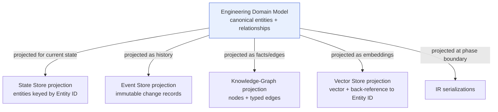

# Data Modeling — The Persistence-Projection Discipline

> **Ring:** Interface adapters (outer). This document defines the **conceptual data-modeling discipline** for Electronics Agent Kit: how the canonical [Engineering Domain Model](../foundation/engineering-domain-model.md) is projected into persistent form across the [stores](storage.md), how identity and relationships are preserved, and how indexing/query needs are reasoned about — **all conceptually**. It deliberately replaces a technology-presupposing "database.md": it prescribes *how to model data for persistence*, never *which database models it* ([P1](../foundation/principles.md), Phase-0 rule).

---

## 1. Why this document exists

The architecture review's sharpest structural risk was **three drifting sources of truth**: the [IRs](../compiler/compiler-ir.md), the (then-missing) [domain model](../foundation/engineering-domain-model.md), and store schemas. [P6](../foundation/principles.md) resolves this by decree — *one canonical model, many projections* — but a decree needs a *discipline* to be enforceable. This document is that discipline: the rules every store's [conceptual data model](storage.md) obeys so that what is persisted is always a faithful **projection** of the canonical model, never a rival definition of it.

> **Projection, defined.** A persistence projection is a representation of canonical entities shaped for one store's access pattern and lifecycle, carrying only the fields and relationships that store is responsible for, and *always reducible back* to the canonical [Engineering Domain Model](../foundation/engineering-domain-model.md) entities by stable [Entity ID](../foundation/engineering-domain-model.md). A projection adds *shape*, never *meaning*.

---

## 2. The four modeling rules

### Rule 1 — Model the canonical entity, project the storage shape

Every persisted record corresponds to a canonical entity (or relationship) from the [domain model](../foundation/engineering-domain-model.md). A store may *omit* fields it is not responsible for and *reshape* them for its access pattern, but it may never *redefine* what a `Component`, `Net`, or `Decision` *means*. Where a store needs a derived or denormalized field for performance, it is marked as **derived** and is recomputable from canonical data — it is never authoritative ([shared-state-model partitions](../core/shared-state-model.md)).

### Rule 2 — Identity is by opaque, immutable Entity ID

All references between persisted records are by the **opaque, immutable [Entity ID](../core/shared-state-model.md)** assigned at entity creation — never by name, reference designator, net label, or position, all of which are mutable *attributes* ([domain-model modelling principle 1](../foundation/engineering-domain-model.md)). This is what lets:

- **provenance** ([P5](../foundation/principles.md)) trace a track → net → connection → decision → requirement across stores;
- **version control** ([design-version-control.md](design-version-control.md)) diff/merge at entity granularity ([ADR-0008](../decisions/0008-design-version-control-model.md));
- **determinism** ([P4](../foundation/principles.md)) reproduce references exactly on replay.

A store's primary addressing key is therefore *(Entity ID within Project, version coordinate)* — the same addressing scheme the [Shared State Model](../core/shared-state-model.md) fixes. The concrete *shape* of the Entity ID is deferred to [ADR-0008](../decisions/0008-design-version-control-model.md); this document fixes only that all stores key on it.

### Rule 3 — Relationships are first-class

A [Connection](../foundation/engineering-domain-model.md#connection), a [Provenance Link](../foundation/engineering-domain-model.md#provenance-link) ("X derived from Y"), and a [Decision](../foundation/engineering-domain-model.md#decision)'s subject edge are themselves *identified entities*, not implicit foreign-key pointers buried in a row. Modeling relationships as first-class lets the runtime attach [Events](../core/event-bus.md), decisions, and provenance *to the relationship itself*, and lets the [Knowledge-Graph Store](stores/knowledge-graph-store.md) traverse them. Different stores realize this differently in their conceptual model — the State Store as addressable relationship entities, the Knowledge-Graph Store as graph edges — but the *meaning* is one.

### Rule 4 — Typed physical values stay typed

Any physical value is a [Physical Quantity](../engineering/units-and-quantities.md) (magnitude + unit + tolerance), never a bare number, in *every* projection ([P9](../foundation/principles.md), [ADR-0007](../decisions/0007-units-and-physical-quantity-type-system.md)). A store that flattened `3.3 V ±5 %` to `3.3` would silently destroy meaning and reintroduce the dimensional-error class the type system exists to prevent.

---

## 3. Identity, relationships, and the projection map

*Figure: one canonical model, many persistence projections — each shaped for a store's access pattern, all reducible to the same entities by Entity ID. Viewpoint: the modeling discipline. ([P6](../foundation/principles.md))*

Note that even the [Vector Store](stores/vector-store.md), whose payload is an opaque embedding, carries a **back-reference to the canonical Entity ID** — so a similarity hit always resolves to a real entity, and the index is rebuildable from canonical sources.

---

## 4. Indexing & query — a conceptual concern

Indexing is treated *conceptually* here: we describe **what questions each store must answer efficiently**, which constrains its model, without choosing an index technology.

| Store | Must answer efficiently | Modeling consequence (conceptual) |
|-------|-------------------------|-----------------------------------|
| [State Store](stores/state-store.md) | "get this entity by ID"; "all entities of type T"; "all entities related to E" | Address by Entity ID; navigable relationships; query by type and relationship. |
| [Event Store](stores/event-store.md) | "events in order from sequence N"; "events touching entity E" | Total order; per-entity event lookup for provenance. |
| [Knowledge-Graph Store](stores/knowledge-graph-store.md) | multi-hop pattern match ("active RoHS parts with footprint X") | Typed nodes/edges; traversal-oriented. |
| [Vector Store](stores/vector-store.md) | "k most similar to this item" | Similarity-searchable vectors + Entity-ID back-reference. |
| [Project Store](stores/project-store.md) | "list/find projects"; "resolve a project's roots" | Catalog lookup by project identity. |
| [Artifact Store](stores/artifact-store.md) | "fetch the artifact for this output descriptor" | Content/descriptor addressing of large blobs. |

> **No silent caps.** Wherever a query could be unbounded (a broad graph traversal, a large similarity sweep), the bound is explicit and governed by the [Cost-budget port](../core/contracts.md) — never a hidden truncation ([P13](../foundation/principles.md)).

---

## 5. What this discipline does **not** cover

- **Schema technology / DDL / index types** — deferred to per-store technology ADRs ([P1](../foundation/principles.md)).
- **Schema *evolution* over time** — that is [`data-versioning-and-migration.md`](data-versioning-and-migration.md).
- **Branch/merge of modeled data** — that is [`design-version-control.md`](design-version-control.md).
- **Entity definitions themselves** — canonical in the [domain model](../foundation/engineering-domain-model.md); this document only governs how they are *projected*.

---

## 6. Open decisions

- [ADR-0005](../decisions/0005-ir-as-canonical-phase-boundary-representation.md) — projections (IRs and store schemas) derive from the canonical model, never compete with it.
- [ADR-0007](../decisions/0007-units-and-physical-quantity-type-system.md) — typed physical quantities survive every projection.
- [ADR-0008](../decisions/0008-design-version-control-model.md) — the concrete Entity-ID and version-coordinate shape all stores key on.

---

## 7. Related documents

[`data/storage.md`](storage.md) · [`data/data-versioning-and-migration.md`](data-versioning-and-migration.md) · [`data/design-version-control.md`](design-version-control.md) · [`foundation/engineering-domain-model.md`](../foundation/engineering-domain-model.md) · [`core/shared-state-model.md`](../core/shared-state-model.md) · [`compiler/compiler-ir.md`](../compiler/compiler-ir.md) · [`engineering/units-and-quantities.md`](../engineering/units-and-quantities.md) · [`foundation/principles.md`](../foundation/principles.md)
