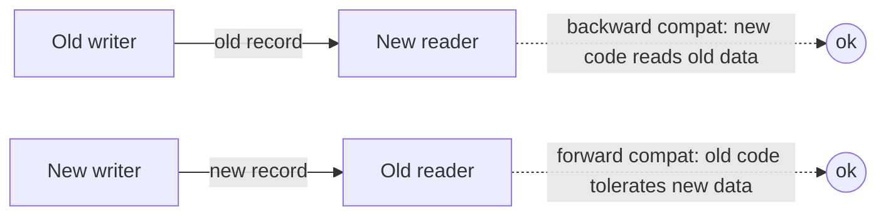
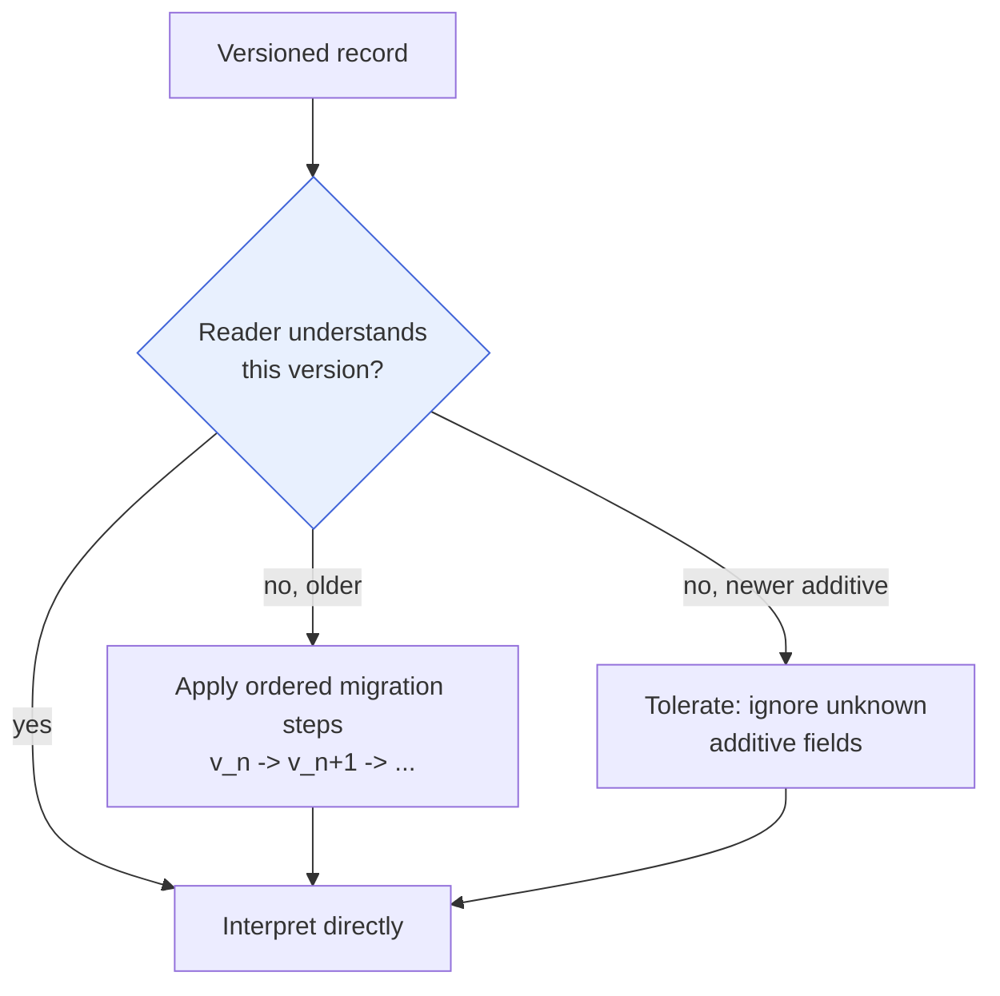

# Data Versioning & Migration

> **Ring:** Interface adapters (outer), with rules that bind inner-ring [contracts](../core/contracts.md). This document defines how Electronics Agent Kit's persisted knowledge — store schemas, [IRs](../compiler/compiler-ir.md), and the [domain model](../foundation/engineering-domain-model.md) itself — **evolves over a multi-year product life** without breaking the data already on disk or the consumers already in the field. It is the discipline of *change without loss*: versioning, migration, backward/forward compatibility, and contract stability. **No technology is named** — these are conceptual policies ([P1](../foundation/principles.md)), realized later.

---

## 1. Why this document exists

A PCB designed today must still open, replay, and re-manufacture years from now, after the [domain model](../foundation/engineering-domain-model.md) has gained entities, the [IRs](../compiler/compiler-ir.md) have grown fields, and stores have been re-platformed. The product's promises — [determinism](../core/determinism-and-reproducibility.md) ([P4](../foundation/principles.md)) and [traceability](../core/provenance-and-traceability.md) ([P5](../foundation/principles.md)) — are *longitudinal*: they only mean something if a record written long ago is still faithfully interpretable. That is impossible without an explicit evolution discipline. This document supplies it.

The core difficulty is that **three things version at different rates**, and a change in one must not silently corrupt the others:

| What versions | Cadence | Governed here by |
|---------------|---------|------------------|
| The canonical [domain model](../foundation/engineering-domain-model.md) | Slow, deliberate | §3 model evolution |
| The [IRs](../compiler/compiler-ir.md) (phase-boundary projections) | Medium | §3, [ADR-0005](../decisions/0005-ir-as-canonical-phase-boundary-representation.md) |
| Each store's schema (persistence projection) | Fast, per-store, tech-driven | §4 migration |

Because all three are bound by [P6](../foundation/principles.md) (one canonical model, many projections), the **domain model is the pacing item**: a projection may add shape freely, but a change in *meaning* must originate in the canonical model.

---

## 2. Versioning principles

1. **Every persisted record is self-describing about its version.** A record carries enough information to identify which schema/model version produced it, so a reader can interpret it correctly or migrate it. No version-guessing ([P13](../foundation/principles.md)).
2. **Stored knowledge is read across versions; it is not silently rewritten.** Old records remain valid; readers either understand them directly (compatibility) or migrate them explicitly (§4). History — the [Event Store](stores/event-store.md) — is **immutable**, so it is *never* rewritten in place; it is interpreted through versioned readers.
3. **Contracts are the stable surface.** Inner-ring [ports](../core/contracts.md) speak [domain vocabulary](../foundation/engineering-domain-model.md) and change only under this discipline; a breaking contract change is itself an [ADR](../decisions/README.md) ([contract design rule 3](../core/contracts.md)). Stores may re-platform freely *behind* a stable port.
4. **Additive by default, breaking by exception.** Growth (new entities, new optional fields, new relationships) is the common case and must be non-breaking. Removal or semantic change of an existing field is rare, reviewed, and migration-backed.

---

## 3. Compatibility model

Two directions of compatibility are maintained, each protecting a different actor:

*Figure: backward compatibility lets new code read old data; forward compatibility lets old code tolerate new data. Both are required for a long-lived, gradually-upgraded system. Viewpoint: a single schema change.*

- **Backward compatibility (must-have).** New code reads every record old code ever wrote — directly or via migration. This is what lets an old design open in a new build. Without it, [determinism](../core/determinism-and-reproducibility.md) replay of historical [Events](../core/event-bus.md) breaks.
- **Forward compatibility (best-effort, for additive change).** Old code tolerates records written by newer code by ignoring unknown additive fields rather than failing. This lets mixed-version deployments and collaboration ([multi-user](../collaboration/multi-user-and-sessions.md)) survive a rollout.
- **Breaking change (exceptional).** A change that is neither — removing a field, changing a meaning, restructuring a relationship. Permitted only with: an [ADR](../decisions/README.md), a versioned reader, and a migration (§4). Contracts that break get a new contract version, never a silent redefinition.

### IR and domain-model evolution

Because an [IR](../compiler/compiler-ir.md) is a *projection* of the canonical model, an IR change is legal only if it remains a faithful projection ([P6](../foundation/principles.md), [ADR-0005](../decisions/0005-ir-as-canonical-phase-boundary-representation.md)). Adding an IR field that has no canonical-model source is forbidden — it would create the rival source of truth the architecture exists to prevent. Domain-model additions follow the entity [lifecycle](../foundation/engineering-domain-model.md) (created/enriched/superseded/retired): entities are *superseded with a provenance link*, never erased, preserving the trace ([P5](../foundation/principles.md)).

---

## 4. Migration

Migration is the explicit transformation of persisted data from one version to another. It is conceptual policy here; the mechanism is deferred.

*Figure: read-path decision — interpret, migrate, or tolerate. Migrations compose as ordered steps so any old version reaches current. Viewpoint: a reader opening a record.*

- **Migrations are ordered and composable.** A record at version *n* reaches current by applying steps *n → n+1 → … → current*; each step is independently reviewed and reversible-by-design where feasible.
- **Migration preserves identity and provenance.** [Entity IDs](../core/shared-state-model.md) survive migration unchanged; a migration never breaks a [provenance link](../foundation/engineering-domain-model.md#provenance-link) or invents one.
- **The event log is migrated by *reader*, not by *rewrite*.** Because the [Event Store](stores/event-store.md) is immutable ([ADR-0004](../decisions/0004-event-sourcing-decision.md)), historical events are interpreted through version-aware readers (or up-cast on read), keeping the audit trail authentic. This is the one place where in-place migration is explicitly disallowed.
- **Lazy vs. eager is a per-store choice** (migrate-on-read vs. migrate-on-deploy) made later per store; either way the *policy* — no silent data loss, every step recorded — holds.

---

## 5. What this document does **not** own

- **Concrete migration tooling / formats / versioning scheme syntax** — deferred ([P1](../foundation/principles.md)).
- **Branch/merge versioning of *design content*** — that is [`design-version-control.md`](design-version-control.md) (a different axis: design alternatives vs. schema evolution).
- **The conceptual modeling rules** themselves — those are [`data-modeling.md`](data-modeling.md).
- **Runtime determinism mechanics** — [`determinism-and-reproducibility.md`](../core/determinism-and-reproducibility.md); this document only ensures historical records stay *interpretable* so replay can occur.

> **Two version axes, kept distinct.** *Schema/model versioning* (this doc) answers "how did the **representation** change?" *Design version control* ([next doc](design-version-control.md)) answers "how did the **design** diverge and merge?" Conflating them is a category error — a new schema is not a new branch.

---

## 6. Open decisions

- [ADR-0004](../decisions/0004-event-sourcing-decision.md) — immutability of the event log fixes that history is migrated by reader, never rewritten.
- [ADR-0005](../decisions/0005-ir-as-canonical-phase-boundary-representation.md) — IR/schema changes must remain projections of the canonical model.
- [ADR-0008](../decisions/0008-design-version-control-model.md) — stable Entity IDs survive schema migration and branch/merge alike.
- **Open (deferred):** the concrete version-identifier scheme and migration mechanism — a later-phase decision.

---

## 7. Related documents

[`data/storage.md`](storage.md) · [`data/data-modeling.md`](data-modeling.md) · [`data/design-version-control.md`](design-version-control.md) · [`core/contracts.md`](../core/contracts.md) · [`compiler/compiler-ir.md`](../compiler/compiler-ir.md) · [`foundation/engineering-domain-model.md`](../foundation/engineering-domain-model.md) · [`core/determinism-and-reproducibility.md`](../core/determinism-and-reproducibility.md) · [`data/stores/event-store.md`](stores/event-store.md) · [`foundation/roadmap.md`](../foundation/roadmap.md)
