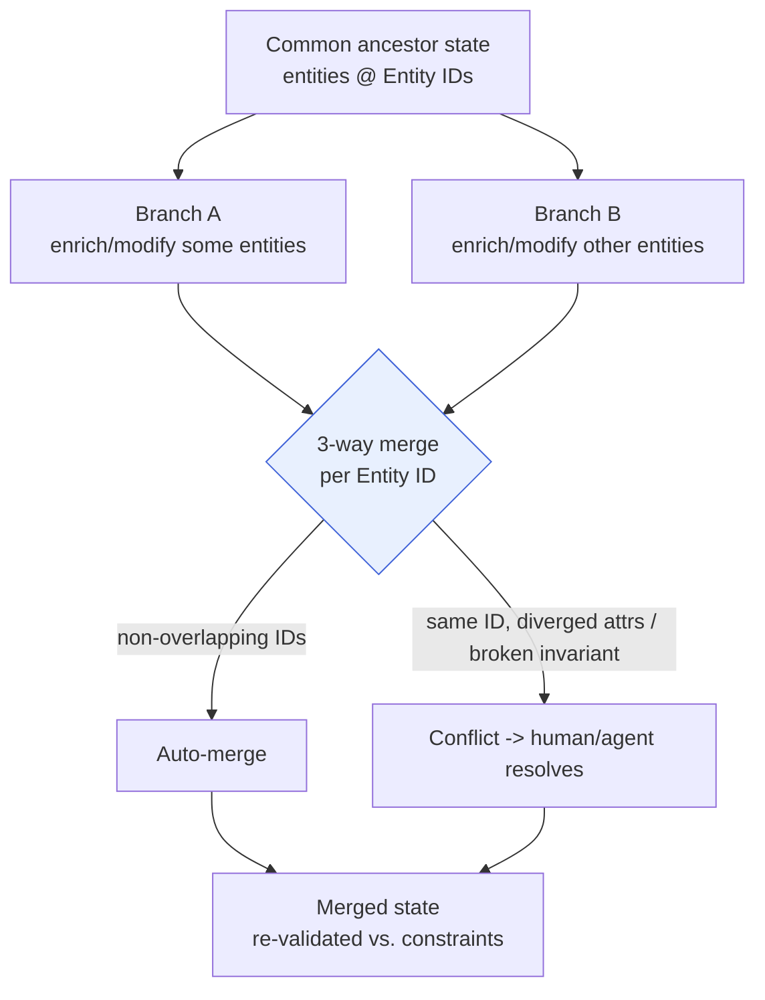
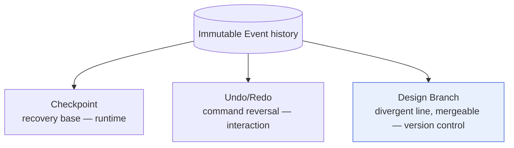

# Design Version Control — "Git for Hardware"

> **Ring:** Interface adapters (outer), realizing an inner-ring concept. This document defines **design version control**: the ability to keep divergent, mergeable lines of [Engineering State](../core/shared-state-model.md) history — *branch and merge for a hardware design* — keyed on stable [Entity IDs](../foundation/engineering-domain-model.md). It explains **why merging layouts is not merging text**, and how branching relates to (but differs from) [Checkpoints](../core/checkpoint-system.md) and [Undo/Redo](../GLOSSARY.md#undoredo). The model is recorded in **[ADR-0008](../decisions/0008-design-version-control-model.md)**. **No VCS technology is named** ([P1](../foundation/principles.md), Phase-0 rule).

---

## 1. Why "Git for hardware" — and why it is not Git

Engineers want what software engineers have: try a design alternative on a branch, compare it, and merge the good one back. A [Design Branch](../GLOSSARY.md#design-branch) is therefore a **first-class design artifact** — a divergent line of design evolution the engineer names, manages, and merges — not a backup and not an undo step.

But hardware version control **cannot** be built on text diffing, the way Git is, for a fundamental reason:

> **A design is a graph of identified entities, not a sequence of lines.** A PCB layout, a schematic, and a BOM have no meaningful "lines." Two engineers who both move components produce changes that a line-based merge would either falsely conflict or silently corrupt. Merging must operate on the **[domain model](../foundation/engineering-domain-model.md)'s entities and relationships**, keyed on **stable Entity IDs**, with awareness of engineering **invariants** — not on serialized bytes.

This is the central claim of the document and the reason design version control is its own concern rather than "store the project files in Git."

### Why merging layouts ≠ merging text

| Text merge (Git) | Design merge (here) |
|------------------|---------------------|
| Unit: a line of a file | Unit: an [entity](../foundation/engineering-domain-model.md) / relationship, addressed by [Entity ID](../core/shared-state-model.md) |
| Conflict: same line edited twice | Conflict: same entity attribute diverged, *or* a violated cross-entity [invariant](../foundation/engineering-domain-model.md) (e.g. two branches route the same [Net](../foundation/engineering-domain-model.md#net) incompatibly) |
| Correctness: textual | Correctness: **engineering** — a syntactically clean merge can be electrically wrong |
| Reorder/format changes spuriously conflict | Identity is positional-independent: moving U3 doesn't conflict with renaming a net |
| No semantic validation | Merge result is re-checked against [constraints](../engineering/constraint-engine.md) / [verification](../engineering/verification-engine.md) |

A line-based tool would mistake a relocated component for a deletion-plus-insertion, and would happily merge two layouts into a physically impossible board. Entity-keyed, invariant-aware merging is what makes the result *engineering-correct*, not merely *conflict-free*.

---

## 2. Entity-ID-keyed branch & merge

Everything rests on [domain-model modelling principle 1](../foundation/engineering-domain-model.md): every entity has an **opaque, immutable Entity ID** that survives renames, re-values, moves, and version bumps. Version control keys on this ID.

*Figure: three-way merge over entities, not lines. Disjoint Entity-ID changes auto-merge; same-ID divergence or a broken cross-entity invariant raises a semantic conflict. The merged graph is re-checked. Viewpoint: one merge.*

- **Diff is per-entity.** Comparing two branches asks, for each Entity ID, "was this entity added, retired, or enriched, and how?" — not "which bytes differ." The same Entity ID denotes "the same engineering thing" across branches ([shared-state addressing](../core/shared-state-model.md)).
- **Merge is three-way and semantic.** Against the common ancestor: disjoint changes combine automatically; changes to the *same* entity, or changes that *jointly* break an [invariant](../foundation/engineering-domain-model.md) spanning entities, are **conflicts**.
- **Conflicts are engineering decisions.** A conflict is resolved by a [Decision](../foundation/engineering-domain-model.md#decision) (human disposes, [P10](../foundation/principles.md); an agent may propose) and recorded as [Events](../core/event-bus.md) with full [provenance](../core/provenance-and-traceability.md) ([P5](../foundation/principles.md)) — a merge has a "why," like every other change.
- **The merge result is re-verified.** A merged design is re-checked against [constraints](../engineering/constraint-engine.md) and [verification rules](../engineering/verification-engine.md); a clean merge that introduces a [Violation](../foundation/engineering-domain-model.md#violation) is surfaced, never accepted blindly.

---

## 3. Relation to Checkpoint and Undo/Redo

These three share the immutable [Event](../core/event-bus.md) substrate but answer different questions and live in different rings. The [Checkpoint System](../core/checkpoint-system.md) owns this reconciliation; this section states it from the version-control side.

| Concept | Question | Audience | Granularity | Owner |
|---------|----------|----------|-------------|-------|
| **Design Branch** (this doc) | "Keep a divergent design line and merge it back" | Engineer (version control) | A whole line of design evolution | this doc + [ADR-0008](../decisions/0008-design-version-control-model.md) |
| [Checkpoint](../core/checkpoint-system.md) | "Restore a consistent runtime base fast after a crash / before a risky step" | Runtime (recovery) | Whole-state snapshot @ sequence position | [`checkpoint-system.md`](../core/checkpoint-system.md) |
| [Undo/Redo](../GLOSSARY.md#undoredo) | "Reverse my last action" | Engineer (interaction) | One user command | [`presentation/`](../presentation/frontend.md) |

- **A branch is not a checkpoint.** A checkpoint is a *derived, disposable* recovery cache, prunable without semantic loss; a branch is *intentional design intent* whose deletion loses an alternative. A checkpoint may, however, be *used by* version control as an efficient base state when materializing a branch — borrowed mechanism, different meaning.
- **A branch is not undo.** Undo is linear, ephemeral, per-[Session](../GLOSSARY.md#session) interaction state ([Session Store](stores/session-store.md)); a branch is durable, named, and mergeable. Undo reverses one command; branching forks a line.

*Figure: all three derive from one event history; only the Design Branch carries merge semantics and durable design intent. Viewpoint: the version-control concern.*

---

## 4. How branches are represented (conceptual)

Representation is conceptual; the mechanism is deferred to [ADR-0008](../decisions/0008-design-version-control-model.md) and a later technology phase.

- A branch is a **named line of history** over the shared [Event](../core/event-bus.md) substrate: addressing an entity requires *(Entity ID, branch, point-in-history)* — the version coordinate the [Shared State Model](../core/shared-state-model.md) already defines.
- Branch materialization is "nearest base + forward events," directly reusing the [checkpoint](../core/checkpoint-system.md) snapshot-plus-tail-replay mechanism — the same machinery that powers [deterministic](../core/determinism-and-reproducibility.md) reconstruction.
- [Knowledge](stores/knowledge-graph-store.md) and [vector](stores/vector-store.md) data version *alongside* branches by the same Entity-ID keying, so a branch's facts and similarity matches reflect that branch's design ([knowledge-graph open decisions](../knowledge/knowledge-graph.md)).
- This is a *projection/representation* concern, so it also obeys [data-versioning](data-versioning-and-migration.md): the branch model is itself versioned, on a different axis from the design it tracks (§5 there).

---

## 5. Failure modes

- **Unresolvable semantic conflict.** Surfaced as an explicit [Decision](../foundation/engineering-domain-model.md#decision) for the engineer ([P10](../foundation/principles.md)); never auto-resolved by guessing. The merge blocks rather than producing a wrong board.
- **Clean merge, broken engineering.** Caught by post-merge re-verification against [constraints](../engineering/constraint-engine.md)/[rules](../engineering/verification-engine.md); reported as [Violations](../foundation/engineering-domain-model.md#violation), not silently accepted.
- **Identity ambiguity** (an entity's ID can't be matched across branches). Impossible by construction if the [Entity ID is immutable](../core/shared-state-model.md); a retired entity leaves a tombstone + provenance link, so a merge sees "superseded by X," never a silent null.
- **Branch sprawl / storage growth.** Bounded by stated retention policy ([P13](../foundation/principles.md)); pruning *merged/abandoned* branches is safe because the [Event Store](stores/event-store.md) retains authoritative history.

---

## 6. Open decisions

- [ADR-0008](../decisions/0008-design-version-control-model.md) — **the** design version-control model: branch representation, entity-ID-keyed three-way merge, conflict semantics.
- [ADR-0004](../decisions/0004-event-sourcing-decision.md) — whether branches are lines over an authoritative event log or over state-of-record bases (sets materialization strategy).
- [ADR-0003](../decisions/0003-shared-state-consistency-model.md) — how concurrent edits on a branch are isolated before they ever reach a merge.

---

## 7. Related documents

[`core/checkpoint-system.md`](../core/checkpoint-system.md) (the three-concept reconciliation) · [`core/shared-state-model.md`](../core/shared-state-model.md) (Entity identity & addressing) · [`foundation/engineering-domain-model.md`](../foundation/engineering-domain-model.md) (entity lifecycle) · [`data/stores/event-store.md`](stores/event-store.md) · [`data/stores/state-store.md`](stores/state-store.md) · [`data/data-versioning-and-migration.md`](data-versioning-and-migration.md) · [`core/provenance-and-traceability.md`](../core/provenance-and-traceability.md) · [`decisions/0008-design-version-control-model.md`](../decisions/0008-design-version-control-model.md) · [`GLOSSARY.md`](../GLOSSARY.md)
