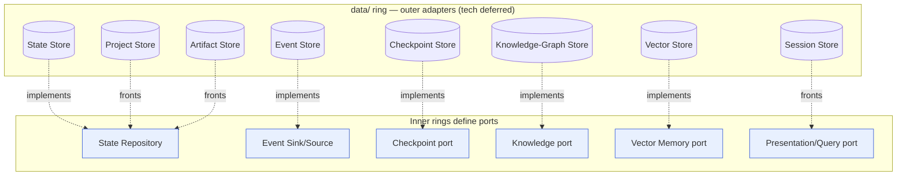
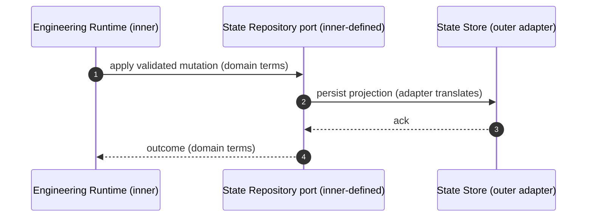

# Storage — The Persistence Model

> **Ring:** Interface adapters (outer). This document describes the **conceptual persistence model** of Electronics Agent Kit: why the system persists what it persists, the **taxonomy of eight stores**, and how every store relates to an inner-ring [Contract (port)](../core/contracts.md). It is the map of the [`data/`](.) ring. **It names no database, file format, or library** — persistence technology is deferred to a later phase ([P1](../foundation/principles.md), Phase-0 rule). It answers *what each store is for and why it exists separately*, never *which engine backs it*.

---

## 1. Why a persistence model exists at all

The product's thesis is that **the [Engineering Runtime](../core/engineering-runtime.md) owns the engineering knowledge** ([P2](../foundation/principles.md)). Knowledge that is owned must be *durable, versioned, traceable, and reproducible* — none of which is possible if it lives only in process memory or in model prompts. Persistence is therefore not an incidental infrastructure detail; it is the substrate that makes [P2](../foundation/principles.md) (runtime owns knowledge), [P4](../foundation/principles.md) (determinism), and [P5](../foundation/principles.md) (traceability) real across restarts, crashes, sessions, and years.

Three rules govern everything in this ring:

1. **Stores are outer-ring [Adapters](../GLOSSARY.md#adapter).** Each store *implements* a [port](../core/contracts.md) defined by an inner ring. The core depends on the port, never on the store ([P1](../foundation/principles.md)). A store can be replaced without any inner-ring change.
2. **Schemas are projections, not definitions.** What a store persists is a *projection* of the canonical [Engineering Domain Model](../foundation/engineering-domain-model.md) ([P6](../foundation/principles.md)). A store schema is never a competing source of truth; the discipline for this is [`data-modeling.md`](data-modeling.md).
3. **No silent assumptions, no silent caps.** Retention, growth bounds, and consistency guarantees are stated, not implied ([P13](../foundation/principles.md)).

---

## 2. The store taxonomy — why eight stores, not one

A naïve design would put everything in a single store. We deliberately separate persistence into **eight stores** because they differ along axes that a single store cannot serve well simultaneously: *who defines the port they implement*, *their access shape* (key-value vs. relational-traversal vs. similarity vs. append-only log vs. large opaque blob), *their consistency needs*, *their retention policy*, and *their authority* (source of truth vs. derived/rebuildable).

> **The principle is not "many stores for their own sake."** Each store exists because it implements a *distinct inner-ring contract* with a *distinct access pattern and lifecycle*. Collapsing two of them would either violate the [Dependency Rule](../foundation/principles.md) (a consumer would depend on an access pattern it does not need) or force one consistency/retention policy onto data that needs another.

| Store | Implements port | Authority | Access shape | Why it cannot fold into another |
|-------|-----------------|-----------|--------------|---------------------------------|
| [State Store](stores/state-store.md) | [State Repository](../core/contracts.md#state-repository) | Source of truth for current [Engineering State](../core/shared-state-model.md) | Entity get / query by type & relationship | The materialized, queryable *now* of the design; distinct from the *history* that produced it. |
| [Event Store](stores/event-store.md) | [Event Sink/Source](../core/contracts.md#event-sink--event-source) | **Candidate system of record** (see §4) | Append-only, ordered, replayable log | History is immutable and append-only; state is mutable and materialized. Opposite shapes. |
| [Vector Store](stores/vector-store.md) | [Vector Memory port](../core/contracts.md#vector-memory-port) | Derived, rebuildable index | Similarity / nearest-neighbour | Approximate similarity is a different access model from exact entity lookup or relational traversal. |
| [Knowledge-Graph Store](stores/knowledge-graph-store.md) | [Knowledge port](../core/contracts.md#knowledge-port) | Source of truth for *engineering facts* (not design state) | Pattern match + relationship traversal | Relational, multi-hop fact queries the State Store is not shaped for; holds knowledge *about* parts/standards, not *the* design. |
| [Session Store](stores/session-store.md) | (fronts the [Presentation/Query port](../core/contracts.md#presentation--query-port)) | Source of truth for ephemeral interaction state | Per-session key/scoped state | Short-lived, per-user, non-design-significant; must not pollute the durable design record. |
| [Checkpoint Store](stores/checkpoint-store.md) | [Checkpoint port](../core/contracts.md#checkpoint-port) | Derived, disposable optimization | Whole-state snapshot @ sequence position | A recovery cache, prunable without semantic loss; not the history and not the live state. |
| [Project Store](stores/project-store.md) | (fronts [State Repository](../core/contracts.md#state-repository) at registry scope) | Source of truth for the project *registry* | Catalog / metadata lookup | Cross-project metadata and addressing root; lives above any single design's state. |
| [Artifact Store](stores/artifact-store.md) | (fronts [State Repository](../core/contracts.md#state-repository) for large outputs) | Source of truth for *generated* outputs | Large opaque blob + descriptor | Manufacturing outputs are large, immutable, content-addressable blobs — wrong shape for a mutable entity store. |

*Figure: every store is an outer-ring adapter implementing (or fronting) an inner-ring port. Arrows show implementation, opposite to source dependency. Viewpoint: the data ring.*

### Authority classes

The eight stores fall into three authority classes, which determines their retention and recovery treatment:

- **Sources of truth** — losing them loses knowledge: State Store *or* Event Store (which one is canonical is [ADR-0004](../decisions/0004-event-sourcing-decision.md), §4), Knowledge-Graph Store, Project Store, Artifact Store.
- **Derived / rebuildable** — losing them costs time, not knowledge: Vector Store (re-index from sources), Checkpoint Store (re-derive from the event log).
- **Ephemeral** — intentionally transient: Session Store.

---

## 3. How stores relate to ports (the inversion)

A store never appears in an inner-ring document as itself; it appears only as the *implementation* of a port. The flow of a typical persistence interaction:

*Figure: the runtime speaks only domain vocabulary to a port; the store adapter translates to its persistence model. The runtime cannot name the store. Viewpoint: one write.*

This inversion is what lets Phase 0 defer **all** technology: the inner rings are fully specifiable against ports today, and each store's concrete realization becomes a later-phase technology ADR with zero impact on consumers ([contract design rules](../core/contracts.md), [P1](../foundation/principles.md)).

---

## 4. The system-of-record question (Event Store) → ADR-0004

The single most consequential persistence decision is **what is the system of record**: the ordered [Event](../core/event-bus.md) log (full event sourcing, with current state as a derived materialization), or the materialized [State Store](stores/state-store.md) (state-of-record, with events as a forward audit delta)?

- Under **log-as-system-of-record**, the [State Store](stores/state-store.md) and [Checkpoint Store](stores/checkpoint-store.md) are *caches* re-derivable by replaying the [Event Store](stores/event-store.md); determinism ([P4](../foundation/principles.md)) and full provenance ([P5](../foundation/principles.md)) come "for free" because every fact traces to the event that produced it.
- Under **state-as-system-of-record**, the State Store is durable truth and the event log is the audit/replay trail; reconstruction is cheaper but the log's authority is weaker.

The architecture is deliberately designed to work under **either** resolution — this is why the [Checkpoint System](../core/checkpoint-system.md) defines itself as "snapshot + tail replay" regardless. The resolution is recorded in **[ADR-0004](../decisions/0004-event-sourcing-decision.md)**; until then both the [Event Store](stores/event-store.md) and [State Store](stores/state-store.md) docs state their behavior under each branch. This is the canonical "system of record" question for the whole product.

---

## 5. What this ring does **not** own

- **Persistence technology.** No database, file system, format, or index choice — deferred ([P1](../foundation/principles.md)).
- **Entity definitions.** Canonical in the [Engineering Domain Model](../foundation/engineering-domain-model.md); stores hold projections ([P6](../foundation/principles.md)).
- **The capabilities** of Knowledge Graph and Vector Memory — those are inner-ring [capabilities](../knowledge/knowledge-graph.md); the stores merely back them.
- **Concurrency semantics** — defined by [`concurrency-and-consistency.md`](../core/concurrency-and-consistency.md); stores honour them, they do not invent them.
- **Branch/merge semantics** — owned by [`design-version-control.md`](design-version-control.md).

---

## 6. Open decisions

- [ADR-0004](../decisions/0004-event-sourcing-decision.md) — system of record: event-sourcing vs. state-of-record (sets the authority of the Event Store vs. State Store).
- [ADR-0008](../decisions/0008-design-version-control-model.md) — how stores represent [Design Branches](design-version-control.md) keyed on stable Entity IDs.
- **Open (deferred):** the concrete technology for each store — eight later-phase technology ADRs, deliberately out of scope ([P1](../foundation/principles.md)).

---

## 7. Related documents

[`data/data-modeling.md`](data-modeling.md) · [`data/data-versioning-and-migration.md`](data-versioning-and-migration.md) · [`data/design-version-control.md`](design-version-control.md) · [`core/contracts.md`](../core/contracts.md) · [`core/shared-state-model.md`](../core/shared-state-model.md) · [`foundation/engineering-domain-model.md`](../foundation/engineering-domain-model.md) · [`foundation/principles.md`](../foundation/principles.md) · the eight stores in [`data/stores/`](stores/) · [`GLOSSARY.md`](../GLOSSARY.md)
