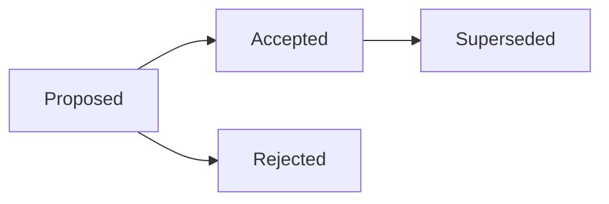

# Architecture Decision Records

> **Ring:** cross-cutting. This is the index and process for Electronics Agent Kit's **Architecture Decision Records (ADRs)** — the numbered, immutable record of every load-bearing architectural decision. An ADR captures *one* justified decision: the forces that motivated it, what was decided, the consequences accepted, and the alternatives rejected. The decisions here are the reasons the rest of the documentation is shaped the way it is; the [principles](../foundation/principles.md) are the laws, and these ADRs are the rulings that established them.

An ADR exists so that a multi-year, multi-contributor product never has to re-litigate a settled choice from memory. When a later reader asks "why is the runtime built this way?", the answer is a link, not a conversation.

## The seed set

Phase 0 ships **ten seed ADRs** capturing the load-bearing decisions identified by the architecture review. More accrete as the product evolves; the seed set is never renumbered.

| ADR | Title | Status |
|-----|-------|--------|
| [0001](0001-adopt-clean-architecture-dependency-rule.md) | Adopt clean-architecture rings and the dependency rule | Accepted |
| [0002](0002-runtime-owns-knowledge-llm-as-reasoning-engine.md) | The runtime owns the knowledge; LLMs are only reasoning engines | Accepted |
| [0003](0003-shared-state-consistency-model.md) | Shared Engineering State consistency & concurrency model | Accepted |
| [0004](0004-event-sourcing-decision.md) | The event log is the system of record (event sourcing) | Accepted |
| [0005](0005-ir-as-canonical-phase-boundary-representation.md) | IRs are canonical phase-boundary projections of the domain model | Accepted |
| [0006](0006-agent-fsm-separation.md) | Two-part agents, separated from state machines | Accepted |
| [0007](0007-units-and-physical-quantity-type-system.md) | First-class physical-quantity type system | Accepted |
| [0008](0008-design-version-control-model.md) | Design version control ("Git for hardware") | Accepted |
| [0009](0009-determinism-and-replay-strategy.md) | Determinism via deterministic core + recorded reasoning + replay | Accepted |
| [0010](0010-human-in-the-loop-autonomy-levels.md) | Configurable autonomy levels; AI proposes, engineer disposes | Accepted |

## Phase 1 additions

Phase 1 (implementation start) records the technology and scoping decisions Phase 0 deferred. These accrete after the seed set and obey the same process rules.

| ADR | Title | Status |
|-----|-------|--------|
| [0011](0011-implementation-language-and-ring-per-crate.md) | Implementation language: Rust, one crate per ring | Accepted |
| [0012](0012-event-sourced-file-log-persistence.md) | Event-sourced file log as the Phase-1 persistence substrate | Accepted |
| [0013](0013-reasoning-adapters-fixture-and-live.md) | Reasoning adapters: one port, fixture + live Anthropic | Accepted |
| [0014](0014-first-phase-requirement-planning.md) | First implemented phase: Requirement Planning | Accepted |
| [0015](0015-phase1-autonomous-hitl-deferred.md) | Phase 1 runs autonomously; human-in-the-loop deferred | Accepted |

## The ADR lifecycle

*Figure: an ADR's status only ever moves forward. The decision text of a decided ADR is never edited in place.*

- **Proposed** — the decision is recorded and under discussion; the document that relies on it links to it as an open decision.
- **Accepted** — the decision is in effect and every other document may assume it.
- **Rejected** — the decision was considered and declined; the record is kept so the option is not silently revisited.
- **Superseded by ADR-NNNN** — a later ADR replaces this one. The old ADR stays; its status line points to the replacement.

## Process rules (non-negotiable)

1. **Next number, zero-padded.** A new decision worth recording takes the next free `NNNN`. Numbers are assigned once.
2. **Never renumber.** An ADR's number is permanent, even if it is later superseded or rejected. Links resolve by number forever.
3. **Never edit a decided ADR's decision.** Once an ADR is **Accepted** (or **Rejected**), its Context/Decision/Consequences are immutable. A changed mind is recorded by **appending** a new ADR that supersedes the old one — never by rewriting history. (This mirrors the system's own [event-sourcing](0004-event-sourcing-decision.md) discipline: history is append-only.)
4. **One decision per ADR.** If a document bundles two decisions, split it. Each ADR answers exactly one architectural question.
5. **Always record the alternatives.** "We just picked it" is not a rationale. Every ADR states what else was considered and why it was rejected ([P13 — Document the Why](../foundation/principles.md)).
6. **Link both ways.** The ADR cross-links the [principle(s)](../foundation/principles.md) it grounds and the primary document it governs; that document links back to the ADR as an open/decided decision.

## ADR format

Every ADR (0001 onward) follows the [`CONVENTIONS.md`](../CONVENTIONS.md) ADR template, in this order:

1. **Status** — Proposed / Accepted / Rejected / Superseded by ADR-NNNN.
2. **Context** — the forces, constraints, and problem that motivate the decision.
3. **Decision** — what was decided, stated in **architecture terms only** (Phase 0 selects *approach*, never a product, library, or vendor).
4. **Consequences** — what becomes easier, harder, or merely different: positive, negative, and neutral.
5. **Alternatives considered** — the options weighed, each with the specific reason it was rejected.

## ADRs vs. ECC

These two are easy to confuse and must stay distinct:

| | **ADR** | **ECC** |
|---|---------|---------|
| **What it records** | A decision *about this product's architecture* — one ruling, justified. | Reusable *engineering-of-the-product intelligence*: patterns, conventions, prompts, lessons about how we build. |
| **Where it lives** | In this repository, under [`decisions/`](README.md), versioned with the docs and code it governs. | In the external [ECC](../GLOSSARY.md#ecc) long-term memory, never embedded in these docs. |
| **Scope** | Specific to Electronics Agent Kit's architecture. | Cross-project, reusable beyond this product. |
| **Mutability** | Append-only; immutable once decided. | A living, curated memory. |

Rule of thumb: *"Why is **this system** built this way?"* → an **ADR**. *"A reusable way to build **any** system / a lesson worth carrying forward"* → **ECC**. Note the parallel but separate concept of the in-product [Learning Engine](../engineering/learning-engine.md), which captures reusable *engineering-domain* experience (about circuits and boards) — that is neither an ADR nor ECC.

## Related documents

[`CONVENTIONS.md`](../CONVENTIONS.md) (the ADR template & process) · [`foundation/principles.md`](../foundation/principles.md) · [`GLOSSARY.md`](../GLOSSARY.md#adr-architecture-decision-record) · [`README.md`](../README.md)
