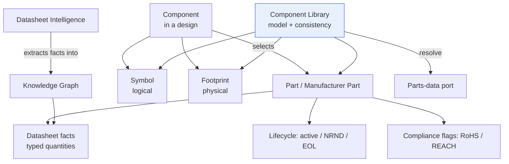
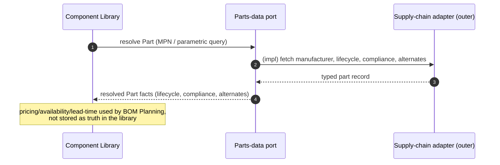

# Component Library

> **Ring:** Use cases / runtime (inner) — a domain model + service area. The Component Library is the model of **parts, symbols, footprints, datasheets, and lifecycle** that the design draws on: the bridge between an abstract [Component](../foundation/engineering-domain-model.md#component) in a design and a real, orderable [Part](../foundation/engineering-domain-model.md#part) with a [Symbol](../foundation/engineering-domain-model.md#symbol), a [Footprint](../foundation/engineering-domain-model.md#footprint), datasheet-derived facts, and a lifecycle status. It exists because a [Component](../foundation/engineering-domain-model.md#component) ("this U3") is meaningless until it is grounded in a concrete, sourceable part with verified physical and electrical reality — and that grounding must be typed, traceable, and lifecycle-aware so the design does not silently depend on an [EOL](#lifecycle) part. It is **deterministic** ([P3](../foundation/principles.md)): it organizes and serves library facts; the *judgement* of which part to choose is an [Agent's](../agents/README.md) reasoning, recorded as a [Decision](../foundation/engineering-domain-model.md#decision).

---

## 1. Purpose & responsibilities

### What it owns

- **The library model of parts.** The conceptual catalog relating [Symbols](../foundation/engineering-domain-model.md#symbol), [Footprints](../foundation/engineering-domain-model.md#footprint), datasheet facts, and [Parts](../foundation/engineering-domain-model.md#part) (manufacturer parts) — and the rules that keep them mutually consistent.
- **Symbol↔Footprint↔Part consistency.** Enforcing the [domain invariants](../foundation/engineering-domain-model.md#footprint): a footprint's pad count and pin mapping must match the symbol; a component's electrical parameters must be consistent with the chosen part's datasheet facts.
- **Datasheet-derived facts (as consumer).** Holding the structured parametric facts, pinouts, and limits that [Datasheet Intelligence](#3-relationship-to-datasheet-intelligence) extracts — as typed [Physical Quantities](units-and-quantities.md).
- **Lifecycle awareness.** Tracking each part's lifecycle status (active / [NRND](#lifecycle) / [EOL](#lifecycle)) and surfacing it so the design can avoid or flag risky parts.
- **Resolution to orderable parts.** Coordinating with the [Parts-data port](../core/contracts.md) to resolve a [Part](../foundation/engineering-domain-model.md#part) to current sourcing reality (manufacturer, alternates, lifecycle, compliance flags).

### What it does **NOT** own

- **Choosing a part.** *Which* part to select for a component is engineering judgement — an [Agent's](../agents/README.md) reasoning recorded as a [Decision](../foundation/engineering-domain-model.md#decision) with [Evidence](../foundation/engineering-domain-model.md#evidence). The library provides candidates and facts; it does not decide.
- **Sourcing data fetching.** Live price, availability, and lead time come from the [Parts-data port](../core/contracts.md), implemented by [supply-chain adapters](../integration/supply-chain-and-parts-data.md) (outer ring). The library *consumes* that; it is not the integration.
- **Datasheet extraction itself.** Turning a PDF datasheet into structured facts is the [Datasheet Intelligence](../state-machines/datasheet-intelligence.md) phase / [Datasheet Agent](../agents/datasheet-agent.md). The library is the *home* of the resulting facts (via the [Knowledge Graph](../knowledge/knowledge-graph.md)), not the extractor.
- **The BOM.** Quantities, line items, and sourcing rollups are [BOM Planning](../state-machines/bom-planning.md) / the [BOM IR](../compiler/ir/bom-ir.md). A [BOM Line Item](../foundation/engineering-domain-model.md#bom-line-item) *uses* a Part; the library defines the Part.
- **The unit type system.** It *uses* [Physical Quantities](units-and-quantities.md); it does not define them.
- **Persistence technology.** Library facts persist via the [State Repository](../core/contracts.md) and [Knowledge port](../knowledge/knowledge-graph.md); the library owns the model, not the store.

---

## 2. Position in the architecture

*Figure: the library relates the design-side Component to a real Part with its Symbol, Footprint, datasheet facts, lifecycle, and compliance. Viewpoint: the engineering ring.*

- **Ring:** Use cases / runtime. Depends inward only — on the [Engineering Domain Model](../foundation/engineering-domain-model.md) (Part/Symbol/Footprint/Component), [Physical Quantities](units-and-quantities.md), and the [Knowledge port](../knowledge/knowledge-graph.md), [Parts-data port](../core/contracts.md), [State Repository port](../core/contracts.md) ([P1](../foundation/principles.md)).
- **Depended on by:** [Schematic Planning](../state-machines/schematic-planning.md) (needs symbols), [Component Placement](../state-machines/component-placement.md) (needs footprints), [BOM Planning](../state-machines/bom-planning.md) (needs parts/sourcing), and [Datasheet Intelligence](../state-machines/datasheet-intelligence.md) (writes facts the library serves).

---

## 3. Relationship to domain entities and Datasheet Intelligence

### Entity relationships

The library is the operational home of four [domain entities](../foundation/engineering-domain-model.md) and their invariants:

| Entity | Role in the library | Invariant enforced |
|--------|---------------------|--------------------|
| [Symbol](../foundation/engineering-domain-model.md#symbol) | logical schematic representation (pin map + graphic) | pin map matches the part's pinout |
| [Footprint](../foundation/engineering-domain-model.md#footprint) | physical land pattern (pads, courtyard, keep-outs, IPC land class) | **pad count and pin mapping match the Symbol** |
| [Part](../foundation/engineering-domain-model.md#part) | real orderable manufacturer part (MPN, datasheet, lifecycle, compliance) | a [Component's](../foundation/engineering-domain-model.md#component) parameters are consistent with the part's datasheet facts |
| [Component](../foundation/engineering-domain-model.md#component) | the design instance that *selects* a Part and binds a Symbol + Footprint | exactly one chosen Part per realized component |

### Datasheet Intelligence

[Datasheet Intelligence](../state-machines/datasheet-intelligence.md) (the [Datasheet Agent](../agents/datasheet-agent.md)) extracts structured facts — parameters, pinouts, absolute-maximum limits — from a part's datasheet into the [Knowledge Graph](../knowledge/knowledge-graph.md) as typed [Physical Quantities](units-and-quantities.md). The Component Library is the **consumer**: those facts become the part's parametric reality that the library serves to schematic/placement/BOM work, and that the [Constraint Engine](constraint-engine.md) can turn into derived constraints (e.g. an absolute-maximum becomes a [Pin](../foundation/engineering-domain-model.md#pin) voltage-limit constraint). Extraction is the phase; *holding and serving* the facts is the library.

---

## 4. Lifecycle

Part **lifecycle status** is a first-class library concern because choosing a dying part is a costly, common mistake:

| Status | Meaning | Library behaviour |
|--------|---------|-------------------|
| **active** | in normal production | preferred for new selection |
| **NRND** | Not Recommended for New Designs | selectable but flagged; the engineer is warned ([P10](../foundation/principles.md)) |
| **EOL** | End Of Life / obsolete | flagged strongly; alternates surfaced; may raise a [Violation](../foundation/engineering-domain-model.md#violation) via [DFM](../state-machines/dfm-verification.md)/sourcing rules |

Lifecycle is resolved through the [Parts-data port](../core/contracts.md) and kept current; a change in a part's lifecycle is a design-significant fact recorded as an [Event](../core/event-bus.md), so a design can be re-assessed when a part it depends on goes NRND/EOL. **Compliance flags** (RoHS, REACH) are tracked the same way and feed [Standards & Compliance](standards-and-compliance.md).

---

## 5. Sourcing via the Parts-data port

*Figure: the library resolves parts through the port; volatile sourcing data (price/stock) is fetched, not treated as canonical state. Viewpoint: the engineering ring calling outward through a contract.*

The library keeps **stable** part facts (identity, datasheet parameters, lifecycle, compliance) as part of the knowledge model, while **volatile** sourcing data (price, stock, lead time) is fetched on demand through the [Parts-data port](../core/contracts.md) and consumed mainly by [BOM Planning](../state-machines/bom-planning.md) — so the design's canonical state never goes stale on prices.

---

## 6. Contracts

- **Consumes:**
  - [Knowledge port](../knowledge/knowledge-graph.md) — store and query datasheet-derived part facts and relationships.
  - [Parts-data port](../core/contracts.md) — resolve [Parts](../foundation/engineering-domain-model.md#part), lifecycle, compliance, and alternates (implemented by [supply-chain adapters](../integration/supply-chain-and-parts-data.md)).
  - [State Repository port](../core/contracts.md) — persist the chosen Part/Symbol/Footprint bindings as part of [Engineering State](../core/shared-state-model.md).
  - [Vector Memory port](../knowledge/vector-memory.md) — find similar/alternate parts by parametric/semantic similarity (supports part suggestion and [Learning Engine](learning-engine.md) reuse).
- **Provides (inner-ring):** library lookup/consistency-check operations used by schematic, placement, and BOM agents' [deterministic use-case halves](../agents/README.md).
- **Does not consume** the [Reasoning Engine port](../core/reasoning-engine-interface.md) — part *choice* is the agent's reasoning, not the library's ([P3](../foundation/principles.md)).

---

## 7. Failure modes

- **Symbol/Footprint mismatch.** Rejected by the consistency invariant; an inconsistent component binding cannot be committed. See [`failure-taxonomy-and-degraded-modes.md`](../core/failure-taxonomy-and-degraded-modes.md).
- **Part not resolvable** (unknown MPN, port unavailable). The component remains "unbound"; downstream phases treat its parameters as [indeterminate](constraint-engine.md), not assumed.
- **Part goes NRND/EOL mid-design.** Recorded as an [Event](../core/event-bus.md); the design is flagged for re-assessment with alternates surfaced — never silently shipped on a dead part.
- **Datasheet facts missing or low-confidence.** The library serves what exists and marks gaps; the [Constraint Engine](constraint-engine.md) cannot derive limits it lacks (indeterminate), rather than guessing.
- **Compliance flag conflict** (e.g. non-RoHS part in a RoHS design). Surfaced via [Standards & Compliance](standards-and-compliance.md) as a [Violation](../foundation/engineering-domain-model.md#violation).

---

## 8. Open decisions

- [ADR-0007](../decisions/0007-units-and-physical-quantity-type-system.md) — datasheet parameters are typed quantities.
- [ADR-0008](../decisions/0008-design-version-control-model.md) — part bindings and library facts under [design version control](../data/design-version-control.md) (stable [Entity IDs](../foundation/engineering-domain-model.md)).
- [ADR-0005](../decisions/0005-ir-as-canonical-phase-boundary-representation.md) — how part/symbol/footprint project into the [Schematic](../compiler/ir/schematic-ir.md)/[PCB](../compiler/ir/pcb-ir.md)/[BOM](../compiler/ir/bom-ir.md) IRs.
- **Open:** boundary between user-private libraries, org libraries, and resolved-from-supplier parts — future ADR (interacts with [Learning Engine](learning-engine.md) and [security](../crosscutting/security.md)).

---

## 9. Related documents

[`foundation/engineering-domain-model.md`](../foundation/engineering-domain-model.md) (Part, Symbol, Footprint, Component) · [`state-machines/datasheet-intelligence.md`](../state-machines/datasheet-intelligence.md) · [`agents/datasheet-agent.md`](../agents/datasheet-agent.md) · [`engineering/units-and-quantities.md`](units-and-quantities.md) · [`engineering/constraint-engine.md`](constraint-engine.md) · [`engineering/standards-and-compliance.md`](standards-and-compliance.md) · [`integration/supply-chain-and-parts-data.md`](../integration/supply-chain-and-parts-data.md) · [`compiler/ir/bom-ir.md`](../compiler/ir/bom-ir.md) · [`knowledge/knowledge-graph.md`](../knowledge/knowledge-graph.md) · [`core/contracts.md`](../core/contracts.md)
