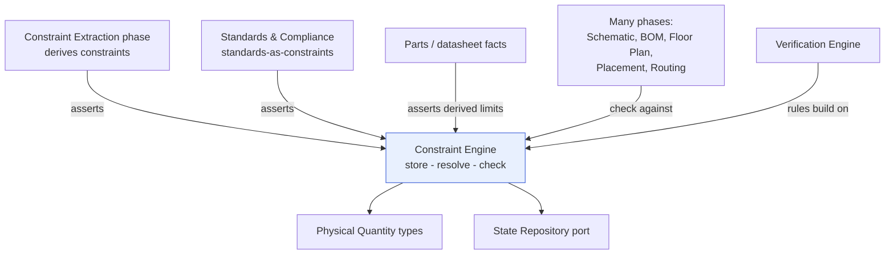
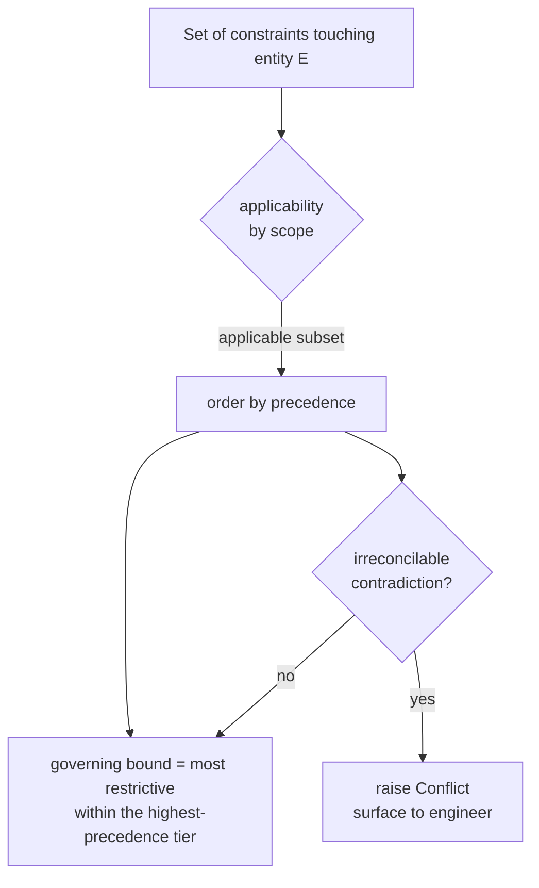

# Constraint Engine

> **Ring:** Use cases / runtime (inner) — a deterministic domain [Engine](../GLOSSARY.md#engine). The Constraint Engine is the cross-cutting service that **stores, resolves, and checks** [Constraints](../foundation/engineering-domain-model.md#constraint): machine-checkable restrictions on the design (electrical, physical, thermal, manufacturing, regulatory). It exists because constraints are produced by many [Phases](../GLOSSARY.md#phase) but must be reconciled into one coherent, queryable, conflict-resolved body of rules that *every* phase can check against continuously. It contains **no stochastic reasoning** — [Agents](../agents/README.md) may ask the [Reasoning Engine port](../core/reasoning-engine-interface.md) to *propose* a constraint, but the engine only ever evaluates and reconciles constraints deterministically ([P3](../foundation/principles.md)). **Critically, it is distinct from the [Constraint Extraction](../state-machines/constraint-extraction.md) phase**, which *derives* constraints; this engine is the service that *holds and enforces* them.

---

## 1. Purpose & responsibilities

### What it owns

- **The constraint store-of-record (conceptually).** The authoritative, in-runtime collection of all active [Constraints](../foundation/engineering-domain-model.md#constraint) for a [Project](../GLOSSARY.md#project), each carrying its type, scope, bound, severity, and source. (Persistence is the [State Store's](../data/stores/state-store.md) job via the [State Repository port](../core/contracts.md); the engine owns the *model and logic*, not the bytes.)
- **Constraint resolution.** Deciding, when multiple constraints touch the same entity, which bound governs — by priority, specificity, and source authority — and detecting genuine *conflicts* that no rule can reconcile.
- **Constraint checking.** Evaluating, for a given subset of [Engineering State](../core/shared-state-model.md), whether each applicable constraint holds, and producing a typed result (satisfied / violated / not-applicable / indeterminate).
- **Scoping & applicability.** Computing *which* constraints apply to *which* entities, given the constraint's scope (a single net, a net class, a region, the whole board) and the design's current shape.
- **Continuous (incremental) checking.** Re-checking only the constraints affected by a change, so the engine can run after every design-significant mutation without re-evaluating the world.
- **Typed bounds.** Treating every numeric bound as a [Physical Quantity](units-and-quantities.md) with unit and tolerance, so comparisons are dimensionally sound ([P9](../foundation/principles.md)).

### What it does **NOT** own

- **Deriving constraints from intent.** Turning a [Requirement](../foundation/engineering-domain-model.md#requirement) or a standard clause into a constraint is the [Constraint Extraction](../state-machines/constraint-extraction.md) phase (driven by the [Planning Agent](../agents/planning-agent.md)). That phase *writes into* this engine; it is not this engine. **This is the single most important distinction in this document.**
- **Rule evaluation for verification gates.** ERC/DRC/DFM produce [Violations](../foundation/engineering-domain-model.md#violation) through the [Verification Engine](verification-engine.md). A [Rule](../foundation/engineering-domain-model.md#rule) is a constraint *specialized for a verification domain*; the Verification Engine owns the violation/waiver/severity-gate lifecycle. The Constraint Engine supplies the constraints those rules build on, but does not own the gate that blocks manufacturing.
- **Fixing violations.** The engine reports that a constraint is unmet; *repairing* the design is an [Agent's](../agents/README.md) job within a phase.
- **Stochastic judgement.** The engine never calls a model. It is a deterministic evaluator ([P3](../foundation/principles.md)).
- **Persistence technology.** Reached only through ports ([P1](../foundation/principles.md), [P12](../foundation/principles.md)).
- **The unit type system itself.** It *consumes* [Physical Quantities](units-and-quantities.md); it does not define them.

---

## 2. Position in the architecture

*Figure: the Constraint Engine is written-to by constraint-producing phases/standards and read-by every phase that must respect constraints. Viewpoint: the engineering ring.*

- **Ring:** Use cases / runtime. Depends inward only — on the [Engineering Domain Model](../foundation/engineering-domain-model.md), the [Physical Quantity](units-and-quantities.md) types, and the [State Repository](../core/contracts.md) and [Event Sink/Source](../core/contracts.md) ports ([P1](../foundation/principles.md)).
- **Depended on by:** the [Constraint Extraction](../state-machines/constraint-extraction.md), [BOM Planning](../state-machines/bom-planning.md), [Schematic Planning](../state-machines/schematic-planning.md), [PCB Floor Planning](../state-machines/pcb-floor-planning.md), [Component Placement](../state-machines/component-placement.md), and [Routing Planning](../state-machines/routing-planning.md) phases (see the [canonical phase map](../foundation/architecture-views.md) "Constraint" column), and by the [Verification Engine](verification-engine.md).

---

## 3. The constraint model

A [Constraint](../foundation/engineering-domain-model.md#constraint) is, conceptually: **a typed bound, over a scope, with a severity and a source.**

| Facet | Meaning | Examples |
|-------|---------|----------|
| **Type** | the dimension being restricted | clearance, voltage limit, current limit, impedance target, thermal limit, keep-out, manufacturing rule, compliance rule |
| **Scope** | which entities it governs | one [Net](../foundation/engineering-domain-model.md#net), a net class, a [Component](../foundation/engineering-domain-model.md#component), a [Board](../foundation/engineering-domain-model.md#board) region, the whole project |
| **Bound** | the testable predicate | a [Physical Quantity](units-and-quantities.md) comparison (`≥ 0.20 mm`), a relation, an enumerated allowance |
| **Severity** | how bad a breach is | error / warning / info (aligns with [Violation](../foundation/engineering-domain-model.md#violation) severity) |
| **Source** | provenance of the constraint | a [Requirement](../foundation/engineering-domain-model.md#requirement), a [standard clause](standards-and-compliance.md), a [Part](../foundation/engineering-domain-model.md#part) datasheet limit, a fabrication-process rule, or a human override |

Every constraint carries a stable [Entity ID](../foundation/engineering-domain-model.md) and a [Provenance Link](../foundation/engineering-domain-model.md#provenance-link) to its source, so any enforced rule traces back to the requirement or standard that justified it ([P5](../foundation/principles.md)).

### Constraint categories (illustrative, not exhaustive)

- **Electrical** — voltage/current limits per [Pin](../foundation/engineering-domain-model.md#pin) or [Net](../foundation/engineering-domain-model.md#net), impedance targets, max ripple.
- **Physical / geometric** — clearances, keep-outs, courtyard separation, board-edge setbacks.
- **Thermal** — junction-temperature limits, copper-area minima for power devices.
- **Manufacturing** — minimum trace/space, drill sizes, annular ring, solder-mask sliver — typically authored by [DFM](../state-machines/dfm-verification.md)/fab-process inputs.
- **Regulatory / compliance** — creepage/clearance for safety, RoHS/REACH allowances — see [standards-and-compliance.md](standards-and-compliance.md).

---

## 4. Resolution: priority and conflict

When several constraints govern the same entity, the engine must decide which bound *wins* — deterministically and explainably.

*Figure: how the engine reduces many overlapping constraints to one governing bound, or to an explicit Conflict. Viewpoint: a single checked entity.*

**Precedence order (deterministic, recorded):**

1. **Source authority** — a human override or a hard regulatory/safety constraint outranks a derived default.
2. **Specificity** — a constraint scoped to one net outranks one scoped to its net class, which outranks a board-wide default (most-specific-wins).
3. **Restrictiveness** — within the same tier, the *tightest* bound governs (a 0.25 mm clearance beats a 0.20 mm clearance).

A **Conflict** is when two constraints of equal authority demand mutually unsatisfiable bounds (e.g. an impedance target that no available stack-up can meet alongside a thickness limit). Conflicts are **not** silently resolved: the engine records the conflict, refuses to invent a bound, and surfaces it to the engineer ([P10](../foundation/principles.md), [P13](../foundation/principles.md)). This is distinct from a *Violation* (a design that breaks a satisfiable constraint).

> **Why deterministic precedence rather than model judgement?** Resolution must be reproducible and auditable ([P4](../foundation/principles.md)): the same constraint set must always yield the same governing bound. A model *may* be asked (by an agent) to *propose* a resolution policy or flag a likely conflict, but the engine applies only the recorded, deterministic rules.

---

## 5. Continuous checking

The engine is designed to be invoked **after every design-significant mutation**, not only at phase boundaries — this is what lets the IDE show live diagnostics ([P11](../foundation/principles.md): the UI displays them but never computes them).

- **Applicability index.** The engine maintains a mapping from entities to the constraints whose scope covers them, so a change to one net re-checks only that net's constraints — incremental, not global.
- **Change-driven evaluation.** A mutation [Event](../core/event-bus.md) names the affected entities; the engine re-evaluates exactly the affected constraint set.
- **Typed comparison.** Every comparison runs through [Physical Quantity](units-and-quantities.md) dimensional rules; a unit mismatch is an engine error, never a silent coercion.
- **Result shape.** Each check yields `satisfied | violated | not-applicable | indeterminate`. *Indeterminate* (insufficient data to decide — e.g. a net without a routed track yet) is first-class, never collapsed into "pass."

The Verification phases consume these results to *manufacture* [Violations](../foundation/engineering-domain-model.md#violation) and apply the [waiver/gate lifecycle](verification-engine.md); the engine itself stays a pure evaluator.

---

## 6. Distinguishing the Constraint Engine from neighbours

| Concern | Owner |
|---------|-------|
| *Deriving* constraints from requirements/standards | [Constraint Extraction](../state-machines/constraint-extraction.md) phase ([Planning Agent](../agents/planning-agent.md)) |
| *Storing / resolving / checking* constraints | **This engine** |
| Building domain *rules* on constraints and producing *violations + waivers* | [Verification Engine](verification-engine.md) |
| The *typed values* used as bounds | [Physical Quantity type system](units-and-quantities.md) |
| Representing *standards* as constraints | [Standards & Compliance](standards-and-compliance.md) (asserts into this engine) |
| Persisting the constraints | [State Store](../data/stores/state-store.md) via [State Repository port](../core/contracts.md) |

---

## 7. Contracts

- **Consumes:**
  - [State Repository port](../core/contracts.md) — read the entities a constraint is scoped over; persist the constraint set as part of [Engineering State](../core/shared-state-model.md).
  - [Event Sink/Source port](../core/contracts.md) — learn which entities changed (to drive incremental checking) and record constraint assertions/resolutions as [Events](../core/event-bus.md) for [provenance](../core/provenance-and-traceability.md).
  - [Knowledge port](../knowledge/knowledge-graph.md) — pull authoritative facts (e.g. a [Part's](../foundation/engineering-domain-model.md#part) absolute-maximum ratings) that become derived constraint bounds.
- **Provides (to other inner-ring components, not as a new outer contract):** a deterministic *check* operation (given an entity set, return applicable constraints + results) and a *resolve* operation (given an entity, return the governing bound or a Conflict). Agents reach these through their [deterministic use-case half](../agents/README.md) ([P8](../foundation/principles.md)), never the reasoning half.
- **Does not consume** the [Reasoning Engine port](../core/reasoning-engine-interface.md) — by design ([P3](../foundation/principles.md)).

---

## 8. Failure modes

- **Constraint Conflict (unsatisfiable set).** Surfaced explicitly to the engineer; the engine never fabricates a compromise bound. See [`failure-taxonomy-and-degraded-modes.md`](../core/failure-taxonomy-and-degraded-modes.md).
- **Indeterminate check (missing data).** Reported as `indeterminate`, which a [gate](../core/workflow-orchestration.md) treats as "not yet passable" — never as a pass.
- **Unit/dimension mismatch in a bound.** Rejected at assertion time by the [Physical Quantity](units-and-quantities.md) rules ([P9](../foundation/principles.md)); a malformed constraint never enters the active set.
- **Scope references a deleted entity.** The constraint becomes not-applicable and is flagged for review rather than silently dropped (preserving [traceability](../core/provenance-and-traceability.md)).
- **Over-constrained design (many conflicts).** Escalated to the engineer with the conflicting sources named, rather than the engine relaxing constraints on its own ([P10](../foundation/principles.md)).

---

## 9. Open decisions

- [ADR-0007](../decisions/0007-units-and-physical-quantity-type-system.md) — typed bounds depend on the Physical Quantity system.
- [ADR-0005](../decisions/0005-ir-as-canonical-phase-boundary-representation.md) — how the resolved constraint set projects into each [IR](../compiler/compiler-ir.md) at a phase boundary.
- [ADR-0003](../decisions/0003-shared-state-consistency-model.md) — consistency of incremental checking under concurrent mutation.
- [ADR-0009](../decisions/0009-determinism-and-replay-strategy.md) — deterministic resolution must replay identically.
- **Open:** whether constraint *precedence policy* itself is project-configurable via the [Configuration port](../core/contracts.md) or fixed — to be captured as a future ADR.

---

## 10. Related documents

[`foundation/engineering-domain-model.md`](../foundation/engineering-domain-model.md) (Constraint, Rule, Violation) · [`state-machines/constraint-extraction.md`](../state-machines/constraint-extraction.md) · [`engineering/verification-engine.md`](verification-engine.md) · [`engineering/units-and-quantities.md`](units-and-quantities.md) · [`engineering/standards-and-compliance.md`](standards-and-compliance.md) · [`knowledge/knowledge-graph.md`](../knowledge/knowledge-graph.md) · [`core/contracts.md`](../core/contracts.md) · [`foundation/architecture-views.md`](../foundation/architecture-views.md)
