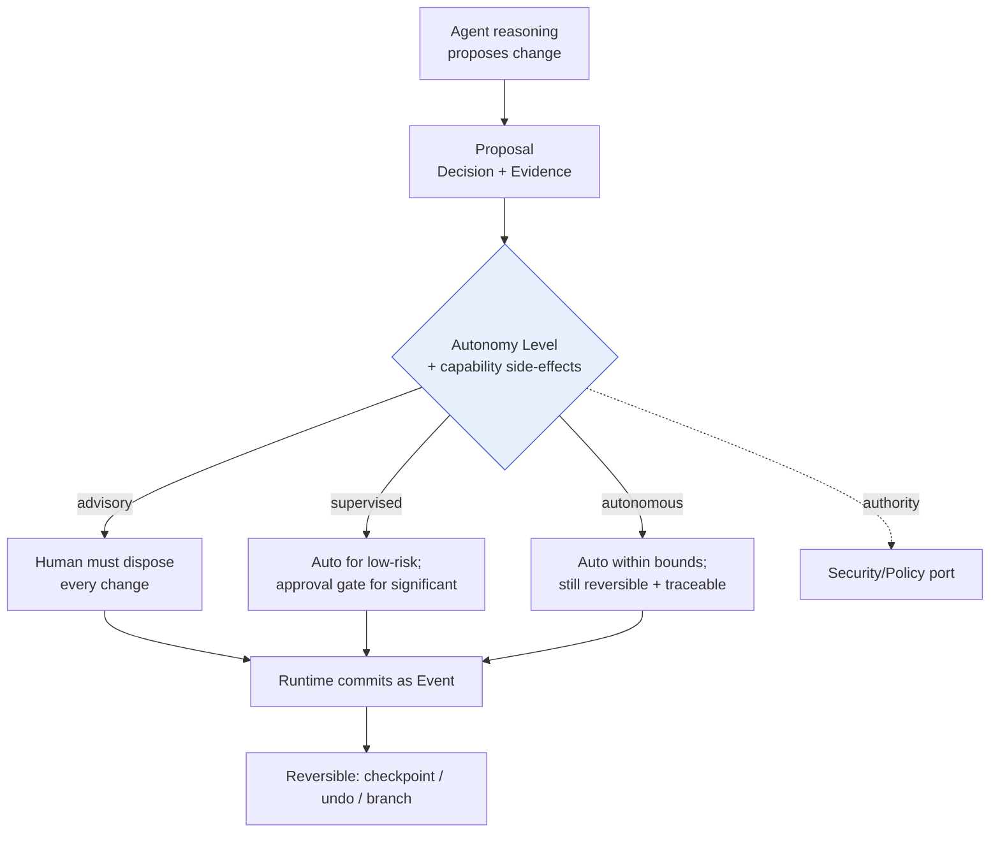
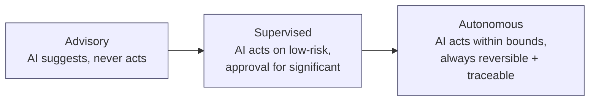
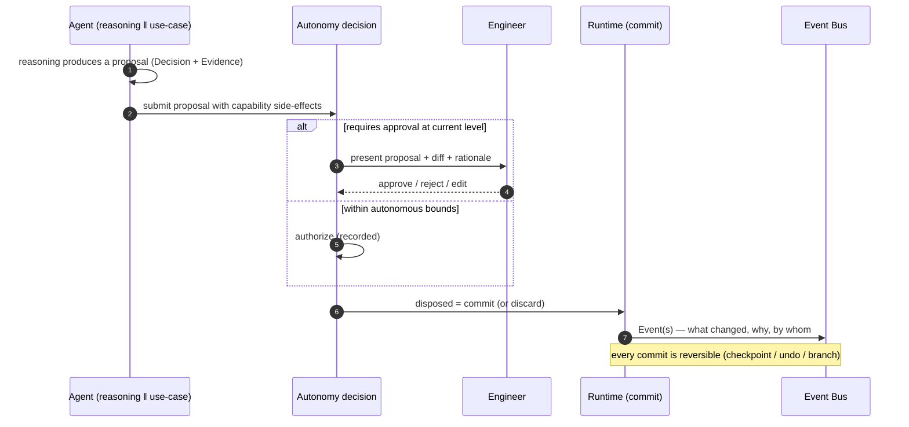

# Human-in-the-Loop & Autonomy Levels

> **Ring:** Use cases / runtime (inner) — a cross-cutting policy concern. This document defines the **[Autonomy Levels](../GLOSSARY.md#autonomy-level)** (advisory → supervised → autonomous), the **approval gates** that bind to them, and the discipline of **"AI proposes, engineer disposes"** that realizes [P10 — Humans Stay in Command](../foundation/principles.md). It exists because an AI-native engineering tool that can act on a design *must* make human authority configurable, explicit, and — above all — **reversible and traceable**: an engineer must always be able to see what the system did, why, and undo it. Autonomy is opt-in and graduated, never a hidden default. See [ADR-0010](../decisions/0010-human-in-the-loop-autonomy-levels.md).

---

## 1. Purpose & responsibilities

### What it owns

- **The Autonomy Level model.** The graduated levels at which the system may act, what each permits without human approval, and how a project (or a phase, or a capability class) is assigned a level.
- **The propose/dispose seam.** The discipline that the [Reasoning Engine](../core/reasoning-engine-interface.md) and [Agents](../agents/README.md) *propose* changes, and only a human (or an explicitly-authorized autonomous action) *disposes* — i.e. commits ([P3](../foundation/principles.md), [P10](../foundation/principles.md)).
- **Approval gates.** The conditions under which work pauses for human decision, and how those gates plug into the [Workflow Orchestrator's](../core/workflow-orchestration.md) gate machinery and the [Verification Engine's](verification-engine.md) waivers.
- **Reversibility guarantees.** The requirement that any autonomous (or assisted) action is undoable and traceable — grounded in [Events](../core/event-bus.md), [Checkpoints](../core/checkpoint-system.md), and [Undo/Redo](../GLOSSARY.md#undoredo).
- **Authority routing.** Determining *who* may approve/waive *what*, in cooperation with the [Security/Policy port](../core/contracts.md).

### What it does **NOT** own

- **The gate *mechanism*.** The [Workflow Orchestrator](../core/workflow-orchestration.md) owns *where* gates sit in the phase graph and how traversal pauses; this document owns *what an autonomy gate means* and *when approval is required*.
- **The waiver lifecycle.** [Waivers](../foundation/engineering-domain-model.md#waiver) live in the [Verification Engine](verification-engine.md); this document defines *who may authorize one* at each level.
- **Reversal machinery.** [Checkpoints](../core/checkpoint-system.md), [Undo/Redo](../GLOSSARY.md#undoredo), and [Design Branches](../data/design-version-control.md) are defined elsewhere; this document *requires* reversibility and relies on them.
- **The UI.** The [frontend](../presentation/frontend.md) renders proposals, approvals, and diffs but holds no autonomy logic ([P11](../foundation/principles.md)); decisions are made in the runtime and surfaced via the [Presentation/Query port](../core/contracts.md).
- **Authentication/authorization implementation.** *Who a user is* and *what they may do* is the [Security/Policy port](../core/contracts.md); this document consumes it.

---

## 2. Position in the architecture

*Figure: every proposal passes the autonomy decision before the runtime commits; whatever commits is reversible and traceable. Viewpoint: the propose/dispose seam.*

- **Ring:** Use cases / runtime. Depends inward only — on the [Engineering Domain Model](../foundation/engineering-domain-model.md) (Decision, Waiver), the [Capability Registry](../core/capability-registry.md) (side-effect declarations), and the [Security/Policy port](../core/contracts.md) ([P1](../foundation/principles.md)).
- **Depended on by:** the [Workflow Orchestrator](../core/workflow-orchestration.md) (approval gates), the [Verification Engine](verification-engine.md) (waiver authorization), and **every** [Agent](../agents/README.md) (whose proposals are gated by the active level).

---

## 3. The Autonomy Levels

*Figure: the autonomy spectrum. Higher levels widen what may proceed without per-action approval; none of them removes reversibility or traceability. Viewpoint: increasing delegation left→right.*

| Level | What the AI may do without approval | What still needs a human | Default for |
|-------|-------------------------------------|--------------------------|-------------|
| **Advisory** | nothing that mutates the design — only *suggest*, annotate, explain | **every** design-significant change | high-stakes work; new users; safety-critical regimes |
| **Supervised** | low-risk, easily-reversible changes within declared bounds | significant changes, anything crossing a [gate](../core/workflow-orchestration.md), any [waiver](verification-engine.md), anything outside bounds | the expected day-to-day default |
| **Autonomous** | act within explicit bounds (scope, budget, risk class) | bound-exceeding actions, irreversible-by-nature actions, blocking-error [waivers](verification-engine.md) | trusted, well-scoped, repetitive sub-flows |

Key properties of the model:

- **Graduated, not binary.** Autonomy is a dial, set per project and refinable per phase or per [capability](../core/capability-registry.md) class — e.g. autonomous routing but advisory part-selection.
- **Risk-aware.** The decision combines the active level with the **declared side-effects** of the [Capability](../core/capability-registry.md) the action uses (from the [registry](../core/capability-registry.md)) — a high-impact capability can demand approval even under a high autonomy level.
- **Bounded.** Autonomous action runs inside explicit scope/budget bounds ([Cost-budget port](../core/contracts.md)); exceeding a bound forces a gate.

---

## 4. "AI proposes, engineer disposes"

This is the operational heart of [P10](../foundation/principles.md), and it dovetails with the runtime's propose/commit seam ([P3](../foundation/principles.md)):

*Figure: a proposal becomes state only after disposal — by a human or an authorized autonomous decision — and the disposal itself is recorded. Viewpoint: one proposed change.*

- **A proposal is a [Decision](../foundation/engineering-domain-model.md#decision) with [Evidence](../foundation/engineering-domain-model.md#evidence)**, not a silent mutation. The engineer sees *what* would change, the *diff*, and the *why* before disposing.
- **Disposal is recorded.** Approve/reject/edit is itself an [Event](../core/event-bus.md) — so the human's role in the audit trail is explicit ([P5](../foundation/principles.md)), and a rejection becomes a valuable [Learning Engine](learning-engine.md) correction signal.
- **No path bypasses disposal.** Even at the autonomous level, the "disposal" is an *authorized, recorded* decision — there is no unrecorded mutation anywhere ([P2](../foundation/principles.md)).

---

## 5. Reversibility (the non-negotiable)

Autonomy is only safe because it is **always reversible and traceable**. Every action — human or AI, at any level — is:

| Property | Provided by | Why it matters |
|----------|-------------|----------------|
| **Traceable** | [Events](../core/event-bus.md) + [Decisions](../foundation/engineering-domain-model.md#decision) + [provenance](../core/provenance-and-traceability.md) | you can always answer "who/what did this and why" |
| **Undoable** | [Undo/Redo](../GLOSSARY.md#undoredo) (user commands) | quick reversal of a recent action |
| **Restorable** | [Checkpoints](../core/checkpoint-system.md) | roll back to a known-good snapshot |
| **Forkable** | [Design Branches](../data/design-version-control.md) | explore an AI proposal on a branch, merge only if good |

> **Why reversibility is the precondition for autonomy.** Delegation is acceptable only if mistakes are cheap to undo. Because the [runtime owns all knowledge as events](../foundation/principles.md) ([P2](../foundation/principles.md)), *every* autonomous action is inherently recorded and reversible — autonomy never creates an unrecoverable state. This is what makes "let the AI route the board overnight" a safe proposition rather than a gamble.

---

## 6. Contracts

- **Consumes:**
  - [Capability Registry](../core/capability-registry.md) / [Capability port](../core/contracts.md) — read each action's declared side-effects/risk to inform the autonomy decision.
  - [Security/Policy port](../core/contracts.md) — resolve *who* may approve/waive *what* (authority).
  - [Event Sink/Source port](../core/contracts.md) — record proposals, disposals, and approvals for [provenance](../core/provenance-and-traceability.md).
  - [Configuration port](../core/contracts.md) — the project's autonomy settings (per project / phase / capability class).
  - [Cost-budget port](../core/contracts.md) — bound autonomous action.
- **Provides:**
  - to the [Workflow Orchestrator](../core/workflow-orchestration.md): the **approval-gate decision** (proceed / pause for approval).
  - to the [Verification Engine](verification-engine.md): **waiver-authorization** decisions.
  - to the [Presentation/Query port](../core/contracts.md): the pending-approval and proposal-diff projections the [UI](../presentation/frontend.md) renders.

---

## 7. Failure modes

- **Approval never given.** Work waits in a *gated* (idle, not failed) state, visible in the UI; the project does not advance silently. See [`failure-taxonomy-and-degraded-modes.md`](../core/failure-taxonomy-and-degraded-modes.md).
- **Autonomous action exceeds bounds.** Forced to a gate for human decision rather than proceeding ([P10](../foundation/principles.md)).
- **Reasoning unavailable.** The system degrades toward advisory operation — it can still take human-driven commands; it simply cannot propose ([engineering-runtime failure posture](../core/engineering-runtime.md)).
- **Disputed/erroneous autonomous change.** Reverted via [Undo](../GLOSSARY.md#undoredo)/[Checkpoint](../core/checkpoint-system.md)/[branch](../data/design-version-control.md); the reversal and its reason are recorded, feeding [Learning](learning-engine.md).
- **Unauthorized approval/waiver attempt.** Rejected by the [Security/Policy port](../core/contracts.md).

---

## 8. Open decisions

- [ADR-0010](../decisions/0010-human-in-the-loop-autonomy-levels.md) — the autonomy-levels model (primary ADR for this document).
- [ADR-0002](../decisions/0002-runtime-owns-knowledge-llm-as-reasoning-engine.md) — propose/commit seam that autonomy builds on.
- [ADR-0009](../decisions/0009-determinism-and-replay-strategy.md) — recorded disposals replay deterministically.
- **Open:** the granularity of autonomy assignment (project vs. phase vs. per-capability) and how risk classes are defined — refinements to [ADR-0010](../decisions/0010-human-in-the-loop-autonomy-levels.md).

---

## 9. Related documents

[`foundation/principles.md`](../foundation/principles.md) (P10) · [`core/workflow-orchestration.md`](../core/workflow-orchestration.md) (gate mechanism) · [`engineering/verification-engine.md`](verification-engine.md) (waivers) · [`core/checkpoint-system.md`](../core/checkpoint-system.md) · [`data/design-version-control.md`](../data/design-version-control.md) · [`core/capability-registry.md`](../core/capability-registry.md) · [`engineering/learning-engine.md`](learning-engine.md) (corrections) · [`crosscutting/security.md`](../crosscutting/security.md) · [`decisions/0010-human-in-the-loop-autonomy-levels.md`](../decisions/0010-human-in-the-loop-autonomy-levels.md)
