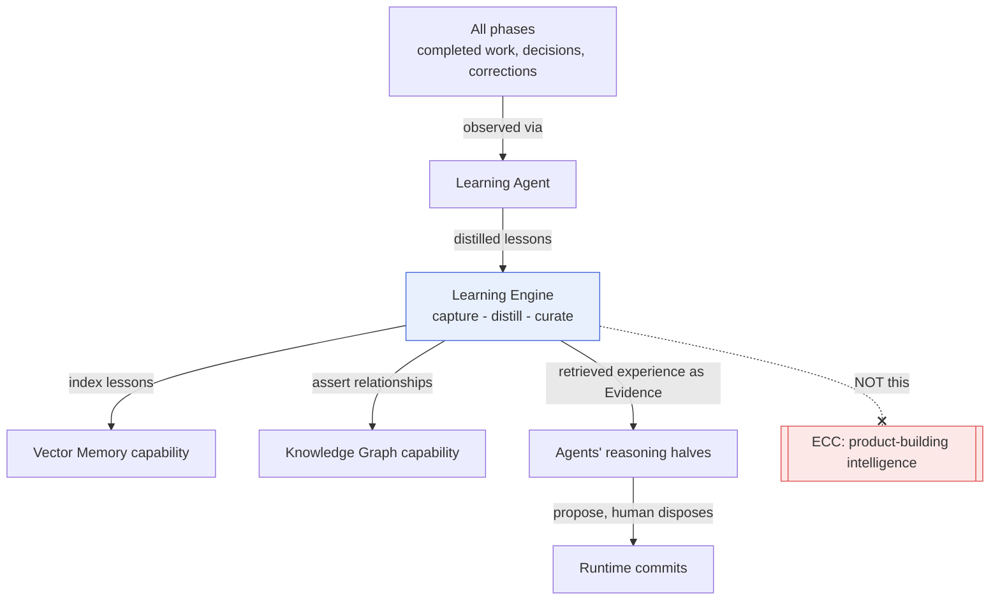
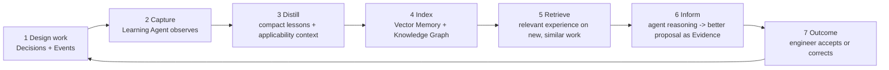

# Learning Engine

> **Ring:** Use cases / runtime (inner) — a cross-cutting, deterministic domain [Engine](../GLOSSARY.md#engine). The Learning Engine **captures reusable *engineering* experience** — successful design patterns, good defaults, and corrections the engineer made to the AI's proposals — and feeds it back so future [reasoning](../core/reasoning-engine-interface.md) and defaults improve. It exists because an AI-native engineering tool that does not get better from its own (audited, human-approved) history is leaving its main compounding advantage on the table. It is **cross-cutting**: per the [canonical phase map](../foundation/architecture-views.md) it is an *engine, not a phase* — it has **no state machine** and *observes all phases* via the [Learning Agent](../agents/learning-agent.md). It is **deterministic and contains no stochastic reasoning of its own** ([P3](../foundation/principles.md)): it organizes and retrieves experience; it does not generate judgement. **Boundary, stated up front:** reusable intelligence about *the engineering domain and a user's/org's designs* lives here; reusable intelligence about *how we build the product itself* (prompts, conventions, dev patterns) goes to [ECC](../GLOSSARY.md#ecc), never here.

---

## 1. Purpose & responsibilities

### What it owns

- **Experience capture.** Recording reusable engineering lessons from completed work: a topology that satisfied a class of requirements, a default value that repeatedly proved right, a [Decision](../foundation/engineering-domain-model.md#decision) the engineer *overrode* (a correction), a recurring [Violation](../foundation/engineering-domain-model.md#violation)-and-fix pair.
- **Distillation.** Turning raw [Event](../core/event-bus.md) history and [Decisions](../foundation/engineering-domain-model.md#decision) into compact, reusable units of experience with the context in which they applied (so a lesson is retrieved only when relevant).
- **Feedback into reasoning & defaults.** Making captured experience available to [Agents](../agents/README.md): better default proposals, prior-art suggestions, "last time this pattern, you did X" hints — surfaced as [Evidence](../foundation/engineering-domain-model.md#evidence), never as silent state changes.
- **Curation & confidence.** Tracking how often a lesson held vs. was overridden, so weak or stale lessons decay and strong ones rise — deterministically, from recorded outcomes.
- **Provenance of learning.** Every lesson links to the [Decisions](../foundation/engineering-domain-model.md#decision) and [Events](../core/event-bus.md) it was distilled from ([P5](../foundation/principles.md)); a suggestion can always be traced to the past designs that justify it.

### What it does **NOT** own

- **Product-building meta-intelligence.** Reusable prompts, doc conventions, agent-design patterns, "how we develop Electronics Agent Kit" — these go to [ECC](../GLOSSARY.md#ecc) per the project rule, **not** into this engine or these docs. *This is the defining boundary of the Learning Engine.*
- **Generating judgement.** It does not call a model. It supplies *retrieved experience*; an [Agent's](../agents/README.md) reasoning half may then reason over it via the [Reasoning Engine port](../core/reasoning-engine-interface.md) ([P3](../foundation/principles.md)).
- **Committing design changes.** A lesson is a *proposal/Evidence input*; only the deterministic runtime commits state, and only with the usual validation and (where required) [human approval](human-in-the-loop.md) ([P10](../foundation/principles.md)). Learning never silently mutates a design.
- **Being the store.** The persistence of embeddings and facts is the [Vector Store](../data/stores/vector-store.md) and [Knowledge-Graph Store](../data/stores/knowledge-graph-store.md); the engine uses the [Vector Memory](../knowledge/vector-memory.md) and [Knowledge Graph](../knowledge/knowledge-graph.md) capabilities, it is not those stores.
- **Cross-tenant leakage.** Whose experience may inform whose designs is a [Security/Policy](../core/contracts.md) matter; the engine respects those boundaries, it does not define sharing policy.

---

## 2. Position in the architecture

*Figure: the engine learns from observed engineering history and feeds experience back to agents; product-building intelligence is explicitly out of scope (it goes to ECC). Viewpoint: the engineering ring.*

- **Ring:** Use cases / runtime. Depends inward only — on the [Engineering Domain Model](../foundation/engineering-domain-model.md) (Decision, Evidence, Violation), the [Knowledge Graph](../knowledge/knowledge-graph.md) and [Vector Memory](../knowledge/vector-memory.md) capabilities (via their ports), and the [Event Sink/Source](../core/contracts.md) port ([P1](../foundation/principles.md)).
- **Depended on by:** the [Learning Agent](../agents/learning-agent.md) (its driver) and, indirectly, every [Agent](../agents/README.md) that asks for prior experience to inform a proposal.

---

## 3. The feedback loop

*Figure: the closed learning loop. The engineer's accept/correct at step 7 is itself captured at step 1, so the loop is also a curation signal. Viewpoint: the lifecycle of a lesson.*

### What a "lesson" is

A unit of captured experience, conceptually:

- **Pattern** — a reusable structure (a topology, a placement strategy, a default value) that recurred and worked.
- **Applicability context** — the conditions under which it applied (requirement class, [Constraint](../foundation/engineering-domain-model.md#constraint) profile, part family), so it is retrieved only when relevant.
- **Outcome history** — how often it held vs. was overridden; the basis of confidence.
- **Provenance** — links to the [Decisions](../foundation/engineering-domain-model.md#decision)/[Events](../core/event-bus.md) it came from.

### Corrections are first-class

When an engineer **overrides** an AI proposal, that disagreement is among the most valuable signals: it is captured as a correction lesson ("for this context, prefer X over the model's default Y"). This operationalizes [P10](../foundation/principles.md) (the engineer disposes) as a *learning* mechanism, not just a control mechanism.

### Curation & decay

Lessons carry **confidence** derived deterministically from recorded outcomes. Repeatedly-overridden or stale lessons decay and stop being surfaced; consistently-validated lessons strengthen. Because this is computed from recorded outcomes, it is reproducible ([P4](../foundation/principles.md)).

---

## 4. Relationship to Vector Memory and the Knowledge Graph

The Learning Engine is a **primary consumer** of both knowledge capabilities; it does not duplicate them.

| Capability | How the Learning Engine uses it |
|------------|--------------------------------|
| [Vector Memory](../knowledge/vector-memory.md) | index lessons and past designs for **semantic retrieval** — "find experience similar to the situation at hand." |
| [Knowledge Graph](../knowledge/knowledge-graph.md) | assert **structured relationships** a lesson implies (this pattern relates to this part family / requirement class / standard) and traverse them. |

The split mirrors the capabilities themselves: *similarity* retrieval is Vector Memory; *structured, relational* facts are the Knowledge Graph. A lesson typically lands in both — embedded for fuzzy recall, and linked for precise traversal and [Evidence](../foundation/engineering-domain-model.md#evidence) provenance.

---

## 5. Boundary with ECC (restated, because it matters)

| Reusable intelligence about… | Goes to |
|------------------------------|---------|
| the **engineering domain & designs** (topologies, defaults, corrections, prior art) | **Learning Engine** (this doc) |
| **building the product** (prompt patterns, doc conventions, agent/architecture patterns, dev workflows) | [ECC](../GLOSSARY.md#ecc) |

> **Why the hard split?** Conflating "what the system learns about electronics" with "what the team learns about building the system" would pollute the runtime's engineering memory with development trivia and, worse, risk leaking product-build knowledge into user-facing reasoning. Keeping them separate keeps the Learning Engine's experience purely about *engineering*, and keeps [ECC](../GLOSSARY.md#ecc) the home of product-build know-how ([CONVENTIONS.md](../CONVENTIONS.md) scope rule).

---

## 6. Contracts

- **Consumes:**
  - [Event Sink/Source port](../core/contracts.md) — observe the [Event](../core/event-bus.md) history (decisions, corrections, violation/fix pairs) to capture from.
  - [Vector Memory port](../knowledge/vector-memory.md) — index and similarity-retrieve lessons and past designs.
  - [Knowledge port](../knowledge/knowledge-graph.md) — assert and traverse the structured relationships a lesson implies.
  - [State Repository port](../core/contracts.md) — read-only, to ground a lesson's applicability context in real [Engineering State](../core/shared-state-model.md).
  - [Security/Policy port](../core/contracts.md) — enforce which experience may inform which project/tenant.
- **Provides (inner-ring):** retrieve-experience operations that an [Agent's](../agents/README.md) reasoning half uses to enrich proposals (surfaced as [Evidence](../foundation/engineering-domain-model.md#evidence)).
- **Does not consume** the [Reasoning Engine port](../core/reasoning-engine-interface.md) — it supplies inputs *to* reasoning, it is not reasoning ([P3](../foundation/principles.md)).

---

## 7. Failure modes

- **Over-fitting to history.** A lesson that worked in narrow contexts is mis-applied broadly — mitigated by strict applicability context and confidence decay; ultimately the engineer disposes ([P10](../foundation/principles.md)).
- **Stale lesson.** Out-of-date experience surfaced — mitigated by decay from recorded outcomes; a lesson never becomes binding state on its own.
- **Sparse data (cold start).** With little history, the engine simply surfaces less; agents fall back to first-principles reasoning. No fabricated experience.
- **Retrieval capability unavailable** ([Vector Memory](../knowledge/vector-memory.md)/[Knowledge Graph](../knowledge/knowledge-graph.md) down). The engine degrades to no-suggestion; design work proceeds without learning aid. See [`failure-taxonomy-and-degraded-modes.md`](../core/failure-taxonomy-and-degraded-modes.md).
- **Privacy/leakage risk.** Prevented by the [Security/Policy port](../core/contracts.md); cross-tenant experience is never surfaced without authorization.

---

## 8. Open decisions

- [ADR-0002](../decisions/0002-runtime-owns-knowledge-llm-as-reasoning-engine.md) — learning improves *reasoning inputs*, never bypasses the reasoning boundary.
- [ADR-0009](../decisions/0009-determinism-and-replay-strategy.md) — confidence/curation computed deterministically from recorded outcomes.
- **Open:** the scope of experience sharing (per-user / per-org / global) and its policy home — future ADR, governed by [`crosscutting/security.md`](../crosscutting/security.md).
- **Open:** whether distillation thresholds are configurable via the [Configuration port](../core/contracts.md) — future ADR.

---

## 9. Related documents

[`agents/learning-agent.md`](../agents/learning-agent.md) · [`knowledge/vector-memory.md`](../knowledge/vector-memory.md) · [`knowledge/knowledge-graph.md`](../knowledge/knowledge-graph.md) · [`foundation/engineering-domain-model.md`](../foundation/engineering-domain-model.md) (Decision, Evidence) · [`engineering/human-in-the-loop.md`](human-in-the-loop.md) · [`core/provenance-and-traceability.md`](../core/provenance-and-traceability.md) · [`GLOSSARY.md`](../GLOSSARY.md#ecc) (ECC boundary) · [`foundation/architecture-views.md`](../foundation/architecture-views.md)
