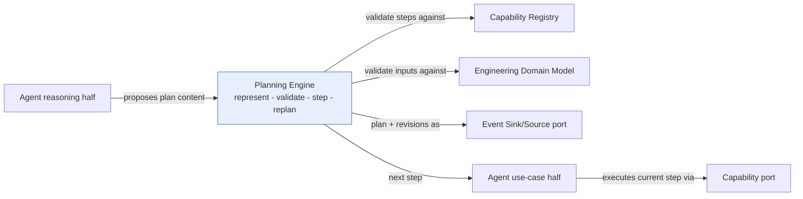
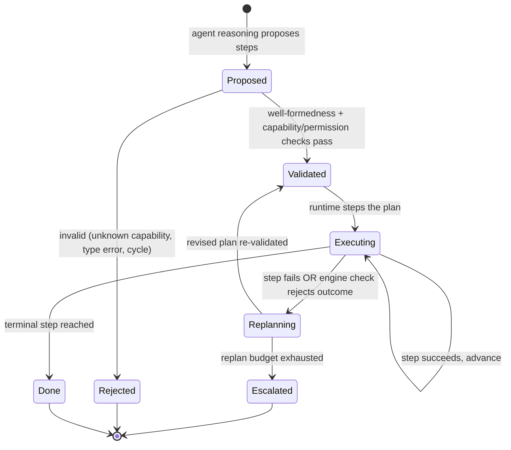
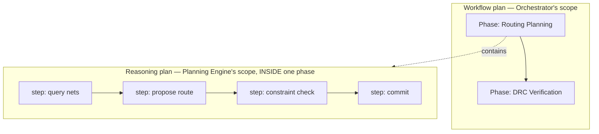

# Planning Engine

> **Ring:** Use cases / runtime (inner) — a deterministic domain [Engine](../GLOSSARY.md#engine). The Planning Engine **produces, validates, and manages [reasoning plans](../GLOSSARY.md#the-word-planning-disambiguation)**: the short-horizon, ordered sequences of steps an [Agent](../agents/README.md) intends to take *inside one [Phase](../GLOSSARY.md#phase)*. It exists so that an agent's plan is a **first-class, inspectable, replayable artifact** rather than improvised control flow hidden in a prompt — making agent behaviour auditable, resumable, and reproducible ([P4](../foundation/principles.md), [P5](../foundation/principles.md)). The engine is **deterministic and contains no stochastic reasoning** ([P3](../foundation/principles.md)): an agent's reasoning half may *propose* plan content via the [Reasoning Engine port](../core/reasoning-engine-interface.md), but the engine's job is to *represent, validate, and step* plans deterministically. **It is NOT the [Workflow Orchestrator](../core/workflow-orchestration.md)**, which owns the project-wide [phase DAG](../GLOSSARY.md#the-word-planning-disambiguation); this section's "plan" lives strictly *within* a single phase. See the disambiguation table in [`GLOSSARY.md`](../GLOSSARY.md).

---

## 1. Purpose & responsibilities

### What it owns

- **The reasoning-plan representation.** A typed, serializable structure for a sequence of steps an agent will execute within a phase: each step names a [Capability](../core/capability-registry.md) to invoke or an [Engine](../GLOSSARY.md#engine) check to run, its inputs (in [domain-model](../foundation/engineering-domain-model.md) terms), and its expected effect.
- **Plan validation (well-formedness).** Checking that a proposed plan is executable *before* it runs: every step references a registered, permitted [Capability](../core/capability-registry.md); inputs are typed and available; step ordering respects data dependencies; the plan has no cycles and a defined terminal step.
- **Plan stepping & progress.** Tracking which step is current, what each step produced, and whether the plan is on-track — so a phase can pause, checkpoint, and resume mid-plan.
- **Replanning.** Producing a *revised* plan deterministically when a step fails, a [Constraint](../foundation/engineering-domain-model.md#constraint) check rejects an outcome, or new information arrives — including bounded retry and fallback-step policies.
- **Plan provenance.** Recording the plan, its origin (which reasoning call proposed it, if any), and its revisions as [Events](../core/event-bus.md), so the *strategy* behind a result is auditable, not just the result.

### What it does **NOT** own

- **The project-wide phase graph.** Branches, gates, and verification loop-backs across phases belong to the [Workflow Orchestrator](../core/workflow-orchestration.md). *This engine never crosses a phase boundary.* (See §4 for the explicit contrast.)
- **Producing the stochastic content of a plan.** *Which* steps a clever plan should contain is judgement; an [Agent's](../agents/README.md) reasoning half asks the [Reasoning Engine port](../core/reasoning-engine-interface.md) for that. The engine *validates and runs* it; it does not *invent* it.
- **Executing capabilities.** Invocation is the [Agent](../agents/README.md) acting through the [Capability port](../core/contracts.md); committing effects is the [runtime/Execution Engine](../core/execution-engine.md). The Planning Engine says *what to do next*, not *how the runtime commits it*.
- **Scheduling / timing.** *When* a runnable phase executes is the [Scheduler](../core/scheduler.md).
- **The phase's state model.** A [Phase's](../GLOSSARY.md#phase) States/Transitions are its [state-machine instance](../state-machines/README.md); a reasoning plan is the agent's intent *within* a state, not the FSM itself (anti-duplication rule, [`CONVENTIONS.md`](../CONVENTIONS.md)).

---

## 2. Position in the architecture

*Figure: the engine sits between an agent's reasoning (which proposes plan content) and its deterministic use-case (which executes steps). Viewpoint: one agent inside one phase.*

- **Ring:** Use cases / runtime. Depends inward only — on the [Engineering Domain Model](../foundation/engineering-domain-model.md), the [Capability Registry](../core/capability-registry.md) (to validate step references), and the [Event Sink/Source](../core/contracts.md) port ([P1](../foundation/principles.md)).
- **Depended on by:** the agents of phases that need multi-step strategies — see the [canonical phase map](../foundation/architecture-views.md) "Planning" column: [Requirement Planning](../state-machines/requirement-planning.md), [Engineering Analysis](../state-machines/engineering-analysis.md), [Schematic Planning](../state-machines/schematic-planning.md), [PCB Floor Planning](../state-machines/pcb-floor-planning.md), and [Routing Planning](../state-machines/routing-planning.md).

---

## 3. The reasoning-plan lifecycle

*Figure: a reasoning plan moves Proposed → Validated → Executing, with deterministic replanning on failure and escalation when bounded retries are exhausted. Viewpoint: the Planning Engine.*

### Plan representation

A reasoning plan is, conceptually, a small directed acyclic graph of **steps**, each with:

- a **target** — a [Capability](../core/capability-registry.md) to invoke or an [Engine](../GLOSSARY.md#engine) check (e.g. a [Constraint Engine](constraint-engine.md) check) to run;
- **typed inputs** expressed in [domain-model](../foundation/engineering-domain-model.md) terms (no raw strings where a [Physical Quantity](units-and-quantities.md) belongs);
- an **expected effect / success condition** the step is checked against;
- optional **fallback** steps used during replanning.

Because steps name registered capabilities with declared side-effects, a plan's blast radius is knowable before it runs — the engine can reject a plan that would exceed the agent's permitted [capabilities](../core/capability-registry.md) ([P8](../foundation/principles.md), security via the [Security/Policy port](../core/contracts.md)).

### Validation rules

1. **Every step references a registered, permitted capability or engine check.** Unknown or unauthorized targets fail validation.
2. **Inputs are typed and resolvable** from current [Engineering State](../core/shared-state-model.md).
3. **Ordering respects data dependencies** and is acyclic with a defined terminal step.
4. **Declared side-effects are within budget** ([Cost-budget port](../core/contracts.md)) and autonomy ([Autonomy Level](human-in-the-loop.md)).

### Replanning

When a step fails, an [Engine](../GLOSSARY.md#engine) check rejects its outcome, or the design state has shifted, the engine triggers **deterministic replanning**: apply the recorded fallback policy, optionally request fresh plan content from the agent's reasoning half (a recorded reasoning call), re-validate, and resume. Replanning is **bounded** — a retry/replan budget prevents infinite loops; on exhaustion the plan is **Escalated** to the engineer or to the [Workflow Orchestrator](../core/workflow-orchestration.md) as a phase failure ([P13](../foundation/principles.md)).

---

## 4. Reasoning plan vs. workflow plan (the load-bearing contrast)

This is the disambiguation the [glossary](../GLOSSARY.md#the-word-planning-disambiguation) demands. The two are different scopes, different owners, different lifetimes:

| Question | Reasoning plan (this engine) | Workflow plan ([Orchestrator](../core/workflow-orchestration.md)) |
|----------|------------------------------|------------------------------------------------------------------|
| **Scope** | steps *within one [Phase](../GLOSSARY.md#phase)* | the *graph of all Phases* in a [Project](../GLOSSARY.md#project) |
| **Horizon** | short — minutes of agent work | long — the whole design effort |
| **Owner** | Planning Engine, driven by an [Agent](../agents/README.md) | [Workflow Orchestrator](../core/workflow-orchestration.md) |
| **Unit** | a *step* (capability invocation / engine check) | a *phase* (a [state machine](../state-machines/README.md)) |
| **Branches/loops** | replanning within the phase | gates and verification loop-backs across phases |
| **Failure** | replan or escalate the phase | loop back to a fixing phase, or pause at a gate |

*Figure: the workflow plan sequences phases; a reasoning plan sequences steps inside one of them. They never share a scope. Viewpoint: the two planners side by side.*

> **Why separate them?** Mixing them recreates the god-object the review warned against ([P8](../foundation/principles.md)) and violates mechanism/policy/instance separation ([P7](../foundation/principles.md)). Keeping reasoning plans phase-local lets the orchestrator stay phase-agnostic and lets agent strategy evolve without touching the project graph.

---

## 5. Determinism & provenance

- **Plans are recorded.** The plan, the reasoning call that proposed it (if any), and every revision are [Events](../core/event-bus.md) — so replaying recorded reasoning outputs reproduces the same plan and the same execution ([P4](../foundation/principles.md)).
- **The strategy is auditable.** Because the plan is an artifact, the engineer can see *not just what the agent did, but what it intended and why it revised* — central to trust ([P5](../foundation/principles.md)).
- **No hidden control flow.** An agent cannot "improvise" outside its plan: steps go through validated capabilities, and unplanned action is not representable.

---

## 6. Contracts

- **Consumes:**
  - [Capability Registry](../core/capability-registry.md) / [Capability port](../core/contracts.md) — to validate that each step targets a registered, permitted capability and to surface declared side-effects.
  - [Event Sink/Source port](../core/contracts.md) — to record plans and revisions for [determinism](../core/determinism-and-reproducibility.md) and [provenance](../core/provenance-and-traceability.md).
  - [State Repository port](../core/contracts.md) — read-only, to resolve and type-check step inputs against current [Engineering State](../core/shared-state-model.md).
  - [Cost-budget port](../core/contracts.md) — to bound replanning and validate that a plan's declared effects fit budget.
- **Does not consume** the [Reasoning Engine port](../core/reasoning-engine-interface.md) directly — the *agent's reasoning half* does, then hands proposed plan content to this engine ([P3](../foundation/principles.md), [P8](../foundation/principles.md)).
- **Provides (inner-ring):** validate-plan, step-plan, replan operations, used by an agent's [deterministic use-case half](../agents/README.md).

---

## 7. Failure modes

- **Invalid plan proposed.** Rejected at validation; the agent is asked to re-propose, bounded by budget. An invalid plan never executes.
- **Step fails / outcome rejected by an engine.** Triggers deterministic replanning within the retry budget.
- **Replan budget exhausted.** The plan is **Escalated** — the phase reports failure to the [Workflow Orchestrator](../core/workflow-orchestration.md), which may loop back or pause at a [gate](human-in-the-loop.md) ([P10](../foundation/principles.md)).
- **Capability becomes unavailable mid-plan.** The step fails cleanly; replanning may route around it via a fallback, else escalate. See [`failure-taxonomy-and-degraded-modes.md`](../core/failure-taxonomy-and-degraded-modes.md).
- **Reasoning unavailable for replanning.** The engine degrades to recorded fallback steps or escalates; it never fabricates steps ([P3](../foundation/principles.md)).

---

## 8. Open decisions

- [ADR-0006](../decisions/0006-agent-fsm-separation.md) — the agent's reasoning/use-case split that this engine sits across.
- [ADR-0009](../decisions/0009-determinism-and-replay-strategy.md) — recording plans/revisions so execution replays identically.
- [ADR-0010](../decisions/0010-human-in-the-loop-autonomy-levels.md) — how plan steps with side-effects bind to autonomy gates.
- **Open:** whether the replan budget is fixed, per-phase, or project-configurable via the [Configuration port](../core/contracts.md) — to be captured as a future ADR.

---

## 9. Related documents

[`core/workflow-orchestration.md`](../core/workflow-orchestration.md) (the contrast) · [`GLOSSARY.md`](../GLOSSARY.md#the-word-planning-disambiguation) (disambiguation) · [`agents/README.md`](../agents/README.md) · [`core/capability-registry.md`](../core/capability-registry.md) · [`core/execution-engine.md`](../core/execution-engine.md) · [`core/reasoning-engine-interface.md`](../core/reasoning-engine-interface.md) · [`engineering/constraint-engine.md`](constraint-engine.md) · [`core/determinism-and-reproducibility.md`](../core/determinism-and-reproducibility.md) · [`foundation/architecture-views.md`](../foundation/architecture-views.md)
