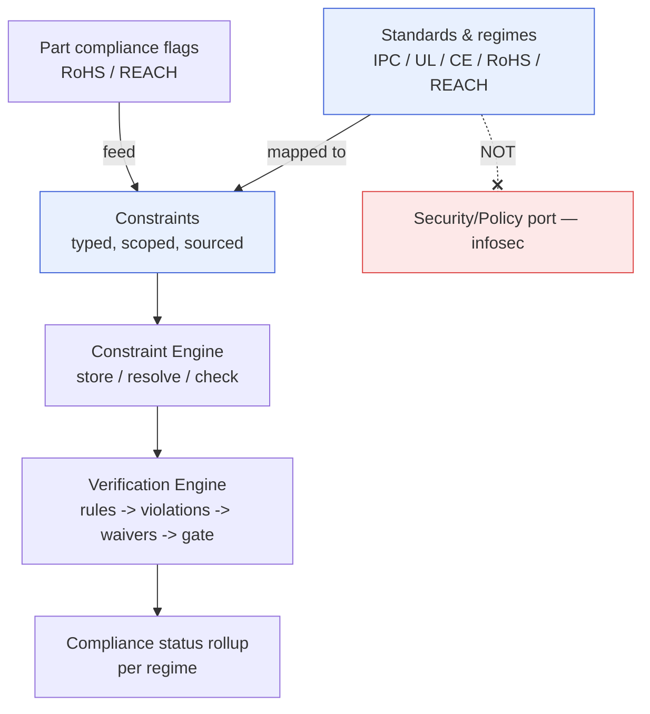
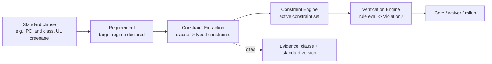

# Standards & Compliance

> **Ring:** Use cases / runtime (inner) — a domain modelling concern. This document defines how **engineering standards and regulatory regimes** (IPC, UL, CE, RoHS, REACH, and the like) are represented **as [Constraints](../foundation/engineering-domain-model.md#constraint)** and enforced through the existing [Constraint Engine](constraint-engine.md) and [Verification Engine](verification-engine.md) — rather than as a parallel, bespoke compliance subsystem. It exists because compliance is not a separate kind of checking: a creepage requirement, an IPC land-pattern class, a RoHS material restriction are all *machine-checkable restrictions on the design* — exactly what a [Constraint](../foundation/engineering-domain-model.md#constraint) is. Modelling standards as constraints means they inherit resolution, continuous checking, violations, waivers, gating, and provenance **for free**, and stay coherent with every other design rule. **This is engineering/regulatory compliance — explicitly distinct from information-security** (the [Security/Policy port](../core/contracts.md) and [`crosscutting/security.md`](../crosscutting/security.md)), which is about access control and data protection, not about whether a board meets UL.

---

## 1. Purpose & responsibilities

### What it owns

- **The representation of standards as constraints.** The discipline and model by which a standard clause becomes one or more typed [Constraints](../foundation/engineering-domain-model.md#constraint) with scope, bound, severity, and a [Provenance Link](../foundation/engineering-domain-model.md#provenance-link) back to the clause.
- **Compliance profiles.** Grouping the constraints that together represent "this design targets CE + RoHS + IPC Class 2," so a project declares its applicable regimes and the right constraint set activates.
- **Standard→constraint provenance.** Ensuring every enforced compliance rule cites its source clause/standard version, so an audit can answer "which requirement of which standard forced this" ([P5](../foundation/principles.md)).
- **Compliance status rollup.** Presenting, from the underlying [Violations](../foundation/engineering-domain-model.md#violation)/[Waivers](../foundation/engineering-domain-model.md#waiver), a per-regime compliance picture (met / open / waived) for the engineer and for documentation.

### What it does **NOT** own

- **The constraint/verification machinery.** Storing/resolving/checking is the [Constraint Engine](constraint-engine.md); violations/waivers/gating is the [Verification Engine](verification-engine.md). This area *populates* and *interprets* them for compliance; it does not reimplement them.
- **Information security.** Access control, authn/z, secret handling, redaction, tenant isolation are the [Security/Policy port](../core/contracts.md) and [`crosscutting/security.md`](../crosscutting/security.md). *Compliance here = regulatory/engineering, not infosec.* (See §5.)
- **The full text of standards.** These docs describe *how* standards map to constraints, not the copyrighted standard text itself; the authoritative clauses live in referenced source material via [Evidence](../foundation/engineering-domain-model.md#evidence).
- **Deciding to waive a compliance violation.** That is a [human-in-the-loop](human-in-the-loop.md) decision at the project's [Autonomy Level](human-in-the-loop.md) ([P10](../foundation/principles.md)); compliance waivers are especially weighty and recorded with full provenance.
- **Stochastic interpretation.** A model may *help draft* a clause→constraint mapping (an [Agent's](../agents/README.md) reasoning, reviewed by a human), but the enforced constraint is deterministic ([P3](../foundation/principles.md)).

---

## 2. Position in the architecture

*Figure: standards become constraints, flow through the existing engines, and roll up into a per-regime compliance view. Infosec is a separate axis. Viewpoint: the engineering ring.*

- **Ring:** Use cases / runtime. Depends inward only — on the [Constraint Engine](constraint-engine.md), [Verification Engine](verification-engine.md), [Engineering Domain Model](../foundation/engineering-domain-model.md), and [Physical Quantities](units-and-quantities.md) ([P1](../foundation/principles.md)).
- **Depended on by:** any phase whose rules include compliance — notably [DFM](../state-machines/dfm-verification.md) (IPC/manufacturing), [BOM Planning](../state-machines/bom-planning.md) (RoHS/REACH via part flags), [Component Placement](../state-machines/component-placement.md)/[Routing Planning](../state-machines/routing-planning.md) (creepage/clearance for safety regimes), and [Requirement Planning](../state-machines/requirement-planning.md) (declaring target regimes as [Requirements](../foundation/engineering-domain-model.md#requirement)).

---

## 3. How a standard becomes enforceable

*Figure: the path from a standard clause to an enforced, audit-traceable check, reusing the normal extraction→constraint→verification chain. Viewpoint: one compliance requirement.*

1. **Declare the regime.** A project states its target standards as [Requirements](../foundation/engineering-domain-model.md#requirement) (category: regulatory) during [Requirement Planning](../state-machines/requirement-planning.md).
2. **Map clauses to constraints.** [Constraint Extraction](../state-machines/constraint-extraction.md) turns each applicable clause into typed [Constraints](../foundation/engineering-domain-model.md#constraint) (e.g. UL creepage → a minimum-distance constraint scoped to mains-voltage nets), each citing its clause as [Evidence](../foundation/engineering-domain-model.md#evidence).
3. **Enforce uniformly.** Those constraints live in the [Constraint Engine](constraint-engine.md) and are checked like any other; the [Verification Engine](verification-engine.md) raises [Violations](../foundation/engineering-domain-model.md#violation), accepts [Waivers](../foundation/engineering-domain-model.md#waiver), and contributes to the [manufacturing gate](verification-engine.md).
4. **Roll up.** Per-regime status is derived from the underlying violation/waiver state.

### Example mappings (illustrative)

| Standard / regime | Becomes constraint(s) of type | Scope | Typical severity |
|-------------------|-------------------------------|-------|------------------|
| **IPC** land-pattern class | manufacturing rule (footprint geometry) | [Footprints](../foundation/engineering-domain-model.md#footprint) | error/warning |
| **UL / IEC** creepage & clearance | physical clearance | mains/high-voltage [Nets](../foundation/engineering-domain-model.md#net) | error |
| **CE** (umbrella) | composite of EMC + safety constraints | board / regions | error |
| **RoHS** | compliance rule (restricted substances) | [Parts](../foundation/engineering-domain-model.md#part)/[BOM](../compiler/ir/bom-ir.md) | error |
| **REACH** | compliance rule (substances of concern) | [Parts](../foundation/engineering-domain-model.md#part)/[BOM](../compiler/ir/bom-ir.md) | error/warning |

RoHS/REACH leverage the **compliance flags** the [Component Library](component-library.md) tracks per [Part](../foundation/engineering-domain-model.md#part) — so a non-RoHS part in a RoHS design surfaces as a violation automatically.

---

## 4. Why standards-as-constraints (the justification)

> **[P13](../foundation/principles.md) rationale.** A separate compliance engine was rejected. Three reasons:
> 1. **No semantic difference.** A compliance rule *is* a machine-checkable restriction — the definition of a [Constraint](../foundation/engineering-domain-model.md#constraint). Inventing a second concept would duplicate resolution, checking, severity, waivers, gating, and provenance, and the two would drift (the exact failure the [Verification Engine](verification-engine.md) was factored to prevent).
> 2. **Coherent conflict handling.** Compliance constraints must be resolved *against* electrical/physical ones (a clearance demanded by both signal integrity and safety). Only one [Constraint Engine](constraint-engine.md) can resolve them together; two engines could not.
> 3. **Unified audit.** "Show me why this clearance is 0.6 mm" should yield one provenance chain whether the driver was a designer choice or a UL clause. One representation makes that possible ([P5](../foundation/principles.md)).
>
> The cost is the mapping discipline (clauses → typed constraints with sourced evidence); the payoff is that compliance is a first-class, conflict-aware, audit-traceable citizen of the same machinery as everything else.

---

## 5. Compliance vs. security (explicit disambiguation)

| Axis | "Compliance" *here* | "Security" (elsewhere) |
|------|---------------------|------------------------|
| Question | does the **design** meet engineering/regulatory standards? | who may **access/modify** data and how is it protected? |
| Mechanism | [Constraints](../foundation/engineering-domain-model.md#constraint) + [Verification Engine](verification-engine.md) | [Security/Policy port](../core/contracts.md) |
| Home doc | this document | [`crosscutting/security.md`](../crosscutting/security.md) |
| Examples | IPC, UL, CE, RoHS, REACH | authn/z, secrets, redaction, tenant isolation |

They intersect only at policy edges (e.g. who may *waive* a compliance violation — an authorization question routed to the [Security/Policy port](../core/contracts.md)), but they are different concerns and must not be conflated.

---

## 6. Contracts

- **Consumes:**
  - [Constraint Engine](constraint-engine.md) (inner-ring) — assert and resolve standard-derived constraints.
  - [Verification Engine](verification-engine.md) (inner-ring) — produce compliance [Violations](../foundation/engineering-domain-model.md#violation)/[Waivers](../foundation/engineering-domain-model.md#waiver) and contribute to the gate.
  - [Knowledge port](../knowledge/knowledge-graph.md) — relate clauses, regimes, and the constraints/parts they touch; hold clause [Evidence](../foundation/engineering-domain-model.md#evidence).
  - [Parts-data port](../core/contracts.md) — obtain per-part RoHS/REACH compliance flags (via the [Component Library](component-library.md)).
  - [Security/Policy port](../core/contracts.md) — *only* to authorize compliance-waiver actions (not for the checks themselves).
- **Provides (inner-ring):** the per-regime compliance rollup projection (for the [Presentation/Query port](../core/contracts.md) and compliance documentation).
- **Does not define** a new outer-ring contract; it is a modelling/usage layer over existing engines and ports.

---

## 7. Failure modes

- **Clause mis-mapped to a constraint.** Caught by human review of the mapping (the model only *drafts* it); a mis-mapping is a [Decision](../foundation/engineering-domain-model.md#decision) the engineer can correct, with the change recorded.
- **Conflicting compliance vs. electrical constraint.** Resolved (or surfaced as a [Conflict](constraint-engine.md)) by the one [Constraint Engine](constraint-engine.md) — never by ad-hoc compromise.
- **Standard version drift.** Each constraint cites a standard *version*; a version change re-opens affected constraints for re-assessment rather than silently applying. See [`failure-taxonomy-and-degraded-modes.md`](../core/failure-taxonomy-and-degraded-modes.md).
- **Part compliance data missing.** The compliance check is [indeterminate](constraint-engine.md) (not a silent pass); the part is flagged for resolution.
- **Unauthorized compliance waiver attempt.** Rejected by the [Security/Policy port](../core/contracts.md); compliance waivers require appropriate authority ([P10](../foundation/principles.md)).

---

## 8. Open decisions

- [ADR-0007](../decisions/0007-units-and-physical-quantity-type-system.md) — compliance bounds are typed quantities (creepage in mm, etc.).
- [ADR-0010](../decisions/0010-human-in-the-loop-autonomy-levels.md) — authorization required to waive a compliance violation.
- [ADR-0005](../decisions/0005-ir-as-canonical-phase-boundary-representation.md) — compliance status carried through the relevant [IRs](../compiler/compiler-ir.md) and into the [Manufacturing IR](../compiler/ir/manufacturing-ir.md).
- **Open:** how standard *versions* and certification artifacts are catalogued and referenced as [Evidence](../foundation/engineering-domain-model.md#evidence) — future ADR.

---

## 9. Related documents

[`engineering/constraint-engine.md`](constraint-engine.md) · [`engineering/verification-engine.md`](verification-engine.md) · [`engineering/component-library.md`](component-library.md) (compliance flags) · [`state-machines/constraint-extraction.md`](../state-machines/constraint-extraction.md) · [`state-machines/dfm-verification.md`](../state-machines/dfm-verification.md) · [`engineering/human-in-the-loop.md`](human-in-the-loop.md) · [`crosscutting/security.md`](../crosscutting/security.md) (the *other* meaning of compliance) · [`foundation/engineering-domain-model.md`](../foundation/engineering-domain-model.md) · [`core/contracts.md`](../core/contracts.md)
