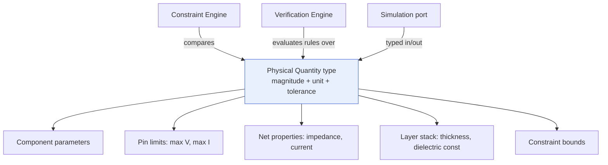

# Units & Physical Quantities

> **Ring:** Entities / foundation-adjacent, consumed across the Use cases / runtime ring. This document defines the **[Physical Quantity](../foundation/engineering-domain-model.md) type system** that realizes [P9 — Physical Correctness Is Typed](../foundation/principles.md): no physical value in the system is ever a bare number. Every voltage, current, length, temperature, capacitance, inductance, impedance, or material property is a typed value carrying **magnitude + unit + tolerance**, subject to **dimensional analysis**. It exists because dimensional and unit errors are a notorious, expensive, and *entirely preventable* class of engineering defect — a "3.3" that is volts in one place and millivolts in another, a clearance compared in mils against a bound in millimetres. Making quantities first-class turns a whole category of runtime disasters into impossible-to-represent states. See [ADR-0007](../decisions/0007-units-and-physical-quantity-type-system.md).

---

## 1. Purpose & responsibilities

### What it owns

- **The Physical Quantity model.** The conceptual type that pairs a **magnitude**, a **unit** (with its dimension), and a **tolerance** (symmetric or asymmetric, absolute or relative).
- **Dimensional analysis.** The rules that make operations dimensionally sound: you may add quantities of the same dimension, multiply/divide to derive new dimensions, and compare only commensurable quantities — never silently mix dimensions.
- **Unit categories & conversion.** The catalog of supported quantity kinds and the *defined, lossless-where-possible* conversions among units within a kind.
- **Tolerance propagation.** How tolerance flows through derived quantities and comparisons (a comparison near a bound must respect tolerance, not just nominal value).
- **Derating semantics.** Representing a derated rating (a capacitor's effective capacitance at voltage/temperature, a component run below its absolute-maximum) as a first-class, traceable adjustment to a quantity.
- **Canonical normalization.** A canonical internal form per dimension so that equality, ordering, and storage are unambiguous and [reproducible](../core/determinism-and-reproducibility.md) ([P4](../foundation/principles.md)).

### What it does **NOT** own

- **The entities that carry quantities.** [Components](../foundation/engineering-domain-model.md#component), [Pins](../foundation/engineering-domain-model.md#pin), [Nets](../foundation/engineering-domain-model.md#net), [Constraints](../foundation/engineering-domain-model.md#constraint), and [Board](../foundation/engineering-domain-model.md#board) stack-ups are defined in the [Engineering Domain Model](../foundation/engineering-domain-model.md); this system provides the *value type* they use.
- **Deciding bounds.** A clearance *value* is a Physical Quantity; the *rule* that a clearance must be ≥ some bound belongs to the [Constraint Engine](constraint-engine.md) / [Verification Engine](verification-engine.md).
- **Sourcing parameter values.** Where a part's rated current comes from (a [datasheet](component-library.md), the [Parts-data port](../core/contracts.md)) is the [Component Library](component-library.md)'s concern; this system types the value once it arrives.
- **Numeric computation engines.** Simulation math runs through the [Simulation port](../core/contracts.md); this system types the inputs and interprets the typed outputs.
- **Stochastic reasoning.** Purely deterministic; no model involvement ([P3](../foundation/principles.md)).

---

## 2. Position in the architecture

*Figure: the Physical Quantity type is the shared value type underneath nearly every numeric facet of the domain. Viewpoint: cross-cutting through the engineering ring.*

- **Ring:** the type belongs with the [Entities](../foundation/engineering-domain-model.md) (it depends on nothing) and is consumed everywhere in the runtime ring ([P1](../foundation/principles.md)).
- **Depended on by:** the [Engineering Domain Model](../foundation/engineering-domain-model.md), [Constraint Engine](constraint-engine.md), [Verification Engine](verification-engine.md), [Component Library](component-library.md), every [IR](../compiler/compiler-ir.md), and the [Simulation port](../core/contracts.md) interpretation.

---

## 3. The Physical Quantity model

A Physical Quantity is conceptually a triple:

| Part | Meaning | Example |
|------|---------|---------|
| **Magnitude** | the numeric value in some unit | `3.3` |
| **Unit** | the unit and its dimension | volt (dimension: electric potential) |
| **Tolerance** | the permitted deviation | `±5 %` (relative) or `±0.1 V` (absolute), possibly asymmetric `+10 %/−20 %` |

So `3.3 V ±5 %` is one value, not three loose fields. Equality and ordering operate on a **canonical normalized form** per dimension, so `3300 mV` and `3.3 V` are the same quantity and comparisons are unambiguous and reproducible.

### Dimensional analysis rules

- **Add / subtract:** only within the same dimension (V + V ✓; V + A ✗ — rejected at the type boundary).
- **Multiply / divide:** dimensions combine (V ÷ A = Ω; V × A = W) — derived dimensions are computed, never guessed.
- **Compare:** only commensurable quantities; a comparison across dimensions is a type error surfaced to the engineer, never a silent coercion.

This is the mechanism that makes a unit-mismatch bug **unrepresentable**, rather than merely discouraged.

---

## 4. Unit categories

The catalog spans the quantities electronics engineering needs (illustrative, extensible — additions are governed by [ADR-0007](../decisions/0007-units-and-physical-quantity-type-system.md)):

| Category | Unit(s) | Typical carriers |
|----------|---------|------------------|
| Electric potential | volt (V) | [Pin](../foundation/engineering-domain-model.md#pin) max voltage, [Net](../foundation/engineering-domain-model.md#net) voltage, supply rails |
| Electric current | ampere (A) | pin/net current limits, trace ampacity |
| Resistance | ohm (Ω) | resistor value, impedance target |
| Capacitance | farad (F) | capacitor value, derated effective C |
| Inductance | henry (H) | inductor value, parasitic L |
| Length | metre (m) / mm / mil | clearances, trace width, [Placement](../foundation/engineering-domain-model.md#placement) coordinates, board dimensions |
| Temperature | degree Celsius (°C) / K | thermal limits, junction temperature |
| Power | watt (W) | dissipation, supply budget |
| Frequency | hertz (Hz) | clock/signal rates, EMC bands |
| Time | second (s) | timing, rise/fall |
| Material property | dielectric constant (dimensionless), thermal conductivity | [Board](../foundation/engineering-domain-model.md#board) layer stack-up |

Each category defines its units and the **defined conversions** among them; conversions are exact where the unit system allows and otherwise carry their rounding behaviour explicitly (no [silent truncation](../foundation/principles.md), [P13](../foundation/principles.md)).

---

## 5. Tolerance & derating

### Tolerance propagation

Real components are not their nominal value. Tolerance is part of the quantity, so:

- a **comparison near a bound** can be evaluated against the worst case, not just nominal (a `0.20 mm ±0.02 mm` clearance against a `≥ 0.20 mm` bound is *not* unconditionally satisfied);
- a **derived quantity** carries propagated tolerance (worst-case or statistical, with the method recorded), so downstream checks see honest uncertainty.

### Derating

Many ratings are conditional: a ceramic capacitor loses capacitance under DC bias and temperature; a device must run below its absolute-maximum. **Derating** is modelled as a first-class, traceable transformation of a quantity — the effective value, the derating basis, and a [Provenance Link](../foundation/engineering-domain-model.md#provenance-link) to the rule/datasheet that justified it. This lets the [Constraint Engine](constraint-engine.md) and [Verification Engine](verification-engine.md) check against *effective* values, and lets the engineer see *why* an effective value differs from the nominal ([P5](../foundation/principles.md)).

---

## 6. Why this prevents whole error classes

> **The justification [P13](../foundation/principles.md) demands.** Catastrophic engineering errors have repeatedly traced to unit confusion (the canonical aerospace metric/imperial losses; routine EDA mistakes mixing mils and millimetres). In a system where AI proposes values, the risk multiplies: a model can emit a plausible number in the wrong unit. By making every physical value a typed quantity:
> - a model proposal is **schema-validated** into a quantity *with* a unit before it can touch state ([P3](../foundation/principles.md)) — a unitless or wrong-dimension proposal is rejected at the [reasoning boundary](../core/reasoning-engine-interface.md);
> - cross-dimension comparisons become **type errors**, not silent wrong answers;
> - unit conversion is **centralized and defined once**, not re-implemented (and mis-implemented) per phase;
> - tolerance and derating are **explicit**, so "passes nominally, fails at worst case" defects surface.
>
> The cost is modest discipline at every numeric boundary; the payoff is the elimination of an entire defect category. This is the same bargain the type system makes elsewhere, applied to physics.

---

## 7. Contracts

- **Consumed by (inner-ring):** the [Constraint Engine](constraint-engine.md) (typed bound comparison), the [Verification Engine](verification-engine.md) (rule evaluation), the [Component Library](component-library.md) (typed parameters), every [IR](../compiler/compiler-ir.md) (typed serialization).
- **Boundary interactions via ports:**
  - [Reasoning Engine port](../core/reasoning-engine-interface.md) — model proposals of physical values are schema-validated into Physical Quantities (unit required) before use.
  - [Simulation port](../core/contracts.md) — analysis inputs are typed quantities; results are interpreted back into typed [Analysis Results](../foundation/engineering-domain-model.md#analysis-result).
  - [Parts-data port](../core/contracts.md) — datasheet parameters arrive and are typed (via the [Component Library](component-library.md)).
- This system **defines no new outer-ring contract**; it is a value type used by other components' contracts. Per [contract rule 2](../core/contracts.md), contracts speak in domain terms — Physical Quantity is part of that vocabulary.

---

## 8. Failure modes

- **Unit mismatch / cross-dimension operation.** Rejected at the type boundary as an error; never coerced silently.
- **Unitless model proposal.** Rejected at the [reasoning boundary](../core/reasoning-engine-interface.md); the agent must re-propose with a unit ([P3](../foundation/principles.md)).
- **Lossy conversion required.** Performed with explicit, recorded rounding behaviour — never a silent truncation ([P13](../foundation/principles.md)).
- **Out-of-range / nonsensical magnitude** (e.g. negative absolute temperature). Flagged as invalid at construction.
- **Tolerance ignored near a bound.** Prevented by tolerance-aware comparison in the consuming engines. See [`failure-taxonomy-and-degraded-modes.md`](../core/failure-taxonomy-and-degraded-modes.md).

---

## 9. Open decisions

- [ADR-0007](../decisions/0007-units-and-physical-quantity-type-system.md) — the Physical Quantity type system (primary ADR for this document).
- [ADR-0005](../decisions/0005-ir-as-canonical-phase-boundary-representation.md) — quantities serialize consistently across every [IR](../compiler/compiler-ir.md).
- [ADR-0009](../decisions/0009-determinism-and-replay-strategy.md) — canonical normalization so equality/ordering replay identically.
- **Open:** the default tolerance-propagation method (worst-case vs. statistical) and whether it is configurable per check — future ADR.

---

## 10. Related documents

[`foundation/engineering-domain-model.md`](../foundation/engineering-domain-model.md) (Physical Quantity, entities that carry it) · [`foundation/principles.md`](../foundation/principles.md) (P9) · [`engineering/constraint-engine.md`](constraint-engine.md) · [`engineering/verification-engine.md`](verification-engine.md) · [`engineering/component-library.md`](component-library.md) · [`core/reasoning-engine-interface.md`](../core/reasoning-engine-interface.md) · [`decisions/0007-units-and-physical-quantity-type-system.md`](../decisions/0007-units-and-physical-quantity-type-system.md)
