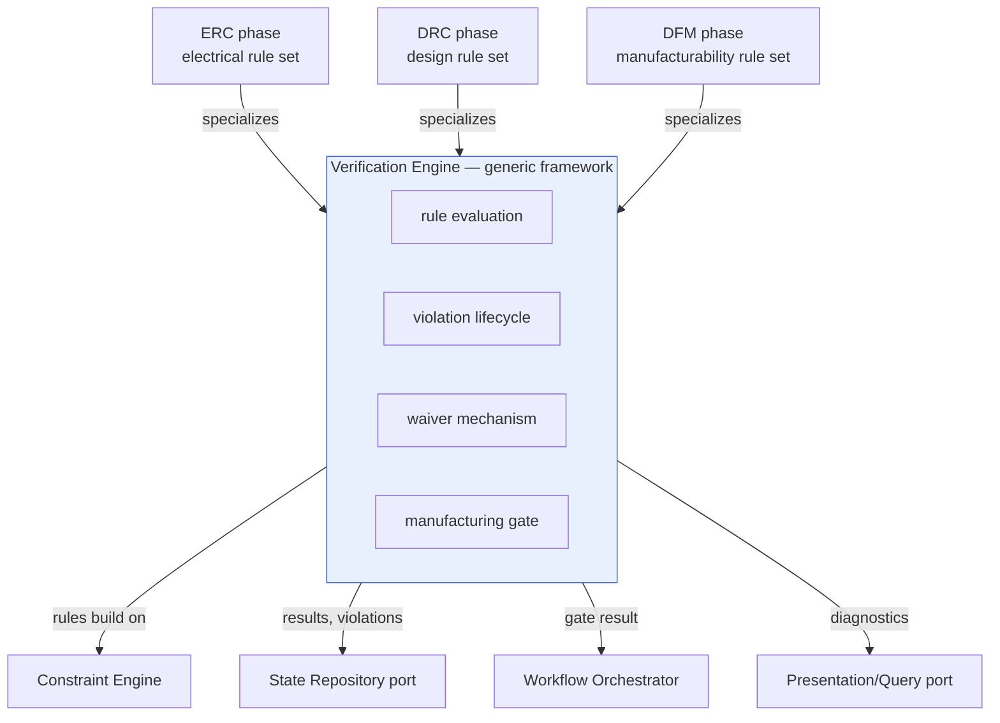
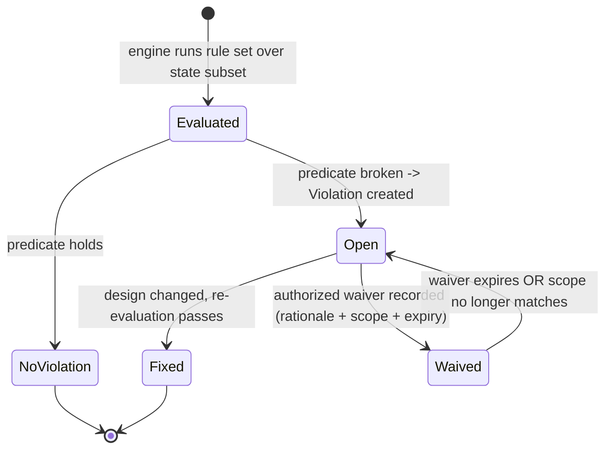

# Verification Engine

> **Ring:** Use cases / runtime (inner) — a deterministic domain [Engine](../GLOSSARY.md#engine). The Verification Engine is the **generic [Rule](../foundation/engineering-domain-model.md#rule) → [Violation](../foundation/engineering-domain-model.md#violation) → [Waiver](../foundation/engineering-domain-model.md#waiver) framework** that the [ERC](../state-machines/erc-verification.md), [DRC](../state-machines/drc-verification.md), and [DFM](../state-machines/dfm-verification.md) phases **specialize** with their own rule sets. It exists so that "evaluate rules, record violations with severity, accept waivers with provenance, and block manufacturing on open errors" is written **once**, correctly and deterministically, instead of three slightly-different times. It contains **no stochastic reasoning** ([P3](../foundation/principles.md)): an [Agent](../agents/README.md) may use reasoning to *explain* or *suggest a fix* for a violation, but the engine's evaluation, severity assignment, and gating are purely deterministic and reproducible ([P4](../foundation/principles.md)). It is the source of the diagnostics the [UI shows but never computes](../foundation/principles.md) ([P11](../foundation/principles.md)).

---

## 1. Purpose & responsibilities

### What it owns

- **The rule-evaluation framework.** A generic way to evaluate a set of [Rules](../foundation/engineering-domain-model.md#rule) (machine-evaluable predicates over the design) against a subset of [Engineering State](../core/shared-state-model.md) and emit results.
- **The Violation lifecycle.** Creating, deduplicating, and tracking [Violations](../foundation/engineering-domain-model.md#violation) — each with rule reference, severity (error / warning / info), offending entities, location, explanation, and status (open / fixed / waived).
- **Severity semantics.** A single, shared definition of what *error*, *warning*, and *info* mean and how each affects gating.
- **The Waiver mechanism.** Recording an explicit, justified [Waiver](../foundation/engineering-domain-model.md#waiver) of a violation — with justifier, rationale, scope, expiry, and full [provenance](../core/provenance-and-traceability.md) — so an accepted risk is auditable, not silent.
- **The manufacturing gate.** The deterministic predicate that **a design with open error-severity Violations cannot transition to [Manufacturing Generation](../state-machines/manufacturing-generation.md)** ([domain invariant](../foundation/engineering-domain-model.md#violation)). This gate is the engine's most consequential output.
- **Result provenance.** Recording every evaluation run, its inputs, and its outcomes as [Events](../core/event-bus.md) so verification is replayable and auditable.

### What it does **NOT** own

- **The specific rule sets.** *What* counts as an ERC, DRC, or DFM violation lives in those phases' specializations and their rule definitions — not in the generic engine. The engine evaluates rules; it does not enumerate electrical or fabrication rules. Rule sets are a natural extension point: additional rule packs (e.g. a house DFM standard or a new compliance regime) can be contributed via the [Plugin System](../integration/plugin-system.md) and evaluated by this same engine without modifying it.
- **The constraints rules build on.** A [Rule](../foundation/engineering-domain-model.md#rule) specializes a [Constraint](../foundation/engineering-domain-model.md#constraint); the [Constraint Engine](constraint-engine.md) stores/resolves/checks those constraints. The Verification Engine consumes constraint results and wraps them in the violation/waiver/gate lifecycle.
- **Fixing violations.** Repair is an [Agent's](../agents/README.md) job within the relevant phase (e.g. the [Routing Agent](../agents/routing-agent.md) re-routes on a DRC failure).
- **Deciding whether to waive.** The engine *records* a waiver and enforces its scope/expiry; *authorizing* a waiver is a [human-in-the-loop](human-in-the-loop.md) decision at the project's [Autonomy Level](human-in-the-loop.md) ([P10](../foundation/principles.md)).
- **Non-pass/fail analysis.** [EMC Analysis](../state-machines/emc-analysis.md) and other analyses produce [Analysis Results](../foundation/engineering-domain-model.md#analysis-result) (interpreted datasets), not binary violations; the engine supports analysis-flavoured checks but its core lifecycle is pass/fail.
- **Stochastic judgement.** No model calls ([P3](../foundation/principles.md)).

---

## 2. Position in the architecture

*Figure: one generic engine, specialized by three rule-check phases; it reads constraints, writes violations, and feeds the orchestrator's gate and the UI's diagnostics. Viewpoint: the engineering ring.*

- **Ring:** Use cases / runtime. Depends inward only — on the [Engineering Domain Model](../foundation/engineering-domain-model.md) (Rule, Violation, Waiver), the [Constraint Engine](constraint-engine.md), and the [State Repository](../core/contracts.md) / [Event Sink/Source](../core/contracts.md) ports ([P1](../foundation/principles.md)).
- **Depended on by:** the [ERC](../state-machines/erc-verification.md), [DRC](../state-machines/drc-verification.md), [DFM](../state-machines/dfm-verification.md) phases (rule-check) and [EMC Analysis](../state-machines/emc-analysis.md) (analysis-flavoured), per the [canonical phase map](../foundation/architecture-views.md) "Verification" column; and by the [Workflow Orchestrator](../core/workflow-orchestration.md) (which consults the gate) and the [frontend](../presentation/frontend.md) (which renders diagnostics).

---

## 3. The generic Rule → Violation → Waiver lifecycle

*Figure: the lifecycle every specializing phase inherits. Viewpoint: a single rule outcome on a single entity.*

### Rule

A [Rule](../foundation/engineering-domain-model.md#rule) is a machine-evaluable predicate over the design that **specializes a [Constraint](../foundation/engineering-domain-model.md#constraint) for a verification domain**. The engine treats rules uniformly: it does not care whether a rule is electrical (ERC), geometric (DRC), or manufacturability (DFM) — only that it is a typed predicate with a severity and a target scope. This uniformity is exactly what makes the framework reusable.

### Violation

A broken rule produces a [Violation](../foundation/engineering-domain-model.md#violation): rule reference, **severity**, the offending entities and location, a human-readable explanation, and a status. The engine **deduplicates** (the same defect found on re-run is the same violation, not a new one) so the engineer sees a stable defect list across iterations.

### Severity & the gate

| Severity | Meaning | Effect on the [manufacturing gate](../core/workflow-orchestration.md) |
|----------|---------|----------------------------------------------------------------------|
| **error** | a real defect that must not ship | **blocks** transition to [Manufacturing Generation](../state-machines/manufacturing-generation.md) unless waived |
| **warning** | likely problem, engineer should review | does not block, but surfaced and tracked |
| **info** | advisory / informational | recorded, non-blocking |

The gate is a pure function of the violation set: **open errors (with no valid waiver) ⇒ cannot manufacture.** This is the engine's enforcement of the [domain invariant](../foundation/engineering-domain-model.md#violation).

### Waiver

A [Waiver](../foundation/engineering-domain-model.md#waiver) is an *explicit, justified, recorded* acceptance of a violation that would otherwise block progress. It carries justifier (human or agent at the permitted [Autonomy Level](human-in-the-loop.md)), rationale, **scope** (which violation(s) it covers), and **expiry**. Key properties:

- **Provenance-bearing.** A waiver is an auditable [Decision](../foundation/engineering-domain-model.md#decision) with [Evidence](../foundation/engineering-domain-model.md#evidence) ([P5](../foundation/principles.md)); "we accepted this risk" is never invisible.
- **Bounded.** Scope and expiry mean a waiver does not silently mask future violations; when it expires or its scope no longer matches, the violation reverts to **Open**.
- **Authorized, not automatic.** Whether the system may self-waive depends on the [Autonomy Level](human-in-the-loop.md) ([P10](../foundation/principles.md)); by default a human disposes.

---

## 4. How ERC / DRC / DFM specialize the framework

Each phase provides a **rule set** and a **scope of state** to evaluate; everything else (violation tracking, severity semantics, waivers, gating, provenance) is inherited from the engine.

| Phase | Specialized rule set | State scope | IR checked |
|-------|----------------------|-------------|------------|
| [ERC](../state-machines/erc-verification.md) | electrical-rule predicates over [Pins](../foundation/engineering-domain-model.md#pin)/[Nets](../foundation/engineering-domain-model.md#net) (e.g. output-driving-output, unconnected power) | schematic domain | [Schematic IR](../compiler/ir/schematic-ir.md) |
| [DRC](../state-machines/drc-verification.md) | geometric/electrical-clearance predicates over [Tracks](../foundation/engineering-domain-model.md#track--routing)/[Footprints](../foundation/engineering-domain-model.md#footprint) | physical domain | [PCB IR](../compiler/ir/pcb-ir.md) |
| [DFM](../state-machines/dfm-verification.md) | manufacturability predicates over fab-process limits | physical domain | [PCB IR](../compiler/ir/pcb-ir.md) |
| [EMC](../state-machines/emc-analysis.md) | analysis-flavoured checks producing [Analysis Results](../foundation/engineering-domain-model.md#analysis-result) | physical domain | analyzes [PCB IR](../compiler/ir/pcb-ir.md) |

> **Why one generic engine rather than three?** The review flagged that ERC/DRC/DFM, authored independently, would each reinvent severity, waivers, and gating — drifting in subtle, dangerous ways (a waiver that blocks in one and not another). Factoring the lifecycle into one engine guarantees identical semantics everywhere; phases contribute *only* domain rules ([P7](../foundation/principles.md): mechanism vs. instance). EMC is *analysis*, not pass/fail, so it uses the engine's evaluation plumbing but produces [Analysis Results](../foundation/engineering-domain-model.md#analysis-result) rather than gating Violations.

---

## 5. Continuous vs. gate-time verification

- **Continuous (incremental).** Like the [Constraint Engine](constraint-engine.md), the Verification Engine can re-evaluate only the rules affected by a change, so the IDE shows live diagnostics as the engineer works — computed in the engine, displayed by the [UI](../presentation/frontend.md) ([P11](../foundation/principles.md)).
- **Gate-time (authoritative).** At a phase boundary or before [Manufacturing Generation](../state-machines/manufacturing-generation.md), a full evaluation produces the authoritative violation set the [Workflow Orchestrator's](../core/workflow-orchestration.md) gate consults. The gate result is deterministic and recorded.

---

## 6. Contracts

- **Consumes:**
  - [Constraint Engine](constraint-engine.md) (inner-ring) — rule predicates build on resolved [Constraints](../foundation/engineering-domain-model.md#constraint).
  - [State Repository port](../core/contracts.md) — read the entities under evaluation; persist [Violations](../foundation/engineering-domain-model.md#violation) and [Waivers](../foundation/engineering-domain-model.md#waiver) as part of [Engineering State](../core/shared-state-model.md).
  - [Event Sink/Source port](../core/contracts.md) — record evaluation runs, violation status changes, and waivers for [provenance](../core/provenance-and-traceability.md) and replay.
  - [Simulation port](../core/contracts.md) — for analysis-flavoured checks ([EMC](../state-machines/emc-analysis.md)) that need external analyses returning [Analysis Results](../foundation/engineering-domain-model.md#analysis-result).
  - [Security/Policy port](../core/contracts.md) — to authorize who/what may record a waiver, per [Autonomy Level](human-in-the-loop.md).
- **Provides:**
  - to the [Workflow Orchestrator](../core/workflow-orchestration.md): the **gate result** (open errors? blocked / clear).
  - to the [Presentation/Query port](../core/contracts.md): the diagnostics projection the UI renders ([P11](../foundation/principles.md)).
- **Does not consume** the [Reasoning Engine port](../core/reasoning-engine-interface.md) — by design ([P3](../foundation/principles.md)).

---

## 7. Failure modes

- **Indeterminate rule (insufficient data).** Reported as indeterminate, treated by the gate as "not passable," never as a pass — consistent with the [Constraint Engine](constraint-engine.md).
- **Waiver expired / out of scope.** The covered violation automatically reverts to **Open**, re-arming the gate; expiry is never silently extended.
- **Rule-set/state mismatch.** If a rule references entities absent from the checked IR, that rule is flagged rather than silently skipped (preserving completeness of the audit).
- **External analysis unavailable** (EMC/SI/PI via the [Simulation port](../core/contracts.md)). The analysis check degrades to indeterminate; the design is not falsely passed. See [`failure-taxonomy-and-degraded-modes.md`](../core/failure-taxonomy-and-degraded-modes.md).
- **Attempted manufacture with open errors.** The gate refuses the transition; the orchestrator surfaces the blocking violations ([P10](../foundation/principles.md), [P13](../foundation/principles.md)).

---

## 8. Open decisions

- [ADR-0010](../decisions/0010-human-in-the-loop-autonomy-levels.md) — who may authorize a waiver at each autonomy level.
- [ADR-0005](../decisions/0005-ir-as-canonical-phase-boundary-representation.md) — which [IR](../compiler/compiler-ir.md) each specialization evaluates.
- [ADR-0009](../decisions/0009-determinism-and-replay-strategy.md) — verification runs and gate results must replay identically.
- **Open:** whether waiver *expiry policy* (time-based vs. design-change-based) is configurable per project via the [Configuration port](../core/contracts.md) — future ADR.

---

## 9. Related documents

[`foundation/engineering-domain-model.md`](../foundation/engineering-domain-model.md) (Rule, Violation, Waiver) · [`engineering/constraint-engine.md`](constraint-engine.md) · [`state-machines/erc-verification.md`](../state-machines/erc-verification.md) · [`state-machines/drc-verification.md`](../state-machines/drc-verification.md) · [`state-machines/dfm-verification.md`](../state-machines/dfm-verification.md) · [`state-machines/emc-analysis.md`](../state-machines/emc-analysis.md) · [`state-machines/manufacturing-generation.md`](../state-machines/manufacturing-generation.md) · [`engineering/human-in-the-loop.md`](human-in-the-loop.md) · [`core/workflow-orchestration.md`](../core/workflow-orchestration.md) · [`core/contracts.md`](../core/contracts.md)
