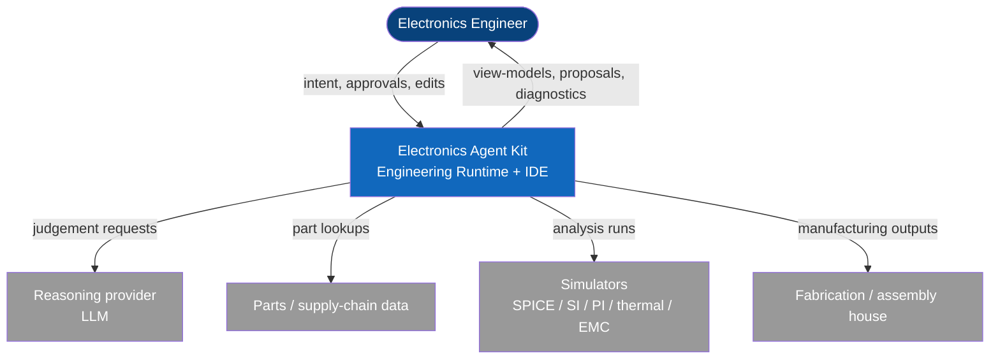
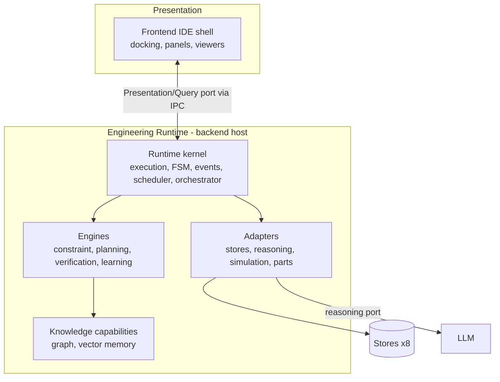
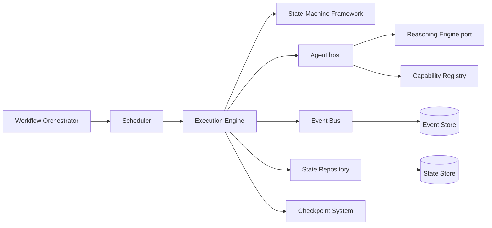
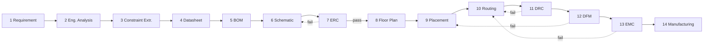

# Architecture Views

> **Ring:** foundation. This document is the map. It holds the C4 views (Context → Container → Component) and the **canonical phase → state-machine → agent → engine → IR table** that every other document references. The table is the authoritative reconciliation of what the vision called "15 subsystems," what we model as "14 phases / state machines," and the "13 agents."

## C1 — System Context

*Figure C1: who and what the system talks to. The engineer is in command ([P10](principles.md)); the LLM is just one external dependency behind the [reasoning port](../core/reasoning-engine-interface.md).*

## C2 — Containers

*Figure C2: the major runtime containers. The UI reaches the runtime only through the [Presentation/Query port](../core/contracts.md) over [IPC](../integration/ipc.md).*

## C3 — Components (runtime kernel)

*Figure C3: the kernel components and their collaboration. Policy (orchestrator/scheduler) → mechanism (execution/FSM/bus) → instance (agents).* See [`core/`](../core/) for each.

---

## The canonical phase map

This single table reconciles subsystems, phases, state machines, agents, engines, and IRs. **It is the source of truth for the 15 / 14 / 13 reconciliation:**

- The vision lists **15 subsystems**. One of them — the **Learning Engine** — is a *cross-cutting engine*, not an engineering phase, so it has **no state machine**.
- That leaves **14 phases**, each modeled as a **state machine** in [`state-machines/`](../state-machines/README.md).
- There are **13 agents**. Two agents each cover two adjacent phases (the **Planning Agent** covers Engineering Analysis + Constraint Extraction; the **Placement Agent** covers Floor Planning + Component Placement). The **Learning Agent** is cross-cutting and bound to no single phase. 14 phases ÷ (11 single-phase agents + 2 dual-phase agents) balances exactly.

| # | Phase (subsystem) | State machine | Primary agent | Engines used | Primary IR |
|---|-------------------|---------------|---------------|--------------|------------|
| 1 | Requirement Planning | [requirement-planning](../state-machines/requirement-planning.md) | [Requirement Agent](../agents/requirement-agent.md) | Planning | produces [Requirement IR](../compiler/ir/requirement-ir.md) |
| 2 | Engineering Analysis | [engineering-analysis](../state-machines/engineering-analysis.md) | [Planning Agent](../agents/planning-agent.md) | Planning, Constraint | Requirement→[Engineering IR](../compiler/ir/engineering-ir.md) |
| 3 | Constraint Extraction | [constraint-extraction](../state-machines/constraint-extraction.md) | [Planning Agent](../agents/planning-agent.md) | Constraint | enriches Engineering IR |
| 4 | Datasheet Intelligence | [datasheet-intelligence](../state-machines/datasheet-intelligence.md) | [Datasheet Agent](../agents/datasheet-agent.md) | — (feeds Knowledge Graph) | enriches Engineering IR |
| 5 | BOM Planning | [bom-planning](../state-machines/bom-planning.md) | [BOM Agent](../agents/bom-agent.md) | Constraint | produces [BOM IR](../compiler/ir/bom-ir.md) |
| 6 | Schematic Planning | [schematic-planning](../state-machines/schematic-planning.md) | [Schematic Agent](../agents/schematic-agent.md) | Planning, Constraint | produces [Schematic IR](../compiler/ir/schematic-ir.md) |
| 7 | ERC Verification | [erc-verification](../state-machines/erc-verification.md) | [ERC Agent](../agents/erc-agent.md) | Verification | checks Schematic IR |
| 8 | PCB Floor Planning | [pcb-floor-planning](../state-machines/pcb-floor-planning.md) | [Placement Agent](../agents/placement-agent.md) | Planning, Constraint | Schematic→[PCB IR](../compiler/ir/pcb-ir.md) |
| 9 | Component Placement | [component-placement](../state-machines/component-placement.md) | [Placement Agent](../agents/placement-agent.md) | Constraint | enriches PCB IR |
| 10 | Routing Planning | [routing-planning](../state-machines/routing-planning.md) | [Routing Agent](../agents/routing-agent.md) | Constraint, Planning | enriches PCB IR |
| 11 | DRC Verification | [drc-verification](../state-machines/drc-verification.md) | [DRC Agent](../agents/drc-agent.md) | Verification | checks PCB IR |
| 12 | DFM Verification | [dfm-verification](../state-machines/dfm-verification.md) | [DFM Agent](../agents/dfm-agent.md) | Verification | checks PCB IR |
| 13 | EMC Analysis | [emc-analysis](../state-machines/emc-analysis.md) | [EMC Agent](../agents/emc-agent.md) | Verification (analysis) | analyzes PCB IR |
| 14 | Manufacturing Generation | [manufacturing-generation](../state-machines/manufacturing-generation.md) | [Manufacturing Agent](../agents/manufacturing-agent.md) | Verification | PCB→[Manufacturing IR](../compiler/ir/manufacturing-ir.md) |
| — | Learning (cross-cutting) | *none — engine, not phase* | [Learning Agent](../agents/learning-agent.md) | [Learning Engine](../engineering/learning-engine.md) | observes all |

## Default workflow plan

*Figure: the default [workflow plan](../core/workflow-orchestration.md). Verification phases loop back on failure; the [orchestrator](../core/workflow-orchestration.md) owns this graph and supports branches and gates.*

## Coverage of the original requested document list

Every topic in the original Phase 0 request maps to a document in this tree. The mapping (originally-flat name → location) is maintained here so coverage can be audited:

| Original item | Location |
|---------------|----------|
| vision, system-overview, runtime, state-machines, execution-engine, event-bus, scheduler, checkpoint-system, compiler-ir, engineering-runtime, plugin-system, ipc, frontend, backend, storage, database, vector-memory, knowledge-graph, constraint-engine, planning-engine, verification-engine, learning-engine, security, logging, configuration, error-handling, performance, roadmap | distributed across the rings — see [`README.md`](../README.md) mapping note |
| 6 IRs (requirement/engineering/bom/schematic/pcb/manufacturing) | [`compiler/ir/`](../compiler/) |
| 8 stores (state/vector/knowledge-graph/event/session/checkpoint/project/artifact) | [`data/stores/`](../data/stores/) |
| 13 agents | [`agents/`](../agents/README.md) |
| 14 phase state machines | [`state-machines/`](../state-machines/README.md) |
| 11 frontend docs | [`presentation/frontend/`](../presentation/frontend.md) |

## Related documents
[`README.md`](../README.md) · [`foundation/system-overview.md`](system-overview.md) · [`core/workflow-orchestration.md`](../core/workflow-orchestration.md) · [`state-machines/README.md`](../state-machines/README.md) · [`agents/README.md`](../agents/README.md)
