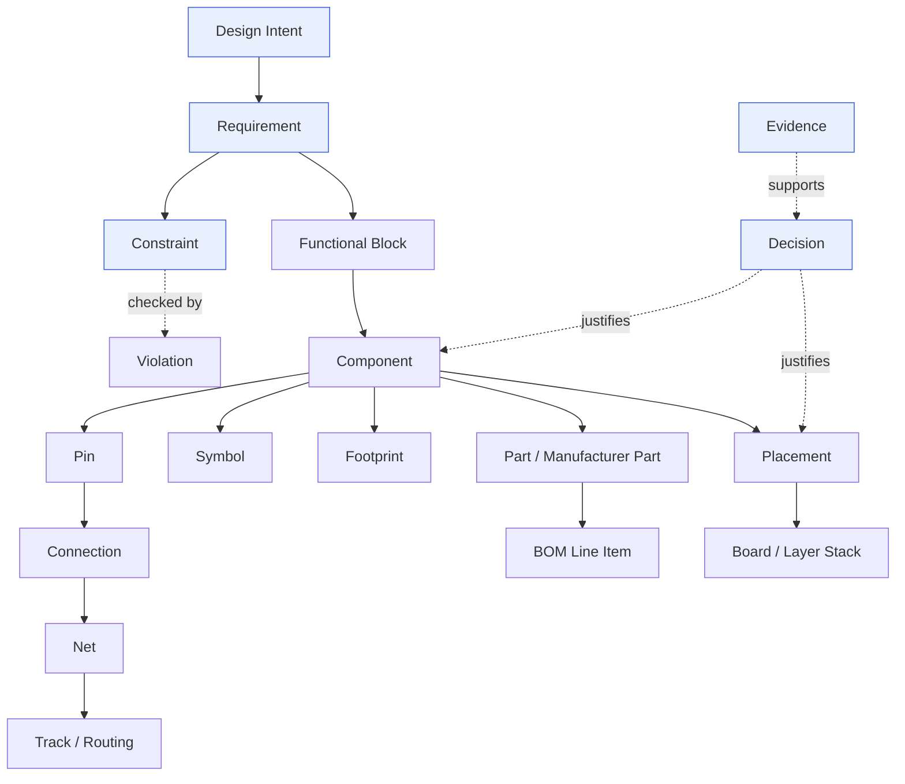

# Engineering Domain Model

> **Ring:** Entities (innermost). **Depends on:** nothing. **Depended on by:** everything.

This is the canonical vocabulary of Electronics Agent Kit — the nouns of the engineering world the runtime *owns*. It is the single source of truth referenced by the [shared state model](../core/shared-state-model.md), every [IR](../compiler/compiler-ir.md), every [store](../data/storage.md), every [agent](../agents/README.md), and every [state machine](../state-machines/README.md). The architecture review identified the absence of this document as the single largest gap in the original plan: a runtime whose thesis is "owns the engineering knowledge" must first *define* that knowledge.

These are **conceptual entities**, not data schemas or classes. We describe identity, attributes, relationships, and invariants — never storage layout or language types. Concrete schemas are a later phase and are governed by [data versioning](../data/data-versioning-and-migration.md).

## Modelling principles

1. **Stable identity.** Every entity has an opaque, immutable **Entity ID** that survives renames, edits, refactors, and version changes. References are always by ID, never by name or position. This is what makes [provenance](../core/provenance-and-traceability.md), [design version control](../data/design-version-control.md), and [determinism](../core/determinism-and-reproducibility.md) possible.
2. **Physical quantities are typed.** No bare numbers for physical values. Every electrical/physical value is a [Physical Quantity](../engineering/units-and-quantities.md) carrying magnitude, unit, and tolerance. See [ADR-0007](../decisions/0007-units-and-physical-quantity-type-system.md).
3. **Intent is first-class.** *Why* something exists (the requirement, the design intent, the decision) is modelled alongside *what* it is. The domain captures rationale, not just artifacts.
4. **Everything is traceable.** Every derived entity records what it was derived from. A routed track traces to a net traces to a connection traces to a schematic decision traces to a requirement.
5. **The model is layered by abstraction, not by phase.** The same `Component` entity is enriched as it passes through phases; phases do not each invent their own component.

## Entity map

*Figure: the principal entities and how engineering meaning flows from intent down to manufacturable artifacts.*

---

## 1. Intent & requirements

### Design Intent
The human-or-agent-expressed goal for the design ("a USB-C powered IoT sensor node, < 5 W, < 50 × 50 mm"). Captured in natural language *and* progressively structured. Origin of all downstream entities; never deleted, only refined. Owned through the [Requirement Planning](../state-machines/requirement-planning.md) phase.

### Requirement
A single, testable statement the design must satisfy. Attributes: ID, statement, category (functional / electrical / mechanical / thermal / regulatory / cost / schedule), priority, acceptance criterion, status (proposed / accepted / satisfied / violated / waived), source (which Design Intent or external standard). **Invariant:** every accepted Requirement must be traceable to satisfaction evidence before a design is declared complete. Requirements are the root of the [traceability](../core/provenance-and-traceability.md) tree.

### Constraint
A machine-checkable restriction derived from Requirements, standards, parts, or process. Attributes: ID, type (clearance, voltage limit, current limit, impedance target, thermal limit, keep-out, manufacturing rule, compliance rule), scope (which entities it applies to), bound (a [Physical Quantity](../engineering/units-and-quantities.md) or relation), severity, source. Managed by the [Constraint Engine](../engineering/constraint-engine.md). **A Requirement is intent; a Constraint is its enforceable projection.** Constraints are produced by the [Constraint Extraction](../state-machines/constraint-extraction.md) phase.

---

## 2. Logical design (schematic domain)

### Functional Block
A logical grouping of components that performs a function (e.g. "buck regulator", "MCU subsystem"). Bridges requirements and components; used by [Floor Planning](../state-machines/pcb-floor-planning.md). Attributes: ID, name, function, parent/children (blocks nest), associated Requirements.

### Component
An instance of an electronic element in the design (this specific U3, this R7). Attributes: ID, reference designator, class (resistor, capacitor, IC, connector…), value/parameters (typed quantities), associated [Symbol](#symbol), [Footprint](#footprint), and chosen [Part](#part). **Invariant:** a Component's electrical parameters must be consistent with its chosen Part's datasheet facts. Enriched across phases — created in [Schematic Planning](../state-machines/schematic-planning.md), placed in [Component Placement](../state-machines/component-placement.md).

### Pin
A connection point on a Component. Attributes: ID, number/name, electrical type (input / output / power / passive / bidirectional / no-connect), associated [Physical Quantity](../engineering/units-and-quantities.md) limits (max voltage, max current). Source of [ERC](../state-machines/erc-verification.md) checks.

### Connection
A logical assertion that two or more [Pins](#pin) are electrically joined. The atomic unit of schematic capture. Aggregated into Nets.

### Net
The transitive closure of [Connections](#connection): a set of Pins that are all electrically common. Attributes: ID, name, net class (power / ground / signal / differential pair / high-speed), electrical properties (target impedance, max current, voltage). Nets are the bridge between schematic ([Schematic IR](../compiler/ir/schematic-ir.md)) and layout ([PCB IR](../compiler/ir/pcb-ir.md)); routing realizes them physically.

### Symbol
The schematic representation of a Component (its pins and graphic). Attributes: ID, pin map, graphic definition. Distinct from Footprint — symbol is logical, footprint is physical. Lives in the [Component Library](../engineering/component-library.md).

---

## 3. Physical design (PCB domain)

### Footprint
The physical land pattern a Component occupies on the board. Attributes: ID, pad geometry, courtyard, keep-outs, mounting type (SMD / THT), associated standard (IPC land class). Lives in the [Component Library](../engineering/component-library.md). **Invariant:** footprint pad count and pin mapping must match the Component's Symbol.

### Placement
The position, rotation, and layer of a Component on the [Board](#board). Attributes: component ref, X/Y (typed length quantities), rotation, side (top / bottom), locked flag. Produced by [Component Placement](../state-machines/component-placement.md); constrained by keep-outs, thermal, and floor-planning regions.

### Board / Layer Stack
The physical substrate. Attributes: outline, dimensions, layer stack-up (copper/dielectric layers, thicknesses, materials, dielectric constants — all typed quantities), board regions from [Floor Planning](../state-machines/pcb-floor-planning.md). The frame all Placement and Routing live in.

### Track / Routing
The physical realization of a [Net](#net): copper geometry connecting pins. Attributes: net ref, layer, width, geometry (segments, arcs, vias), differential-pair partner. Produced by [Routing Planning](../state-machines/routing-planning.md); checked by [DRC](../state-machines/drc-verification.md). **Invariant:** the union of Tracks for a Net must electrically realize exactly that Net's Connections — no more, no less.

---

## 4. Sourcing (BOM domain)

### Part (Manufacturer Part)
A real, orderable component from a manufacturer (e.g. `TI TPS62840DLCR`). Attributes: ID, MPN, manufacturer, datasheet reference, lifecycle status (active / NRND / EOL), parametric facts (from [Datasheet Intelligence](../state-machines/datasheet-intelligence.md)), compliance flags (RoHS/REACH). Sourced via [supply-chain integration](../integration/supply-chain-and-parts-data.md). A [Component](#component) *selects* a Part.

### BOM Line Item
A row in the Bill of Materials: a Part, the quantity, the Components that use it, and sourcing data (price, availability, lead time, alternates). Produced by [BOM Planning](../state-machines/bom-planning.md). See [BOM IR](../compiler/ir/bom-ir.md).

---

## 5. Verification & analysis

### Rule
A machine-evaluable predicate over the design, specializing a [Constraint](#constraint) for a verification domain. ERC/DRC/DFM rules live over the [Verification Engine](../engineering/verification-engine.md).

### Violation
A recorded instance of a Rule being broken. Attributes: ID, rule ref, severity (error / warning / info), offending entities, location, status (open / fixed / waived), explanation. **Invariant:** a design with open error-severity Violations cannot transition to [Manufacturing Generation](../state-machines/manufacturing-generation.md).

### Waiver
An explicit, justified, recorded acceptance of a Violation. Attributes: violation ref, justifier (human/agent), rationale, scope, expiry. Carries [provenance](../core/provenance-and-traceability.md).

### Analysis Result
The output of a non-pass/fail analysis (EMC, thermal, signal integrity): a structured dataset plus interpretation. Attributes: analysis type, inputs, results (typed quantities), confidence, source ([simulation interface](../integration/simulation-interface.md)).

---

## 6. Reasoning & provenance (the meta-domain)

These entities are what make the runtime *own* knowledge rather than merely hold data.

### Decision
A recorded choice made during design (selecting a Part, a topology, a placement). Attributes: ID, subject entity, options considered, chosen option, rationale, decider (which [Agent](../agents/README.md) + reasoning call, or human), confidence, timestamp. **Every non-trivial change to the design is justified by a Decision.** Decisions are the engineering analogue of git commits with a "why."

### Evidence
A piece of supporting information for a Decision: a datasheet parameter, a simulation result, a standard clause, a prior design. Attributes: ID, kind, content reference, source, reliability. Links Decisions to the [Knowledge Graph](../knowledge/knowledge-graph.md) and external sources.

### Provenance Link
A directed edge asserting "X was derived from / justified by Y." The fabric connecting Requirements → Constraints → Components → Placement → Routing → Decisions → Evidence. Queried via [provenance and traceability](../core/provenance-and-traceability.md).

---

## Lifecycle of an entity

Entities are **created**, **enriched**, **superseded**, or **retired** — never silently mutated without an [Event](../core/event-bus.md) and (for design-significant changes) a [Decision](#decision). Versioning of entities across [Design Branches](../data/design-version-control.md) keys on the stable Entity ID. This lifecycle is what the [shared state model](../core/shared-state-model.md) operationalizes and the [event store](../data/stores/event-store.md) records.

## Open decisions

- [ADR-0005](../decisions/0005-ir-as-canonical-phase-boundary-representation.md) — the domain model is canonical; IRs are its phase-boundary serializations.
- [ADR-0007](../decisions/0007-units-and-physical-quantity-type-system.md) — physical-quantity typing.
- [ADR-0008](../decisions/0008-design-version-control-model.md) — entity identity under branch/merge.

## Related documents
[`core/shared-state-model.md`](../core/shared-state-model.md) · [`compiler/compiler-ir.md`](../compiler/compiler-ir.md) · [`engineering/units-and-quantities.md`](../engineering/units-and-quantities.md) · [`engineering/component-library.md`](../engineering/component-library.md) · [`core/provenance-and-traceability.md`](../core/provenance-and-traceability.md) · [`GLOSSARY.md`](../GLOSSARY.md)
