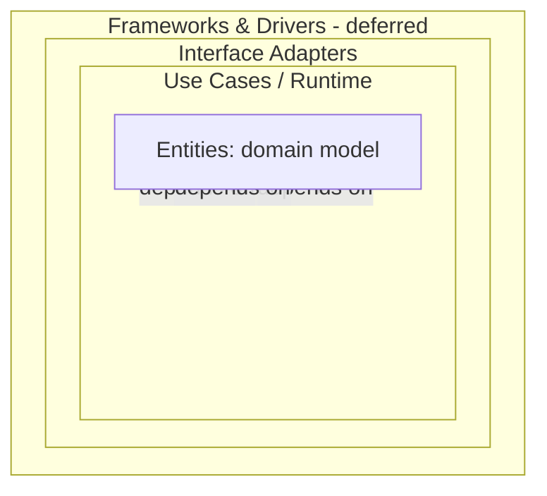

# Architectural Principles

> **Ring:** Entities/foundation. These are the laws every other document obeys. Where a later document appears to conflict with a principle here, this document wins (or the conflict is escalated to an [ADR](../decisions/README.md)).

This document encodes the non-negotiable rules of Electronics Agent Kit's architecture. They exist so that a multi-year, multi-contributor product stays coherent. Each principle states the rule, the rationale, and its enforcement.

## P1 — The Dependency Rule

Source-level dependencies point **only inward**. Outer rings may depend on inner rings; inner rings know nothing of outer rings.

*Figure: the rings. Arrows are the only legal direction of source dependency.*

- **Entities** ([`foundation/engineering-domain-model.md`](engineering-domain-model.md)) depend on nothing.
- **Use cases / runtime** ([`core/`](../core/)) + domain engines ([`engineering/`](../engineering/)) + compiler ([`compiler/`](../compiler/)) + knowledge capabilities ([`knowledge/`](../knowledge/)) depend only on Entities and on each other's *contracts*.
- **Interface adapters** ([`data/`](../data/), [`integration/`](../integration/), [`presentation/`](../presentation/)) implement inner contracts; the core never imports them.
- **Frameworks & drivers** (concrete tech) are deferred to a later phase.

**Enforcement:** every cross-ring interaction goes through a [Contract](../core/contracts.md). See [ADR-0001](../decisions/0001-adopt-clean-architecture-dependency-rule.md).

## P2 — The Runtime Owns the Knowledge

The [Engineering Runtime](../core/engineering-runtime.md) is the sole authority over [Engineering State](../core/shared-state-model.md). All engineering knowledge — entities, decisions, provenance — lives in the runtime's model and stores, never inside an agent, a model prompt, or the UI.

**Rationale:** knowledge in prompts is ephemeral, unversioned, and unverifiable; knowledge in the runtime is durable, traceable, and reproducible. This is the product's core differentiator. See [ADR-0002](../decisions/0002-runtime-owns-knowledge-llm-as-reasoning-engine.md).

## P3 — LLMs Are Only Reasoning Engines

Large language models supply *judgement* — never *truth* and never *state*. They are reached only through the [Reasoning Engine port](../core/reasoning-engine-interface.md). The domain core has zero knowledge of any model or provider.

**Rationale & consequences:** keeps the domain provider-independent; isolates stochasticity to one boundary (essential for [determinism](../core/determinism-and-reproducibility.md)); forces every model output to be validated against domain rules before it touches state. An agent may *propose* via reasoning; only the deterministic core may *commit*.

## P4 — Determinism by Default

Given identical inputs and identical recorded reasoning outputs, the runtime reproduces identical [Engineering State](../core/shared-state-model.md). All non-determinism (model calls, time, randomness, external data) is captured at a boundary and recorded as [Events](../core/event-bus.md).

**Rationale:** engineering artifacts must be auditable and reproducible. See [`core/determinism-and-reproducibility.md`](../core/determinism-and-reproducibility.md) and [ADR-0009](../decisions/0009-determinism-and-replay-strategy.md).

## P5 — Everything Is Traceable

Every design-significant change is an [Event](../core/event-bus.md) justified by a [Decision](engineering-domain-model.md#decision) backed by [Evidence](engineering-domain-model.md#evidence). Any fact in the design can be traced to the requirement and reasoning that produced it.

**Rationale:** trust in an AI-driven engineering tool requires explainability and an audit trail (cf. functional-safety practice). See [`core/provenance-and-traceability.md`](../core/provenance-and-traceability.md).

## P6 — One Canonical Model, Many Projections

The [Engineering Domain Model](engineering-domain-model.md) is the single source of truth. [IRs](../compiler/compiler-ir.md), store schemas, and UI view-models are *projections* of it, never competing definitions.

**Rationale:** the review found the IR, the (then-missing) domain model, and store schemas would otherwise be three drifting sources of truth. See [ADR-0005](../decisions/0005-ir-as-canonical-phase-boundary-representation.md).

## P7 — Mechanism, Policy, and Instance Are Separated

- **Mechanism**: how things run ([execution engine](../core/execution-engine.md), [state-machine framework](../core/state-machine-framework.md), [event bus](../core/event-bus.md)).
- **Policy**: what should run and when ([workflow orchestrator](../core/workflow-orchestration.md), [scheduler](../core/scheduler.md)).
- **Instance**: the concrete engineering content ([state machines](../state-machines/README.md), [agents](../agents/README.md)).

**Rationale:** lets engineering phases be added or changed without touching the kernel.

## P8 — Agents Are Two-Part, Never God-Objects

Every [Agent](../agents/README.md) is split into a **deterministic engineering use-case** (touches state via contracts, calls engines) and a **reasoning adapter** (calls the reasoning port). The seam between domain logic and stochastic reasoning runs *between* these halves, never through the middle of a tangled object.

**Rationale:** the review warned that undivided agents become god-objects spanning all rings. See [ADR-0006](../decisions/0006-agent-fsm-separation.md).

## P9 — Physical Correctness Is Typed

Physical values are [Physical Quantities](../engineering/units-and-quantities.md) with units and tolerances; the type system prevents dimensional-error classes. See [ADR-0007](../decisions/0007-units-and-physical-quantity-type-system.md).

## P10 — Humans Stay in Command

The system operates at a configurable [Autonomy Level](../engineering/human-in-the-loop.md). By default, AI *proposes* and the engineer *disposes*; autonomous action is opt-in and always reversible and traceable. See [`engineering/human-in-the-loop.md`](../engineering/human-in-the-loop.md) and [ADR-0010](../decisions/0010-human-in-the-loop-autonomy-levels.md).

## P11 — The UI Is Presentation-Only

The [frontend](../presentation/frontend.md) renders state and issues commands; it contains **no engineering rules**. ERC/DRC logic never lives in a viewer. Diagnostics shown in the UI are computed by the [verification engine](../engineering/verification-engine.md) and consumed via contracts.

## P12 — Cross-Cutting Concerns Are Abstractions

Security, logging/observability, configuration, and cost governance are consumed by the core as *abstractions* it defines; concrete implementations live in the outer ring. The core never imports a concrete logger, config source, or model client. See [`crosscutting/`](../crosscutting/).

## P13 — Document the Why

No silent decisions. A non-obvious choice carries a rationale or an [ADR](../decisions/README.md) link. No silent caps or truncations — if something is bounded, it is stated.

## Tensions we accept

- **Determinism vs. AI creativity (P3/P4):** resolved by recording reasoning outputs so a creative result, once produced, is reproducible.
- **Autonomy vs. control (P10):** resolved by autonomy levels and universal reversibility.
- **Single canonical model vs. phase-specific needs (P6):** resolved by projections (IRs), not forks.

## Related documents
[`decisions/README.md`](../decisions/README.md) · [`core/contracts.md`](../core/contracts.md) · [`core/engineering-runtime.md`](../core/engineering-runtime.md) · [`foundation/engineering-domain-model.md`](engineering-domain-model.md)
