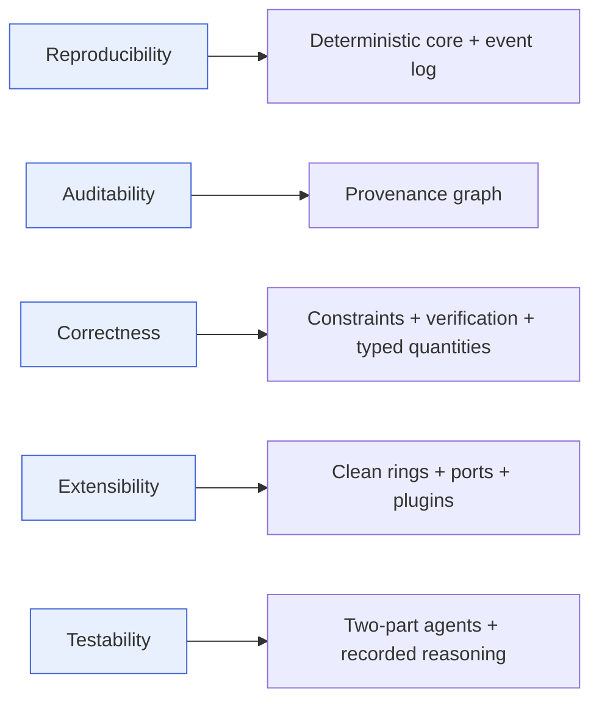

# Quality Attributes

> **Ring:** foundation (Entities). This document names the **architecturally-significant non-functional requirements (NFRs)** — the qualities that *drive* the architecture rather than decorate it. For each, it gives a definition, why it matters for an AI-native engineering runtime, and the specific architectural decisions that serve it. It exists because the [principles](principles.md) and the structure of the system are, in large part, the *answer* to these qualities; reading them in reverse — quality → decision — is how a reviewer checks the architecture is fit for purpose.

These are not generic "-ilities." Each is here because it changed a structural decision. Where a quality and a decision point at each other, the architecture is *traceably* fit for purpose — the same standard of justification the product itself promises ([P13](principles.md)).

## How to read this document

Qualities are ordered by how strongly they shaped the architecture. The first four (reproducibility, auditability, correctness, extensibility) are the **dominant drivers** — the architecture would be a different shape without them. The rest are **important constraints** the architecture must also satisfy. Each entry links the decisions and ADRs that serve it.

*Figure: the dominant qualities and the headline decision each one forces. From the architect's viewpoint.*

---

## 1. Reproducibility — the dominant driver

**Definition.** Given identical inputs and identical recorded reasoning outputs, the system reproduces identical [Engineering State](../core/shared-state-model.md) ([P4](principles.md)).

**Why it matters.** Engineering artifacts must be reproducible to be trusted, audited, and collaborated on. A design that cannot be regenerated cannot be defended at sign-off or rebuilt after a change. For an AI tool built on a *stochastic* model, reproducibility is the difference between an engineering instrument and a slot machine.

**Decisions that serve it.**
- A **deterministic core** with all non-determinism confined to recorded boundaries ([determinism-and-reproducibility.md](../core/determinism-and-reproducibility.md), [ADR-0009](../decisions/0009-determinism-and-replay-strategy.md)).
- **Every change is an ordered [Event](../core/event-bus.md)**; state is the fold of the log ([concurrency model](../core/concurrency-and-consistency.md), [ADR-0003](../decisions/0003-shared-state-consistency-model.md)).
- **Recording every [reasoning call](../core/reasoning-engine-interface.md)** so replay reuses outputs instead of re-sampling.
- **Stable [Entity IDs](engineering-domain-model.md)** so references re-bind identically on replay.
- **Seeded randomness** for heuristics.

## 2. Auditability — the trust property

**Definition.** Any fact in the design can be traced to the [Requirement](engineering-domain-model.md#requirement), [Decision](engineering-domain-model.md#decision), [Agent](../agents/README.md), reasoning call, and [Evidence](engineering-domain-model.md#evidence) that produced it ([P5](principles.md)).

**Why it matters.** Trust in AI-driven engineering requires explainability and an audit trail (cf. functional-safety practice). Reviewers, customers, and regulators must be able to ask "why is this here?" and get a complete answer. Without auditability the tool's outputs are unverifiable.

**Decisions that serve it.**
- The **[provenance & traceability graph](../core/provenance-and-traceability.md)** with first-class [Provenance Links](engineering-domain-model.md#provenance-link).
- **Intent is first-class** in the [domain model](engineering-domain-model.md) (Decision, Evidence modelled alongside artifacts).
- **The runtime owns knowledge** ([P2](principles.md), [ADR-0002](../decisions/0002-runtime-owns-knowledge-llm-as-reasoning-engine.md)) — knowledge in the runtime is auditable; knowledge in prompts is not.
- **Requirement-satisfaction matrices** derived from the graph.

## 3. Correctness by construction

**Definition.** The design is kept consistent with its [Constraints](engineering-domain-model.md#constraint) and engineering rules continuously, not at a final gate ([vision](vision.md) tenet 3).

**Why it matters.** In electronics, mistakes caught late (at fabrication) cost real money and weeks. Continuous correctness compresses cycles and is the core value proposition. Stochastic reasoning makes correctness *more* critical: model output must be checked before it can do harm.

**Decisions that serve it.**
- **Validation before state** at the [reasoning boundary](../core/reasoning-engine-interface.md) ([P3](principles.md)): no model output touches state unchecked.
- The **[Constraint Engine](../engineering/constraint-engine.md)** and **[Verification Engine](../engineering/verification-engine.md)** as continuous services, not phases-of-last-resort.
- **Typed [Physical Quantities](../engineering/units-and-quantities.md)** that make dimensional-error classes unrepresentable ([P9](principles.md), [ADR-0007](../decisions/0007-units-and-physical-quantity-type-system.md)).
- **Domain invariants** enforced on every mutation ([shared state model](../core/shared-state-model.md)).
- **Gating** on open error-[Violations](engineering-domain-model.md#violation) before [manufacturing](../state-machines/manufacturing-generation.md).

## 4. Extensibility

**Definition.** Phases, agents, engines, capabilities, and integrations can be added or changed over years without disturbing the kernel ([vision](vision.md) tenet 5).

**Why it matters.** The electronics domain is vast and evolving; the product must grow for years and accept third-party extension without architectural erosion.

**Decisions that serve it.**
- **Clean rings + the [Dependency Rule](principles.md)** ([P1](principles.md), [ADR-0001](../decisions/0001-adopt-clean-architecture-dependency-rule.md)): inner rings never depend on outer.
- **[Contracts](../core/contracts.md)/ports** so implementations swap without core changes.
- **Mechanism / policy / instance separation** ([P7](principles.md)): new phases/agents are *instances*, not kernel edits.
- **[Capability Registry](../core/capability-registry.md) + [plugin system](../integration/plugin-system.md)**: new actions arrive as registrations.
- **[Provider-independent reasoning port](../core/reasoning-engine-interface.md)**: models swap freely.

## 5. Testability

**Definition.** Every component can be verified in isolation, and stochastic behavior can be made deterministic for tests.

**Why it matters.** A multi-year, multi-contributor product needs fast, reliable tests; an AI system needs a way to test agent behavior despite model stochasticity.

**Decisions that serve it.**
- The **two-part agent split** ([P8](principles.md), [ADR-0006](../decisions/0006-agent-fsm-separation.md)): the deterministic use-case is unit-testable; the reasoning adapter is mockable behind the [reasoning port](../core/reasoning-engine-interface.md).
- **Ports everywhere** ([contracts](../core/contracts.md)): every dependency is substitutable with a test double.
- **Recorded reasoning** ([determinism](../core/determinism-and-reproducibility.md)): pin recorded outputs for deterministic agent tests.
- **Pure [engines](../GLOSSARY.md#engine)**: no stochasticity inside, so they test like ordinary functions. (See the [quality strategy](../quality/).)

## 6. Performance & latency

**Definition.** Interactive operations feel responsive; long operations (reasoning, simulation, routing) stream progress and never block the engineer.

**Why it matters.** The product is an IDE the engineer works *inside* ([vision](vision.md), the "like Cursor" tenet). Perceived latency determines whether it feels like a tool or a batch job.

**Decisions that serve it.**
- **Optimistic, scoped concurrency** ([concurrency model](../core/concurrency-and-consistency.md)): slow reasoning never holds locks; work proceeds in parallel.
- **Streaming** at the [reasoning](../core/reasoning-engine-interface.md) and [agent](../core/agent-runtime-protocol.md) boundaries; partial results to the UI.
- **Derived/cached projections** ([shared state model](../core/shared-state-model.md)) recomputable from source — fast reads without risking truth.
- **[Checkpoints](../core/checkpoint-system.md)** bound replay/recovery cost.
- **[Scheduler](../core/scheduler.md)** prioritizes interactive work over background work.

## 7. Scalability

**Definition.** The system handles growing design size (entity count, history length) and concurrent activity (agents, phases, users) without architectural rework.

**Why it matters.** Real designs are large and long-lived; collaboration (a later phase) multiplies concurrency.

**Decisions that serve it.**
- **Entity-grained state** ([shared state model](../core/shared-state-model.md)): read/mutate working sets, not the whole graph.
- **Event log + checkpoints**: history grows append-only; replay starts from snapshots.
- **Ports over stores** ([contracts](../core/contracts.md)): persistence backends can scale independently.
- **Scoped concurrency** that parallelizes naturally across independent working sets.

## 8. Security & safety

**Definition.** Access is authorized, secrets are protected, sensitive context is redacted before leaving the system, and autonomous action is bounded and reversible.

**Why it matters.** The system holds proprietary designs, calls external providers, and can *act* on engineering artifacts. Both data security and *engineering* safety (an autonomous agent must not do irreversible harm) are at stake.

**Decisions that serve it.**
- **[Security/Policy port](../core/contracts.md#cross-cutting-contracts)** as a core abstraction ([P12](principles.md)); concrete security in the outer ring.
- **Least-privilege [Capabilities](../core/capability-registry.md)**: an agent can only do what it is permitted, and that set is enumerable.
- **Redaction before reasoning egress** ([reasoning port](../core/reasoning-engine-interface.md)).
- **[Autonomy Levels](../engineering/human-in-the-loop.md)** + universal reversibility ([P10](principles.md), [ADR-0010](../decisions/0010-human-in-the-loop-autonomy-levels.md)): the human stays in command; every action is undoable via [checkpoints](../core/checkpoint-system.md).

## 9. Cost-efficiency

**Definition.** Token, compute, and external-service spend are accounted for and bounded; the system avoids needless reasoning.

**Why it matters.** Reasoning and simulation cost real money; an unbounded agent loop is both a correctness and a budget hazard.

**Decisions that serve it.**
- **[Cost-budget port](../core/contracts.md#cross-cutting-contracts)** ([P12](principles.md)): every cost-bearing [capability](../core/capability-registry.md) and [reasoning call](../core/reasoning-engine-interface.md) is metered, with explicit limits ([P13](principles.md): no silent caps).
- **Recorded reasoning + replay**: re-deriving a design reuses recorded outputs instead of re-spending tokens.
- **Bounded retries** in the [concurrency model](../core/concurrency-and-consistency.md): repeated conflict escalates to a human, not a token storm.
- **Deterministic engines** do the heavy lifting where reasoning is unnecessary.

## Tensions and how the architecture resolves them

| Tension | Resolution |
|---------|-----------|
| Reproducibility vs. AI creativity | Record reasoning outputs: a creative result, once produced, is reproducible ([P4](principles.md), [determinism](../core/determinism-and-reproducibility.md)). |
| Performance vs. correctness | Validate before commit, but reason optimistically off the critical section ([concurrency](../core/concurrency-and-consistency.md)). |
| Autonomy vs. control | [Autonomy Levels](../engineering/human-in-the-loop.md) + reversibility ([P10](principles.md)). |
| Extensibility vs. coherence | Extension only through [contracts](../core/contracts.md) and the [Capability Registry](../core/capability-registry.md), never by reaching into the kernel. |
| Cost vs. quality of reasoning | Budgeted reasoning + deterministic engines for what doesn't need a model. |

## Open decisions

- [ADR-0001](../decisions/0001-adopt-clean-architecture-dependency-rule.md) (extensibility/testability), [ADR-0002](../decisions/0002-runtime-owns-knowledge-llm-as-reasoning-engine.md) (auditability/correctness), [ADR-0003](../decisions/0003-shared-state-consistency-model.md) (reproducibility/performance), [ADR-0009](../decisions/0009-determinism-and-replay-strategy.md) (reproducibility), [ADR-0010](../decisions/0010-human-in-the-loop-autonomy-levels.md) (safety) — each serves the qualities cited above.
- Quantitative targets (latency budgets, design-size ceilings) are deferred; this document fixes the qualities and their drivers, not numbers ([P13](principles.md): bounds will be stated when set).

## Related documents

[`foundation/principles.md`](principles.md) · [`foundation/vision.md`](vision.md) · [`core/determinism-and-reproducibility.md`](../core/determinism-and-reproducibility.md) · [`core/provenance-and-traceability.md`](../core/provenance-and-traceability.md) · [`core/concurrency-and-consistency.md`](../core/concurrency-and-consistency.md) · [`core/contracts.md`](../core/contracts.md) · [`quality/testing-and-validation-strategy.md`](../quality/testing-and-validation-strategy.md) · [`crosscutting/cost-and-resource-governance.md`](../crosscutting/cost-and-resource-governance.md) · [`engineering/human-in-the-loop.md`](../engineering/human-in-the-loop.md)
